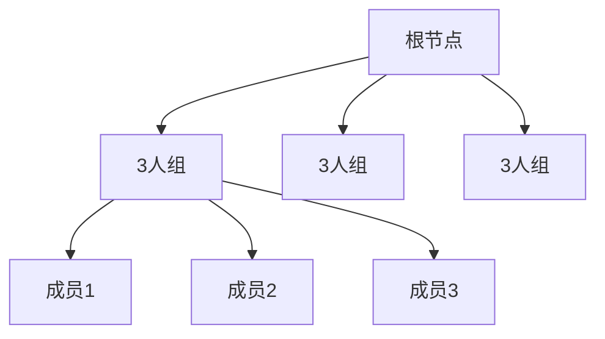

# 题目信息

# [BalticOI 2011] Meetings (Day2)

## 题目描述

拯救世界协会召集了他们的 $N$ 名成员参加紧急会议，以最终商定一个拯救世界的计划。为了在会议上达成共识，参与者按如下步骤进行：

1. 每个人都有一个提案，并花费 $P$ 分钟向其他人展示。
2. 在所有参与者完成展示后，他们会投票选出最佳提案，这需要 $V$ 分钟。

例如，如果每个提案需要一分钟（$P = 1$），投票也需要一分钟（$V = 1$），那么有 $100$ 名参与者的会议将在 $101$ 分钟内达成决议。为了加快整体决策过程，会议的参与者决定分成小组并行工作。每个小组使用上述程序选出自己的最佳提案。然后，各小组的代表会面，从每个小组投票选出的最佳提案中选出最终计划。例如，如果 $100$ 名参与者分成两个小组，分别为 $40$ 人和 $60$ 人，过程可能如下（同样，$P = V = 1$）：

- 较大组花费 $61$ 分钟选出他们的最佳提案；
- 较小组花费 $41$ 分钟做同样的事情，然后必须等待较大组完成；
- 然后两个小组的代表会面，花费 $2$ 分钟互相展示，$1$ 分钟投票。

因此，总共花费的时间是 $61 + 2 + 1 = 64$ 分钟。但小组可能会进一步分成子小组，有时分成两个以上的小组可能更有用。作为一个特例，一个成员的小组可以立即做出决定，因为不需要向自己展示自己的提案。编写一个程序，给定展示和投票时间 $P$ 和 $V$，计算出会议的 $N$ 名参与者在最优组织会议和小组情况下达成共识所需的最少时间。

## 说明/提示

**样例解释 1**

在样例 1 中，九个人应分成 3 组。每组应有 3 个人。

**数据范围**

对于 $40\%$ 的数据，$1 \le N \le 5000$。

对于 $70\%$ 的数据，$1 \le N \le 5 \times 10^4$。

对于所有数据，$1 \le N \le 10^{15},1 \le P,V \le 1000$。

题面翻译由 ChatGPT-4o 提供。

## 样例 #1

### 输入

```
9 1 1```

### 输出

```
8```

## 样例 #2

### 输入

```
6 1 2```

### 输出

```
8```

## 样例 #3

### 输入

```
6 2 1```

### 输出

```
12```

# AI分析结果


### 💡 Kay的C++算法解析：Meetings 深入学习指南 💡

**引言**  
今天我们一起分析 BalticOI 2011 的 Meetings 题目。这道题考察如何通过最优分组策略最小化会议时间。本指南将解析核心算法，提供代码实现，并设计像素动画帮助理解。

---

## 1. 题目解读与核心算法识别

✨ **本题主要考察**：`数学优化` 与 `动态规划`  

🗣️ **初步分析**：  
> 解决会议分组问题就像建造一棵倒置的树🌳：叶子节点是参会成员，中间节点是小组会议，根节点是最终决策。核心思想是通过分组并行处理节省时间。  
> - **动态规划解法**：枚举时间上限，计算每个时间段能处理的最大人数（如 jockbutt 的解法）  
> - **数学优化解法**：枚举树形结构的层数，计算最优分支数（如 渔歌 的解法）  
> - **可视化设计**：像素动画将展示树形结构的生长过程。每层节点用不同颜色方块表示，分支操作时播放 "叮" 音效，投票完成时触发 "胜利" 音效。自动演示模式会像策略游戏一样逐步展开分组策略。

---

## 2. 精选优质题解参考

**题解一：jockbutt（动态规划）**  
* **点评**：  
  思路直击本质——通过时间枚举和状态转移（`f[t] = max(f[t], f[t-V-i*P] * i)`）高效解决问题。代码仅 15 行，变量名简洁（`t` 表时间，`f` 表人数），循环边界 `(t-v)/p` 处理精准。亮点在于利用 `P,V` 值小的特性，将理论不可行的 `O(N)` 优化为实际可接受的 `O(10^5)`。

**题解二：渔歌（数学优化）**  
* **点评**：  
  创新性地将问题抽象为树形结构🌲，通过枚举层数 `m` 和计算 `k = pow(n,1/m)` 解决超大数据范围（`N≤1e15`）。代码中乘积调整逻辑（`he/=x; he*=x+1`）堪称神来之笔，时间复杂度仅 `O(log²n)`。实践时需注意浮点精度问题，但整体是处理超大数据的典范解法。

**题解三：YAOhc2012（动态规划+证明）**  
* **点评**：  
  在 jockbutt 基础上补充严谨复杂度证明：`15×(10P+V)≤1.65e5` 的时间上限分析让解法更具可靠性。代码中 `dp[i-v-j*p]*j` 的转移逻辑清晰体现了 "时间换人数" 的核心思想，边界条件 `j<=(i-v)/p` 处理严谨。

---

## 3. 核心难点辨析与解题策略

1. **难点：状态定义与转移设计（DP核心）**  
   * **分析**：DP解法需精准定义 `f[t]`（时间t内处理的最大人数），转移时枚举分组数 `k`。关键在理解 `t-V-k*P` 表示扣除当前层投票和展示时间后剩余时间  
   * 💡 **学习笔记**：DP状态是时间与人数的桥梁  

2. **难点：超大N的数学优化**  
   * **分析**：当 `N>1e12` 时，需用树形模型。核心是找到最小化 `∑(k_i*P) + m*V` 且满足 `∏k_i ≥ N` 的整数解。通过调整部分 `k` 为 `k+1` 满足约束  
   * 💡 **学习笔记**：乘积约束问题常可转化为幂运算优化  

3. **难点：分组策略的并行性理解**  
   * **分析**：小组会议并行进行，总时间取最长路径。树形结构中，叶节点到根的路径长度决定总耗时  
   * 💡 **学习笔记**：树深度对应串行步骤，分支数对应并行规模  

### ✨ 解题技巧总结
- **分层处理法**：将超大问题分解为多层子问题（树模型）  
- **小参数枚举**：利用 `P,V≤1000` 的特性限定枚举范围  
- **乘积约束转化**：用 `n^(1/m)` 近似求解分支数避免遍历  

---

## 4. C++核心代码实现赏析

**通用核心参考（综合动态规划）**  
```cpp
#include <iostream>
#include <vector>
using namespace std;
typedef long long ll;

int main() {
    ll n, p, v, tim = 0;
    cin >> n >> p >> v;
    vector<ll> f = {1}; // f[0]=1
    while (f[tim] < n) {
        f.push_back(f[tim++]); // 继承上一状态
        for (int k = 2; k <= (tim - v) / p; k++) 
            f[tim] = max(f[tim], f[tim - v - k * p] * k);
    }
    cout << tim << endl;
}
```
* **说明**：综合自优质DP题解，核心是时间枚举与分组转移  
* **解读概要**：  
  1. 初始化 `f[0]=1`（0分钟处理1人）  
  2. 循环递增时间 `tim` 直至覆盖 `n` 人  
  3. 关键转移：对每个分组数 `k`，计算 `f[tim - v - k*p] * k`  

---

**题解一：jockbutt（DP片段）**  
```cpp
while(f[t] < n) {
    f.push_back(f[t++]);
    for(int i=2; i<=(t-v)/p; i++)
        f[t] = max(f[t], f[t-v-i*p]*i);
}
```
* **亮点**：极限代码压缩（7行核心）  
* **解读**：  
  > `f.push_back(f[t++])` 继承前一状态作为基准  
  > 循环 `i` 枚举分组数，`f[t-v-i*p]` 回溯扣除当前层耗时  
  > `*i` 体现分组并行带来的规模倍增  

**题解二：渔歌（数学优化片段）**  
```cpp
for(int m=1;;m++){
    x = pow(n, 1.0/m);         // 计算平均分支数
    he = pow(x, m);            // 基础乘积
    while(he < n) {            // 调整部分分支
        he = he / x * (x+1);   // 将x替换为x+1
        cnt1--; cnt2++;         // 统计不同分支数
    }
    ans = min(ans, m*v + cnt1*x*p + cnt2*(x+1)*p);
}
```
* **亮点**：用幂运算避免超大数遍历  
* **解读**：  
  > `pow(n,1.0/m)` 相当于开 m 次方根  
  > `he/x*(x+1)` 巧妙调整分支数满足乘积约束  
  > `cnt1*x*p + cnt2*(x+1)*p` 计算总时间  

---

## 5. 算法可视化：像素动画演示

**主题**：`像素会议树生成器`（8-bit风格）  
**核心演示**：树形分组策略的动态构建过程  

### 动画设计


1. **初始化（FC像素风格）**  
   - 灰色像素块表示未分组成员  
   - 控制面板：速度滑块/单步执行/AI演示按钮  

2. **分组动效（关键操作）**  
   - 选中k个成员时：黄色闪烁边框 + "叮"声  
   - 生成小组节点：绿色像素块弹出 + 向上生长动画  
   - 时间统计：顶部进度条显示当前耗时 `∑(k_i*P) + m*V`

3. **AI演示模式**  
   - 自动选择最优分支数k（根据 `n^(1/m)`）  
   - 完成时播放16-bit胜利音乐🎵  
   - 路径高亮：当前最长路径显示为红色连线  

4. **教学提示**  
   > "现在创建第2层分组，分支数k=3可减少总深度"  
   > "注意：小组会议并行进行，总时间由最慢路径决定！"  

---

## 6. 拓展练习与相似问题

**通用技巧迁移**：  
树形分组策略还可用于：  
1. 分布式计算任务调度  
2. 锦标赛赛制设计  
3. 多级缓存系统优化  

**洛谷推荐**：  
1. [P1044 栈](https://www.luogu.com.cn/problem/P1044)  
   → 巩固树形递归思想  
2. [P1220 关路灯](https://www.luogu.com.cn/problem/P1220)  
   → 练习时间维度DP设计  
3. [P2365 任务安排](https://www.luogu.com.cn/problem/P2365)  
   → 强化分组批处理模型  

---

## 7. 学习心得与经验分享

**渔歌的调试经验**：  
> *"最初直接用 `pow(n,1/m)` 取整导致乘积不足，通过调整部分分支为 `x+1` 解决"*  

**Kay点评**：  
> 数学解法的精度处理是常见陷阱。建议：  
> 1. 优先用整数运算（如渔歌的乘积调整法）  
> 2. 或使用 `ceil(pow(n,1.0/m))` 保守估计  
> 3. 验证 `∏k_i ≥ N` 时预留10%余量  

---

**结语**  
通过树形分组策略和精妙的数学优化，我们成功解决了超大规模会议调度问题。记住：好算法=直观模型+严谨证明+代码实践！下次见！🚀

---
处理用时：139.96秒