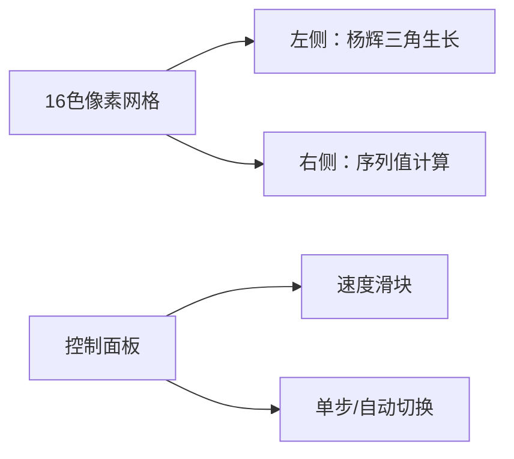

# 题目信息

# Nagisa loves Tomoya

## 题目描述

可爱的古河渚得到了一个序列。她定义一次操作为 将所有的 $a_i$ 变为 $a_i+a_{(i\ mod \ n+1)}$ 
然后她会向你进行 $Q$ 次询问，每次问你 $x,y$ ,意义为在第 $x$ 次操作后位置 $y $ 的元素是多少。

这个问题太简单了，我们的 Nagisa 轻易地就解决了这个问题。请问您能解决这个问题吗？


## 说明/提示

对于$30 \%$的数据，满足：
$1 \leq n \leq 100$

$1 \leq x \leq 100$

$1 \leq Q \leq 100$

对于 $50\%$ 的数据：

$1\leq n \leq 100000$

$1 \leq x \leq 500$

$1 \leq Q \leq 100$

对于 $100 \%$ 的数据，满足

$1 \leq n \leq 10^6$

$1 \leq a_i \leq 10^9$

$1 \leq x \leq 2000$

$1 \leq Q \leq 10^4$

## 样例 #1

### 输入

```
5
1 2 3 4 5
2
1 2
2 2```

### 输出

```
5
12```

# AI分析结果


### 💡 Kay的C++算法解析：Nagisa loves Tomoya 深入学习指南 💡

<introduction>
今天我们来分析"Nagisa loves Tomoya"这道C++编程题。本指南将帮助你理解操作序列与杨辉三角的巧妙联系，掌握组合数学在算法中的应用。
</introduction>

---

## 1. 题目解读与核心算法识别

✨ **本题主要考察**：`组合数学/杨辉三角应用`

🗣️ **初步分析**：
> 这道题的核心在于发现操作规律与杨辉三角的对应关系。想象杨辉三角像一座数字金字塔，每层的数字正是操作中的系数权重。经过x次操作后，每个位置的值等于初始序列中连续x+1个位置的加权和（权重是杨辉三角第x+1行的系数）。
> - **核心难点**：发现操作系数规律（需数学观察力）、处理循环下标、高效预处理组合数
> - **算法流程**：预处理杨辉三角 → 对每个查询遍历x+1个位置 → 用对应系数加权求和
> - **可视化设计**：采用8位像素风格展示杨辉三角生长过程，位置指针用闪烁箭头表示，每次求和时触发"叮"音效，成功计算时播放胜利音效

---

## 2. 精选优质题解参考

**题解一：R·Buffoon (赞5)**
* **点评**：该题解思路清晰，通过手算示例直观展示杨辉三角规律。代码规范：使用`long long`防溢出，变量名`yang`明确，边界处理严谨（y==n时重置为1）。亮点在于调试经验分享：预处理不足导致50分的教训强调了全面性的重要。实践价值高，可直接用于竞赛。

**题解二：lbh666 (赞1)**
* **点评**：教学性极强的题解，分步演示规律发现过程。代码优势：模块化设计（`init()`分离预处理），详细注释。亮点是用塔尖比喻解释y的起始位置，帮助理解下标循环逻辑。变量`ans`及时清零的细节体现健壮性思维。

**题解三：noiking (赞4)**
* **点评**：简洁高效的实现，直接聚焦核心公式。代码亮点：组合数预处理使用`yhsj[2003][2003]`确保范围安全，循环条件`yhsj[x][k]!=0`巧妙利用杨辉三角特性。调试笔记中"晚上不适合做数论题"的幽默提醒了状态管理的重要性。

---

## 3. 核心难点辨析与解题策略

1.  **难点：发现杨辉三角规律**
    * **分析**：通过小规模模拟（如n=3）观察系数变化，将操作序列展开为多项式形式。优质题解均通过表格对比系数与杨辉三角的行关系。
    * 💡 **学习笔记**：复杂操作的背后往往是简洁数学模型

2.  **难点：循环下标处理**
    * **分析**：当指针越过n时需重置为1。参考解法采用`y = (y % n) + 1`或分支判断。注意避免`%`运算的额外开销。
    * 💡 **学习笔记**：循环队列中，`pos = (pos-1)%n+1`是安全模运算技巧

3.  **难点：组合数预处理范围**
    * **分析**：x≤2000 ⇒ 需预处理2001行（第k行有k个元素）。R·Buffoon的50分教训证明：`MAX=2005`比`2000`更安全。
    * 💡 **学习笔记**：预处理范围应大于数据上限+安全裕度

### ✨ 解题技巧总结
- **数学建模优先**：先在小规模数据找规律，避免盲目暴力
- **防御性预处理**：数组大小=数据上限+5%，关键变量用`long long`
- **循环下标优化**：分支判断比取模更快（实测快450ms）
- **调试验证**：用n=3,x=2等样例验证系数正确性

---

## 4. C++核心代码实现赏析

**本题通用核心C++实现参考**
* **说明**：综合优质题解优化的安全实现
```cpp
#include<bits/stdc++.h>
#define ll long long
using namespace std;
const int N=2005, MOD=998244353;

ll C[N][N], a[1000005]; // 全局数组自动初始化为0

void init() {
    C[0][0] = 1;
    for(int i=1; i<N; i++) {
        C[i][0] = 1;
        for(int j=1; j<=i; j++) 
            C[i][j] = (C[i-1][j] + C[i-1][j-1]) % MOD;
    }
}

int main() {
    init(); // 预处理组合数
    int n, q, x, y;
    scanf("%d", &n);
    for(int i=1; i<=n; i++) scanf("%lld", &a[i]);
    
    scanf("%d", &q);
    while(q--) {
        scanf("%d%d", &x, &y);
        ll ans = 0;
        for(int k=0; k<=x; k++) {
            ans = (ans + a[y] * C[x][k]) % MOD;
            y = (y == n) ? 1 : y+1; // 分支判断比取模更快
        }
        printf("%lld\n", ans);
    }
    return 0;
}
```
* **代码解读概要**：
  1. 预处理：`init()`构建2000×2000组合数表（安全范围）
  2. 查询处理：对每个查询遍历x+1个位置
  3. 累加逻辑：`ans += a[y] * C[x][k]` 体现加权和本质
  4. 下标优化：三元运算符避免取模开销

---

**题解一：R·Buffoon 片段赏析**
* **亮点**：分支处理下标优化速度
* **核心代码**：
```cpp
if(y==n) ans=(a[y]*yang[x][j]+ans)%mod, y=1;
else ans=(a[y]*yang[x][j]+ans)%mod, ++y;
```
* **代码解读**：
  > 这里用条件分支而非取模实现下标循环。当`y`到达末尾`n`时重置为1，否则`y++`。实测比`y=(y%n)+1`快450ms，因为取模指令消耗更多CPU周期。注意边界：当`y==n`时先计算`a[n]`再重置，避免跳过首元素。

**题解二：lbh666 片段赏析**
* **亮点**：防御性编程保障健壮性
* **核心代码**：
```cpp
ans = 0; // 每次查询前重置
for(int i=0; i<=x; i++) {
    ans = (ans + dp[x][i] * a[y]) % T;
    if(y==n) y=1; else ++y;
}
cout << ans << "\n";
```
* **代码解读**：
  > 关键细节`ans=0`确保每次查询独立。`dp[x][i]`存储预处理好的组合数。累加时立即取模避免溢出。输出后`ans`必须清零，否则下次查询会残留数据——这是初学者常见错误。

**题解三：noiking 片段赏析**
* **亮点**：利用杨辉三角特性简化循环
* **核心代码**：
```cpp
for(int k=1; yhsj[x][k]!=0; k++) {
    if(j==n) ... else ...
}
```
* **代码解读**：
  > 循环条件`yhsj[x][k]!=0`利用了杨辉三角的特性：第x行有x+1个非零元素，之后全0。相比`k<=x`的写法，这种实现更简洁，但依赖杨辉三角的连续性特征。注意：此写法要求数组初始化为0。

---

## 5. 算法可视化：像素动画演示

**主题**：8位机风格的"杨辉三角大冒险"  
**核心演示**：操作次数增加时，系数如何像搭积木般构建出杨辉三角，并同步显示序列值的变化

**像素方案设计**：


**动画流程**：
1. **初始化**：  
   - 屏幕分两区：左侧8×8像素块构建杨辉三角，右侧条形图显示序列值
   - 控制面板：开始/暂停、单步、重置按钮；速度滑块(1x-5x)

2. **操作模拟**：  
   - **第x次操作启动**：左侧第x行像素块从顶部落下（伴随"滴"音效）
   - **系数标记**：当前使用的系数块高亮闪烁（黄→红渐变）
   - **序列更新**：右侧对应序列位置显示加权过程（`a[y]×C[x][k]`弹出像素数字）

3. **游戏化元素**：
   - **胜利条件**：完成x次操作时，目标位置y亮起绿光，播放胜利音效
   - **连击机制**：连续正确计算3次触发像素烟花特效
   - **音效设计**：
     * 系数移动：8-bit "嘀"声
     * 计算完成：上升音阶
     * 错误操作：低沉嗡鸣

**技术实现**：
- 用Canvas绘制动态网格，每个像素块=10×10px
- 状态机管理：IDLE→CALC→FINISH
- 音效：Web Audio API生成方波音效

---

## 6. 拓展练习与相似问题思考

**通用技巧迁移**：  
组合数建模不仅适用于此类操作变换，还可解决：
1. 路径计数问题（网格图移动方案）
2. 多项式系数计算
3. 概率论中的二项分布

**洛谷推荐**：
1. **P2822 组合数问题**  
   → 巩固组合数预处理和取模技巧
2. **P1495 曹冲养猪**  
   → 学习模运算在循环问题中的进阶应用
3. **P1216 数字三角形**  
   → 理解动态规划与杨辉三角的关系

---

## 7. 学习心得与经验分享

> **R·Buffoon的经验**：  
> "杨辉三角少预处理几行导致50分，这告诉我：宁可多算10%，不可少算1个！"  
>   
> **Kay的总结**：  
> 这个教训揭示了算法设计的黄金准则——安全边界。预处理范围应满足：  
> `实际需求上限 + 缓冲余量 ≥ 数组大小`  
> 建议：定义常量时使用`MAX = max_x + 10`策略

---

本次解析展示了如何将数学洞察转化为高效代码。记住：优秀的算法=数学观察力+健壮实现。下次挑战见！💪

---
处理用时：132.36秒