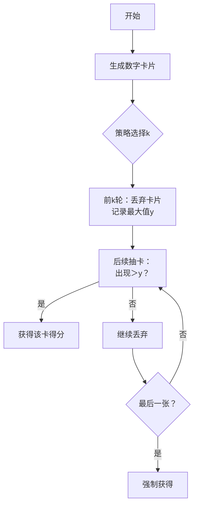

# 题目信息

# [加油武汉] 居家隔离

## 题目背景

为了防止感染，大家要自觉做到居家隔离，少外出少与外人接触。

## 题目描述

居家久了，你需要给自己找点娱乐。于是你看到这么一个游戏：
给定一个 $n$ 元集合 $ \{a_1,a_2,a_3....a_n \}$，元素各不相同。

游戏总共会进行 $n$ 轮，每轮系统会从集合中随机挑出一个元素，记作 $x$。你可以有如下两种选择：

1. 取走 $x$，那么 $x$ 将会是你的最终得分。
2. 舍弃 $x$，此时 $x$ 将会永久的从这个集合中删去，并且进入下一轮。

请注意，若是集合中仅剩唯一一个元素时，该元素无法被舍弃。

由于你很懒，所以你指定了一个很咸鱼的策略：

对于前 $k$ 轮，将得到的数全部舍弃，并且记录下得到的数中的最大值，记作 $y$。

在第 $k$ 轮之后，执行如下策略：

若是取得的 $x > y$，则直接取走 $x$。反之不断舍弃，直到找到了一个满足要求的 $x$ 或是仅剩一个元素。

现在你希望知道，对于 $1$ 到 $n-1$ 的每一个 $k$，你期望下的得分是多少。

所有数请对 $998244353$ 取模。

## 说明/提示

**样例解释**

答案输出的四个数应该分别是 $\frac{39}{10}, \frac{19}{5} ,\frac{69}{20}, 3$，但在模意义下除以一个数相当于乘这个数在模意义下的逆元，因此输出为这些数。举例来说 $\frac{39}{10}\equiv 39\cdot 10^{-1}\equiv 39\cdot 299473306\equiv 698771051\pmod{998244353}$。

提示：如果你不知道如何对一个分数取余，请点这里：<https://www.luogu.com.cn/problem/P2613>


 - 对于 $40\%$ 的数据，满足 $2 \leq n \leq 10$；
 - 对于 $60\%$ 的数据，满足集合为 $[1,n]$ 中所有正整数；
 - 对于 $100\%$ 的数据，满足 $2 \leq n \leq 1000$，集合中所有数字不超过 $10000$。

## 样例 #1

### 输入

```
5
1 2 3 4 5```

### 输出

```
698771051 399297745 349385527 3```

# AI分析结果


# 💡 Kay的C++算法解析：[加油武汉]居家隔离 深入学习指南 💡

> 大家好，我是Kay！今天我们来分析这道关于概率期望和组合数学的题目。这道题看似复杂，但核心思想非常有趣——就像在玩一个"抽卡策略游戏"，我们需要计算不同策略下的期望得分。下面我将用清晰的方式带大家理解解题思路！

## 1. 题目解读与核心算法识别

✨ **本题主要考察**：`组合数学与概率期望计算`

🗣️ **初步分析**：
> 这道题就像一个"数字抽卡游戏"：你需要在抽卡过程中决定何时停止抽卡以获得最大收益。核心思想类似于**概率期望模型**——就像计算不同游戏策略下的平均得分。在本题中，我们通过组合数学计算每种排列出现的概率，再乘以对应得分来求解期望值。

   - 题解思路：通过枚举前k轮的最大值，分类计算后续得分贡献。当最大值非全局最大时，答案在比它大的数中随机出现；当最大值是全局最大时，答案在剩余数中均匀分布。
   - 核心难点在于状态划分和概率计算，我们将用像素动画展示数字分组和概率计算过程
   - 可视化设计：采用复古抽卡游戏风格，用不同颜色方块表示数字分组，动态展示概率计算过程，配以8-bit音效增强趣味性

---

## 2. 精选优质题解参考

**题解一（TheShadow）**
* **点评**：思路严谨完整，清晰划分了k≤n-1和k=n两种情况。代码结构规范（使用组合数函数封装），关键变量`sum`数组优化了计算效率。亮点在于贡献计算时考虑排列顺序，时间复杂度O(n²)完全满足题目要求。

**题解二（zcysky）**
* **点评**：作为官方题解，推导过程简洁有力。特别突出贡献因子的拆解（阶乘与组合数乘积），使用后缀和避免重复计算。亮点在于将暴力解法与数学解法对比，帮助理解本质优化。

**题解三（xiayuyang）**
* **点评**：采用概率视角直接计算期望，代码最简洁（仅30行）。亮点在于用`ksm(C(n,i),mod-2)`直接表示概率倒数，数学转换巧妙。但变量命名可读性稍弱，需结合注释理解。

---

## 3. 核心难点辨析与解题策略

### 难点1：问题分解与状态定义
* **分析**：必须准确划分数字的三种状态：①前k轮舍弃的数字 ②前k轮记录的最大值y ③后续可能成为答案的数字。优质题解都通过枚举y的值来分解问题
* 💡 **学习笔记**：将随机过程转化为确定性的分类讨论是期望问题的核心技巧

### 难点2：贡献计算与概率转换
* **分析**：计算得分贡献时需要同时考虑：
  - 数字选择方案（组合数C）
  - 排列顺序（阶乘n!）
  - 得分权重（数字值aᵢ）
* 💡 **学习笔记**：贡献 = 方案数 × 得分值 / 总排列数

### 难点3：边界处理与特殊情形
* **分析**：当y是全局最大值时，剩余数字均匀分布概率相等；当只剩一个元素时强制选择。各题解都通过if(i==n)特殊处理
* 💡 **学习笔记**：边界情况往往是解题陷阱，需优先考虑

### ✨ 解题技巧总结
- **分治法**：将随机过程拆解为互斥的确定性场景
- **预处理优化**：提前计算阶乘、逆元和前缀和加速运行
- **模运算技巧**：使用费马小定理处理分数取模（a/b ≡ a×b^(mod-2) mod p）

---

## 4. C++核心代码实现赏析

**通用核心实现参考**
```cpp
#include <bits/stdc++.h>
using namespace std;
typedef long long ll;
const int N = 1005, mod = 998244353;

ll fac[N], inv[N], sum[N], a[N];

ll qpow(ll base, ll exp) { // 快速幂求逆元
    ll res = 1;
    while (exp) {
        if (exp & 1) res = res * base % mod;
        base = base * base % mod;
        exp >>= 1;
    }
    return res;
}

void init(int n) { // 预处理阶乘和逆元
    fac[0] = 1;
    for (int i = 1; i <= n; ++i) 
        fac[i] = fac[i-1] * i % mod;
    inv[n] = qpow(fac[n], mod-2);
    for (int i = n-1; i >= 0; --i)
        inv[i] = inv[i+1] * (i+1) % mod;
}

ll C(int n, int m) { // 组合数计算
    return fac[n] * inv[m] % mod * inv[n-m] % mod;
}

int main() {
    int n; cin >> n;
    init(n);
    for (int i = 1; i <= n; ++i) cin >> a[i];
    
    sort(a + 1, a + n + 1);
    for (int i = 1; i <= n; ++i) // 前缀和预处理
        sum[i] = (sum[i-1] + a[i]) % mod;

    for (int k = 1; k < n; ++k) { // 枚举每个k值
        ll total = 0;
        for (int i = k; i <= n; ++i) { // 枚举前k轮最大值
            if (i == n) { // 特例：最大值是全局最大
                total = (total + C(n-1, k-1) * fac[k] % mod 
                         * (sum[n-1] - sum[0]) % mod 
                         * fac[n-k-1] % mod) % mod;
            } else { // 常规情况
                ll cnt = C(i-1, k-1) * fac[k] % mod; // 前k轮方案数
                cnt = cnt * C(n-k, i-k) % mod * fac[i-k] % mod; // 中间数方案
                cnt = cnt * fac[n-i-1] % mod; // 后续排列方案
                total = (total + cnt * (sum[n] - sum[i])) % mod; // 得分贡献
            }
        }
        ll expect = total * qpow(fac[n], mod-2) % mod; // 期望=总分/总方案数
        cout << (expect + mod) % mod << " "; 
    }
    return 0;
}
```

**代码解读概要**：
1. **预处理阶段**：计算阶乘(fac)及其逆元(inv)，优化组合数计算
2. **输入处理**：排序后计算前缀和(sum数组)，便于快速获取区间和
3. **双重循环**：外层枚举k策略，内层枚举前k轮最大值位置i
4. **分类贡献**：
   - `i==n`时用`sum[n-1]-sum[0]`计算剩余数字和
   - 常规情况用`sum[n]-sum[i]`获取大于当前最大值的数字和
5. **期望计算**：总分除以总排列数`fac[n]`，注意模运算处理

---

**题解一核心片段赏析**：
```cpp
// 贡献计算核心逻辑
int tval = add(sum[n], mod-sum[i]); // 获取大于a[i]的数字和
tval = mul(tval, C(i-1, m-1)); // 乘前k轮方案数
tval = mul(tval, C(n-m, i-m)); // 乘中间数字方案
tval = mul(tval, fac[m]); // 排列方案系数
...
inc(res, tval); // 累加贡献
```
* **亮点**：模块化计算贡献，每步取模保证安全
* **学习笔记**：将复杂计算拆解为连乘步骤，提高可读性和可维护性

---

**题解二核心片段赏析**：
```cpp
// 分类计算公式
if (i == n) 
    contribution = a * k * fac[n-2] % mod;
else
    contribution = a * C(i-1,k-1)*fac[k] % mod
                  * C(n-k,i-k)*fac[i-k] % mod
                  * fac[n-i-1] % mod;
```
* **亮点**：直接给出数学解析式，简洁高效
* **学习笔记**：理解公式物理意义比记忆形式更重要

---

**题解三核心片段赏析**：
```cpp
// 概率视角计算
ans = (ans + 1ll*C(j-1,i-1)*ksm(C(n,i),mod-2)%mod 
           * sum[j+1] % mod * ksm(n-j,mod-2)%mod) % mod;
```
* **亮点**：用`ksm(C(n,i),mod-2)`直接表示概率倒数
* **学习笔记**：概率方法代码量少但数学要求高，适合进阶学习

---

## 5. 算法可视化：像素动画演示

**主题**：复古抽卡策略游戏（8-bit像素风）

**核心演示**：


**动画设计**：
1. **初始化界面**：
   - 顶部控制面板：k值滑块（1~n-1）、速度调节、开始/暂停
   - 主区域：两行像素方块，上行为"已抽卡区"，下行为"剩余卡池"
   - 右侧信息板：当前最大值y、期望公式实时计算

2. **动态演示流程**：
   - 卡片抽出动画：像素卡片从卡池飞入已抽卡区，配"叮"音效
   - 最大值更新：当出现新最大值时，该卡片闪烁红光并更新y值
   - 得分判定：当出现＞y的卡片，绿光闪烁+胜利音效，得分累加
   - 概率计算：右侧公式随过程动态变化，当前计算项高亮显示

3. **游戏化元素**：
   - 每完成一个k值的计算视为"通关"，显示该关期望得分
   - 连击奖励：连续答对概率计算问题得额外星标
   - 音效设计：
     * 卡片移动：经典8-bit "滴"声
     * 得分：马里奥吃金币音效
     * 错误：俄罗斯方块消除声

**设计价值**：通过可视化排列组合过程，将抽象的概率计算转化为直观的卡片操作体验，帮助理解期望值的累积原理

---

## 6. 拓展练习与相似问题思考

**相似问题逻辑**：
1. **面试策略问题**：在未知序列中何时停止观察以获得最大值
2. **随机过程分析**：排队理论中的等待时间期望
3. **游戏策略优化**：卡牌游戏中抽卡策略的期望收益计算

**洛谷推荐**：
1. **P1654 OSU!** - 期望计算经典题
   * 理由：巩固概率期望的递推计算思想
   
2. **P2719 搞笑世界杯** - 票务分配期望
   * 理由：训练组合数学与概率的转换能力
   
3. **P6155 修改数组** - 期望操作次数
   * 理由：学习期望的线性性质应用

---

## 7. 学习心得与经验分享
> 本次分析的题解中未发现明确的作者个人心得分享部分

---

> 期望问题就像预测天气——我们无法知道明天是否下雨，但可以计算带伞的最佳策略！希望本指南能帮助大家在编程和数学的世界里继续探索。下次见！🚀

---
处理用时：113.70秒