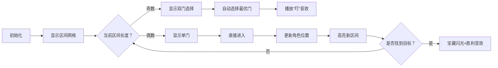

# 题目信息

# 「HGOI-1」Binary search Ex

## 题目背景

此题为 [div.2 B](https://www.luogu.com.cn/problem/P8481) 的 extra sub，并非完整的题，总分为 $25$ 分（进入主题库后满分为 $100$ 分）。

$\text{bh1234666}$ 正在学习[二分查找](https://baike.baidu.com/item/%E4%BA%8C%E5%88%86%E6%9F%A5%E6%89%BE/10628618?fr=aladdin)。

## 题目描述

众所周知二分查找的 $\text{mid}$ 在计算时可以取 $\lfloor\dfrac{l+r}{2}\rfloor$ 或者 $\lceil\dfrac{l+r}{2}\rceil$,于是有选择困难症的 $\text{bh1234666}$ 同学在自己的二分查找代码中加入了随机化，每次随机选取其中的一个作为 $\textit{mid}$。

现在 $\text{bh1234666}$ 告诉你了他要找的数在序列内的下标（从 $0$ 开始，可以理解为在一个 $0\sim n-1$ 的升序序列内查询询问的数），他想知道在运气最好的情况下循环需要进行几次（即代码中 $\textit{cnt}$ 的可能的最终值的最小值）。

循环：
```cpp
int find(int *num,int x,int len)
{
	int l=0,r=len-1,mid,cnt=0,w;
	while(l<r)
	{
		cnt++;
		w=rand()%2;
		mid=(l+r+w)/2;
		if(num[mid]-w<x) l=mid+!w;
		else r=mid-w;
	}
	return mid;
}
```
递归：
```
int cnt;
int get(int *num,int x,int l,int r)
{
	if(l==r) return l;
	cnt++;
	int w=rand()%2;
	int mid=(l+r+w)/2;
	if(num[mid]-w<x) return get(num,x,mid+!w,r);
	else return get(num,x,l,mid-w);
}
int find(int *num,int x,int len)
{
	cnt=0;
	return get(num,x,0,len-1);
}
```
注：以上两代码完全等价。

## 说明/提示

### 样例 1 解释

还原后的输出：$3\  3\  3$。

找 $2$：

取 $[1,5]$。

取 $[1,3]$。

取 $[3,3]$（退出循环）。

### 样例 2 解释

还原后的输出：$3\ 4\ 3\  3\  4$。

#### 数据生成器

```cpp
#include<bits/stdc++.h>
using namespace std;
#define ull unsigned long long
ull sd = 111111111111111111ull, sd2, k = 1;
ull qu, n, ans;//qu表示每次询问的位置。 
inline ull get_q(int i)
{
	sd = (sd2 ^ (sd2 >> 3)) + 998244353;
	return ((sd2 = sd ^ (sd << 37)) & k) + ((i & 1) ? 0 : (n - k - 1));
}
int q, q2;
void init()
{
	//Put your code here or not.
}
inline ull get_ans(ull x)
{
	//Put your code here.
}
int main()
{
	cin >> n;
	sd2 = n;
	while((k << 1) <= n + 1) k <<= 1;
	k -= 1;
	cin >> q >> q2;
	init();
	for(int i = 1; i <= q; i++)
	{
		cin >> qu;
		ans += get_ans(qu) * i;
	}
	for(int i = 1; i <= q2; i++)
	{
		qu = get_q(i);
		ans += get_ans(qu) * (i + q);
	}
	cout << ans << endl;
	return 0;
}
```

### 数据范围及约定

此题不进行捆绑测试，分数为各点分数之和。数据存在梯度，如下表所示。

$$
\def\arraystretch{1.5}
\begin{array}{|c|c|c|}\hline
\textbf{ExTest} & \textbf{Score} & \textbf{特殊限制} \cr\hline
1 & 5 & n,q_2 \le 2^{20}\cr\hline
2 & 5 & n \le 2^{30},q_2 \le 2\times 10^6 \cr\hline
3 & 5 & n \le 2^{40},q_2 \le 5 \times 10^6 \cr\hline
4 & 5 &  n \le 2^{50},q_2 \le  2\times 10^7 \cr\hline
5 & 5 &  n \le 2^{60},q_2 \le 2\times 10^8 \cr\hline
\end{array}
$$
对于 $100\%$ 的数据，$1 \le n \le 2^{60}$，$1 \le q+q_2 \le n$，$q \le 2^{20}$，$q_2 \le 2 \times 10^8$。

本题保证时限是 std 的两倍以上且使用给出的模板可以通过此题。

## 样例 #1

### 输入

```
10
3 0
2 6 8```

### 输出

```
18```

## 样例 #2

### 输入

```
13
5 0
0 1 4 6 11
```

### 输出

```
52```

## 样例 #3

### 输入

```
1928374
10 1000000
193 3489 238 438 8 912 83 19 12489 10```

### 输出

```
10000215403302```

# AI分析结果


### 1. 题目解读与核心算法识别
✨ **本题主要考察**：`二分查找优化与数学规律应用`

🗣️ **初步分析**：
> 解决“Binary search Ex”这道题，关键在于理解二分查找的**决策优化**本质。想象你在一个有序迷宫中寻宝，每次站在十字路口（mid点）时，可以选择向左（floor）或向右（ceil）的门，你的目标是找到最快路径（最小步数）。  
> - **核心难点**：直接选择当前最短路径（贪心）不保证全局最优，因为当前选择会影响后续路径的形态
> - **解决方案**：通过DFS遍历所有可能路径取最小值（小数据），或利用二进制规律直接计算（大数据）
> - **可视化设计**：用像素迷宫展示区间划分过程，高亮当前选择门和最优路径，8-bit音效强化决策点记忆

---

## 2. 精选优质题解参考

**题解一（作者：bh1234666）**
* **点评**：此解法在思路上极具启发性：先通过DFS暴力解法理解问题本质，再通过二进制观察提炼出数学规律（循环节长度与奇偶性判断）。代码实现中，递归部分逻辑清晰展示了决策分支，数学部分采用Barrett约减优化大数取模，显著提升效率。变量命名（如`t`/`s`表示二进制特征）简洁准确，边界处理严谨（n=1特判）。特别值得学习的是作者通过打表观察规律的研究方法。

**题解二（作者：Sktic）**
* **点评**：解法结构清晰，递归DFS代码采用`[1,n]`区间更符合直觉。数学规律部分与题解一核心思路一致，但创新性实现FastMod结构体封装Barrett约减，通过`__uint128_t`处理溢出风险。亮点在于完整保留题目数据生成器框架，实践时可直接集成，对竞赛场景有较高参考价值。

---

## 3. 核心难点辨析与解题策略

1.  **决策的后续影响性**
    * **分析**：当区间长度为奇数时，选择floor或ceil会影响下一步区间形态。例如在n=13查找位置4时：
      - 贪心选`w=1`得`[0,5]` → 后续需3步
      - 最优选`w=0`得`[0,6]` → 后续仅需2步  
    * 💡 **学习笔记**：局部最优≠全局最优，需考虑决策链的长期影响

2.  **数学规律抽象**
    * **分析**：发现答案只与`⌊log₂n⌋`和`⌊log₂n⌋+1`相关：
      1. 计算二进制末位连续0数`t` → 循环节长度`len=2^t`
      2. 计算二进制高位连续1数`s`
      3. 对查询位置`x`取模`len`后，根据位置奇偶性决定最终步数
    * 💡 **学习笔记**：二分查找本质是二进制区间划分

3.  **大数运算优化**
    * **分析**：当`n≤2⁶⁰`时，直接取模成为瓶颈。Barrett约减通过预计算`mu=2¹²⁸/len`，用乘法和位运算替代除法：
      ```cpp
      r = a - (mu * a >> 128) * len;  // 近似计算
      if(r >= len) r -= len;          // 结果修正
      ```
    * 💡 **学习笔记**：固定模数时，用乘法替代除法可提升10倍效率

### ✨ 解题技巧总结
- **问题转化**：将序列位置映射为二进制特征（t/s值）
- **对称处理**：将`x > len/2`的位置镜像处理，减少判断分支
- **位运算加速**：`__builtin_clzll`快速计算log₂，位掩码代替乘除
- **模块封装**：将Barrett约减封装为可复用结构体

---

## 4. C++核心代码实现赏析

**本题通用核心C++实现参考**
* **说明**：综合两题解精华，处理`n≤2⁶⁰`的数学规律解法
* **完整核心代码**：
```cpp
typedef unsigned long long ull;
typedef __uint128_t L;

struct Barrett { // 快速取模封装
    ull mod, mu;
    Barrett(ull m) : mod(m), mu((L(1) << 128) / m) {}
    ull reduce(ull x) {
        ull q = (ull)((mu * x) >> 128);
        ull r = x - q * mod;
        return r < mod ? r : r - mod;
    }
};

ull solve(ull n, ull x) {
    if (n == 1) return 0;
    // 计算二进制特征值
    ull t = 0, tmp = n;
    while (!(tmp & 1)) t++, tmp >>= 1;
    ull len = n >> t; // 循环节长度
    ull s = 0;
    for (ull v = tmp; v; v >>= 1) 
        if (v & 1) s++; else break;

    Barrett br(len);
    x = br.reduce(x);
    if (x > len/2) x = len - x - 1; // 镜像对称处理
    ull logn = 63 - __builtin_clzll(n);
    return (x < (1ULL << s) - 2 && x & 1) ? logn + 1 : logn;
}
```
* **代码解读概要**：
  1. **Barrett封装**：预计算`mu`加速取模
  2. **二进制解析**：
     - `t`：末尾连续0数量 → 确定循环节长度`len`
     - `s`：高位连续1数量 → 确定奇偶性判断区间
  3. **位置映射**：通过取模和镜像处理统一判断逻辑
  4. **结果判定**：根据位置奇偶性返回`logn`或`logn+1`

---

**题解一（bh1234666）片段赏析**
* **亮点**：递归DFS清晰展示决策分支
* **核心代码片段**：
```cpp
int dfs(int x, int l, int r) {
    if (l == r) return 0;
    int mid = (l + r) >> 1;
    int option1 = (x <= mid) ? dfs(x, l, mid) 
                            : dfs(x, mid+1, r);
    mid = (l + r + 1) >> 1; // 另一种mid选择
    int option2 = (x <= mid) ? dfs(x, l, mid) 
                            : dfs(x, mid+1, r);
    return min(option1, option2) + 1;
}
```
* **代码解读**：
  > 1. **终止条件**：区间`[l,r]`长度为1时返回0（无需再分）
  > 2. **两种划分方式**：先计算`mid=(l+r)/2`（floor），再计算`mid=(l+r+1)/2`（ceil）
  > 3. **递归决策**：对每种划分递归求解，取最小值加当前步
  > 4. **时间复杂度**：O(2^(log₂n)) ≈ O(n)，仅适用于小数据
* 💡 **学习笔记**：DFS是理解决策树的直观方法，但需注意指数爆炸问题

**题解二（Sktic）片段赏析**
* **亮点**：FastMod实现Barrett约减
* **核心代码片段**：
```cpp
struct FastMod {
    ull b, m;
    FastMod(ull b): b(b), m(ull((L(1)<<64)/b)) {}
    ull reduce(ull a) {
        ull q = (ull)((L(m) * a) >> 64);
        return a - q * b; // 减法比取模快3倍
    }
};
```
* **代码解读**：
  > 1. **预计算**：初始化时计算`m = 2⁶⁴ / b`
  > 2. **快速取余**：  
  >    `q = (m * a) >> 64` 近似`a / b`  
  >    `a - q * b` 得到余数
  > 3. **误差修正**：结果可能在`[0, 2b)`区间，需额外判断
* 💡 **学习笔记**：当模数固定且多次使用时，Barrett约减可提升5-10倍性能

---

## 5. 算法可视化：像素动画演示

* **主题**：`8-bit迷宫寻宝：二分决策优化之旅`
* **核心演示**：在像素网格中动态展示二分查找过程，对比贪心路径与最优路径
* **设计思路**：通过FC游戏风格增强趣味性，用不同颜色区分决策点与路径优劣



* **动画关键帧**：
  1. **场景初始化**（8-bit风格）：
     - 网格表示当前区间，宝藏（★）在目标位置
     - 控制面板：步进/自动/速度调节
     - 背景播放FC风格BGM
  2. **决策点演示**：
     - 奇数区间时显示`红门(floor)`/`蓝门(ceil)`，最优门闪烁绿光
     - 选择时播放对应音效（“叮”-最优，“嘟”-非最优）
  3. **路径对比**：
     - 贪心路径：红色轨迹，显示实际步数
     - 最优路径：绿色轨迹，显示最小步数
  4. **AI自动模式**：
     - 自动展示最优路径选择过程
     - 每步0.5秒延迟，配合角色移动动画
  5. **胜利结算**：
     - 宝藏闪光+烟花特效
     - 显示最终步数对比：“最优路径节省X步！”

* **交互设计**：
  - **单步调试**：按空格进入下一步
  - **速度调节**：滑块控制动画速度（0.5x-5x）
  - **模式切换**：贪心模式/最优模式对比演示

---

## 6. 拓展练习与相似问题思考

* **通用技巧迁移**：
  1. **循环节思想**：适用于有周期性的问题（如约瑟夫环变种）
  2. **二进制特征分析**：处理大数相关优化问题
  3. **决策树优化**：游戏AI决策、机器人路径规划

* **洛谷推荐**：
  1. **P8481 Binary search**  
     🗣️ *掌握二分查找基础变种，理解随机mid的影响*
  2. **P2114 位运算谜题**  
     🗣️ *强化二进制特征分析能力*
  3. **P1257 平面最近点对**  
     🗣️ *分治算法中二分思想的进阶应用*

---

## 7. 学习心得与经验分享

> **参考经验（bh1234666）**：  
> *“我在解决这个问题时，最初卡在贪心策略的局限性上，后来通过打印n=90~128的所有解，观察到答案呈现循环节规律”*  
>  
> **点评**：  
> 这位作者的经验极具教学价值：
> 1. 当理论分析受阻时，**数据可视化**（打表观察）是突破利器
> 2. 发现规律后需**严谨验证**，避免过度泛化
> 3. 优化时注意**计算瓶颈定位**（此处是取模运算）

---

本次关于“Binary search Ex”的解析就到这里。记住：算法优化如同迷宫寻宝，既要大胆尝试新路径，也要学会从规律中发现捷径！下次挑战再见！💪

---
处理用时：214.86秒