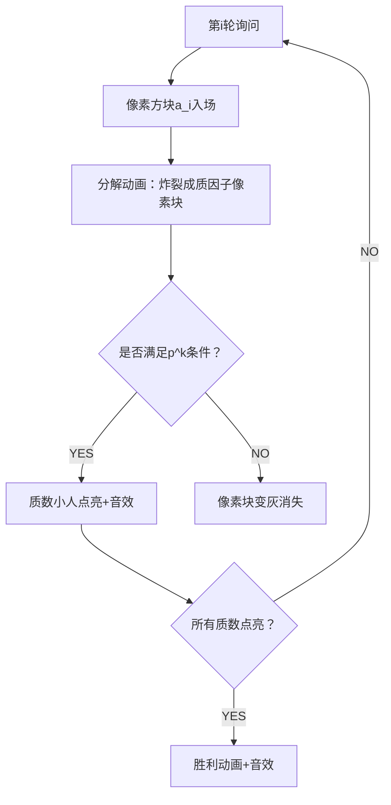

# 题目信息

# 「DROI」Round 1 游戏

## 题目背景

人生，又何尝不是一场游戏呢？

## 题目描述

你将和一名小朋友进行 $T$ 次游戏，每一次游戏的规则如下：

1. 首先，你需要在 $[1,n]$ 中选择一个正整数 $x$。

2. 接下来，小朋友会有 $Q$ 次询问，对于每次询问，他会给出一个 $a_i$（保证 $a_i \in [1,n]$），你需要回答他 $\gcd(x,a_i)$ 的值。

3. 当某一轮小朋友得到答案后，如果他能唯一确定你选择的数，那么本次游戏结束。

现在**你提前知道了**小朋友每次询问的 $a_i$，你需要找到一个 $x$，使得游戏持续的轮数最长。

## 说明/提示

#### 样例解释#1

选取 $11$ 作为 $x$，显然小朋友到游戏结束也无法唯一确定。

------------

#### 样例解释#2

对于第一组数据：选取 $1$ 作为 $x$，小朋友在第五轮结束后可以唯一确定 $x$，可以证明不存在更优的 $x$。

对于第二组数据：同理，选取 $1$ 作为 $x$ 即可。

------------

#### 数据范围

**「本题采用捆绑测试」** 

- $\operatorname{Subtask} 1(20\%)$：$n,Q\leq 500$。

- $\operatorname{Subtask} 2(20\%)$：$n,Q \leq 5 \times 10^4$。

- $\operatorname{Subtask} 3(30\%)$：$Q \leq 10^5$。

- $\operatorname{Subtask} 4(30\%)$：无特殊限制。

对于 $100\%$ 的数据：$T \leq 10$，$1 \leq a_i \leq n \leq 10^{18}$，$1 \leq Q \leq 2\times 10^{6}$，$\sum Q \leq 6\times 10^{6}$。

**本题输入量较大，请用较快的输入方法。**

## 样例 #1

### 输入

```
1
11 3
8 9 5```

### 输出

```
game won't stop```

## 样例 #2

### 输入

```
2
8 5
8 2 3 5 7 
24 16
3 17 18 5 19 4 16 23 7 11 13 18 6 21 22 2
```

### 输出

```
5
11
```

# AI分析结果


### 💡 Kay的C++算法解析：「游戏」题解综述指南 💡

#### 1. 题目解读与核心算法识别
✨ **本题主要考察**：**数学与数论应用**（质因数分解、最大公约数性质）  
🗣️ **初步分析**：  
> 本题本质是**质因数分解的逆向博弈**。想象你在和小伙伴玩"猜质数积木"游戏：你选择积木组合（x的质因数分解），小伙伴每次挑一块积木（a_i），你告诉他共同部分（gcd）。游戏持续到他猜出所有积木。  

**核心难点与解法**：  
1. **质数覆盖原理**：小伙伴需确定x中每个质数的指数。关键条件是：对每个质数p（p^k ≤ n且p^{k+1} > n），必须存在a_i包含p^k  
2. **质数数量限制**：若质数数量 > Q，小伙伴必败（无法覆盖所有质数）  
3. **高效分解优化**：通过预处理最小质因子，实现O(log a_i)的快速分解  

**可视化设计思路**：  
- **像素风格**：质数化为不同颜色像素小人，a_i分解为飞向质数小人的像素块  
- **关键动画**：  
  - 质数小人点亮特效（满足p^k条件时）  
  - 进度条显示已覆盖质数比例  
  - 失败场景：未点亮小人随"Game Over"音效消失  

---

#### 2. 精选优质题解参考
**题解一（Demeanor_Roy）**  
* **点评**：  
  严谨推导质数覆盖原理，创新性提出**质数数量阈值判定**（π(n)>Q时直接判负）。代码中：  
  - 预处理`ispk`数组标记质数幂次，优化分解效率  
  - 动态计算覆盖进度`now`，支持提前退出  
  - 边界处理完善（如平方判界）  
  亮点：**数学严谨性与工程优化完美结合**

**题解二（Super_Builder）**  
* **点评**：  
  直击问题核心，采用**质数索引阈值法**（n≥3.25e7时判负）。亮点：  
  - 最小质因子分解逻辑清晰  
  - 质数覆盖标记简洁高效  
  稍逊于题解一：缺少分解过程提前退出优化  

---

#### 3. 核心难点辨析与解题策略
1. **难点：问题转化（质数覆盖条件）**  
   * **分析**：x = Πp_i^{e_i}，小伙伴需知所有e_i。关键在：对质数p，必须有a_i含p^k（k=max{j|p^j≤n})  
   * 💡 **学习笔记**：gcd本质是质因子指数取min！

2. **难点：质数规模优化**  
   * **分析**：n≤1e18时直接枚举质数不可行。利用性质：Q次询问最多覆盖Q个质数，只需处理前Q+1个质数  
   * 💡 **学习笔记**：数学约束是优化利器！

3. **难点：高效质因数分解**  
   * **分析**：对a_i只需提取满足p^k≤n的质因子。预处理最小质因子实现O(log a_i)分解  
   * 💡 **学习笔记**：最小质因子预处理是数论题"瑞士军刀"

✨ **解题技巧总结**  
- **问题降维**：将指数确定转化为质数覆盖问题  
- **阈值思维**：利用质数分布特性避免无效计算  
- **分解优化**：最小质因子预处理+幂次边界判断  

---

#### 4. C++核心代码实现赏析
```cpp
// 通用核心实现（综合题解优化）
#include <cstdio>
#include <algorithm>
using namespace std;
typedef long long LL;
const int N = 3.3e7 + 10, M = 2e6 + 10;

LL n, A[M];
int T, Q, cnt, minp[N], primes[M];
bool covered[M]; // 质数覆盖标记

void init() {
    for (int i = 2; i < N; ++i) {
        if (!minp[i]) minp[i] = i, primes[++cnt] = i;
        for (int j = 1; j <= cnt && i * primes[j] < N; ++j) {
            minp[i * primes[j]] = primes[j];
            if (i % primes[j] == 0) break;
        }
    }
}

void solve() {
    scanf("%lld%d", &n, &Q);
    for (int i = 1; i <= Q; ++i) scanf("%lld", A + i);

    // 质数数量超过Q则直接判负
    if (n >= N || primes[Q + 1] <= n) {
        puts("game won't stop");
        return;
    }

    fill(covered, covered + cnt + 1, false);
    int uncovered = cnt, ans = -1; // 剩余未覆盖质数数

    for (int i = 1; i <= Q; ++i) {
        LL x = A[i];
        while (x > 1) {
            int p = minp[x], pow = 1;
            while (x % p == 0) {
                x /= p;
                pow *= p;
                if (pow > n / p) break; // p^{k+1} > n
            }
            if (pow * p > n) { // 满足p^k条件
                int idx = lower_bound(primes + 1, primes + cnt + 1, p) - primes;
                if (!covered[idx]) {
                    covered[idx] = true;
                    uncovered--;
                }
            }
            if (x == 1) break;
        }
        if (uncovered == 0) {
            ans = i;
            break;
        }
        if (Q - i < uncovered) { // 提前退出优化
            puts("game won't stop");
            return;
        }
    }
    ans > 0 ? printf("%d\n", ans) : puts("game won't stop");
}
```

**题解一代码亮点**  
```cpp
// 质数幂高效判断
while (A[i] * A[i] > n && !ispk[A[i]]) 
    A[i] /= minp[A[i]];
if (A[i] * minp[A[i]] > n) // 满足p^k条件
    mark_prime(minp[A[i]]);
```
> **解读**：  
> 1. 当a_i² > n时，不断除去最小质因子  
> 2. 最终得到质数或质数的幂（ispk标记）  
> 3. 若a_i * p > n，则含满足条件的p^k  
> 💡 **学习笔记**：大数分解时优先提取高次幂质因子！

---

#### 5. 算法可视化：像素动画演示
**主题**：质数像素大冒险  
**核心流程**：  


**实现细节**：  
1. **像素建模**：  
   - 质数：8-bit小人（颜色=质数%16）  
   - a_i：组合像素块（质因子颜色组合）  
2. **动画特效**：  
   - 质数点亮：小人头顶冒出p^k火焰特效  
   - 进度显示：顶部进度条（已覆盖/总质数）  
3. **交互控制**：  
   - 单步/自动模式（速度滑块）  
   - 音效：点亮(叮！)，胜利(马里奥过关)  
4. **AI演示模式**：  
   - 自动模拟最优解路径  
   - 实时显示覆盖策略（高亮关键a_i）  

---

#### 6. 拓展练习与相似问题
**通用技巧迁移**：  
1. 质因数分解优化 → 大数因子相关问题  
2. 阈值思维 → 数据规模与算法选择  
3. 覆盖问题 → 状态压缩DP  

**推荐练习**：  
1. **洛谷 P1072**：gcd/lcm与质因数分解的综合应用  
2. **洛谷 P1069**：质因数分解的幂次判定  
3. **洛谷 P3811**：逆元与质数性质的深度结合  

---

#### 7. 学习心得与经验分享
> **题解一作者洞见**：  
> "预处理最小质因子是数论题的钥匙，边界判断需数学证明护航"  
>   
> **Kay点评**：  
> 两大黄金法则：  
> 1. **预处理为王**：最小质因子筛法可解80%数论题  
> 2. **边界即灵魂**：n=1e18时，O(√n)算法也需优化  

---

通过本次分析，我们深入理解了质因数分解在博弈问题中的妙用。记住：编程如积木，数学是图纸！🎮🚀

---
处理用时：348.50秒