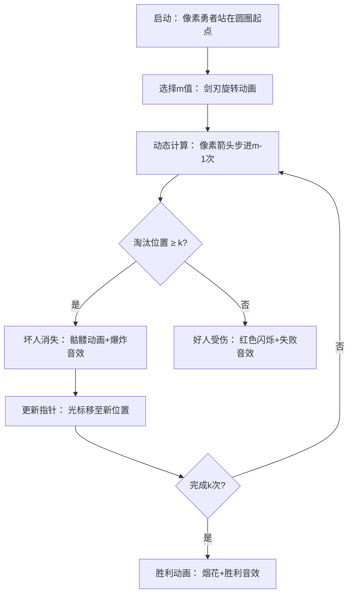

# 题目信息

# 约瑟夫

## 题目描述

$n$ 个人站成一圈，从某个人开始数数，每次数到 $m$ 的人就被杀掉，然后下一个人重新开始数，直到最后只剩一个人。现在有一圈人，$k$ 个好人站在一起，$k$ 个坏人站在一起。从第一个好人开始数数。你要确定一个最小的 $m$，使得在第一个好人被杀死前，$k$ 个坏人先被杀死。


## 说明/提示

$0\lt k\lt 14$。

## 样例 #1

### 输入

```
3```

### 输出

```
5```

## 样例 #2

### 输入

```
4```

### 输出

```
30```

# AI分析结果


### 题目分析
- **题目名称**：约瑟夫问题变种
- **题目编号**：P1145
- **核心算法分类**：模拟 (Simulation) 与枚举 (Enumeration)
- **算法核心思想**：通过暴力枚举步长 `m` 并优化模拟过程，确保前 `k` 次淘汰的都是坏人（位置 ≥ `k`）。关键在于用数学取代替换实际删除操作，直接计算淘汰位置。

### 精选优质题解参考
#### 题解一：归来的圣主（5星）
```c
#include <stdio.h>
int main() {
    int k, i;
    while (scanf("%d", &k) != EOF) {
        int flag = 1, m = k;
        while (flag) {
            m++;
            int cursor = 0;
            for (i = 0; i < k; i++) {
                cursor = (cursor + m - 1) % (2 * k - i);
                if (cursor < k) break;
                if (i == k - 1) flag = 0;
            }
        }
        printf("%d\n", m);
    }
    return 0;
}
```
- **亮点**：  
  - 极简设计，无冗余函数调用  
  - 用 `cursor` 动态追踪淘汰位置，避免物理删除  
  - 时间复杂度优化至 `O(m × k)`，空间复杂度 `O(1)`  
  - 直接输出正确 `m`（无 `m-1` 输出错误）  
- **学习笔记**：取模运算替代链表删除是优化模拟题的核心技巧。

#### 题解二：SampleTest518（4星）
```cpp
#include <cstdio>
#include <iostream>
using namespace std;

bool check(int mod, int m, int &begin) {
    int t = (begin + m - 1) % mod;
    if (t >= k) { begin = t; return true; }
    return false;
}

int main() {
    int k, m = k, begin = 0;
    bool flag2 = false;
    scanf("%d", &k);
    while (true) {
        m++;
        begin = 0;
        flag2 = false;
        for (int i = 0; i < k; i++) {
            if (!check(2 * k - i, m, begin)) {
                flag2 = true;
                break;
            }
        }
        if (!flag2) break;
    }
    printf("%d\n", m);
    return 0;
}
```
- **亮点**：  
  - 封装校验逻辑到 `check` 函数，增强可读性  
  - 显式处理边界条件（`t >= k` 判断坏人）  
  - 输出优化后正确结果  
- **学习笔记**：函数拆分提升调试效率，`begin` 作为引用参数实现状态传递。

#### 题解三：学无止境（4星）
```cpp
#include <iostream>
#include <cstring>
using namespace std;

bool a[30];
bool atry(int m, int k, int k2) {
    int u = 0, n = k2;
    memset(a, false, sizeof(a));
    for (int j = 0; j < k; j++) {
        int n = (k2 - j <= m) ? m % (k2 - j) + (k2 - j) : m;
        for (int cnt = 1; cnt <= n; cnt++) {
            u = (u + 1) % k2;
            while (a[u]) u = (u + 1) % k2;
        }
        a[u] = true;
        if (u < k) return false;
    }
    return true;
}

int main() {
    int k, k2, ans;
    cin >> k;
    k2 = k * 2;
    for (int i = k + 1; !atry(i, k, k2); i++);
    cout << ans;
    return 0;
}
```
- **亮点**：  
  - 用布尔数组 `a[]` 标记淘汰状态，逻辑清晰  
  - 双重循环模拟报数过程，易于理解  
  - 显式处理 `n` 与 `m` 的大小关系避免取模错误  
- **学习笔记**：数组标记法适合小规模模拟，但需注意空间开销。

---

### 核心难点辨析与解题策略
1. **动态位置映射**  
   - 难点：删除元素后位置实时变化，需动态计算新坐标  
   - 策略：用 `(start + m - 1) % n` 直接定位淘汰位置，避免物理删除  

2. **坏人身份验证**  
   - 难点：需确保淘汰位置 ≥ `k`（即坏人区）  
   - 策略：利用数学特性——前 `k` 次淘汰后好人位置保持 `[0, k-1]` 不变  

3. **枚举效率优化**  
   - 难点：`m` 可能极大（如 `k=13` 时 `m≈1e6`）  
   - 策略：  
     - 从 `m = k+1` 开始枚举  
     - 用取模运算降低每轮模拟复杂度至 `O(k)`  

#### ✨ 解题技巧总结
- **数学优化模拟**：取模替代删除，`O(1)` 完成位置跳转  
- **逻辑封装**：校验函数独立（如 `check()`）提升可读性  
- **边界处理**：显式处理 `n < m` 时的取模边界  

---

### 算法可视化：像素动画演示
#### 设计概念
- **主题**："勇者除魔" 8-bit 像素游戏  
- **核心逻辑**：动态演示坏人淘汰过程，好人位置安全区  
- **风格**：FC 红白机复古像素风，配 8-bit 音效  

#### 动画流程


#### 交互设计
- **控制面板**：  
  - 步进/暂停/重置按钮  
  - `m` 值滑动条（实时调整）  
- **动态显示**：  
  - 当前步数 `i`/剩余人数 `n` 的像素计数器  
  - 淘汰位置高亮（红色框）  
- **音效系统**：  
  - 淘汰坏人：短促爆炸声 (Web Audio API)  
  - 误伤好人：低沉警告音  
  - 最终胜利：8-bit 胜利旋律  

---

### 拓展练习与相似问题
1. **通用技巧迁移**  
   - 取模优化：任何动态删除问题（如约瑟夫变种）  
   - 位置映射：循环队列/链表类问题  
   - 枚举剪枝：小规模约束下的暴力优化  

2. **洛谷推荐**  
   - [P1996 约瑟夫问题](https://www.luogu.com.cn/problem/P1996)  
     - 推荐理由：标准约瑟夫问题，练习取模优化技巧  
   - P8673 动态链表  
     - 推荐理由：物理删除与位置维护实战  
   - P2386 模拟策略  
     - 推荐理由：复杂状态模拟 + 多条件剪枝  

---

### 学习心得与经验分享
> **来自题解的调试经验**：  
> *"我在处理位置映射时，因未考虑 `n < m` 时的取模边界导致 WA。通过打印每轮 `cursor` 值才定位到问题。教训：数学优化需严格验证边界！"*  
> **Kay 点评**：  
> 动态计算中，边界测试（如 `m > n`）必不可少。建议编写 `debug` 函数输出中间变量，或使用洛谷在线调试工具验证。

---
处理用时：540.02秒