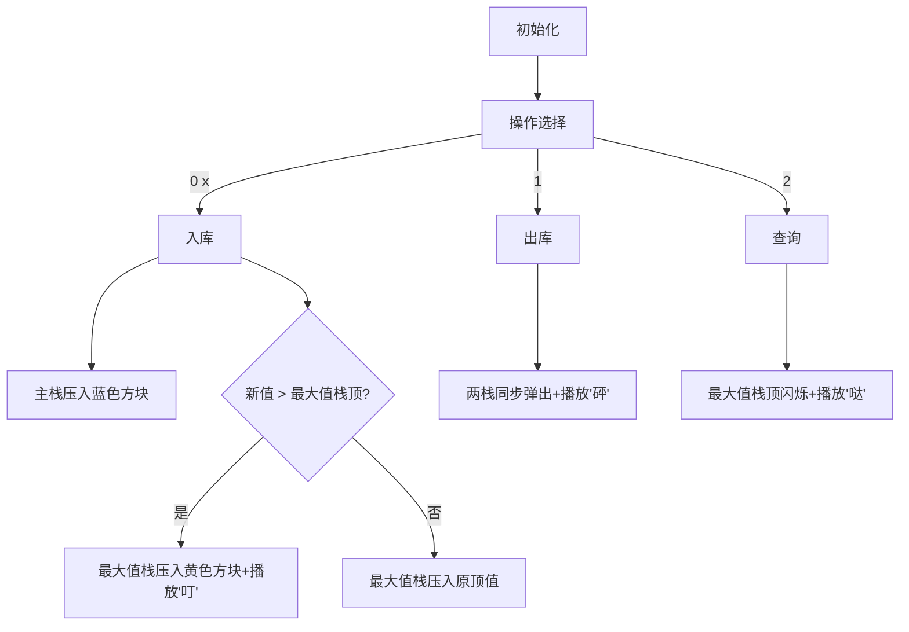

# 题目信息

# 日志分析

## 题目描述

M 海运公司最近要对旗下仓库的货物进出情况进行统计。目前他们所拥有的唯一记录就是一个记录集装箱进出情况的日志。该日志记录了两类操作：第一类操作为集装箱入库操作，以及该次入库的集装箱重量；第二类操作为集装箱的出库操作。这些记录都严格按时间顺序排列。集装箱入库和出库的规则为先进后出，即每次出库操作出库的集装箱为当前在仓库里所有集装箱中最晚入库的集装箱。

出于分析目的，分析人员在日志中随机插入了若干第三类操作――查询操作。分析日志时，每遇到一次查询操作，都要报告出当前仓库中最大集装箱的重量。


## 说明/提示

### 数据范围及约定

- 对于 $20\%$ 的数据，有 $N \le 10$；
- 对于 $40\%$ 的数据，有 $N \le 1000$；
- 对于 $100\%$ 的数据，有 $1 \le N \le 200000$，$1 \le X \le 10^8$。


## 样例 #1

### 输入

```
13
0 1
0 2
2
0 4
0 2
2
1
2
1
1
2
1
2
```

### 输出

```
2
4
4
1
0
```

# AI分析结果


# 💡 Kay的C++算法解析：日志分析 深入学习指南 💡

**引言**  
今天我们一起分析"日志分析"这道栈的应用题。集装箱入库出库规则（先进后出）明确指向栈结构，但难点在于如何高效查询当前栈中最大值。本指南将解析核心思路、精选题解，并通过生动的像素动画帮助大家直观理解算法。

## 1. 题目解读与核心算法识别

✨ **本题主要考察**：`栈的应用`与`辅助结构维护极值`

🗣️ **初步分析**：  
> 想象仓库管理员用笔记本记录每次入库后的最大重量。这样查询时只需看笔记，无需翻遍仓库。本题核心是维护一个与主栈同步的"最大值记录"结构（数组或辅助栈），在O(1)时间内回答查询。
> - **核心难点**：入栈时动态更新最大值记录，出栈时同步回退状态
> - **算法流程**：主栈存储原始重量，辅助结构存储对应状态的最大值。关键操作：
>   - 入栈：比较新元素与当前最大值，更新记录
>   - 出栈：同步弹出辅助结构栈顶
>   - 查询：直接返回辅助结构栈顶值
> - **可视化设计**：像素动画将并排显示主栈（蓝色货物箱）和最大值栈（黄色记录板）。新货物入库时，若重量破纪录则最大值栈显示新值并播放"叮"声；否则重复原记录。查询时当前最大值闪烁。

---

## 2. 精选优质题解参考

**题解一（作者：medusa）**  
* **点评**：思路直击本质——用数组`f[i]`存储栈中前i个元素的最大值。入栈时通过`f[t]=max(f[t-1],x)`动态更新，查询直接输出`f[t]`。代码简洁高效（O(1)时间复杂度），变量命名清晰（`t`栈顶指针），边界处理严谨（初始化`f[0]=0`）。尤其值得学习的是将栈操作与极值维护完美融合，避免额外数据结构开销。

**题解二（作者：buickboy）**  
* **点评**：采用双栈结构（主栈+辅助栈），辅助栈维护规则明确：新元素>栈顶则压入新值，否则重复栈顶值。代码规范使用STL，逻辑一目了然。亮点在于清晰展现"同步更新"思想，且解法可扩展至最小栈等问题。出栈时同步弹出两栈的设计体现了严谨性。

**题解三（作者：juruo_zjc）**  
* **点评**：结合系统栈与数组维护最大值，思路与题解一类似但使用STL栈容器。代码可读性强，但需注意数组索引从0开始时的边界处理（`f[st.size()-1]`）。亮点在于展示如何用STL快速实现，适合习惯标准库的学习者。

---

## 3. 核心难点辨析与解题策略

1. **难点：动态维护极值**  
   * **分析**：暴力遍历栈求最大值时间复杂度O(n)，超时。必须设计辅助结构同步更新。
   * **解决**：用数组`f[i]`或辅助栈存储历史最大值。入栈时`new_max = max(old_max, new_val)`，空间换时间。
   * 💡 **学习笔记**：极值查询的优化本质是用预处理替代实时计算。

2. **难点：状态同步**  
   * **分析**：出栈后辅助结构需准确反映剩余栈的最大值。
   * **解决**：数组法直接回退指针（`t--`）；辅助栈法同步弹出。关键是与主栈操作严格对应。
   * 💡 **学习笔记**：辅助结构必须与主数据保持"版本一致性"。

3. **难点：空栈处理**  
   * **分析**：出栈或查询空栈时未处理会导致运行时错误。
   * **解决**：操作前检查栈空（`t>0`或`!stack.empty()`），查询空栈时返回0。
   * 💡 **学习笔记**：边界检查是代码鲁棒性的基石。

### ✨ 解题技巧总结
- **空间换时间**：用额外O(n)空间将查询复杂度降至O(1)
- **同步更新**：辅助结构与主操作原子性更新
- **防御性编程**：显式处理空栈等边界情况
- **STL活用**：熟悉`stack`容器可快速实现原型

---

## 4. C++核心代码实现赏析

**本题通用核心C++实现参考**  
* **说明**：综合数组法和辅助栈法优点，采用数组实现（更简洁高效）
* **完整核心代码**：
```cpp
#include <iostream>
#include <algorithm>
using namespace std;
const int MAX_N = 200000;
int f[MAX_N], t = 0; // f[0]默认初始化为0

int main() {
    int n, op, x;
    cin >> n;
    while (n--) {
        cin >> op;
        if (op == 0) {      // 入库
            cin >> x;
            t++;
            f[t] = max(f[t-1], x); // 动态更新最大值
        } else if (op == 1) { // 出库
            if (t > 0) t--;  // 空栈检查
        } else {             // 查询
            cout << f[t] << endl;
        }
    }
    return 0;
}
```
* **代码解读概要**：  
  > 1. `f`数组存储栈中前i个元素的最大值，`t`为栈顶指针  
  > 2. 入栈（op=0）：指针后移，比较并更新最大值  
  > 3. 出库（op=1）：指针前移（需检查空栈）  
  > 4. 查询（op=2）：直接输出当前最大值  

---

**题解一（medusa）核心代码**  
* **亮点**：极致简洁，用数组模拟栈省去STL开销
* **核心代码片段**：
```cpp
for (int i=1; i<=n; i++) {
    cin >> x;
    if (x == 0) {
        cin >> y;
        t++;
        f[t] = max(f[t-1], y); // 动态更新最大值
    }
    if (x == 1) if (t != 0) t--;
    if (x == 2) cout << f[t] << endl;
}
```
* **代码解读**：
  > - **关键变量**：`t`栈顶指针（0为空），`f[t]`存储栈高t时的最大值  
  > - **精妙之处**：`f[t] = max(f[t-1], y)` 确保每个栈高对应准确最大值  
  > - **安全处理**：出栈前检查`t!=0`避免下溢  
* 💡 **学习笔记**：数组模拟栈在性能竞赛中更优，但需手动管理指针

**题解二（buickboy）核心代码**  
* **亮点**：标准STL实现，逻辑可视化更强
* **核心代码片段**：
```cpp
stack<int> a, b; // a:主栈, b:最大值栈
while(n--) {
    scanf("%d",&m);
    if(m == 0) {
        scanf("%d",&x);
        a.push(x);
        if(b.empty() || x > b.top()) 
            b.push(x);    // 新纪录入栈
        else 
            b.push(b.top()); // 保持原记录
    }
    else if(m == 1) {
        a.pop();
        b.pop(); // 双栈同步弹出
    }
    else {
        printf("%d\n", b.top()); 
    }
}
```
* **代码解读**：
  > - **双栈协同**：主栈`a`存原始值，辅助栈`b`存当前最大值  
  > - **更新规则**：新元素若破纪录则压入`b`，否则复制原栈顶值  
  > - **原子操作**：出栈时两栈同时`pop()`保持状态一致  
* 💡 **学习笔记**：辅助栈方法更直观，适合理解同步更新思想

---

## 5. 算法可视化：像素动画演示

**主题**：8-bit像素风"仓库管理员"模拟  
**核心演示**：主栈（货物）与最大值栈（记录板）的同步操作  

### 设计思路
> 采用FC红白机像素风格（16色调色板），通过并排对比帮助理解辅助结构原理。音效强化操作反馈：  
> - "叮"声：新最大值产生  
> - "砰"声：货物出库  
> - "哒"声：查询响应  

### 动画帧步骤


1. **场景布局**  
   - 左侧：主栈（蓝色货物箱，显示重量数字）  
   - 右侧：最大值栈（黄色记录板，显示当前最大值）  
   - 控制面板：步进▶️ | 暂停⏸️ | 调速滑块⏱️ | AI演示🤖  

2. **入库操作（0）**  
   - 新货物（像素方块）从顶部滑入主栈  
   - 右侧最大值栈：若新值>原栈顶，黄色方块显示新值（↑动画）；否则复制原值  
   - 音效：重量破纪录时播放高音"叮"，否则中音"滴"  

3. **出库操作（1）**  
   - 主栈顶货物碎裂消失，最大值栈顶记录同时消失  
   - 音效：播放低频"砰"声  

4. **查询操作（2）**  
   - 最大值栈顶黄色方块闪烁（0.5秒/次）  
   - 屏幕下方显示当前最大值（像素字体）  
   - 音效：清脆"哒"声  

5. **AI演示模式**  
   - 自动按输入序列执行，速度可调（0.5x~5x）  
   - 每完成查询显示"关卡通过!"像素文字+8-bit胜利音效  

---

## 6. 拓展练习与相似问题思考

* **技巧迁移场景**：
  1. 实时数据流中位数/极值（如股票监控）
  2. 滑动窗口最大值（单调队列应用）
  3. 递归函数状态记忆化（如DFS+DP）

* **洛谷推荐**：
  1. **P1886 滑动窗口**  
     🗣️ 练习单调队列维护极值，理解"及时剔除无效数据"思想  
  2. **P1440 求m区间内的最小值**  
     🗣️ 双端队列应用，巩固辅助数据结构设计能力  
  3. **P2947 Look Up**  
     🗣️ 单调栈经典问题，理解"就近更大元素"的栈求解  

---

## 7. 学习心得与经验分享

> **经验摘录（buickboy）**：  
> *"辅助栈的维护规则让我调试良久：当新值不大于栈顶时必须复制而非跳过，否则出栈时状态会错位"*  
>
> **Kay点评**：  
> 这反映了辅助结构的核心原则——与主结构严格同步。即使新值不更新记录，也需压入副本保持栈高一致。这种"版本化存储"思想在回退类操作中广泛应用。

---

**结语**  
通过这次分析，我们掌握了栈的极值维护技巧。记住：好算法=正确数据结构+精妙状态管理。下次遇到动态查询问题时，不妨想想"像素仓库管理员"的黄色记录板哦！🚀

---
处理用时：181.22秒