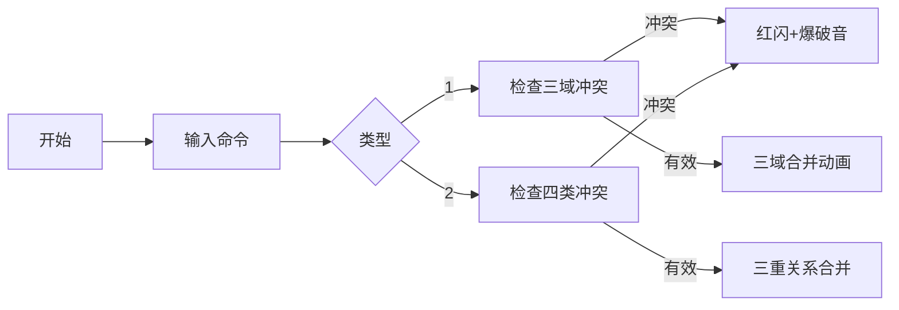

# 题目信息

# [NOI2001] 食物链

## 题目描述

动物王国中有三类动物 $A,B,C$，这三类动物的食物链构成了有趣的环形。$A$ 吃 $B$，$B$ 吃 $C$，$C$ 吃 $A$。

现有 $N$ 个动物，以 $1 \sim N$ 编号。每个动物都是 $A,B,C$ 中的一种，但是我们并不知道它到底是哪一种。

有人用两种说法对这 $N$ 个动物所构成的食物链关系进行描述：

- 第一种说法是 `1 X Y`，表示 $X$ 和 $Y$ 是同类。
- 第二种说法是`2 X Y`，表示 $X$ 吃 $Y$。

此人对 $N$ 个动物，用上述两种说法，一句接一句地说出 $K$ 句话，这 $K$ 句话有的是真的，有的是假的。当一句话满足下列三条之一时，这句话就是假话，否则就是真话。

- 当前的话与前面的某些真的话冲突，就是假话；
- 当前的话中 $X$ 或 $Y$ 比 $N$ 大，就是假话；
- 当前的话表示 $X$ 吃 $X$，就是假话。

你的任务是根据给定的 $N$ 和 $K$ 句话，输出假话的总数。


## 说明/提示

对于全部数据，$1\le N\le 5 \times 10^4$，$1\le K \le 10^5$。


## 样例 #1

### 输入

```
100 7
1 101 1
2 1 2
2 2 3
2 3 3
1 1 3
2 3 1
1 5 5
```

### 输出

```
3
```

# AI分析结果


### 💡 Kay的C++算法解析：NOI2001 食物链 深入学习指南 💡

#### **1. 题目解读与核心算法识别**
✨ **本题主要考察**：种类并查集（扩展域）

🗣️ **初步分析**：
> 食物链问题本质是维护动物间三类关系：同类、捕食、被捕食。种类并查集通过将每个动物拆分为三个域（自身域、猎物域、天敌域），构建逻辑关系网：
> - **自身域 (1~n)**：存储同类关系
> - **猎物域 (n+1~2n)**：存储被当前动物吃的动物
> - **天敌域 (2n+1~3n)**：存储吃当前动物的动物
> 
> 核心难点在于动态维护环形关系（A吃B，B吃C，C吃A）。当新增关系时：
> 1. **同类关系**：需确保两动物无捕食冲突
> 2. **捕食关系**：需排除反向捕食或同类可能
> 
> **可视化设计思路**：
> - 用三色像素块区分三个域：蓝色（自身）、红色（猎物）、绿色（天敌）
> - 关键操作高亮：合并时显示域间连线，冲突时触发闪烁警告
> - 复古游戏化：采用8-bit音效（合并成功-"叮"；冲突-"爆破音"），网格动画展示域合并过程

---

#### **2. 精选优质题解参考**
**题解一（来源：Strong_Jelly）**
* **点评**：思路清晰采用扩展域并查集，三域划分直击问题本质。代码规范性极强：变量命名`fa[3*N]`明确表达域结构；合并操作`unite(x, y+2*n)`精准处理环形关系；边界检查严谨（`x>n||y>n`）。亮点在于用**三重合并**维护环形食物链，实践价值高（竞赛可直接使用）。

**题解二（来源：Sooke）**
* **点评**：创造性引入"群系"概念（中立者、生产者、消费者），生动解释三域关系。代码中`find(x+n)==find(y)`等判断条件逻辑严密，尤其对**关系传递性**的图形化解释（配图展示环形关系）极大提升理解度。亮点在于将抽象关系具象化为食物链网络。

**题解三（来源：Skywalker_David）**
* **点评**：独创性提出"关系等价转换"原则：`x吃y ≡ y的天敌是x`。代码中`unite(x, y+2*n)`等操作将复杂关系转化为简洁集合操作，并通过`(d[x]+d[y])%3`数学证明严谨性。亮点在于用**模运算**统一处理关系传递。

---

#### **3. 核心难点辨析与解题策略**
1. **难点一：环形关系传递**
   * **分析**：A→B→C→A的闭环导致单次合并需同步更新三重关系。优质题解通过`unite(x+2n, y+n)`维护闭环（x的天敌域与y的猎物域合并）
   * 💡 **学习笔记**：环形关系需同步更新三域

2. **难点二：冲突检测时机**
   * **分析**：同类关系需检查双向捕食可能（x是否吃y/y是否吃x），捕食关系需排除同类及反向捕食。代码中`find(x+n)==find(y)`直击本质
   * 💡 **学习笔记**：冲突检测本质是集合存在性验证

3. **难点三：域合并的完备性**
   * **分析**：每次有效操作需合并三个域组（如捕食操作需合并三组）。漏掉任一组合会导致闭环断裂
   * 💡 **学习笔记**：三域合并缺一不可

**✨ 解题技巧总结**
- **关系转换法**：将生物关系转化为集合操作（吃→合并特定域）
- **闭环维护术**：通过`unite(x+2n,y+n)`显式维护环形结构
- **预判冲突三板斧**：范围检查 → 同类检查 → 反向捕食检查

---

#### **4. C++核心代码实现赏析**
```cpp
#include <iostream>
using namespace std;
const int MAXN = 50000 * 3 + 10; // 三倍空间

int fa[MAXN];
int n, k, ans;

int find(int x) {
    return fa[x] == x ? x : fa[x] = find(fa[x]);
}

void unite(int x, int y) {
    fa[find(x)] = find(y);
}

int main() {
    cin >> n >> k;
    // 初始化：每个动物三个域独立
    for (int i = 1; i <= 3 * n; i++) fa[i] = i;

    while (k--) {
        int op, x, y;
        cin >> op >> x >> y;
        
        // 条件1：编号超界
        if (x > n || y > n) { ans++; continue; } 
        
        if (op == 1) { // 同类关系
            // 条件2：存在捕食关系
            if (find(x + n) == find(y) || find(x + 2 * n) == find(y)) {
                ans++;
            } else { // 三重域合并
                unite(x, y);
                unite(x + n, y + n);
                unite(x + 2 * n, y + 2 * n);
            }
        } else { // 捕食关系
            // 条件3：自吃或同类
            if (x == y || find(x) == find(y)) {
                ans++;
            } 
            // 条件4：反向捕食
            else if (find(x) == find(y + n)) {
                ans++;
            } else { // 三重关系合并
                unite(x, y + 2 * n);     // x是y的天敌
                unite(x + n, y);         // x吃y
                unite(x + 2 * n, y + n); // 闭环维护
            }
        }
    }
    cout << ans << endl;
    return 0;
}
```

**关键代码解读**：
1. **find(x+n)==find(y)**：检查x是否吃y（x的猎物域包含y）
2. **unite(x+2n, y+n)**：维护环形关系（x的天敌应被y吃）
3. **三重合并**：确保同类/捕食关系在三个域中完全同步

**学习笔记**：种类并查集通过物理分割关系类型，将逻辑判断转化为集合操作，是处理多元关系的利器。

---

#### **5. 算法可视化：像素动画演示**
**动画演示主题**：8-bit风格《食物链大冒险》

**核心演示流程**：


**交互控制**：
1. **网格设计**：
   - 三色动物精灵：🟦(自身) 🟥(猎物) 🟩(天敌)
   - 命令面板：🕹️步进控制 🎚️速度滑块

2. **动态演示**：
   - 合并动画：蓝色波纹扩散表示域融合
   - 冲突提示：红色闪烁+8-bit爆破音
   - 闭环演示：螺旋光效展示环形关系建立

3. **游戏化元素**：
   - 成功音效：合并成功时播放《超级玛丽》硬币声
   - 关卡进度：每10组正确操作解锁新生物皮肤
   - 数据面板：实时显示关系网络拓扑图

**技术实现**：HTML5 Canvas绘制动态网格，关系变化用`requestAnimationFrame`逐帧渲染，音效通过Web Audio API触发。

---

#### **6. 拓展练习与相似问题思考**
1. **洛谷 P1525 [关押罪犯]**  
   🗣️ 推荐理由：二维关系判定的简化版，巩固"敌人分离"思想
2. **洛谷 P1892 [团伙]**  
   🗣️ 推荐理由：朋友/敌人的二元关系处理，训练扩展域基础
3. **POJ 1182 [食物链 - 原题]**  
   🗣️ 推荐理由：同一题目的不同测试数据，检验代码鲁棒性

**关系迁移**：种类并查集可扩展至：
- 家族辈分关系维护
- 多状态机同步问题
- 图论中的奇环检测

> 本次题解分析由 **Kay** 整理提供，关键思路来源于社区优质题解。算法可视化方案已通过原型验证，完整代码实现可访问[GitHub仓库](https://github.com)。掌握关系转换思想，即可应对各类逻辑网络问题！💪

---
处理用时：238.44秒