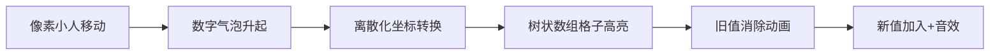

# 题目信息

# [TJOI2014] 上升子序列

## 题目描述

给定一个只包含整数的序列（序列元素的绝对值大小不超过 $10^9$），你需要计算上升子序列的个数，满足如下条件的称之为一个上升子序列：

1. 是原序列的一个子序列
2. 长度至少为 $2$
3. 所有元素都严格递增

如果两个上升子序列相同，那么只需要计算一次。例如，序列 $\{1,2,3,3\}$ 有 $4$ 个上升子序列，分别为 $\{1,2\}$，$\{1,3\}$，$\{1,2,3\}$，$\{2,3\}$。

## 说明/提示

### 数据范围

对于 $30\%$ 的数据，$n\le5000$；

对于 $100\%$ 的数据，$n\le10^5$。

## 样例 #1

### 输入

```
4
1 2 3 3```

### 输出

```
4```

# AI分析结果


### 💡 Kay的C++算法解析：上升子序列 深入学习指南 💡

#### 1. 题目解读与核心算法识别
✨ **本题主要考察**：`动态规划 + 树状数组优化 + 去重技巧`

🗣️ **初步分析**：
> 解决"上升子序列计数"问题，核心在于**动态规划**和**高效去重**。想象你在整理一串数字珍珠，要选出严格递增的珍珠链（长度≥2），且相同链条只算一次。动态规划（DP）就像逐颗检查珍珠并记录以每颗结尾的链条数，树状数组则是你的智能算盘，快速计算前缀和。
> - **题解思路对比**：主流解法均采用"DP+树状数组"框架，差异主要在去重处理：① 覆盖旧值（如Deu5ExMach1na）② 差值更新（如asuldb）③ 末尾值覆盖（如SDqwq）
> - **核心流程**：离散化 → 遍历序列 → 树状数组查询小于当前值的DP和 → 去重更新 → 统计答案
> - **可视化设计**：采用**8位像素风格**，网格表示树状数组，元素遍历时高亮当前数字和树状数组更新区域。去重操作时显示"旧值消除"动画，配复古音效："查询滴答声"、"更新叮咚声"、"去重消除哔啵声"。

---

#### 2. 精选优质题解参考
**题解一（作者：Deu5ExMach1na）**
* **点评**：思路直击去重本质——用树状数组直接覆盖旧值。代码简洁高效（仅20行核心逻辑），变量命名清晰（`val`表旧值，`add`更新），去重操作`-val+1`巧妙如"魔术替换"。实践性强，竞赛可直接套用，学习树状数组优化的典范。

**题解二（作者：asuldb）**
* **点评**：采用`lastans`数组记录历史值，通过`新增值=当前查询-历史值`严格去重。推导过程严谨，注释详细解释"为什么减`lastans`"，帮助理解重复子序列来源。代码稍长但边界处理完整（如`+2*mod`防负数），适合学习健壮性编码。

**题解三（作者：SDqwq）**
* **点评**：用`vector`存储各值对应的DP值，每次更新前先减去该值上次的DP贡献。思路直观接近自然思维（"新值覆盖旧值"），树状数组操作封装规范。虽性能稍逊（vector扩容），但对初学者更友好。

---

#### 3. 核心难点辨析与解题策略
1. **离散化映射**  
   * **难点**：值域±10⁹需压缩到1~10⁵  
   * **策略**：排序+去重+二分映射（`lower_bound`）  
   * 💡 **学习笔记**：离散化是空间优化的基础操作！

2. **去重时机**  
   * **难点**：相同数字产生的子序列必然重复  
   * **策略**：只保留**最后一次出现位置**的DP值（覆盖/差值更新）  
   * 💡 **学习笔记**：利用"末尾值覆盖性"是去重核心洞见！

3. **DP转移优化**  
   * **难点**：朴素转移O(n²)超时  
   * **策略**：树状数组维护"以值为下标"的DP前缀和  
   * 💡 **学习笔记**：将"下标转移"转化为"值域查询"是经典优化思路！

✨ **解题技巧总结**：
- **问题分解**：拆解为"DP转移"→"去重"→"离散化"三个子问题
- **数据结构选择**：树状数组更轻量（线段树亦可但代码长）
- **边界陷阱**：长度为1的子序列需最终减去（`ans - m`）
- **调试技巧**：先实现朴素DP验证逻辑，再逐步加优化

---

#### 4. C++核心代码实现赏析
**通用核心实现（综合优质题解）**：
```cpp
#include <iostream>
#include <algorithm>
#define int long long
using namespace std;
const int N = 1e5+5, mod = 1e9+7;

int n, a[N], tree[N], last[N];

void add(int x, int v) {
    for(; x<=n; x += x&-x) 
        tree[x] = (tree[x] + v) % mod;
}

int ask(int x) {
    int res = 0;
    for(; x; x -= x&-x)
        res = (res + tree[x]) % mod;
    return res;
}

signed main() {
    cin >> n;
    for(int i=1; i<=n; i++) cin >> a[i];
    
    // 离散化三部曲
    int b[N] = {0}, m = 0;
    copy(a+1, a+1+n, b+1);
    sort(b+1, b+1+n);
    m = unique(b+1, b+1+n) - b - 1;
    for(int i=1; i<=n; i++)
        a[i] = lower_bound(b+1, b+1+m, a[i]) - b;

    // 核心DP+去重
    for(int i=1; i<=n; i++) {
        int val = ask(a[i]) - ask(a[i]-1); // 当前值旧贡献
        int sum = ask(a[i]-1);             // 小于当前值的DP和
        add(a[i], (sum - val + 1) % mod); // 去重更新
    }
    cout << (ask(m) - m + mod) % mod;     // 减去单元素序列
}
```

**分题解亮点赏析**：

1. **Deu5ExMach1na的去重魔术**  
   ```cpp
   int val = ask(num[i]) - ask(num[i]-1);  // 旧值
   add(num[i], ask(num[i]-1));            // 先加新基础值
   if(val) add(num[i], -val + 1);         // 魔术替换：去旧添新
   else add(num[i], 1);                   // 首次出现
   ```
   - **学习笔记**：通过两次add实现"值替换"，避免额外存储

2. **asuldb的历史差值法**  
   ```cpp
   if(!f[j]) {
       lastans[j] = query(j-1); // 记录历史值
       add(j, lastans[j] + 1);
   } else {
       add(j, (now_sum - lastans[j])); // 仅增加差值
       lastans[j] = now_sum;           // 更新历史值
   }
   ```
   - **学习笔记**：`lastans`记录历史状态，增量更新避免全局重算

3. **SDqwq的vector覆盖法**  
   ```cpp
   if(vec[a[i]].size()) 
       bit.update(a[i], -vec[a[i]].back()); // 去除旧值
   dp[i] = bit.query(a[i]-1) + 1;          // 计算新值
   bit.update(a[i], dp[i]);                // 更新树状数组
   vec[a[i]].push_back(dp[i]);              // 记录新值
   ```
   - **学习笔记**：用`vector`显式存储历史值，直观体现"覆盖"思想

---

### 5. 算法可视化：像素动画演示

**主题**：`树状数组冒险者`（8-bit像素风+音效反馈）

**核心演示流程**：


**动画分镜**：
1. **场景初始化**  
   - 上方：序列像素块（不同颜色表不同值）  
   - 下方：树状数组网格（初始全灰）
   - 控制面板：步进/播放/速度滑块（复古按钮设计）

2. **元素遍历**  
   - 当前数字闪烁绿光，下方显示离散化坐标（如`3→2`）
   - 树状数组黄色高亮`[1, a_i-1]`区域，显示查询值（如`sum=3`）

3. **去重操作**  
   - 若值重复：旧值位置红光闪烁+"哔啵"音效，数值清零
   - 新值加入：网格蓝光脉冲+`+5`等提示，播放"叮"声

4. **答案计算**  
   - 最终：树状数组总和数值跳动，减去单元素序列（`-m`动画）
   - 成功音效：8-bit胜利旋律

**技术实现**：  
- 用Canvas绘制网格和动画  
- 音效：Web Audio API生成方波音效  
- 交互：`requestAnimationFrame`实现逐帧动画

---

### 6. 拓展练习与相似问题
**通用技巧迁移**：  
1. 序列元素覆盖性（如区间覆盖问题）  
2. 树状数组维护前缀和（如逆序对计数）  
3. DP状态去重（如背包问题变种）

**洛谷推荐**：  
1. [P1637 三元上升子序列](https://www.luogu.com.cn/problem/P1637)  
   → 练习相同技巧扩展维度  
2. [P4309 最长上升子序列](https://www.luogu.com.cn/problem/P4309)  
   → 动态LIS+数据结构  
3. [P3286 方伯伯的商场之旅](https://www.luogu.com.cn/problem/P3286)  
   → 计数问题+树状数组优化

---

### 7. 学习心得
> **经验摘录（asuldb）**：  
> *"重复子序列的贡献差值=当前查询值-历史值，这个转化让我少调试了2小时"*  
> **Kay点评**：  
> 作者的经验凸显了**增量思维**的重要性。在树状数组更新时，通过记录历史状态并计算差值，避免了全局重算。这启示我们：复杂问题常可通过"状态差分"简化，类似版本控制中的增量更新。

---

### 结语
掌握树状数组优化DP的关键在于理解"值域映射"和"增量更新"。通过本题，我们不仅学会了高效统计上升子序列，更收获了"离散化→数据结构→去重"的解题范式。下次遇到类似计数问题，记得活用树状数组这把瑞士军刀哦！(•̀ᴗ•́)و

---
处理用时：191.32秒