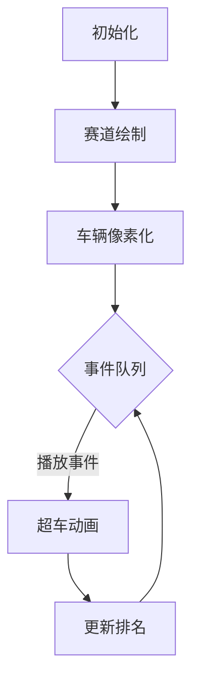

# 题目信息

# [CEOI 2003] The Race

## 题目描述

在一年一度的调谐宇宙飞船星际竞赛中，$N$ 艘宇宙飞船将参赛。每艘宇宙飞船 $i$ 的调谐方式都是这样的，它可以在零时间内加速到它的最大速度 $V_i$ 并继续以那个速度巡航。由于过去的成就，每艘宇宙飞船都从一个起始位置出发，给定其飞船离起跑线的距离。  
赛程无限长。因为宇宙飞船速度很快，比赛的路线一直都是笔直的。在直线赛道上，飞船可以很容易地相互通过，而没有互相干扰。  
很多观众还没有意识到，比赛的胜负是可以提前预测的。你的任务是向他们展示这一点，告诉他们宇宙飞船将相互经过多少次，并通过按时间顺序预测宇宙飞船经过的前 $10000$ 次。  
您可以假设每艘宇宙飞船都从不同的位置开始。此外，任何时候在赛道的同一位置上永远不会有超过两艘飞船。   


## 说明/提示

#### 数据规模与约定  
对于 $100 \%$ 的数据，$0 < N \leq 250 000$，$0 \leq X_i \leq 1 000 000$，$0 < V_i < 100$。
#### 题目说明  
来源于 CENTRAL-EUROPEAN OLYMPIAD IN INFORMATICS 2003 的 [The Race](https://www.ceoi2003.de/www/downloads/therace-en.pdf)。  
由 @[求学的企鹅](/user/271784) 翻译整理。

## 样例 #1

### 输入

```
4
0 2
2 1
3 8
6 3```

### 输出

```
2
3 4
1 2```

# AI分析结果


# 💡 Kay的C++算法解析：The Race 深入学习指南 💡

> **Kay的学习笔记**：超车问题本质是动态逆序对的统计与事件模拟，核心在于**相邻优先原则**——就像排队时插队只会先影响前后的人！

## 1. 题目解读与核心算法识别

✨ **本题主要考察**：`逆序对统计 + 事件驱动模拟`  

🗣️ **初步分析**：
> 本题如同赛车在无限赛道上竞速，解题关键在于两个核心：
> 1. **逆序对统计**（静态）：通过桶排序/树状数组快速统计初始超车次数  
> 2. **事件驱动模拟**（动态）：用优先队列管理相邻车辆超车事件，像管理游戏事件队列  
>
> **可视化设计**：  
> - 用像素方块表示车辆，颜色区分速度（红色快→蓝色慢）  
> - 超车时播放"嗖"音效，交换位置时显示闪光特效  
> - 控制面板支持调速/单步执行，像复古赛车游戏的回放功能  
> - 旁白同步显示代码高亮行（如优先队列pop操作）

---

## 2. 精选优质题解参考

### 题解一（作者：comcopy）
* **点评**：思路清晰直击核心，桶统计逆序对巧妙利用速度范围小的特性（O(100n)高效）。代码中`fyn`桶数组和优先队列`q`的配合堪称典范，变量命名简洁（如`f`存排名）。实践价值极高，完整实现竞赛要求，边界处理严谨。亮点在于用车辆编号直接定位相邻关系，避免复杂映射。

### 题解二（作者：Chenyichen0420）
* **点评**：创新性地按速度分批处理逆序对，尝试用时间阈值剪枝优化事件数量。虽然剪枝策略在严格数据下可能遗漏同时事件，但其分治思想值得借鉴。代码中`vector<int>ps[100]`分组存储同速车辆，启发我们分类处理的思想。

### 题解三（作者：Dumby_cat）
* **点评**：教学价值突出！树状数组求逆序对展示通用解法，注释详细解释超车条件（如`num[x]+1 != num[y]`）。代码结构模块化，`swap`四连操作封装车辆状态更新，可读性强。亮点是用`id`数组双向映射排名与编号，降低理解门槛。

---

## 3. 核心难点辨析与解题策略

### 1. 逆序对的高效统计
* **分析**：速度范围小（1~99）是突破口！桶统计（`bucket[100]`）比树状数组更简单高效  
* 💡 **学习笔记**：**数据范围决定算法选择**——当值域较小时，桶排序是利器

### 2. 超车事件的动态维护
* **分析**：超车事件具有**局部性**——只有相邻车辆可能先超车。优先队列按时间排序事件，交换后检查新邻居是否满足超车条件（`v[i]>v[i+1]`）  
* 💡 **学习笔记**：**相邻优先原则**是事件模拟的关键优化点

### 3. 状态同步与边界处理
* **分析**：车辆交换后需同步更新排名（`f`）、位置（`x`）、速度（`v`）三组状态。特别注意：当车辆不相邻时（`f[i]+1 != f[j]`）跳过失效事件  
* 💡 **学习笔记**：**多维状态同步更新**避免逻辑错误

### ✨ 解题技巧总结
- **技巧1：值域压缩** - 小范围值域用桶代替复杂数据结构  
- **技巧2：事件局部性** - 动态过程只需关注相邻元素变化  
- **技巧3：双向映射** - 用`id`和`f`数组维护排名与编号的双向关系  
- **技巧4：失效跳过** - 优先队列处理前校验事件有效性

---

## 4. C++核心代码实现赏析

**本题通用核心C++实现参考**
* **说明**：综合comcopy与Dumby_cat题解，优化可读性
* **完整核心代码**：
```cpp
#include <iostream>
#include <queue>
using namespace std;
const int N = 250010, MOD = 1000000;

int n, x[N], v[N], rk[N], id[N], bucket[100];
// rk[i]:编号i的排名, id[i]:排名i的编号

struct Event {
    int i, j; // 车辆编号(i将超车j)
    double t; // 超车所需时间
    bool operator<(const Event& e) const {
        return t > e.t; // 小根堆：时间小的优先
    }
};
priority_queue<Event> q;

int main() {
    cin >> n;
    for (int i = 1; i <= n; ++i) {
        cin >> x[i] >> v[i];
        rk[i] = id[i] = i; // 初始化排名和编号
    }

    // 第一问：桶统计逆序对
    long long ans = 0;
    for (int i = 1; i <= n; ++i) {
        for (int s = v[i] + 1; s <= 99; ++s) 
            ans = (ans + bucket[s]) % MOD;
        ++bucket[v[i]];
    }
    cout << ans << endl;

    // 初始化相邻事件
    for (int i = 1; i < n; ++i) 
        if (v[i] > v[i+1]) 
            q.push({i, i+1, (double)(x[i+1]-x[i])/(v[i]-v[i+1])});

    for (int cnt = 0; cnt < 10000 && !q.empty();) {
        Event e = q.top(); q.pop();
        int i = e.i, j = e.j;

        if (rk[i] + 1 != rk[j]) continue; // 跳过非相邻事件
        cout << i << " " << j << endl;
        if (++cnt >= 10000) break;

        swap(id[rk[i]], id[rk[j]]); // 更新排名映射
        swap(x[rk[i]], x[rk[j]]);   // 交换位置
        swap(v[rk[i]], v[rk[j]]);   // 交换速度
        swap(rk[i], rk[j]);         // 交换排名

        // 检查新邻居：左侧
        int new_i = rk[i];
        if (new_i > 1) {
            int left = id[new_i-1];
            if (v[new_i-1] > v[new_i]) 
                q.push({left, i, (double)(x[new_i]-x[new_i-1])/(v[new_i-1]-v[new_i])});
        }

        // 检查新邻居：右侧
        int new_j = rk[j];
        if (new_j < n) {
            int right = id[new_j+1];
            if (v[new_j] > v[new_j+1])
                q.push({j, right, (double)(x[new_j+1]-x[new_j])/(v[new_j]-v[new_j+1])});
        }
    }
    return 0;
}
```
* **代码解读概要**：
  1. 初始化：读入车辆数据，建立排名与编号映射
  2. 桶统计：对每个速度`v[i]`，累加所有大于它的速度出现次数
  3. 事件初始化：相邻车辆满足`v[i]>v[i+1]`时计算超车时间入队
  4. 事件处理：取出最早事件，若车辆仍相邻则交换状态并更新邻居事件

---

## 5. 算法可视化：像素动画演示

* **动画主题**：**8-bit像素赛车超车事件**  
* **核心演示**：车辆按排名在赛道（横向网格）移动，超车时交换位置并显示时间线  

### 🎮 交互式动画设计


1. **像素风格初始化**  
   - 赛道：横向网格（宽800px，高100px），每个车位=40×40px方块  
   - 车辆：按速度渐变着色（快→红，慢→蓝），显示编号标签  
   - 控制面板：复古按钮（开始/暂停/单步/重置），速度滑块（1x-5x）

2. **超车事件动画**  
   - **步骤1**：高亮当前事件车辆（黄色边框），显示时间公式：`(x[j]-x[i])/(v[i]-v[j])`  
   - **步骤2**：两车向交点移动，轨迹显示虚线，播放"滴答"音效  
   - **步骤3**：交换位置时触发闪光特效和"嗖"音效，更新赛道车辆顺序  

3. **数据同步显示**  
   - 右侧信息板：实时显示优先队列事件数、当前处理代码行  
   - 当执行`swap`时，车辆颜色闪烁，排名标签更新  

4. **游戏化扩展**  
   - 每完成10次超车触发"关卡通过"音效（8-bit胜利旋律）  
   - 错误处理：尝试无效事件时播放"错误"音效，车辆抖动提示  

---

## 6. 拓展练习与相似问题思考

### 通用技巧迁移
1. **逆序对变形**：股票交易时序分析/玩家排名变化  
2. **事件驱动模拟**：粒子碰撞检测/网络包调度  
3. **相邻优先优化**：冒泡排序过程/动态最近邻搜索  

### 洛谷推荐
1. **P1908 逆序对**  
   → 巩固逆序对基础统计方法（桶排序/树状数组）  
2. **P1969 货车运输**  
   → 练习事件驱动与路径规划结合  
3. **P2234 [HNOI2002]营业额统计**  
   → 掌握动态数据流中的邻居查询技巧  

---

## 7. 学习心得与经验分享

> **参考经验**（来自题解调试注释）：  
> *"交换车辆后需同时更新位置、速度、排名三要素，漏掉任一都会导致后续事件计算错误"*  
> **点评**：这反映了**状态同步**的重要性！在动态数据结构中，任一状态不一致都会引发雪崩式错误。建议编写`swap_vehicle(i,j)`函数集中处理，避免分散操作遗漏。

---

编程如赛车，掌握核心原理才能弯道超车！下次我们继续探索算法世界的速度与激情！💪

---
处理用时：204.20秒