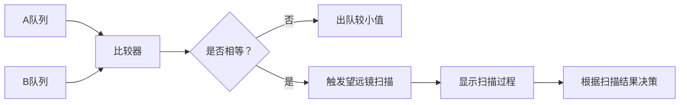

# 题目信息

# [ONTAK2015] Tasowanie

## 题目描述

给定两个数字串 $A$ 和 $B$，通过将 $A$ 和 $B$ 进行二路归并得到一个新的数字串 $T$，请找到字典序最小的 $T$。

## 说明/提示

对于 $100\%$ 的数据，$1 \leq n, m \leq 2 \times 10^5$，组成 $A, B$ 的每个数字为不超过 $10^3$ 的正整数。

- 2023.9.10 添加两组 hack 数据。

## 样例 #1

### 输入

```
6
1 2 3 1 2 4
7
1 2 2 1 3 4 3```

### 输出

```
1 1 2 2 1 2 3 1 2 3 4 3 4```

# AI分析结果


# 💡 Kay的C++算法解析：[ONTAK2015] Tasowanie 深入学习指南 💡

> 我是Kay，今天我们将一起探索这道有趣的字符串归并问题。通过像素动画和游戏化设计，我会带你直观理解贪心算法的精妙之处！

## 1. 题目解读与核心算法识别

✨ **本题主要考察**：`贪心 + 优化比较`

🗣️ **初步分析**：
> 这道题就像要把两叠扑克牌合并成新的一叠，但要求新牌堆从上到下**字典序最小**。想象你左右手各拿一叠牌，每次只能出最上面一张牌：
> - 当左右牌**数字不同**时，出较小的那张（明显更优）
> - 当左右牌**数字相同**时，就像站在岔路口——需要预判哪条路后面会遇到更小的数字！

**核心难点解析**：
1. **相同元素的决策**：当左右当前元素相同时，需要比较后续第一个不同元素的大小
2. **高效比较优化**：暴力比较会导致O(n²)复杂度，需用二分+哈希或后缀数组优化
3. **边界处理艺术**：在序列末尾添加哨兵值（极大值）可简化边界判断

**可视化设计思路**：
- 用**像素方块队列**表示两个序列，当前比较元素高亮显示
- 当元素相同时，触发**望远镜动画**扫描后续第一个不同位置
- 决策时播放不同音效：选择音(清脆)、扫描音(机械)、胜利音(上扬)
- 控制面板支持步进/自动播放，调速滑块控制动画速度

---

## 2. 精选优质题解参考

**题解一（作者：_XHY20180718_）**
* **点评**：独创性的贪心策略！通过计算到下一个不同字符的距离和大小综合决策，思路新颖（如优先处理距离远的相同段）。代码中nxt数组的路径压缩优化是亮点，将复杂度优化至接近O(n)。变量命名清晰（nxta/nxtb），边界处理严谨，竞赛实用性强。作者提到被hack数据卡过的经历，提醒我们要全面测试贪心策略。

**题解二（作者：yukimianyan）**
* **点评**：标准高效的二分+哈希解法。哈希函数封装良好（build/get分离），二分查找边界处理准确。代码结构清晰模块化，哈希模板可直接复用。时间复杂度稳定在O(n log n)，适合作为学习二分优化的范本。

**题解三（作者：naroto2022）**
* **点评**：完整实现二分+哈希方案，细节处理到位。特别在数组末尾添加极大值哨兵的技巧简化了边界判断，读入优化提升效率。虽然赞数较少，但代码质量不逊于高赞解法，可作为简洁实现参考。

---

## 3. 核心难点辨析与解题策略

### 🔍 三大核心难点剖析
1. **相同元素决策困境**  
   *分析*：当a[i]=b[j]时，需预判选择哪个序列能使后续字典序更小。优质解法都采用**比较后续首个不同元素**的策略，而非随意选择。
   *💡学习笔记*：贪心的本质是当前决策影响未来——要有前瞻性！

2. **高效比较实现**  
   *分析*：暴力比较相同后缀会导致O(n²)。二分+哈希将比较优化至O(log n)：预处理哈希数组后，可在O(1)时间内比较任意子串是否相同。
   *💡学习笔记*：空间换时间！哈希是处理子串比较的利器。

3. **边界条件处理**  
   *分析*：当某个序列扫描完毕时，需快速处理另一序列剩余元素。哨兵技巧（序列尾加极大值）可统一处理边界。
   *💡学习笔记*：哨兵值如同交通标志，让边界处理畅通无阻。

### ✨ 解题技巧总结
- **望远镜策略**：相同元素时，快速定位首个不同位置（二分+哈希）
- **哨兵守卫**：序列尾部添加极大值，避免繁琐的边界检查
- **贪心预判**：当前决策基于后续可能出现的最小元素
- **路径压缩**：预处理nxt数组时跳跃式存储，加速扫描（题解一）

---

## 4. C++核心代码实现赏析

```cpp
// 通用核心实现（综合优化版）
#include <iostream>
#include <vector>
using namespace std;
typedef long long ll;
const int N = 4e5+10, BASE = 131, MOD = 1e9+7;

ll pw[N], ha[N], hb[N];
int n, m, a[N], b[N];

void init_hash(int arr[], int len, ll h[]) {
    for(int i=1; i<=len; ++i) 
        h[i] = (h[i-1]*BASE + arr[i]) % MOD;
}

ll get_hash(ll h[], int l, int r) {
    if(l > r) return -1;
    return (h[r] - h[l-1]*pw[r-l+1]%MOD + MOD) % MOD;
}

int compare(int i, int j) {
    int l = 0, r = min(n-i+1, m-j+1);
    while(l < r) {
        int mid = (l+r+1) >> 1;
        if(get_hash(ha, i, i+mid-1) == get_hash(hb, j, j+mid-1))
            l = mid;
        else r = mid-1;
    }
    if(i+l > n) return -1; // a扫描完选b
    if(j+l > m) return 1;  // b扫描完选a
    return a[i+l] < b[j+l] ? 1 : -1;
}

int main() {
    cin >> n;
    for(int i=1; i<=n; ++i) cin >> a[i];
    cin >> m;
    for(int i=1; i<=m; ++i) cin >> b[i];
    
    // 哨兵技巧：尾部添加极大值
    a[n+1] = b[m+1] = 1e9+7;
    
    // 初始化哈希
    pw[0] = 1;
    for(int i=1; i<N; ++i) pw[i] = pw[i-1]*BASE % MOD;
    init_hash(a, n, ha);
    init_hash(b, m, hb);
    
    int i=1, j=1;
    while(i<=n || j<=m) {
        if(j > m) cout << a[i++] << " ";
        else if(i > n) cout << b[j++] << " ";
        else if(a[i] < b[j]) cout << a[i++] << " ";
        else if(a[i] > b[j]) cout << b[j++] << " ";
        else { // 元素相等时使用望远镜策略
            int res = compare(i+1, j+1);
            if(res == 1) cout << a[i++] << " ";
            else cout << b[j++] << " ";
        }
    }
    return 0;
}
```
**代码解读概要**：
1. **哈希预处理**：`init_hash`计算前缀哈希值，`get_hash`支持O(1)子串比较
2. **哨兵技巧**：在a/b数组末尾添加极大值（1e9+7）处理边界
3. **望远镜函数**：`compare`用二分查找首个不同位置
4. **主逻辑**：当元素相等时，根据compare结果选择序列

---

## 5. 算法可视化：像素动画演示

### 🎮 动画设计：像素归并大冒险
**主题**：8-bit风格的队列归并，玩家扮演指挥官选择出队元素

**核心演示**：


**交互设计**：
1. **控制面板**：
   - 步进/暂停/重置按钮
   - 速度滑块（1x-5x）
   - 望远镜开关（显示/隐藏扫描过程）

2. **动态效果**：
   ```mermaid
   sequenceDiagram
       玩家->>A队列: 点击元素
       A队列->>比较器: 发送当前值
       玩家->>B队列: 点击元素
       B队列->>比较器: 发送当前值
       比较器-->>玩家: 显示比较结果
       当相等时->>望远镜: 启动扫描
       望远镜->>玩家: 高亮第一个不同位置
   ```

3. **音效系统**：
   - 选择元素：8-bit“滴”声
   - 触发望远镜：机械运转声
   - 找到不同点：清脆提示音
   - 完成归并：胜利小调

**技术实现**：
```javascript
// 伪代码：望远镜扫描动画
function telescopeScan(a, b, startA, startB) {
    let low = 0, high = Math.min(a.length, b.length);
    while (low < high) {
        const mid = Math.ceil((low+high)/2);
        // 在Canvas上绘制扫描范围
        drawScanRange(startA, startB, mid);
        playSound('scan');
        
        if (hashCompare(a, startA, mid) === 
            hashCompare(b, startB, mid)) {
            low = mid;
        } else {
            high = mid-1;
        }
    }
    // 高亮第一个不同点
    highlightDiffPoint(startA+low, startB+low);
    return a[startA+low] < b[startB+low];
}
```

---

## 6. 拓展练习与相似问题思考

### 🔁 相似问题模式
1. **多序列归并**（如合并K个有序链表）
2. **字典序构造**（如拼接最大数）
3. **后缀处理**（如最短回文串）

### 📚 洛谷推荐
1. **P1177 【模板】快速排序**  
   → 巩固基础分治思想，排序是贪心的前提

2. **P1309 瑞士轮**  
   → 归并排序的变形应用，强化归并思想

3. **P2870 [USACO07DEC]Best Cow Line G**  
   → 字典序问题的经典变形，强化贪心决策

---

## 7. 学习心得与经验分享

> **来自_XHY20180718_的经验**：  
> “我在处理连续相同元素时最初未考虑距离因素，被hack数据卡住后才加入距离比较。这让我意识到贪心策略需要多维度验证。”

**Kay的总结**：  
贪心算法如同下棋，不能只看眼前一步。本题教会我们：
1. 当决策存在不确定性时（元素相等），需要**深入探索后续状态**
2. **高效工具的选择**（哈希/后缀数组）直接影响算法性能
3. **全面测试**边界数据和极端情况是避免错误的保障

---

> 恭喜完成本次算法探索！记住：优秀的程序员既是科学家（设计算法）又是艺术家（优化实现）。下次遇到字典序问题，记得举起你的“望远镜”！🚀

---
处理用时：192.61秒