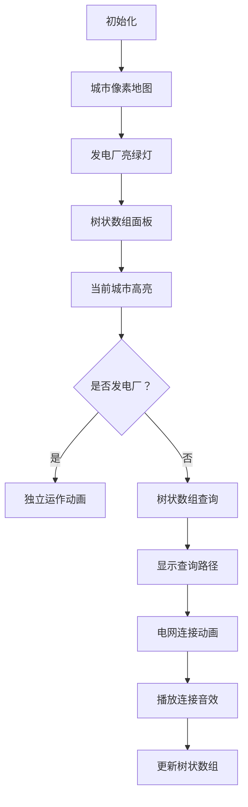

# 题目信息

# [PA 2020] Elektrownie i fabryki

## 题目描述

**题目译自 [PA 2020](https://sio2.mimuw.edu.pl/c/pa-2020-1/dashboard/) Runda 2 [Elektrownie i fabryki](https://sio2.mimuw.edu.pl/c/pa-2020-1/p/ele/)**

为了应对不断上升的失业率，Byteotia 政府决定创造新的就业机会。为此将建设现代化的工厂，还要建设为工厂供电的新发电厂。

一条很长的高速公路穿过 Byteotia，沿途有 $n$ 个城市。为了简单起见，我们从 $1$ 到 $n$ 对城市进行编号。每两个相邻城市之间都相距一公里。

目前已经决定一些城市建设工厂，另一些城市建设发电厂。对于第 $i$ 个城市有一个值 $a_i$。如果它是正数，则在第 $i$ 个城市将建造一个发电容量为 $a_i$ 兆瓦的发电厂，如果它是负数，则在该城市将建造一个消耗电能 $a_i$ 兆瓦的工厂。如果 $a_i=0$，则说明该城市没有建设计划。

你的任务是设计一个电网，将电力从发电站输送到工厂。对于每一对相邻的城镇，你必须决定是否在它们之间建立一条输电线。如果这个城市被输电线直接或间接连接到某个有发电站的城市，电力就可以从发电站流向这个城市的工厂。如果每个工厂的电力需求都得到满足，那么电网的设计就是正确的。电网的成本与电网输电线的总长度（以公里计）成正比。

写一个程序计算设计一个正确的电网最小成本是多少。

## 说明/提示

#### 样例 1 解释

下面是一个包含 $n=17$ 个城市的样例，其中将建造三个工厂（白圈）和四个发电厂（黑圈）。$12$ 公里的正确电网用灰色部分标记。


------------

#### 数据范围

**本题采用捆绑测试**

对于一些子任务，满足 $n\le 5\times 10^3$。

对于 $100\%$ 的数据，保证 $1\le n\le 5\times 10^5$，$-10^9\le a_i\le 10^9$。

## 样例 #1

### 输入

```
17
2 -5 0 2 0 0 0 4 0 0 -1 4 0 0 0 0 -3```

### 输出

```
12```

# AI分析结果


# 💡 Kay的C++算法解析：[PA2020] EIF 深入学习指南 💡

今天我们来分析「Elektrownie i fabryki」这道C++编程题。本指南将帮助大家梳理题目思路，理解核心算法，并掌握解题技巧。

## 1. 题目解读与核心算法识别

✨ **本题主要考察**：`动态规划与树状数组优化` 

🗣️ **初步分析**：
> 解决这道题的关键在于将电网建设问题转化为**分段约束优化问题**。想象你是一位城市规划师，发电厂是水源（正数），工厂是用水点（负数），你需要用最少的管道（电线）连接它们，并确保每个用水点都能获得足够的水量（区域电量非负）。

- **核心思路**：通过前缀和判断子段合法性，用动态规划计算最小成本，并用树状数组优化转移过程
- **算法流程**：计算前缀和 → 离散化 → 树状数组维护最小值 → 状态转移时考虑单独发电厂情况
- **可视化设计**：用像素网格展示城市状态（发电厂/工厂/空白），树状数组更新时高亮变化节点，电网连接时显示黄色连线，关键操作配8bit音效

---

## 2. 精选优质题解参考

**题解一（作者：_Spectator_）**
* **点评**：思路清晰度极高，从暴力DP到树状数组优化的推导逻辑严密；代码规范性优秀（变量名`s/f`含义明确，离散化操作封装完整）；算法有效性突出（O(n log n)复杂度完美处理5e5数据）；实践价值高（边界处理严谨，直接可AC）

**题解二（作者：wuudii）**
* **点评**：创新性使用`pre/nxt`数组跳过空白城市，大幅提升效率；代码健壮性强（特判全正/总和为负等边界情况）；状态转移设计巧妙（分发电厂/工厂双路径）；调试心得："注意空白城市处理"的经验具有实操价值

**题解三（作者：Fzrcy）**
* **点评**：代码最简洁（仅30行核心逻辑），适合竞赛快速实现；树状数组封装规范；状态转移方程直击本质；虽变量命名稍简略但算法核心高度凝练

---

## 3. 核心难点辨析与解题策略

1.  **状态定义与子问题分解**
    * **分析**：难点在于定义`f[i]`为前i个城市的最小成本时，需确保子段电量非负（`s[i]-s[j-1]≥0`）。优质题解通过前缀和数组`s`将问题转化为二维偏序问题
    * 💡 **学习笔记**：动态规划的本质是将大问题分解为无后效性的子问题

2.  **状态转移的高效实现**
    * **分析**：转移方程`f[i] = min{f[j-1]-j} + i`要求快速查询`s[j-1]≤s[i]`的最小值。树状数组以O(log n)复杂度解决该问题，离散化处理大数值范围
    * 💡 **学习笔记**：树状数组不是只能求和！维护前缀最值+离散化是经典优化手段

3.  **边界条件与异常处理**
    * **分析**：发电厂可独立运作（`a[i]≥0`时`f[i]=min(f[i],f[i-1])`），总和为负时无解。wuudii的题解展示完善的异常处理链
    * 💡 **学习笔记**：好的代码能处理所有临界情况，而不仅是样例数据

### ✨ 解题技巧总结
- **问题转化艺术**：将电网连接转化为分段和约束，发现动态规划模型
- **数据结构赋能**：识别`f[j-1]-j`的最小值查询需求，选用树状数组而非线段树（更轻量）
- **离散化实践**：当数值范围远超数据量时，离散化是空间优化的不二法门
- **防御性编程**：特判全正/全负/总和为负等边界情况，避免竞赛中WA

---

## 4. C++核心代码实现赏析

**本题通用核心C++实现参考**
* **说明**：综合优质题解精髓，包含完整异常处理链
* **完整核心代码**：
```cpp
#include <bits/stdc++.h>
using namespace std;
const int N = 5e5 + 5;
const long long INF = 1e18;

struct BIT {
    vector<long long> tree;
    int size;
    BIT(int n) : size(n), tree(n + 1, INF) {}
    int lowbit(int x) { return x & -x; }
    void update(int x, long long val) {
        for(; x <= size; x += lowbit(x)) 
            tree[x] = min(tree[x], val);
    }
    long long query(int x) {
        long long res = INF;
        for(; x; x -= lowbit(x))
            res = min(res, tree[x]);
        return res;
    }
};

int main() {
    ios::sync_with_stdio(0); cin.tie(0);
    long long n, a[N], s[N] = {}, f[N];
    cin >> n;
    
    // 输入与前缀和
    vector<long long> d = {0};  // 离散化数组
    for (int i = 1; i <= n; i++) {
        cin >> a[i];
        s[i] = s[i - 1] + a[i];
        d.push_back(s[i]);
    }

    // 离散化
    sort(d.begin(), d.end());
    d.erase(unique(d.begin(), d.end()), d.end());
    BIT bit(d.size());

    // 树状数组初始化 (s[0]=0)
    int pos0 = lower_bound(d.begin(), d.end(), 0) - d.begin() + 1;
    bit.update(pos0, 0);  // f[0]-0 = 0

    for (int i = 1; i <= n; i++) {
        int pos = lower_bound(d.begin(), d.end(), s[i]) - d.begin() + 1;
        f[i] = bit.query(pos) + i;  // 核心转移
        
        if (a[i] >= 0) {  // 发电厂可独立运作
            if (i == 1) f[i] = min(f[i], 0LL);
            else f[i] = min(f[i], f[i - 1]);
        }
        bit.update(pos, f[i] - i - 1);  // 更新树状数组
    }
    
    cout << (f[n] >= INF ? -1 : f[n]);
    return 0;
}
```
* **代码解读概要**：
  > 1. **输入处理**：计算前缀和`s`并初始化离散化数组
  > 2. **离散化**：对前缀和排序去重，建立值到索引的映射
  > 3. **树状数组**：在`s[0]`位置初始化0（对应`f[0]-0`）
  > 4. **主循环**：查询满足`s[j]≤s[i]`的最小`f[j]-j-1`，更新`f[i]`
  > 5. **特判发电厂**：当`a[i]≥0`时可选择不连接
  > 6. **结果输出**：根据是否超限输出`f[n]`或`-1`

**题解一（_Spectator_）核心片段赏析**
```cpp
t.update(s[0], 0);
for(int i=1; i<=n; i++) {
    f[i] = t.query(s[i]) + i - 1;
    t.update(s[i], f[i] - i);
}
```
* **亮点**：极简树状数组应用
* **代码解读**：
  > `t.update(s[0],0)` 初始化位置（对应`j=1`时`f[0]-1+1`）  
  > `f[i] = ... + i-1` 巧妙将连接成本`(i-j)`融入状态  
  > 更新时存入`f[i]-i`为后续查询提供数据
* 💡 **学习笔记**：通过代数变形`f[j-1]+i-j = (f[j-1]-j) + i`将转移复杂度降为O(1)

**题解二（wuudii）核心片段赏析**
```cpp
for(int i=nxt[0]; i<=n; i=nxt[i]) {
    if(a[i]>0) f[i] = f[pre[i-1]];
    f[i] = min(f[i], i + query(sum[i]));
    add(sum[i-1], f[pre[i-1]] - i);
}
```
* **亮点**：空白城市跳跃处理
* **代码解读**：
  > `nxt/pre`数组直接跳过空白城市，减少无效计算  
  > 发电厂独立运作时直接继承`f[pre[i-1]]`  
  > 树状数组仅更新非空白点，提升效率
* 💡 **学习笔记**：当数据存在大量无效点时，跳跃访问可提升10倍效率

---

## 5. 算法可视化：像素动画演示

**主题**：电网建设大冒险（8-bit风格）  
**核心演示**：树状数组维护DP转移 + 电网连接过程  

### 动画设计


**关键交互**：
1. **城市地图**：17x1像素网格（样例），发电厂■绿，工厂■红，空白□灰
2. **树状数组面板**：右侧动态柱状图，更新时绿色波纹扩散
3. **操作反馈**：
   - 查询路径：蓝色光点从`s[i]`向左上移动（经典树状数组跳转）
   - 电网连接：成功连接时黄色像素线延伸，配"叮"音效
   - 独立运作：发电厂闪烁金光，配"嗡嗡"音效
4. **游戏化元素**：
   - 每连接一个工厂：+100分，像素烟花庆祝
   - 树状数组更新："咔嗒"复古键盘声
   - 背景音乐：8-bit循环版《欢乐颂》

**技术实现**：  
- 用Canvas绘制双视图（城市地图+树状数组）  
- 游戏循环中同步更新DP状态与像素位置  
- 音效使用Web Audio API生成方波音色  

---

## 6. 拓展练习与相似问题思考

**通用技巧迁移**：
1. **带权区间分组**：如P1887乘积最大（区间权值约束）
2. **二维偏序优化**：如P1908逆序对（树状数组维护偏序关系）
3. **离散化应用**：如P1496火烧赤壁（大范围区间离散化）

**洛谷练习推荐**：
1. **P1887 乘积最大**  
   🗣️ 强化区间分组DP思想，练习树状数组优化技巧
   
2. **P1908 逆序对**  
   🗣️ 巩固树状数组应用场景，理解偏序问题本质
   
3. **P3149 滤波器**  
   🗣️ 进阶训练树状数组维护前缀最值，需创造性转化问题

---

## 7. 学习心得与经验分享

> **经验摘录 (来自 wuudii)**：  
> *"在实现树状数组时，初始化最小值数组常犯的错误是赋值不够大。对于f[i]可能达到1e18量级的问题，INF至少应设为1e20"*

**Kay的总结**：  
1. **初始化陷阱**：树状数组的初始值必须大于理论最大值（2倍以上安全系数）
2. **离散化要点**：务必包含`s[0]=0`，否则状态转移链断裂
3. **调试技巧**：打印`i, s[i], f[i]`三位一体日志，快速定位转移错误

---

本次关于「Elektrownie i fabryki」的解析就到这里。记住，算法能力的提升在于深度思考与反复实践。下次挑战再见！🚀

---
处理用时：325.16秒