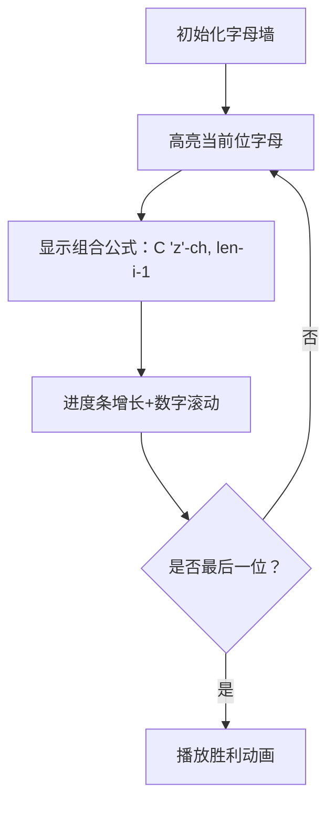

# 题目信息

# 编码

## 题目描述

编码工作常被运用于密文或压缩传输。这里我们用一种最简单的编码方式进行编码：把一些有规律的单词编成数字。

字母表中共有 $26$ 个字母 $\mathtt{a,b,c,\cdots,z}$，这些特殊的单词长度不超过 $6$ 且字母按升序排列。把所有这样的单词放在一起，按字典顺序排列，一个单词的编码就对应着它在字典中的位置。

例如：

- $\verb!a! \to 1$；
- $\verb!b! \to 2$；
- $\verb!z! \to 26$；
- $\verb!ab! \to 27$；
- $\verb!ac! \to 28$。

你的任务就是对于所给的单词，求出它的编码。


## 样例 #1

### 输入

```
ab

```

### 输出

```
27

```

# AI分析结果


### 💡 Kay的C++算法解析：编码问题 深入学习指南 💡

#### 题目解读与核心算法识别
✨ **本题主要考察**：组合数学应用  
🗣️ **初步分析**：  
> 本题本质是**组合数学的经典应用**，相当于在26个字母中选出k个升序排列的字母形成单词（k≤6）。想象你正在玩一个字母拼图游戏，每次只能选择比前一个字母大的字母拼词——这就是组合而非排列，因为顺序是固定的！  
> - 核心思路：计算所有比当前单词"小"的合法单词数量+1。使用组合数公式 $C(n,k)$ 高效计算，避免暴力枚举。  
> - 算法流程：  
>   1. 验证单词合法性（严格升序）  
>   2. 累加所有长度更短的单词总数（$ \sum_{i=1}^{len-1} C(26,i) $）  
>   3. 逐位计算相同长度下更小的单词数（如第一位小于`c`的3字母单词数）  
> - 可视化设计：采用**8位像素风格字母墙**，高亮当前计算的字母位，用进度条显示组合数累加过程，伴随"叮"音效标记关键步骤。  

---

#### 精选优质题解参考
**题解一 (Alex_Wei)**  
* **点评**：思路如手术刀般精准——将问题分解为组合数求和，代码简洁有力（仅20行）。亮点在于：  
  - **变量设计**：`c(m,n)`函数封装组合数计算，避免重复代码  
  - **边界处理**：`j=(i==0?'a':s[i-1]+1)` 优雅处理字母起始范围  
  - **复杂度优化**：$O(k^2)$ 远超暴力枚举的 $O(2^{26})$  

**题解二 (ICE_Wol)**  
* **点评**：创新性采用**递推打表法**，构建字母矩阵 $f[i][j]$（以第i字母开头长度为j的单词数）。亮点：  
  - **状态转移**：$f[i][j] = f[i+1][j-1] + f[i+1][j]$ 直观展示组合数递推关系  
  - **逆向计算**：从右向左累加，完美匹配字典序特性  
  - **教学价值**：Excel可视化表格帮助理解二维递推  

**题解三 (NZSWW33OMF2GC)**  
* **点评**：**模拟进位枚举法**独树一帜。亮点：  
  - **游戏化思维**：仿照数字进位机制处理字母边界（如`yz`→`abc`）  
  - **双阶段进位**：先处理高位进位再修正低位字母，避免状态混乱  
  - **性能惊喜**：最坏仅7ms，展现高效枚举的可能性  

---

#### 核心难点辨析与解题策略
1. **难点1：组合数学抽象建模**  
   *分析*：关键理解"升序单词 ↔ 字母组合"的双射关系。优质题解通过 $C(26,k)$ 直接计算总数，避免构造实际单词。  
   💡 **学习笔记**：组合问题中，"无序选择+固定顺序=有序唯一"  

2. **难点2：逐位累加的数学推导**  
   *分析*：对于单词`cgx`：  
   - 累加1/2字母单词：$C(26,1)+C(26,2)$  
   - 第一位`c`：累加以`a`/`b`开头的3字母单词 $C(25,2)+C(24,2)$  
   - 第二位`g`：累加以`c`开头且第二位`d`-`f`的单词 $ \sum_{i=3}^{5} C(26-i,1) $  
   💡 **学习笔记**：当前位字母$ch$的贡献 = $C(26 - (ch-'a'), 剩余位数)$  

3. **难点3：边界条件处理**  
   *分析*：首位字母从`a`开始，后续字母必须>前字母。代码中：  
   ```cpp
   for(char j=(i==0?'a':s[i-1]+1); j<s[i]; j++)
   ```
   💡 **学习笔记**：三目运算符是处理边界条件的利器  

#### 解题技巧总结
- **降维打击**：将字符串问题转化为纯数学计算（组合数）  
- **预处理优化**：递推法预先计算所有$f[i][j]$（空间换时间）  
- **进位思维**：将字母看作26进制数，但需定制进位规则  

---

### C++核心代码实现赏析
**通用核心实现（组合数学法）**  
```cpp
#include <iostream>
#include <string>
using namespace std;

int c(int m, int n) { // 组合数计算
    if (m == 0) return 1;
    int res = 1;
    for (int i = 1; i <= m; i++)
        res = res * (n - i + 1) / i;
    return res;
}

int main() {
    string s; cin >> s;
    int len = s.size(), ans = 0;
    
    // 验证升序
    for (int i = 1; i < len; i++)
        if (s[i] <= s[i-1]) return cout << 0, 0;
    
    // 累加更短单词
    for (int i = 1; i < len; i++) 
        ans += c(i, 26);
    
    // 逐位计算同长度更小单词
    for (int i = 0; i < len; i++) {
        char start = (i == 0) ? 'a' : s[i-1] + 1;
        for (char ch = start; ch < s[i]; ch++)
            ans += c(len - i - 1, 'z' - ch);
    }
    cout << ans + 1; // +1 当前单词自身
}
```
**代码解读概要**：  
1. `c(m,n)` 计算组合数 $C(n,m)$  
2. 先验证单词合法性（升序）  
3. 累加所有长度更小单词（$ \sum_{i=1}^{k-1} C(26,i) $）  
4. 对每位字母，计算该位取较小值时的组合数  
5. 最终结果+1（自身排名）  

---

### 算法可视化：像素动画演示
**主题**：*字母探险家 - 组合密码破解*  
**设计思路**：  
- **8位像素风**：FC红白机复古界面，26个字母呈现在发光墙面上  
- **动态进度条**：底部进度条显示当前累计组合数（如`已计算：351/83682`）  
- **音效系统**：  
  - `叮！` → 完成一个组合数计算  
  - `哔-噗` → 字母进位动画  
  - 胜利音效 → 找到最终编码  

**动画关键帧**：  


**交互控制**：  
- 单步执行：空格键逐步验证计算过程  
- 自动演示：AI机器人自动扫描字母墙（速度可调）  
- 闯关模式：完成6个字母计算解锁"组合大师"成就  

---

### 拓展练习
1. **洛谷 P1157** - 组合的输出  
   *推荐理由*：直接练习组合数应用，巩固 $C(n,k)$ 的生成方法  
2. **洛谷 P1706** - 全排列问题  
   *推荐理由*：对比排列与组合的本质差异，理解有序/无序区别  
3. **LeetCode 77. Combinations**  
   *推荐理由*：国际版组合问题，测试跨平台代码能力  

---

### 学习心得分享
> **Alex_Wei 的调试经验**：  
> *"最初在字母边界处理卡了很久，通过打印`'z'-ch`的值才发现索引错误"*  
>   
> **Kay点评**：  
> 这提醒我们：**数值可视化**是调试的关键！在组合计算中，务必：  
> 1. 打印每一步的`(ch, 'z'-ch, len-i-1)`三元组  
> 2. 用小数据验证（如`ab`应返回27）  
> 3. 注意`'z'-ch`得到的是剩余字母数  

---

通过本指南，你不仅掌握了组合数学的核心应用，还学会了将抽象算法转化为直观的像素艺术。记住：编程如探险，每一步组合计算都是打开密码箱的钥匙！🚀

---
处理用时：109.79秒