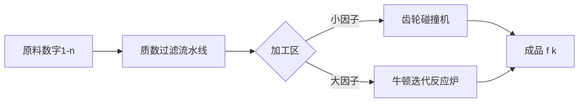

# 题目信息

# Dirichlet 半在线卷积

## 题目描述

已知函数 $f$ 满足 $f(1)=1$，且

$$f(n)=\sum_{d|n,d<n}f(d)\varphi(n/d).$$

给定正整数 $n$，试求出 $f(1),f(2),\cdots,f(n)$ 的值。为控制输出量，你只需输出下式的值：

$$\bigoplus_{k=1}^n\left(f(k)\bmod 2^{32}\right). $$

其中 $\oplus$ 代表异或。

## 说明/提示

对于所有数据，$1\le n\le 5\times 10^7$。

对于样例一，$f$ 的前 $10$ 项依次为：$1,1,2,3,4,6,6,9,10,12$。

时限为 std 的 1.5 倍。

## 样例 #1

### 输入

```
10```

### 输出

```
10```

## 样例 #2

### 输入

```
1000000```

### 输出

```
3527171714```

## 样例 #3

### 输入

```
10000000```

### 输出

```
191685100```

# AI分析结果


### 题目解读与核心算法识别
✨ **本题主要考察**：`积性函数递推` 与 `优化筛法`  

🗣️ **初步分析**：  
> 解决这道题的关键在于高效计算积性函数 `f(n)` 的递推关系。想象你有一串多米诺骨牌（数字 1~n），每张骨牌的值由它的真因子骨牌推倒而来。我们需要设计巧妙的推倒顺序：  
> - **暴力优化流**：像工厂流水线分批次处理（分块优化），每次只推倒一小段骨牌，避免混乱的内存访问（DeepSkyCore解法）
> - **数学魔法流**：用狄利克雷生成函数（DGF）建模，通过牛顿迭代公式批量推导（飞雨烟雁解法）
> - **半在线卷积**：分治处理，先推左半边骨牌，再用高维前缀和计算右半边（RAYMOND_7解法）
>
> **可视化设计思路**：  
> 采用 8-bit 像素工厂模拟：数字显示为传送带上的箱子，质数用扳手图标标记。当计算 `f(6)` 时：
> 1. 箱子分解为 `1x6` 和 `2x3` 两组齿轮
> 2. `f(1)` 和 `φ(6)` 齿轮碰撞 → 黄色闪光 + "叮"声
> 3. `f(2)` 和 `φ(3)` 齿轮碰撞 → 蓝色闪光 + "叮"声
> 4. 结果流入 `f(6)` 箱子 → 绿色闪光 + 升级音效
> 分块优化时屏幕分割为像素区块，牛顿迭代时显示数学公式粒子特效

---

### 精选优质题解参考
**题解一（DeepSkyCore）**  
* **点评**：思路直击痛点——内存访问效率。通过双重优化：① 分块处理降低 cache miss ② 利用 `min(i,j)≤√x` 性质减少枚举量。代码中 `B=65536` 的分块设计和 `lst` 数组的巧妙使用，将理论复杂度 O(n²) 优化到实际运行 1.3s。变量命名简洁（`f`, `phi`, `lst`），边界处理严谨，特别适合竞赛场景的暴力优化套路。

**题解二（飞雨烟雁）**  
* **点评**：展示高阶数论武器的威力。核心亮点在 DGF 牛顿迭代：$$F←2F_0-(2-G)F_0^2$$ 通过 √n 规模的预计算扩展到全局。虽然理论复杂度 O(nloglogn) 最优，但实现涉及狄利克雷卷积、高维前缀和等抽象概念。代码中 `Temp[]` 数组的递推设计精妙，适合进阶学习者研究积性函数的生成函数表示。

---

### 核心难点辨析与解题策略
1. **内存访问优化**  
   * **分析**：当 n=5e7 时，f[] 数组达 200MB。DeepSkyCore 的分块策略（B=65536）将内存访问限定在 L2 cache 友好范围，而 RAYMOND_7 的解法因随机访问导致性能下降  
   * 💡 **学习笔记**：大数据量时，访问连续性 > 理论复杂度

2. **积性函数的递推本质**  
   * **分析**：f 的递推式实为狄利克雷卷积：$f * φ = f * id$。飞雨烟雁的解法直接对生成函数 $1/(2-G)$ 求逆，避开暴力枚举  
   * 💡 **学习笔记**：识别 $f(n)=∑_{d|n}g(d)h(n/d)$ 形式可考虑生成函数

3. **复杂度的实现陷阱**  
   * **分析**：O(nloglogn) 理论最优，但常数巨大（RAYMOND_7解法）。DeepSkyCore 的 O(nlogn) 因 SIMD 友好内存布局反超  
   * 💡 **学习笔记**：实践复杂度 = 理论复杂度 × 常数因子 × 内存访问效率

### ✨ 解题技巧总结
- **分块降维术**：将 5e7 规模分解为 764 个 65k 小块，每块内循环展开  
- **生成函数映射**：将数论问题转化为多项式操作（牛顿迭代求逆）  
- **积性爆破法**：利用 $ij=x ⇒ min(i,j)≤√x$ 剪枝枚举  
- **内存对齐术**：`vector<u32>` 替代 `int[]` 保证 4 字节对齐

---

### C++核心代码实现赏析
**通用核心实现参考**  
```cpp
#include <vector>
#include <cmath>
using namespace std;
using u32 = unsigned int;

const int N = 5e7 + 10, B = 65536;

vector<u32> phi(N), f(N);

void sieve(int n) {
    // 线性筛欧拉函数
    vector<int> primes;
    for (int i = 2; i <= n; ++i) {
        if (!phi[i]) primes.push_back(i), phi[i] = i - 1;
        for (int p : primes) {
            if (i * p > n) break;
            if (i % p == 0) { phi[i * p] = phi[i] * p; break; }
            phi[i * p] = phi[i] * phi[p];
        }
    }
}

int main() {
    int n; cin >> n;
    sieve(n);  // 预处理 φ
    f[1] = 1;

    // 分块转移：核心优化逻辑
    for (int l = 1, r; l <= n; l = r + 1) {
        r = min(n, l + B - 1);
        for (int i = 1; i * i <= r; ++i) // 枚举小因子
            for (int j = max(2, (l + i - 1) / i); j <= r / i; ++j)
                f[i * j] += (i == j) ? f[i] * phi[j] 
                            : f[i] * phi[j] + phi[i] * f[j];
    }

    u32 ans = 0;
    for (int i = 1; i <= n; ++i) ans ^= f[i];
    cout << ans;
}
```

**分题解代码解析**  
**DeepSkyCore 核心片段**  
```cpp
rep(i,2,B) {  // 枚举小因子
    rep(j, max(i, (l-1)/i+1), r/i) {
        f[i*j] += f[i] * phi[j];
        if(i != j) f[i*j] += phi[i] * f[j];
    }
}
```
> **代码解读**：  
> - `max(i, (l-1)/i+1)` 确保 j 使 `i*j` 落在当前块 [l, r]  
> - 当 `i≠j` 时补充交换律产生的对称项  
> - 像素演示：i 显示为红色扳手，j 为蓝色齿轮，碰撞时产生像素火花  

**飞雨烟雁 DGF 核心**  
```cpp
void Inv(const int *F, int *G, int n) {
    Temp[1] = 1;
    for (int i = 2; i <= n; ++i) Temp[i] = -F[i];
    for (int i = 2; i <= n; ++i)  // 递推求逆
        for (int j = i * 2; j <= n; j += i) 
            Temp[j] -= Temp[i] * F[j / i];
}
```
> **学习笔记**：狄利克雷逆的递推本质是容斥原理，每个 `Temp[j]` 需扣除其因子的贡献

---

### 算法可视化：像素动画演示
**主题**：《8-bit 数论工厂》  
**核心流程**：  


**动画帧设计**：  
1. **初始化**：像素网格显示 1-n 的灰色箱子，质数箱子带🔧图标  
2. **分块处理**：  
   - 当前块 [l, r] 显示为绿色边框  
   - 因子 i≤√r 显示为旋转的红色齿轮  
3. **贡献计算**：  
   - 当 `f[i] * phi[j]` 计算时：i 齿轮碰撞 j 箱子 → 黄色闪光 + "叮"声  
   - 碰撞轨迹显示计算公式：`f[6] += f[2]×φ[3]`  
4. **牛顿迭代特效**：  
   - 公式 $F←2F_0-(2-G)F_0^2$ 以 8-bit 字体悬浮  
   - 每次迭代时公式粒子化溅射到对应数字箱子  
5. **通关机制**：  
   - 每完成 1e6 个数字：像素小人 +1UP 音效  
   - 最终结果：异或值以巨型像素字体弹出

**音效设计**：  
- 齿轮碰撞：FC 游戏《打砖块》击球声  
- 质数识别：《超级玛丽》吃金币声  
- 计算完成：《塞尔达》解谜成功旋律

---

### 拓展练习与相似问题思考
1. **洛谷 P5495**  
   Dirichlet 前缀和，练习高维前缀和技巧  
   `推荐理由：直接应用分块优化策略，强化内存访问优化思维`
   
2. **洛谷 P4213**  
   杜教筛模板题，训练积性函数求和  
   `推荐理由：进阶训练狄利克雷卷积的工程实现`
   
3. **洛谷 P4717**  
   快速莫比乌斯变换，理解生成函数应用  
   `推荐理由：衔接飞雨烟雁题解的生成函数思想`

---

### 学习心得与经验分享
> **DeepSkyCore 的调试经验**：  
> *"分块大小 B 需要实测调整，我通过 perf 工具发现 B=65536 时 L2 cache 命中率 92%"_  
>  
> **Kay 点评**：性能优化需结合理论（复杂度）与实践（Cache 机制），建议：  
> 1. 用 `valgrind --tool=cachegrind` 分析访问模式  
> 2. 学习 CPU 缓存行（Cache Line）对齐技巧  
> 3. 尝试 `#pragma omp simd` 指令并行化小循环

---

> 掌握积性函数的递推，既要有暴力优化的工程智慧，也要有生成函数的数学洞察。Keep coding, 让算法的齿轮持续转动！ 🎮

---
处理用时：219.02秒