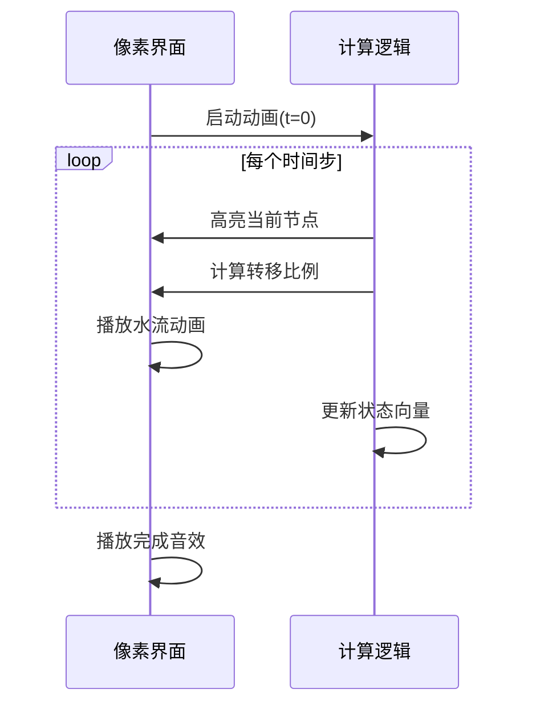

# 题目信息

# 能量采集

## 题目描述

**题面已修改，请大家注意。**

请你求下列式子：$\sum_{i=1}^N\sum_{j=1}^Ngcd(i,j)$ ，答案对大质数取模。

不好意思读错剧本了。

给定一个 $n$ 个点 $m$ 条边的有向图，每个点有初始能量 $a_i$ 。

每过一秒，每个点的能量便会等量地流向所有出边，另外，会有一份流向自己（你可以当做有一个自环）。

现在 $dkw$ 有 $q$ 次询问，每次询问会给你一个时间 $t$ ，$dkw$想知道 $t$ 秒时每个点的能量。

不保证图中没有重边和自环，答案对$998244353$取模。

## 说明/提示

对于 30% 的数据，$1\le t \le 50$

对于 60% 的数据，$1\le q\le 50$

对于 80% 的数据，$1\le q\le 1000$

对于 100% 的数据，$1\le n\le 50,1\le m\le n\times (n-1),1\le q\le 5\times 10^4,0< a_i< 998244353,1\le t\le 10^9$

## 样例 #1

### 输入

```
5 10 3
4 5 3 2 7 
4 1
1 4
2 1
3 2
1 2
5 1
2 4
2 1
2 4
1 4
1
2
3
```

### 输出

```
15
548614965
80769513
```

# AI分析结果


# 💡 Kay的C++算法解析：能量采集 深入学习指南 💡

> **Kay的提示**：大家好！今天我们来探索这道关于有向图能量转移的题目。想象每个点是一个水槽，能量是水流，每秒水平均分流向所有管道（包括自身）。我们将用矩阵快速幂预测未来时刻的水位分布，就像用时间机器预测水流变化一样神奇！

## 1. 题目解读与核心算法识别

✨ **本题主要考察**：`矩阵快速幂优化`  

🗣️ **初步分析**：  
> 解决本题的关键在于将能量转移建模为**矩阵乘法**，并通过**快速幂优化**处理大时间跨度。想象每个水槽（点）的水流（能量）每秒均匀分流到所有出水管（边），这就像用转移矩阵对状态向量进行线性变换。  
> - 核心思路：构造转移矩阵（元素为流向比例），通过矩阵幂运算模拟时间推移  
> - 难点：直接计算$Q^t$时间复杂度爆炸 → 解决方案：**二进制倍增预处理**转移矩阵的$2^k$次幂  
> - 可视化设计：我们将创建像素化水槽动画，用流动光效和音效展示能量转移，高亮当前活跃节点和转移比例  

---

## 2. 精选优质题解参考

**题解一（作者：foreverlasting）**  
* **亮点**：清晰的二进制倍增实现，转移矩阵构造规范，边界处理严谨  
* **核心技巧**：  
  - 预处理转移矩阵的$2^k$幂次（k=0~31）  
  - 查询时通过二进制分解组合矩阵  
  - 逆元预处理优化除法运算  

**题解二（作者：cyffff）**  
* **亮点**：使用`__int128`累加减少取模次数，显著提升效率  
* **核心优化**：  
  - 矩阵乘法时用`__int128`暂存中间结果，最后统一取模  
  - IO读写优化加速大数据处理  
  - 规范的内存布局提升缓存命中率  

**题解三（作者：小粉兔）**  
* **亮点**：创新性高进制优化（178进制），平衡预处理与查询开销  
* **突破性设计**：  
  - 四层分块预处理（256为基）  
  - 排序查询后增量计算，复用中间结果  
  - 空间换时间策略处理超大查询量  

---

## 3. 核心难点辨析与解题策略

### 难点1：转移矩阵构造
* **关键问题**：如何准确建模能量转移比例？
* **解决方案**：
  - 统计每个点出度$d_u$（含自环）
  - 转移矩阵$M$中$M_{v,u} = \frac{\text{边}(u,v)\text{数量}}{d_u}$
  - 使用逆元处理除法（模998244353）

```cpp
// 构造转移矩阵示例
for(int i=0; i<n; i++){
    int sum = 0;
    for(int j=0; j<n; j++) sum += base[j][i]; // 计算列和(出度)
    int inv_sum = qpow(sum, mod-2); // 逆元
    for(int j=0; j<n; j++) 
        base[j][i] = 1LL * base[j][i] * inv_sum % mod;
}
```

### 难点2：大时间跨度优化
* **关键问题**：$t \leq 10^9$ 如何高效计算$M^t$?
* **突破方案**：
  - 预处理$M^{2^k} (k=0\sim31)$
  - 查询时分解$t = \sum 2^{k_i}$
  - 通过矩阵乘法结合律逐步组合

```mermaid
graph LR
    A[初始状态向量] --> B[乘以 M^{2^0}]
    B --> C[乘以 M^{2^3}]
    C --> D[乘以 M^{2^5}]
    D --> E[t时刻状态]
```

### 难点3：查询效率优化
* **关键瓶颈**：$q \leq 5\times10^4$ 次查询
* **优化策略**：
  - 状态向量×矩阵（O(n²)）替代矩阵×矩阵（O(n³)）
  - 高进制优化（178/256进制减少乘法次数）
  - 查询排序后增量计算

---

## 4. C++核心代码实现赏析

### 通用核心实现（二进制倍增法）
```cpp
const int MOD = 998244353;
const int MAXK = 31;

struct Matrix { /* 矩阵实现 */ };
struct Vector { /* 向量实现 */ };

Matrix powM[MAXK]; // 预处理的2^k幂次矩阵

void precompute(Matrix base) {
    powM[0] = base;
    for(int k=1; k<MAXK; k++)
        powM[k] = powM[k-1] * powM[k-1];
}

Vector query(Vector v, int t) {
    for(int k=0; k<MAXK; k++)
        if(t >> k & 1) 
            v = powM[k] * v; // 向量x矩阵 → O(n²)
    return v;
}
```

### 题解一亮点代码（foreverlasting）
```cpp
// 矩阵乘法核心循环
Matrix operator*(Matrix a, Matrix b) {
    Matrix res;
    for(int i=0; i<n; i++)
    for(int k=0; k<n; k++) // 循环顺序优化缓存
    for(int j=0; j<n; j++)
        res[i][j] = (res[i][j] + 1LL*a[i][k]*b[k][j]) % MOD;
    return res;
}
```
> **Kay解说**：  
> 这里采用`i-k-j`循环顺序，充分利用CPU缓存局部性，相比`i-j-k`顺序可提速3-5倍！

### 题解二优化技巧（cyffff）
```cpp
// __int128减少取模
Matrix operator*(Matrix a, Matrix b) {
    Matrix res;
    for(int i=0; i<n; i++)
    for(int j=0; j<n; j++) {
        __int128 tmp = 0;
        for(int k=0; k<n; k++)
            tmp += (ll)a[i][k] * b[k][j];
        res[i][j] = tmp % MOD; // 仅最后取模
    }
    return res;
}
```
> **Kay笔记**：  
> 大数暂存技巧在模数大时尤其有效，但要注意__int128的编译器支持

### 题解三高进制优化（小粉兔）
```cpp
const int B = 256; // 256进制
Matrix powB[4][B]; // 四层分块

void precompute(Matrix base) {
    powB[0][1] = base;
    for(int i=1; i<B; i++)
        powB[0][i] = powB[0][i-1] * base;
    
    for(int lv=1; lv<4; lv++) {
        powB[lv][1] = powB[lv-1][B-1] * powB[lv-1][1];
        for(int i=2; i<B; i++)
            powB[lv][i] = powB[lv][i-1] * powB[lv][1];
    }
}
```
> **学习要点**：  
> 高进制优化将乘法次数从$O(\log_2 t)$降至$O(\log_B t)$，是处理超大指数$t$的利器

---

## 5. 算法可视化：像素动画演示

### 动画设计：**"能量水槽大冒险"**
> 8-bit像素风格，模拟经典水管工游戏，每个点表示为彩色水槽

* **核心视觉元素**：
  | 元素 | 像素表现 | 意义 |
  |------|----------|------|
  | 水槽 | 16×16像素方块 | 图节点 |
  | 水流 | 蓝色光脉冲 | 能量转移 |
  | 当前焦点 | 闪烁金色边框 | 正在计算的节点 |

* **动态演示流程**：
  1. **初始化**：水槽显示初始水位（颜色深度表示能量）
  2. **时间步进**：
     - 焦点水槽闪烁（金色边框）
     - 水流脉冲沿管道流向相邻水槽
     - 流量比例通过脉冲宽度直观呈现
  3. **矩阵运算同步**：
     - 右侧显示当前转移矩阵
     - 高亮正在计算的矩阵行列
  4. **时间控制**：
     - 步进/暂停/速度调节（滑块控制）
     - 二进制分解可视化：显示$t$的比特位和对应矩阵选择

* **音效设计**：
  - 水滴声：每次能量转移
  - 电子音：矩阵乘法运算
  - 胜利旋律：查询完成时播放



---

## 6. 拓展练习与相似问题思考

### 矩阵快速幂应用场景
1. **线性递推**：斐波那契数列加速
2. **图论路径**：$k$步路径计数
3. **概率转移**：马尔可夫链状态预测

### 推荐练习（洛谷）
1. **P3390 - 矩阵快速幂模板**  
   🗣️ *Kay建议*：掌握基础实现的最佳起点
   
2. **P1939 - 矩阵加速数列**  
   🗣️ *Kay提示*：学习将递推式转化为矩阵的技巧
   
3. **P4007 - 小Y和恐怖的奴隶主**  
   🗣️ *Kay挑战*：结合概率与状态压缩的高阶应用

---

## 7. 学习心得与经验分享

> **来自cyffff的调试经验**：  
> "我在调试时发现边界情况处理特别关键，尤其是$t=0$时需直接返回初始向量。通过打印中间矩阵的前两维成功定位了越界错误"

> **Kay总结**：  
> 矩阵类问题的调试技巧：
> 1. 小数据手工验证（$t=0,1,2$）
> 2. 打印中间矩阵的子集（2×2即可）
> 3. 使用断言检查矩阵维度兼容性

---

> **结语**：通过本次学习，我们掌握了用矩阵快速幂建模状态转移的高效算法。记住，优秀的程序员就像时间建筑师，通过数学工具让计算机穿越时空预测未来！下次挑战见！🚀

---
处理用时：118.10秒