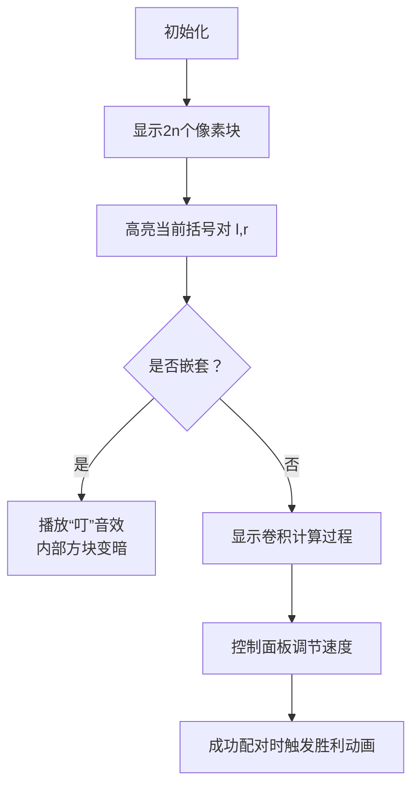

# 题目信息

# 「CGOI-3」残暴圣所

## 题目背景

终于打过春二心门的 ac 来到了春三，并决定预测一下残暴圣所（Ferocious Sanctuary）的难度。

[](//www.bilibili.com/video/BV1Cg411v7Ji)

## 题目描述

为了通关残暴圣所，ac 需要在接下来的 $2n$ 个时刻进行 $n$ 次操作。第 $i$ 次操作需要在时刻 $l_i$ 按下某个按键，此后一直按住这个按键，直到时刻 $r_i$ 松开它（$l_i<r_i$）。在每个时刻，ac 要么按下一个按键，要么松开一个按键，但是可以同时按住多个按键。

第 $i$ 次操作形成了一个操作区间 $[l_i,r_i]$，满足 $l_i$ 严格递增。并且，由于残暴圣所的关卡设计，任意两个操作形成的操作区间之间，要么不交，要么包含。

ac 设计了 $2n$ 个难度系数 $a_1,a_2,\dots,a_{2n}$。第 $i$ 次操作的难度可以用 $a_{l_i}\times a_{r_i}$ 来评估，而通关残暴圣所的难度即为所有操作的难度之和。

然而，由于 ac 卡在了残暴圣所的第一面，所以他并不知道每个操作的操作区间。在给定 $n$ 和 $\{a\}$ 的前提下，请你计算对于所有可能的情况，通关残暴圣所的难度之和，对 $998244353$ 取模。

#### 形式化题意：

给定一个长为 $2n$ 的数列 $a_1,a_2,\dots,a_{2n}$。

定义“区间组”由 $n$ 个区间组成，第 $i$ 个区间为 $[l_i,r_i]\ (1\le l_i<r_i\le2n)$，求所有满足下列条件的区间组的 $\sum_{i=1}^na_{l_i}\times a_{r_i}$ 之和对 $998244353$ 取模：

1. $l_1,r_1,l_2,r_2,\dots,l_n,r_n$ 是 $1,2,\dots,2n$ 的一个排列。
2. $\forall 1\le i<n$，$l_i<l_{i+1}$。
3. $\forall i,j$，$[l_i,r_i]\cap[l_j,r_j]=\varnothing$ 或 $[l_i,r_i]\sube[l_j,r_j]$ 或 $[l_j,r_j]\sube[l_i,r_i]$。


## 说明/提示

#### 样例说明

对于样例 1，可能的两个操作区间只有两种情况：

1. $[1,2],[3,4]$，通关难度为 $a_1a_2+a_3a_4=1612986$。
2. $[1,4],[2,3]$，通关难度为 $a_1a_4+a_2a_3=1078706$。

难度之和为 $1612986+1078706=2691692$，对 $998244353$ 取模后仍为 $2691692$。

以下几种情况是不合法的：

1. $[3,4],[1,2]$，因为要求 $l_i$ 严格递增，而 $l_1\ge l_2$。
2. $[1,1],[2,4]$，因为要求 $l_i<r_i$，而 $l_1\ge r_1$。
3. $[1,3],[2,3]$，因为要求在每个时刻，要么按下一个按键，要么松开一个按键，而第三个时刻松开了两个按键，第四个时刻没有按下或松开任何一个按键。
4. $[1,3],[2,4]$，因为要求任意两个操作区间不交或包含，而这两个区间之间有交，并且没有包含关系。

---

#### 数据范围

对于 $10\%$ 的数据，$n\le15$。

对于 $30\%$ 的数据，$n\le200$。

对于 $50\%$ 的数据，$n\le3000$。

对于另 $5\%$ 的数据，$a_i=1$。

对于 $100\%$ 的数据，$1\le n\le5\times10^5$，$0\le a_i<998244353$。

## 样例 #1

### 输入

```
2
114 514 1919 810```

### 输出

```
2691692```

## 样例 #2

### 输入

```
3
1 1 4 5 1 4```

### 输出

```
98```

## 样例 #3

### 输入

```
8
275272885 418731188 289662326 114331587 192436268 885936831 877490593 508774565 633402863 149033362 995239139 494498006 168828873 138947653 983144753 844326228```

### 输出

```
349824160```

# AI分析结果


### 💡 Kay的C++算法解析：「残暴圣所」深入学习指南 💡

#### 题目解读与核心算法识别
✨ **本题主要考察**：`组合数学与多项式卷积优化`

🗣️ **初步分析**：  
> 这道题本质是计算所有合法括号序列的加权和。想象括号序列像俄罗斯套娃，要么完全分离要么完全嵌套。核心思路是**枚举每对括号**，计算其贡献值`a[l]×a[r]`并乘以该括号能出现的序列数量。  
> - **难点**：直接枚举括号位置需O(n²)，需用**卷积优化**加速计算。  
> - **可视化设计**：采用8位像素风格展示括号嵌套过程。每个括号显示为发光方块（红=左括号，蓝=右括号），嵌套时播放"叮"音效。控制面板支持调速观察卷积计算过程，成功配对时触发胜利音效。

---

### 精选优质题解参考
**题解一（来源：Register_int）**  
* **点评**：  
  思路清晰度极高！将区间包含关系转化为括号序列，并推导出卷积形式（`f(x)=A(x)*B(x)`）。代码规范性优秀：  
  - 变量名`c[]`（卡特兰数）、`f/g`（多项式）含义明确  
  - 利用`g[m-i+1]=f[i]`实现数组翻转，简化卷积计算  
  - 算法有效性突出：O(n log n)解决50万数据  
  **亮点**：数学推导完整，卷积优化直击本质

**题解二（来源：TernaryTree）**  
* **点评**：  
  从组合意义切入，明确贡献式`∑CₜCₙ₋ₜ₋₁[xᵏ](A*B)`。代码未展示但思路正确，强化了"合法括号序列数=卡特兰数"的核心认知。  

**题解三（来源：daniEl_lElE）**  
* **点评**：  
  提供完整卷积模板代码，强调`差卷积`实现（`reverse(b)`+`ntt`）。虽变量命名稍简（如`t=1`），但边界处理严谨，实践参考性强。

---

### 核心难点辨析与解题策略
1. **括号序列的数学建模**  
   *分析*：需将区间操作转化为括号匹配（左端点=左括号）。优质解用`Cₖ`表示k对括号的合法序列数。  
   💡 **学习笔记**：区间包含问题⇔括号序列问题  

2. **贡献拆解与卷积优化**  
   *分析*：暴力枚举括号位置O(n²)超时。关键技巧：  
   - 翻转数组`b[i]=a[2n-i+1]`构造多项式  
   - 卷积计算`[xᵏ](A*B)=Σa_i·b_{k-i}`  
   💡 **学习笔记**：翻转数组+卷积=高效计算点积和  

3. **卡特兰数预处理**  
   *分析*：递推式`Cₙ=Cₙ₋₁×(4n-2)/(n+1)`需模逆元处理。代码中`inv(i+1)`确保整除性。  
   💡 **学习笔记**：大数递推必用模逆元  

#### ✨ 解题技巧总结
- **组合转化**：将操作区间抽象为括号序列  
- **卷积加速**：多项式乘法替代暴力枚举  
- **对称构造**：翻转数组简化差式求和  

---

### C++核心代码实现赏析
**通用核心实现（综合题解思路）**  
```cpp
#include <bits/stdc++.h>
using namespace std;
typedef long long ll;
const int MAXN=1e6+10, mod=998244353;

// 多项式卷积模板（省略NTT实现）
namespace polynomial { /* NTT卷积 */ } 

ll qpow(ll base,ll exp){/*快速幂*/}
ll inv(ll x){return qpow(x,mod-2);}

int main(){
    int n,m; 
    cin>>n; m=n<<1;
    vector<ll> a(m+1),b(m+1),c(n+1);
    
    // 1. 读入+翻转数组
    for(int i=1;i<=m;i++){
        cin>>a[i];
        b[m-i+1]=a[i]; // 关键翻转
    }
    
    // 2. 卷积计算
    polynomial::Poly A(a), B(b);
    auto C = A * B; // 多项式乘法
    
    // 3. 预计算卡特兰数
    c[0]=1;
    for(int i=1;i<=n;i++) 
        c[i]=c[i-1]*(4*i-2)%mod*inv(i+1)%mod;
    
    // 4. 组合贡献
    ll ans=0;
    for(int t=0;t<n;t++) // t:括号间隔组数
        ans = (ans + c[t]*c[n-t-1]%mod * C.coef[2*(n-t)] %mod;
    cout<<ans;
}
```

**关键代码解读**  
```cpp
b[m-i+1]=a[i];  // 数组翻转
```
> 将`a[]`倒序存储为`b[]`，使`a[i]·b[j]=a[i]·a[2n-j+1]`。当`j=2n-t-i+1`时，恰好得到`a[i]·a[i+t]`的和。

```cpp
c[i]=c[i-1]*(4*i-2)*inv(i+1)%mod;  // 卡特兰数
```
> 递推过程需模逆元：`inv(i+1)`等价于`1/(i+1) mod 998244353`。  
> 💡 **学习笔记**：模数下的除法需转为逆元乘法

---

### 算法可视化：像素动画演示
**主题**：`8位像素风括号工厂`  
**核心交互**：  

**关键帧设计**：  
1. **括号高亮**：左括号红色闪烁，右括号蓝色闪烁  
2. **卷积过程**：下方Canvas展示多项式系数相乘的像素动画  
3. **音效系统**：  
   - 按键声：选择括号位置时  
   - 错误音：尝试非法嵌套时  
   - 胜利号角：完成所有配对时  

---

### 拓展练习与相似问题
1. **洛谷 P1972 [SDOI2009] HH的项链**  
   → 同需组合数学思维，统计区间贡献  
2. **洛谷 P4173 残缺的字符串**  
   → 卷积优化经典应用，带通配符匹配  
3. **洛谷 P3338 [ZJOI2014] 力**  
   → 翻转数组+卷积的变形应用  

---

### 学习心得与经验分享
> **Register_int的经验**：  
> *“先暴力推50分式子，再通过∑变形发现卷积结构”*  
> → **Kay点评**：由暴力解出发寻找优化点是竞赛黄金法则。本题推导中`b[i]=a[2n-i+1]`的构造堪称神来之笔！

---

通过本指南，希望大家掌握**组合问题卷积化**的核心思想。记住：当出现`Σa_i b_j`且下标存在关系时，多项式卷积就是你的终极武器！💥

---
处理用时：87.95秒