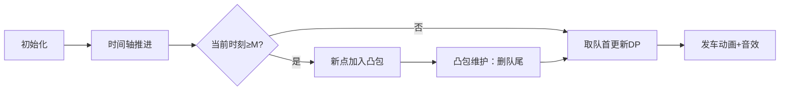

# 题目信息

# [蓝桥杯青少年组国赛 2023] 月球疏散行动

## 题目背景

本题原题：[P5017 [NOIP 2018 普及组] 摆渡车](https://www.luogu.com.cn/problem/P5017)

## 题目描述

为了避免太阳爆发引起的灾难，人类决定给地球装上发动机，最终逃离太阳系。原计划要带着月球一起走，结果月球行星发动机发生灾难性故障，必须炸毁月球。为此，在月球上的工作人员都要疏散回地球。

月球基地有一艘太空穿梭机可以用来疏散工作人员。但是人们分散在各处，必须前往基地集合，他们到达基地的时间不等。穿梭机可以将抵达基地等待登机的工作人员先送回地球，然后再返回基地疏散下一批工作人员。

总共有 $N$ 名工作人员需要疏散，太空穿梭机从月球到地球往返一次花时间 $M$ 小时，第 $i$ 个人抵达基地等待登机的时刻为 $T_i$。

指挥官希望所有工作人员在基地等待的时间总和最小，而且他可以任意安排穿梭机的起飞时间，假定穿梭机足够大，可以装下所有工作人员，在不计登机和下机时间等因素的情况下，最小的等候时间总和是多少？

例如：$N=5$，$M=4$，1 号~5 号工作人员到达基地的时刻依次为 11、3、3、5、10，穿梭机可以在 3 时出发，先送 2 号、3 号工作人员去地球，然后于 7 时返回月球基地；此时，4 号工作人员已于 5 时到达基地，等候了 2 小时。这时让穿梭机马上送走他，然后于 11 时从地球返回基地；此时，5 号工作人员已于 10 时到达基地，等候了 1 小时；而 1 号工作人员刚好于 11 时到达基地，等候 0 小时；穿梭机于 11 时将两人送走，即完成全部疏散任务。总的等候时间 $=$ 4 号工作人员等候时间 $+$ 5 号工作人员等候时间 $=2+1=3$ 小时。无法再找到有更小等候时间总和的方案。

## 样例 #1

### 输入

```
5 4
11 3 3 5 10```

### 输出

```
3```

# AI分析结果


### 💡 Kay的C++算法解析：月球疏散行动 深入学习指南 💡

**引言**  
今天我们来分析蓝桥杯青少年组国赛题目"月球疏散行动"，这是一道经典的动态规划结合斜率优化的问题。本指南将帮助你理解如何最小化工作人员的等待时间总和，并掌握斜率优化的核心技巧。

---

### 1. 题目解读与核心算法识别  
✨ **本题主要考察**：`动态规划 + 斜率优化`  
🗣️ **初步分析**：  
> 解决本题的关键在于动态规划结合斜率优化。想象穿梭机是像素游戏中的公交车，乘客是等待救援的像素小人。我们需要安排公交车的发车时间，使小人等待时间总和最小。  
> - **核心思路**：定义`dp[i]`为前i时刻的最小等待时间，通过斜率优化将O(n²)的暴力DP优化为O(n)  
> - **可视化设计**：在像素动画中，时间轴横向展开，乘客显示为不同颜色的像素块。当穿梭机出发时，对应乘客变为"已上车"状态并播放音效，同时动态展示凸包形成过程  
> - **游戏化元素**：采用8-bit音效（入队"叮"、发车"胜利"音效），将DP状态转移设计为"关卡"，每次成功转移获得像素星星奖励  

---

### 2. 精选优质题解参考  
**题解一（作者：YZren）**  
* **点评**：思路清晰直击斜率优化本质，代码简洁高效。亮点在于：  
  - 用`slop()`函数精准处理凸包斜率比较  
  - 前缀和`tim[]`/`s[]`设计巧妙，将等待时间计算优化为O(1)  
  - 队列维护凸包的逻辑严谨（先删队尾破坏凸包的点，再删队首非最优解）  
  - 竞赛级代码风格，但变量命名可读性可提升  

**题解二（作者：TJB_LHY）**  
* **点评**：教学价值突出，亮点在于：  
  - 用一次函数`y=kx+b`生动解释斜率优化原理  
  - 完整展示暴力DP到斜率优化的推导过程  
  - 结构体+deque实现凸包维护，代码结构清晰  
  - 详细注释边界处理（如`maxn+m`的时间上限）  

---

### 3. 核心难点辨析与解题策略  
1. **状态定义与转移方程**  
   * **分析**：`dp[i]=min{ dp[j] + (tim[i]-tim[j])*i - (s[i]-s[j]) }`  
     其中`tim[i]`为前i时刻人数和，`s[i]`为到达时间总和。关键在于将等待时间转化为前缀和运算  
   * 💡 **学习笔记**：前缀和是优化区间计算的利器  

2. **斜率优化的推导**  
   * **分析**：将转移式变形为：  
     `dp[i] = min{ (dp[j]+s[j]) - tim[j]*i } + tim[i]*i - s[i]`  
     令`y=dp[j]+s[j]`, `x=tim[j]`, `k=i`，转化为求截距最小  
   * 💡 **学习笔记**：斜率优化本质是维护凸包上的最优点  

3. **凸包维护的边界处理**  
   * **分析**：需注意三点：  
     - 加入新点`i-m`时删除队尾破坏凸包的点（斜率递增性）  
     - 根据当前斜率`i`删除队首非最优解  
     - 答案在`[maxx, maxx+m]`区间内寻找  
   * 💡 **学习笔记**：凸包维护要同时保证单调性和凸性  

#### ✨ 解题技巧总结  
- **前缀和加速**：将O(n)等待计算转为O(1)  
- **几何化思维**：将代数问题转化为凸包上的点线关系  
- **边界预判**：时间上限设为`maxx+m`覆盖所有可能  

---

### 4. C++核心代码实现赏析  
**通用核心实现参考**  
```cpp
#include <bits/stdc++.h>
using namespace std;
typedef long long ll;
const int maxn = 4e6+10;

ll tim[maxn], s[maxn], dp[maxn];
int n, m, maxx;

double slope(int j, int k) {
    return 1.0*(dp[j]+s[j]-dp[k]-s[k])/(tim[j]-tim[k]);
}

int main() {
    cin >> n >> m;
    // 数据统计与前缀和初始化
    for(int i=0; i<n; ++i) {
        int t; cin >> t;
        tim[t]++; s[t] += t;
        maxx = max(maxx, t);
    }
    int N = maxx + m;
    for(int i=1; i<N; ++i) {
        tim[i] += tim[i-1];
        s[i] += s[i-1];
    }
    
    deque<int> q;
    dp[0] = 0; q.push_back(0);
    
    for(int i=1; i<N; ++i) {
        // 维护凸包：删队尾
        while(q.size()>=2 && slope(q.back(), i-m) <= slope(q[q.size()-2], q.back())) 
            q.pop_back();
        if(i >= m) q.push_back(i-m);
        
        // 维护凸包：删队首
        while(q.size()>=2 && slope(q[0], q[1]) <= i)
            q.pop_front();
            
        int j = q.front();
        dp[i] = dp[j] + (tim[i]-tim[j])*i - (s[i]-s[j]);
    }
    
    ll ans = *min_element(dp+maxx, dp+N);
    cout << ans;
}
```

**题解一核心片段赏析**  
```cpp
while(L<R && slop(que[R-1], que[R]) >= slop(que[R], i-m)) 
    R--;  // 删队尾破坏凸包
que[++R] = i-m;

while(L<R && slop(que[L], que[L+1]) <= i) 
    L++;  // 删队首非最优

dp[i] = min(dp[i], dp[que[L]] + (tim[i]-tim[que[L]])*i - s[i]+s[que[L]]);
```
* **解读**：  
  1. 第一层循环维护凸包下凸性：当新点`i-m`与队尾两点形成"上凸"时删除队尾  
  2. 第二层循环维护最优性：根据当前斜率`i`淘汰队首过时转移点  
  3. 状态转移用前缀和避免重复计算区间等待时间  

**题解二核心片段赏析**  
```cpp
struct Node { ll x, y, i; };  // x=tim[j], y=dp[j]+s[j]
deque<Node> q;

// 凸包维护
while(q.size()>=2 && cross(a,b) <= cross(b,new_node))
    q.pop_back();
q.push_back({s[j], dp[j]+s[j], j});
```
* **解读**：  
  - 通过结构体封装凸包点信息，提高可读性  
  - `cross()`计算三点间斜率，直观体现凸包维护本质  
  - 双端队列动态维护凸包上的有效转移点  

---

### 5. 算法可视化：像素动画演示  
**主题**：8-bit风格《月球疏散大作战》  
**核心演示流程**：  


**实现细节**：  
1. **像素场景**  
   - 横向时间轴（FC风格像素卷轴）  
   - 乘客：红色像素块（未上车）、绿色（已上车）  
   - 凸包区域：右下角坐标系动态绘制点线  

2. **关键动画**：  
   - **发车时刻**：穿梭机像素动画 + "胜利"音效（8-bit和弦）  
   - **凸包维护**：  
     * 删队尾：被删点爆炸特效 + "失败"音效  
     * 新点加入：绿色闪烁 + "收集"音效  
   - **状态转移**：显示计算公式`dp[i]=...`并逐步高亮变量  

3. **交互控制**：  
   - 单步执行：空格键逐步推进  
   - 速度滑块：调整时间轴推进速度  
   - 模式切换：对比暴力DP与斜率优化的性能差异  

---

### 6. 拓展练习与相似问题  
**通用技巧迁移**：  
1. 任务调度问题（如：P5017 摆渡车）  
2. 带时间成本的序列分割（如：P3195 玩具装箱）  
3. 资源分配优化（如：P3628 特别行动队）  

**洛谷推荐**：  
1. **P5017 摆渡车**  
   → 双倍经验，巩固基础  
2. **P3195 [HNOI2008]玩具装箱**  
   → 斜率优化经典变形  
3. **P3628 [APIO2010]特别行动队**  
   → 二次函数代价的斜率优化  

---

### 7. 学习心得与经验分享  
> **TJB_LHY的调试经验**：  
> “推导斜率方程时卡在代数变形，通过几何意义（凸包）找到突破口”  
>  
> **Kay点评**：  
> 当代数推导受阻时，尝试几何视角常能破局。建议：  
> 1. 用图像绘制凸包点  
> 2. 给转移点标注`(x,y)`坐标  
> 3. 动态调整斜率直线观察切点  

---

**结语**  
掌握斜率优化需要理解其几何本质，多练习前缀和与凸包维护的编码技巧。尝试用本指南的可视化方案在脑海中模拟算法过程，会有奇效！下次挑战再见！🚀

---
处理用时：240.50秒