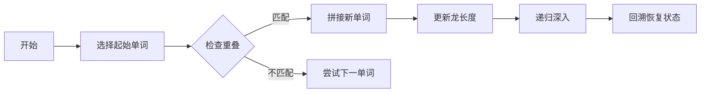

# 题目信息

# [NOIP 2000 提高组] 单词接龙

## 题目背景

注意：本题为上古 NOIP 原题，不保证存在靠谱的做法能通过该数据范围下的所有数据。

本题为搜索题，本题不接受 hack 数据。[关于此类题目的详细内容](https://www.luogu.com.cn/paste/pf94n89x)

NOIP2000 提高组 T3

## 题目描述

单词接龙是一个与我们经常玩的成语接龙相类似的游戏，现在我们已知一组单词，且给定一个开头的字母，要求出以这个字母开头的最长的“龙”（每个单词都最多在“龙”中出现两次），在两个单词相连时，其重合部分合为一部分，例如 `beast` 和 `astonish`，如果接成一条龙则变为 `beastonish`，另外相邻的两部分不能存在包含关系，例如 `at` 和 `atide` 间不能相连。


## 说明/提示

样例解释：连成的“龙”为 `atoucheatactactouchoose`。

$n \le 20$。

## 样例 #1

### 输入

```
5
at
touch
cheat
choose
tact
a
```

### 输出

```
23
```

# AI分析结果


# 💡 Kay的C++算法解析：单词接龙 深入学习指南 💡

**引言**  
今天我们一起分析NOIP 2000提高组的经典题目"单词接龙"。这道题考察DFS在字符串拼接中的应用，我们将通过像素动画直观展示算法执行过程，帮助大家掌握核心解题技巧。

---

## 1. 题目解读与核心算法识别

✨ **本题主要考察**：`DFS搜索` (深度优先搜索)

🗣️ **初步分析**：  
> 单词接龙就像玩多米诺骨牌——每张牌必须与前一张牌末端匹配才能连接。在DFS中，我们：  
> 1. 从起始字母开始，选择可用单词  
> 2. 检查**末端重叠部分**（如`beast`和`astonish`可接为`beastonish`)  
> 3. 每个单词最多用两次  
>  
> **核心难点**在于高效计算重叠长度和避免包含关系。我们将通过**像素动画**展示DFS的探索过程：  
> - 用不同颜色方块表示单词  
> - 连接时重叠部分闪烁高亮  
> - 实时显示当前龙长度和最大长度  

---

## 2. 精选优质题解参考

**题解一 (RyanLi)**  
* **点评**：  
思路清晰直白，直接在DFS中通过`substr`匹配重叠部分。代码规范：  
- 使用`const string&`避免拷贝开销  
- `vis`数组精确控制单词使用次数  
- 主函数通过`cin.tie`优化IO效率  
亮点：简洁高效，竞赛实用性强

**题解二 (yedalong)**  
* **点评**：  
创新点在于预处理`g[i][j]`存储单词间最小重叠长度。  
- 预处理避免DFS中重复计算  
- `pd`数组命名可读性高  
- 状态传递逻辑严谨  
亮点：空间换时间思路值得学习

**题解三 (__yiLIUyi__)**  
* **点评**：  
详细解释传递**最近单词**而非整条龙的原因（避免包含关系）  
- `check`函数封装匹配逻辑  
- 强调重叠长度必须`<min(len1,len2)`  
亮点：教学解释完整，适合初学者理解

---

## 3. 核心难点辨析与解题策略

1.  **重叠长度计算**  
    * **分析**：必须找到两单词间**最大有效重叠**（长度∈[1, min(len1,len2)-1]）。优质解通过`substr`或逐字符比较实现  
    * 💡 学习笔记：`s1.substr(s1.size()-len, len)`取末尾，`s2.substr(0,len)`取开头  

2.  **避免包含关系**  
    * **分析**：当`s1`完全包含`s2`时禁止连接（如`at`和`atide`）。解决方案：  
    - 检查时跳过`len==min(s1.size(),s2.size())`的情况  
    - 传递最近单词而非整条龙（__yiLIUyi__解法）  

3.  **DFS状态设计**  
    * **分析**：关键状态=当前龙末端单词+各单词使用次数  
    - 用`vis[]`数组记录使用次数（≤2）  
    - 回溯时及时恢复`vis`和龙长度  
    * 💡 学习笔记：状态传递要满足「无后效性」  

### ✨ 解题技巧总结
- **字符串优化**：用`const string&`减少拷贝  
- **剪枝策略**：当剩余单词无法超越当前最大长度时提前返回  
- **模块化**：分离重叠计算函数（如`check()`）  
- **边界处理**：特别注意`substr`的索引范围  

---

## 4. C++核心代码实现赏析

**通用核心实现**  
```cpp
#include <iostream>
#include <vector>
using namespace std;

int n, max_len;
vector<string> words;
vector<int> used;

// 计算s1末端与s2前端的重叠长度
int get_overlap(string s1, string s2) {
    for (int len = 1; len < min(s1.size(), s2.size()); len++) 
        if (s1.substr(s1.size()-len) == s2.substr(0, len)) 
            return len;
    return 0;
}

void dfs(string cur) {
    max_len = max(max_len, (int)cur.size());
    for (int i = 0; i < n; i++) {
        if (used[i] >= 2) continue;
        int len = get_overlap(cur, words[i]);
        if (len == 0) continue;
        
        used[i]++;
        dfs(cur + words[i].substr(len)); // 跳过重叠部分
        used[i]--;
    }
}

int main() {
    char start;
    cin >> n;
    words.resize(n); used.resize(n, 0);
    for (int i = 0; i < n; i++) cin >> words[i];
    cin >> start;
    
    for (int i = 0; i < n; i++) 
        if (words[i][0] == start) {
            used[i]++;
            dfs(words[i]);
            used[i]--;
        }
    
    cout << max_len;
}
```

**代码解读概要**：  
- `get_overlap`封装重叠计算  
- `dfs`中`cur`表示当前龙，递归时跳过重叠部分拼接  
- `used`数组控制单词使用上限  

---

**题解一核心代码片段**  
```cpp
void dfs(const string &tmp) {
    ans = max(ans, int(tmp.size()));
    for (int i = 1; i <= n; ++i) {
        if (vis[i] >= 2) continue;
        for (int j = 1; j < min(tmp.size(), s[i].size()); ++j)
            if (tmp.substr(tmp.size() - j) == s[i].substr(0, j)) {
                ++vis[i];
                dfs(tmp + s[i].substr(j));
                --vis[i];
            }
    }
}
```
**亮点**：直接在DFS循环中匹配，避免额外函数调用  
**学习笔记**：`tmp.substr(size-j)`取末尾j字符的高效写法  

**题解二核心片段**  
```cpp
// 预处理g[i][j] = words[i]接words[j]的重叠长度
for (int i=1; i<=n; i++) 
    for (int j=1; j<=n; j++) 
        for (int k=1; k<min(a[i].size(),a[j].size()); k++) 
            if (a[i].substr(a[i].size()-k,k) == a[j].substr(0,k)) {
                g[i][j]=k; break; 
            }

// DFS直接使用预处理的g[][]
void dfs(string s, int last) {
    maxx = max(maxx, (int)s.size());
    for (int i=1; i<=n; i++) 
        if (g[last][i] && used[i]<2) {
            used[i]++;
            dfs(s + words[i].substr(g[last][i]), i);
            used[i]--;
        }
}
```
**亮点**：预处理显著减少DFS中重复计算  
**学习笔记**：`g[last][i]`存储最近单词与候选词的重叠长度  

---

## 5. 算法可视化：像素动画演示

* **主题**：单词接龙大冒险（8-bit复古游戏风格）  
* **核心演示**：DFS搜索树展开过程+单词拼接动态效果  

### 动画设计  
  


1. **初始化界面**  
   - 单词显示为彩色像素方块（如`at`=蓝色方块，`touch`=红色方块）  
   - 控制面板：开始/暂停/单步/速度调节滑块  

2. **DFS过程可视化**  
   - 当前路径显示为发光方块链  
   - 尝试匹配时：候选单词闪烁绿色边框  
   - 成功连接：重叠部分黄色闪烁+“叮”音效  

3. **状态标记**  
   - 已用两次的单词变灰色  
   - 当前龙长度实时显示在顶部  
   - 最大长度记录用金色数字展示  

4. **回溯演示**  
   - 递归返回时路径方块渐隐  
   - 播放"嗖"的音效表示状态回退  

5. **游戏化元素**  
   - 每成功连接5个单词触发"COMBO"特效  
   - 打破长度记录时播放胜利音效+烟花动画  

---

## 6. 拓展练习与相似问题思考

### 相似问题场景
1. 路径拼接问题（如欧拉路径）  
2. 字符串循环节判断  
3. 带约束的序列生成  

### 洛谷推荐
1. **P1706 全排列问题**  
   🗣️ 练习DFS基础应用，理解状态回溯  
2. **P1605 迷宫**  
   🗣️ 学习二维DFS+路径记录  
3. **P1036 选数**  
   🗣️ 掌握组合类DFS的剪枝技巧  

---

## 7. 学习心得与经验分享

**作者RyanLi的经验**：  
> "在解决重叠计算时，特别注意`substr`的索引边界——这是最容易出错的地方"  

**Kay的总结**：  
字符串问题要警惕**索引越界**和**空字符串**边界情况。建议：  
1. 在`substr`前检查`size()>=len`  
2. 用`min(a.size(),b.size())`防止非法访问  
3. 多用`cout<<中间变量`调试边界值  

---

**结语**  
通过本次分析，相信大家已掌握DFS在单词接龙中的应用精髓。记住：多思考状态设计，勤练边界处理，你也能成为搜索高手！下次我们将探索更精彩的算法世界💪

---
处理用时：246.66秒