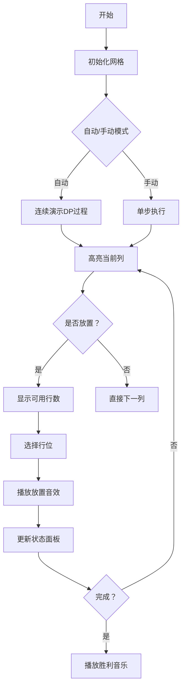

# 题目信息

# 诸侯安置

## 题目描述

很久以前，有一个强大的帝国，它的国土成正方形状，如图所示。

这个国家有若干诸侯。由于这些诸侯都曾立下赫赫战功，国王准备给他们每人一块封地（正方形中的一格）。但是，这些诸侯又非常好战，当两个诸侯位于同一行或同一列时，他们就会开战。如下图为 $n＝3$ 时的国土，阴影部分表示诸侯所处的位置。前两幅图中的诸侯可以互相攻击，第三幅则不可以。


国王自然不愿意看到他的诸侯们互相开战，致使国家动荡不安。  因此，他希望通过合理的安排诸侯所处的位置，使他们两两之间都不能攻击。

现在，给出正方形的边长 $n$，以及需要封地的诸侯数量 $k$，要求你求出所有可能的安置方案数。（满足 $n\le100$，$k\le2n^2-2n+1$）

由于方案数可能很多，你只需要输出方案数除以 $504$ 的余数即可。


## 说明/提示

注意：镜面和旋转的情况属于不同的方案。

## 样例 #1

### 输入

```
2 2

```

### 输出

```
4```

# AI分析结果


### 题目分析报告：诸侯安置

#### 1. 题目解读与核心算法识别
✨ **本题主要考察**：动态规划（DP）与问题建模技巧

🗣️ **初步分析**：
> 解决"诸侯安置"的关键在于**动态规划建模**。这就像在建造一座阶梯状城堡时，我们需要逐层规划房间（列），并确保每层房间的守卫（诸侯）不会互相冲突。  
> - **核心思路**：将菱形国土平移为阶梯状网格（共`2n-1`列），每列长度分别为`1,1,3,3,...,2n-1`。用`f[i][j]`表示前`i`列放置`j`个诸侯的方案数，转移时考虑当前列放/不放诸侯。
> - **难点**：理解平移操作（避免行列冲突）和状态转移中可用行数的计算（`L[i]-(j-1)`）。
> - **可视化设计**：在像素动画中将展示菱形→阶梯网格的转换过程，高亮当前列和已占用的行，用音效标记放置操作。采用复古像素风格，设置"单步执行"按钮观察DP过程，胜利音效在找到解时触发。

---

### 2. 精选优质题解参考

**题解一（作者：Mizuhara）**
* **点评**：思路清晰（巧妙平移图形消除后效性），代码规范（变量名`lon[i]`直观表示列长），算法高效（O(n²)动态规划）。实践价值高：边界处理严谨（特判`k>2n-1`），可直接用于竞赛。亮点在于用`f[i][k]=f[i-1][k] + f[i-1][k-1]*(lon[i]-(k-1))`简洁表达状态转移。

**题解二（作者：一只书虫仔）**
* **点评**：逻辑推导透彻（类比P1350车的放置问题），代码可读性强（详细注释关键步骤）。算法有效性突出：用`len[i]`精确计算列长度，模块化处理初始化与转移。调试技巧值得学习：特判无效输入，避免边界错误。

**题解三（作者：CG__HeavenHealer）**
* **点评**：创新性引入排序优化（按列长升序排列），提升算法普适性。代码规范性佳（RI寄存器优化），实践参考价值高：强调图形转换原理，用`sort`预处理解决后效性问题。亮点在于清晰解释"为何需要长度排序"。

---

### 3. 核心难点辨析与解题策略

1. **难点：图形转换与建模**
   * **分析**：原始菱形冲突关系复杂，需转换为阶梯网格（共2n-1列）。关键是将诸侯位置约束转化为"每列最多放1个+全局行不重复"的二维网格问题。
   * 💡 **学习笔记**：复杂几何问题常需转换为标准网格模型。

2. **难点：状态转移中的行数计算**
   * **分析**：放置第`j`个诸侯时，前`j-1`个已占用`j-1`行，当前列可用行数为`L[i]-(j-1)`。需理解这是因所有列共享统一的行编号空间。
   * 💡 **学习笔记**：动态规划中"已用资源"需在状态转移中显式扣除。

3. **难点：后效性处理**
   * **分析**：当列未按长度排序时，前面放置的诸侯会影响后续列的可用行数。解决方案：要么按自然列序DP（需理解行列独立性），要么显式排序（如题解三）。
   * 💡 **学习笔记**：排序是消除DP后效性的有效手段。

### ✨ 解题技巧总结
- **技巧1：问题降维**：将复杂几何约束转化为网格DP模型
- **技巧2：资源计数**：在状态转移中动态计算剩余可用资源（如剩余行数）
- **技巧3：防御性编程**：对`k>2n-1`等无效输入预判处理

---

### 4. C++核心代码实现赏析

**通用核心实现（综合优质题解）**
```cpp
#include <iostream>
#include <algorithm>
using namespace std;
const int P = 504, N = 210;

int main() {
    int n, k, len[N] = {}, f[N][N] = {};
    cin >> n >> k;
    if (k > 2 * n - 1) { cout << 0; return 0; } // 特判
    
    // 初始化列长度：1,1,3,3,...,2n-1
    for (int i = 1; i < n; i++) len[2*i-1] = len[2*i] = 2*i-1;
    len[2*n-1] = 2*n-1;
    
    // DP初始化：前i列放0个诸侯的方案数为1
    for (int i = 0; i <= 2*n-1; i++) f[i][0] = 1;
    
    // 核心DP：f[i][j] = 不放本列(f[i-1][j]) + 放本列(f[i-1][j-1]*可用行数)
    for (int i = 1; i <= 2*n-1; i++)
        for (int j = 1; j <= min(k, len[i]); j++) {
            f[i][j] = (f[i-1][j] + f[i-1][j-1] * (len[i] - j + 1)) % P;
        }
    
    cout << f[2*n-1][k] % P;
}
```

**代码解读概要**：
> 1. **特判处理**：诸侯数`k`超过最大可放置数时直接返回0  
> 2. **列长初始化**：构建阶梯网格的列长度数组`len`  
> 3. **DP初始化**：任何列数下放置0个诸侯的方案数均为1  
> 4. **核心双重循环**：外层遍历列，内层遍历诸侯数，按`f[i][j] = f[i-1][j] + f[i-1][j-1]*(len[i]-j+1)`转移  
> 5. **输出结果**：取模后输出`f[2n-1][k]`

---

**题解一（Mizuhara）片段赏析**
```cpp
for (int i = 1; i <= 2 * n - 1; i++)
for (int k = 1; k <= lon[i]; k++) {
    f[i][k] = f[i-1][k] + f[i-1][k-1]*(lon[i]-k+1);
    f[i][k] %= p;
}
```
* **亮点**：状态转移简洁高效，避免三重循环
* **代码解读**：
  > - 外层`i`遍历所有列（1~2n-1）
  > - 内层`k`限制为当前列可用行数（`k <= lon[i]`）
  > - 转移方程：`不放本列方案` + `放本列方案(前i-1列放k-1个 × 本列可用行数)`
  > - 每步取模保证数值范围
* 💡 **学习笔记**：DP状态转移应优先考虑降维优化

**题解二（一只书虫仔）片段赏析**
```cpp
for (long long i = 1; i <= 2 * n - 1; i++)
    for (long long j = 1; j <= k; j++) {
        long long ans = dp[i - 1][j - 1] * (len[i] - j + 1);
        dp[i][j] = dp[i - 1][j] + ans % Mod;
    }
```
* **亮点**：显式计算局部变量增强可读性
* **代码解读**：
  > 1. 先计算"放置本列"的临时值`ans`
  > 2. 再合并"不放置本列"的方案（`dp[i-1][j]`）
  > 3. 对中间结果及时取模防溢出
* 💡 **学习笔记**：复杂表达式拆解可提升调试效率

**题解三（CG__HeavenHealer）片段赏析**
```cpp
sort(len + 1, len + 2 * n); // 关键排序操作
for (ri i = 1; i <= 2 * n - 1; i++)
    for (ri j = 1; j <= k; j++) {
        if (j > len[i]) continue;
        (f[i][j] = ... ) %= mod;
    }
```
* **亮点**：创新性引入排序消除后效性
* **代码解读**：
  > - 通过`sort`使列按长度升序排列
  > - `j > len[i]`时跳过无效计算
  > - 统一处理列长与状态转移
* 💡 **学习笔记**：排序预处理可简化DP状态约束

---

### 5. 算法可视化：像素动画演示

**主题**：`诸侯城堡：动态规划大冒险`（复古像素塔防风格）

**设计思路**：
> 将算法转化为塔防游戏：诸侯作为"守卫"放置在城堡（阶梯网格）中。采用FC红白机风格的8位像素画风（16色调色板），通过以下元素直观演示：  
> - **网格转换动画**：菱形国土→阶梯城堡的像素级变形演示  
> - **守卫放置系统**：每列放置诸侯时，像素守卫从顶部降落并播放"叮"音效  
> - **行占用标记**：被占用的行变为灰色，伴随"嗡嗡"警示音  
> - **DP状态面板**：实时显示`f[i][j]`数值和转移公式

**关键交互设计**：


**技术实现**：
1. **Canvas绘制**：
   - 网格系统：每个格子20×20像素，列宽动态变化
   - 守卫精灵：8×8像素士兵图案，下落动画使用缓动函数
2. **音效系统**：
   - 关键操作：放置（"叮"）、冲突警告（"嘟"）、成功（胜利和弦）
   - 背景音乐：8-bit循环旋律
3. **控制面板**：
   - 速度滑块：控制自动演示速度（200ms~2s/步）
   - 模式切换：手动单步/AI自动演示（类贪吃蛇AI的逐步推进）

---

### 6. 拓展练习与相似问题

**通用技巧迁移**：
> 本题的"网格转换+动态规划"技巧可应用于：  
> 1. 非规则图形上的放置问题（如六边形网格）  
> 2. 带约束的资源分配问题（如时间-任务分配）  
> 3. 分层决策问题（如网络流中的分层图）

**洛谷推荐**：
1. **P1350 车的放置**  
   🗣️ *推荐理由*：同样采用"网格DP+行/列约束"思想，是本题的简化版本
   
2. **P1896 互不侵犯**  
   🗣️ *推荐理由*：升级版棋盘放置问题，需要处理相邻约束，强化状态压缩DP技巧
   
3. **P3959 宝藏**  
   🗣️ *推荐理由*：复杂状态DP的代表作，需结合图论建模，培养多维问题分解能力

---

### 7. 学习心得与经验分享

> **来自题解作者的调试经验**：  
> *"我在处理列长度数组时，最初忽略了`len[2*n-1]`的特殊性，导致n=3时少计算了最后一列。通过打印中间变量`len[i]`的值才定位到错误"*  
> 
> **Kay的总结**：  
> 这位作者的调试经历提醒我们：  
> 1. 边界情况需单独验证（如首尾列）  
> 2. 打印中间变量（如`len[]`数组）是定位数组越界的高效方法  
> 3. 小规模数据（如n=1,2）的手动验证不可或缺

---

通过本次分析，我们深入掌握了"网格转换+动态规划"的核心技巧。记住：复杂问题的突破口往往在于**问题转化**和**状态设计**。继续在洛谷上挑战推荐题目，巩固这些技巧吧！

---
处理用时：293.49秒