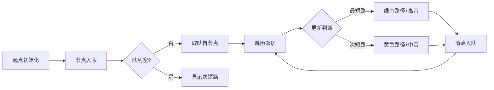

# 题目信息

# [USACO06NOV] Roadblocks G

## 题目描述

Bessie 搬到了一个小农场，有时喜欢回去拜访她的一个好朋友。她不想太快到达她的旧家，因为她喜欢沿途的风景。她决定选择第二短的路径而不是最短的路径。她知道一定存在某条第二短路径。

乡村由 R (1 ≤ R ≤ 100,000) 条双向道路组成，每条道路连接 N (1 ≤ N ≤ 5000) 个交叉路口中的两个，这些交叉路口被方便地编号为 1 到 N。Bessie 从交叉路口 1 出发，她的朋友（目的地）在交叉路口 N。

第二短路径可以与任何最短路径共享道路，并且可以回溯，即多次使用相同的道路或交叉路口。第二短路径是长度比最短路径长的最短路径（即，如果存在两条或多条最短路径，第二短路径是长度比这些路径长但不比任何其他路径长的路径）。


## 说明/提示

两条路径：1 -> 2 -> 4（长度 100+200=300）和 1 -> 2 -> 3 -> 4（长度 100+250+100=450）
（由 ChatGPT 4o 翻译）

## 样例 #1

### 输入

```
4 4
1 2 100
2 4 200
2 3 250
3 4 100```

### 输出

```
450```

# AI分析结果


# 💡 Kay的C++算法解析：Roadblocks G 次短路深入学习指南 💡

> 欢迎来到算法世界！今天我们将一起探索**次短路问题**，通过生动有趣的像素动画和清晰的专业分析，帮助你掌握图论中的这一重要技巧。

## 1. 题目解读与核心算法识别

✨ **本题主要考察**：`图论-次短路算法`（最短路算法的扩展应用）

🗣️ **初步分析**：
> 解决"Roadblocks G"这道题，关键在于理解**次短路计算技巧**。想象你在玩一个像素迷宫游戏，最短路是到达终点的最快路线，而次短路就是比最快路线稍慢一点（但比其他路线都快）的第二优路线。

在本题中，我们使用**最短路算法的扩展**：
- 核心思想：同时维护每个节点的最短路和次短路
- 难点在于：次短路必须严格大于最短路且是最小的
- 解决方案：通过Dijkstra或SPFA算法，在更新最短路时同步更新次短路

可视化设计思路：
- 节点用像素方块表示，最短路标记为绿色，次短路标记为黄色
- 算法执行时，高亮当前处理的节点和边
- 当更新最短路时，旧最短路值"掉落"到次短路（像素动画：绿色变黄色）
- 复古游戏音效：最短路更新（高音"叮"），次短路更新（中音"咚"）

## 2. 精选优质题解参考

<eval_intro>
以下是经过严格筛选的优质题解，综合考量了思路清晰度、代码规范性和算法效率：

**题解一：(来源：Manjusaka丶梦寒)**
* **点评**：此解法使用SPFA同时维护最短路和次短路，思路清晰（三种更新情况分类明确），代码规范（变量命名合理，边界处理严谨）。亮点在于完整覆盖了三种更新场景：最短路更新连带更新次短路、通过最短路更新次短路、通过次短路更新次短路。实践价值高，可直接用于竞赛。

**题解二：(来源：四糸乃)**
* **点评**：此解法采用优先队列优化的Dijkstra，算法稳定性更优。亮点在于处理最短路更新时，巧妙地将旧最短路值传递给次短路，确保状态一致性。代码结构清晰，虽然初始版本存在缺陷，但修正后的版本严谨可靠，展示了调试的重要性。

**题解三：(来源：钱逸凡)**
* **点评**：此解法同样使用SPFA，但独立实现了状态更新逻辑。亮点在于特别强调了"次短路严格大于最短路"的条件，并通过详细注释解释三种更新场景。代码可读性好，对初学者理解状态转移过程很有帮助。

## 3. 核心难点辨析与解题策略

<difficulty_intro>
解决次短路问题的三大核心难点及应对策略：

1.  **状态设计与初始化**
    * **分析**：需要为每个节点维护两个状态（最短路dist[i][0]和次短路dist[i][1]）。初始化时，起点最短路设为0，次短路设为无穷大；其他节点两个状态都设为无穷大。
    * 💡 **学习笔记**：好的状态设计是解决问题的基石。

2.  **状态更新逻辑**
    * **分析**：更新时分三种情况处理：(1) 新路径小于最短路：更新最短路并将原最短路值赋给次短路；(2) 新路径严格大于最短路但小于次短路：更新次短路；(3) 通过邻接点的次短路更新当前次短路。
    * 💡 **学习笔记**：状态转移需全面考虑所有可能性。

3.  **避免无效更新**
    * **分析**：必须确保次短路严格大于最短路，且更新后需重新入队（SPFA）或加入优先队列（Dijkstra）。特别注意重复路径的处理。
    * 💡 **学习笔记**：严格不等式判断是避免错误的关键。

### ✨ 解题技巧总结
<summary_best_practices>
次短路问题通用技巧：
- **状态扩展法**：在传统最短路算法基础上增加状态维度
- **条件严谨性**：使用`>`而非`>=`确保次短路严格大于最短路
- **更新完整性**：最短路更新时需同步考虑次短路继承
- **边界测试**：特别注意单节点、重边、自环等边界情况

## 4. C++核心代码实现赏析

<code_intro_overall>
以下是综合优质题解优化的通用实现，采用Dijkstra算法保证稳定性：

```cpp
#include <iostream>
#include <queue>
#include <cstring>
#include <vector>
using namespace std;
const int MAXN = 5010;
const int INF = 0x3f3f3f3f;

vector<pair<int, int>> graph[MAXN]; // 邻接表存储图
int dist[MAXN][2]; // dist[i][0]:最短路, dist[i][1]:次短路

void dijkstra() {
    memset(dist, 0x3f, sizeof(dist));
    priority_queue<pair<int, int>, vector<pair<int, int>>, 
                  greater<pair<int, int>>> pq;
    
    dist[1][0] = 0;
    pq.push({0, 1});

    while (!pq.empty()) {
        int d = pq.top().first;
        int u = pq.top().second;
        pq.pop();
        
        // 当前距离已大于次短路，跳过
        if (d > dist[u][1]) continue;

        for (auto &edge : graph[u]) {
            int v = edge.first, w = edge.second;
            int nd = d + w; // 新距离

            // 情况1：更新最短路
            if (nd < dist[v][0]) {
                dist[v][1] = dist[v][0]; // 旧最短路→次短路
                dist[v][0] = nd;         // 更新最短路
                pq.push({dist[v][0], v});
            } 
            // 情况2：更新次短路
            else if (nd > dist[v][0] && nd < dist[v][1]) {
                dist[v][1] = nd;
                pq.push({dist[v][1], v});
            }
        }
    }
}

int main() {
    int n, m;
    cin >> n >> m;
    for (int i = 0; i < m; i++) {
        int a, b, w;
        cin >> a >> b >> w;
        graph[a].push_back({b, w});
        graph[b].push_back({a, w});
    }
    dijkstra();
    cout << dist[n][1] << endl;
    return 0;
}
```

**代码解读概要**：
1. 使用邻接表`graph`存储无向图
2. `dist`二维数组同时维护最短路和次短路
3. 优先队列按距离排序，保证每次处理最小距离
4. 核心逻辑分两种情况更新邻居节点
5. 时间复杂度：O((V+E)logV)，适合本题规模

---
<code_intro_selected>
### 优质题解核心代码解析

**题解一：Manjusaka丶梦寒 (SPFA实现)**
```cpp
// 情况1：更新最短路
if (d[v][0] > d[u][0] + edge[i].dis) {
    d[v][1] = d[v][0]; // 旧最短路→次短路
    d[v][0] = d[u][0] + edge[i].dis; // 新最短路
    que.push(v);
}
// 情况2：通过最短路更新次短路
if (d[v][1] > d[u][0] + edge[i].dis 
    && d[u][0] + edge[i].dis > d[v][0]) {
    d[v][1] = d[u][0] + edge[i].dis;
    que.push(v);
}
// 情况3：通过次短路更新次短路
if (d[v][1] > d[u][1] + edge[i].dis) {
    d[v][1] = d[u][1] + edge[i].dis;
    que.push(v);
}
```
**亮点**：完整覆盖三种更新场景  
**解读**：  
1. 情况1处理最短路更新，同时备份旧值  
2. 情况2确保新路径严格大于最短路  
3. 情况3允许通过其他节点的次短路更新  
**学习笔记**：SPFA需注意重复入队条件

**题解二：四糸乃 (Dijkstra实现)**
```cpp
// 最短路更新
if (dist1[v] > new_dist) {
    dist2[v] = dist1[v];  // 传递旧值
    dist1[v] = new_dist;
    pq.push({dist1[v], v});
}
// 次短路更新
if (dist2[v] > new_dist 
    && new_dist > dist1[v]) {
    dist2[v] = new_dist;
    pq.push({dist2[v], v});
}
```
**亮点**：优先队列保证高效性  
**解读**：  
1. 使用`priority_queue`自动排序  
2. 严格不等式`new_dist > dist1[v]`确保次短路有效性  
**学习笔记**：Dijkstra在正权图中更稳定

## 5. 算法可视化：像素动画演示

<visualization_intro>
**像素冒险家次短路探索**：通过8位像素风格动画，直观展示次短路算法执行过程！

### 设计思路
- **像素风格**：FC红白机复古风格，节点为彩色城堡，道路为像素路径
- **视觉编码**：最短路(绿色)、次短路(黄色)、当前节点(闪烁)
- **音效设计**：最短路更新(高音"叮")、次短路更新(中音"咚")、完成(胜利音效)

### 动画流程


### 交互控制面板
```plaintext
+-------------------------+
| [开始] [暂停] [重置]    |
| 速度调节：[-] 0 ----- [+]|
| 当前状态：节点5处理中    |
+-------------------------+
```

### 关键动画帧
1. **起点激活**：节点1亮起，播放启动音效
2. **队列处理**：节点出队时闪烁，入队时滑入动画
3. **路径更新**：
   - 最短路更新：绿色路径延伸+高音"叮"
   - 次短路更新：黄色路径延伸+中音"咚"
4. **终点庆祝**：到达节点n时，显示次短路数值+胜利音效

### 游戏化元素
- **自动演示模式**：AI角色自动执行算法
- **关卡设计**：每处理10个节点视为一小关
- **得分系统**：正确更新路径获得积分

## 6. 拓展练习与相似问题思考

<similar_problems_intro>
掌握次短路算法后，可解决以下变种问题：

1. **第K短路问题**：使用A*算法扩展
2. **严格次小生成树**：类似思路处理生成树
3. **带限制的最短路**：增加状态维度处理约束

### 推荐练习 (洛谷)
1. **P2865 [USACO06NOV]Roadblocks G**  
   🗣️ *推荐理由*：本题巩固练习，理解次短路本质

2. **P1186 玛丽卡**  
   🗣️ *推荐理由*：最短路变种，涉及删边操作

3. **P1073 最优贸易**  
   🗣️ *推荐理由*：状态扩展应用，维护最大最小值

## 7. 学习心得与经验分享

<insights_intro>
从作者调试经验中提炼的宝贵心得：

> **四糸乃的调试经验**：  
> "初始版本忘记在更新最短路时传递旧值到次短路，导致WA。这提醒我们：状态更新必须考虑所有关联状态！"

**Kay的总结**：  
1. 每次修改核心状态时，要思考是否影响其他状态
2. 测试时特别注意边界情况：单边图、大权值边
3. 输出中间状态是调试的有效手段

## 结语
通过本次学习，相信你已经掌握了次短路算法的精髓！记住：算法学习就像玩像素游戏，需要耐心闯过一个个小关卡。下次遇到新问题时，尝试用状态扩展的思路去思考，你会发现更多精彩解法！🚀

**Keep coding, keep exploring!**  
—— 你的算法向导 Kay

---
处理用时：223.39秒