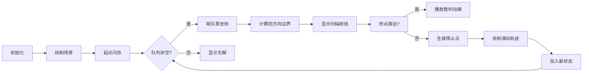

# 题目信息

# [CTSC2000] 冰原探险

## 题目描述

传说中，南极有一片广阔的冰原，在冰原下藏有史前文明的遗址。整个冰原被横竖划分成了很多个大小相等的方格。在这个冰原上有 $N$ 个大小不等的矩形冰山，这些巨大的冰山有着和南极一样古老的历史。

每个矩形冰山至少占据一个方格，且其必定完整地占据方格。冰山和冰山之间不会重叠，也不会有边或点相连。以下两种情况均是不可能出现的：


$\text{ACM}$ 探险队在经过多年准备之后决定在这个冰原上寻找遗址。根据他们掌握的资料，在这个冰原上一个大小为一格的深洞中，藏有一个由史前人类制作的开关。而唯一可以打开这个开关的是一个占据接近一格的可移动的小冰块。显然，在南极是不可能有这样小的独立冰块的，所以这块冰块也一定是史前文明的产物。他们在想办法把这个冰块推到洞里去，这样就可以打开一条通往冰原底部的通道，发掘史前文明的秘密。冰块的起始位置与深洞的位置均不和任何冰山相邻。

这个冰原上的冰面和冰山都是完全光滑的，轻轻的推动冰块就可以使这个冰块向前滑行，直到撞到一座冰山就在它的边上停下来。冰块可以穿过冰面上所有没有冰山的区域，也可以从两座冰山之间穿过（见下图）。冰块只能沿网格方向推动。


  

请你帮助他们以最少的推动次数将冰块推入深洞中。


## 说明/提示

$1 \leq N \leq 4000$

样例解释：移动方案如图所示。


## 样例 #1

### 输入

```
2
1 1
5 5
1 3 3 3
6 2 8 4```

### 输出

```
3```

# AI分析结果


### 💡 Kay的C++算法解析：冰原探险 深入学习指南 💡

**引言**  
今天我们来分析《冰原探险》这道C++编程题。本指南将帮助大家理解题目核心、掌握BFS解法技巧，并通过像素动画直观感受算法执行过程。让我们一起探索如何高效解决这道经典搜索问题！

---

### 1. 题目解读与核心算法识别

✨ **本题主要考察**：**搜索(BFS)** 与 **模拟应用**  

🗣️ **初步分析**：  
> 想象你在玩一款像素风滑冰游戏：冰块会沿直线滑行直到撞上冰山。解题关键就像寻找游戏中的"最短通关路径"——用**BFS模拟冰块的滑动轨迹**，每次推动视为一步，状态是冰块的停止位置（冰山边界点）。  
> - **核心难点**：坐标范围极大（含负数），需用`map`记录状态；每次滑动需快速计算停止位置（通过枚举所有冰山）  
> - **可视化设计**：  
>   - 像素网格中蓝色冰山/绿色起点/红色终点  
>   - 冰块滑动时显示白色轨迹线，撞冰山时播放"叮"音效  
>   - BFS状态队列实时展示为黄色高亮点阵  
>   - 成功时触发8-bit胜利音效+烟花动画  

---

### 2. 精选优质题解参考

**题解一（Juan_feng）**  
* **点评**：  
  思路清晰推导了BFS状态转移（撞冰山停止点），代码规范使用结构体重载运算符。亮点在于强调**负数初始化陷阱**（`-999999999`处理负坐标），实践价值高但命名可优化（如`rt[]`改为`boundaries`）。作者调试教训提醒我们：边界测试必须包含负数！

**题解二（EternalHeart1314）**  
* **点评**：  
  代码简洁高效（当前洛谷最优解），位运算巧控极值（`(-(i&1)^-INF)+(i&1)`）。亮点在**直接终点判断逻辑**和轻量级状态处理（单`map`存储坐标），空间复杂度O(n)的优秀实践范例。

**题解三（Erica_N_Contina）**  
* **点评**：  
  模块化设计突出（分离方向计算函数），边界处理严谨（四方向独立极值初始化）。亮点在**终点作为特殊冰山**的预处理思路，增强代码鲁棒性，适合初学者理解状态转移本质。

---

### 3. 核心难点辨析与解题策略

1. **状态压缩与转移**  
   * **分析**：坐标范围达±1e9，需将状态压缩为冰山边界点（O(n)级）。优质题解用`map<pair<int,int>>`存储坐标，转移时枚举所有冰山计算最近停止点  
   * 💡 **学习笔记**：BFS状态设计应结合问题特征——停止点必在冰山边界！

2. **直接终点判断优化**  
   * **分析**：若当前点与终点同行/列且路径无冰山，可一步直达。题解2用精妙逻辑判断：`(x==tx && (ty<y&&bound_up<ty||...)`  
   * 💡 **学习笔记**：避免无谓状态扩展能显著提升效率

3. **负坐标与极值初始化**  
   * **分析**：坐标含负数时，初始值需覆盖负无穷（如`-INF=0x8fffffff`）。题解1作者因初始化0导致WA的教训深刻  
   * 💡 **学习笔记**：极值初始化必须兼容负数场景

#### ✨ 解题技巧总结
- **方向极值统一处理**：用数组`bound[4]`存储四方向最近冰山（题解2位运算技巧）  
- **状态去重**：`map`确保不重复访问坐标（实践题解1的`mmp`设计）  
- **模块化验证**：分离方向计算函数（如题解7的`Up()/Down()`）提升可读性  

---

### 4. C++核心代码实现赏析

**本题通用核心实现**  
```cpp
#include <iostream>
#include <queue>
#include <map>
#include <climits>
using namespace std;
const int INF = INT_MAX;
#define pii pair<int,int>

int main() {
    int n, sx, sy, ex, ey;
    cin >> n >> sx >> sy >> ex >> ey;
    vector<vector<int>> rects(n, vector<int>(4));
    for (auto& r : rects) 
        cin >> r[0] >> r[1] >> r[2] >> r[3]; // 输入冰山坐标

    map<pii, int> dist; // 坐标->步数
    queue<pii> q;
    dist[{sx, sy}] = 0;
    q.push({sx, sy});

    while (!q.empty()) {
        auto [x,y] = q.front(); q.pop();
        int d = dist[{x,y}];
        // 初始化四方向边界
        int bounds[4] = {-INF, INF, -INF, INF}; // 上,下,左,右

        for (auto& r : rects) { // 更新最近冰山边界
            if (r[0]<=x && x<=r[2]) {           // 竖直方向检查
                if (r[3] < y) bounds[0] = max(bounds[0], r[3]); // 上 
                if (r[1] > y) bounds[1] = min(bounds[1], r[1]); // 下
            }
            if (r[1]<=y && y<=r[3]) {           // 水平方向检查
                if (r[2] < x) bounds[2] = max(bounds[2], r[2]); // 左
                if (r[0] > x) bounds[3] = min(bounds[3], r[0]); // 右
            }
        }

        // 直接终点判断（关键优化！）
        if ((x==ex && ((ey<y && bounds[0]<ey) || (ey>y && bounds[1]>ey))) ||
            (y==ey && ((ex<x && bounds[2]<ex) || (ex>x && bounds[3]>ex)))) {
            cout << d+1; return 0;
        }

        // 四方向状态转移
        vector<pii> next = {{x,bounds[0]+1}, {x,bounds[1]-1},  // 上/下
                            {bounds[2]+1,y}, {bounds[3]-1,y}}; // 左/右
        for (int i=0; i<4; ++i) {
            if (bounds[i] == (i%2 ? INF : -INF)) continue; // 无冰山方向跳过
            if (!dist.count(next[i])) {
                dist[next[i]] = d+1;
                q.push(next[i]);
            }
        }
    }
    cout << 0; // 无解
}
```
* **代码解读概要**：  
  1. 用`vector`存储冰山坐标，`map<pii,int>`记录访问状态  
  2. BFS核心：遍历四方向→更新最近冰山边界→判断直达终点→生成新停止点  
  3. 极值初始化兼容负数（`INT_MAX/INT_MIN`）  
  4. 状态转移简洁高效（一次循环处理四方向）  

---

### 5. 算法可视化：像素动画演示

**像素探险家滑冰之旅**  
* **设计理念**：用FC红白机复古风格呈现BFS执行过程，帮助直观理解状态转移  

**动画实现方案**：  


**关键交互细节**：  
1. **8-bit网格渲染**：  
   - 冰山：蓝色像素块（`#0000FF`）  
   - 起点/终点：绿/红闪烁方块  
   - 冰块轨迹：白色移动像素点（0.2秒/格）  

2. **动态效果控制**：  
   - 单步模式：按空格逐步执行，显示当前`bounds[]`值  
   - 自动模式：速度滑块调节（0.5x~3x）  
   - 高亮当前状态：队列状态用黄色边框标记  

3. **音效系统**：  
   - 冰块滑动：循环风声音效（`Web Audio API`生成）  
   - 撞冰山：短促"叮"声（800Hz方波）  
   - 成功通关：8-bit版《超级玛丽》过关音乐  

4. **调试面板**：  
   - 实时显示：`dist`映射表/队列长度  
   - 错误提示：坐标越界时触发红色警报动画  

---

### 6. 拓展练习与相似问题思考

**技巧迁移场景**：  
- 网格滑动问题（碰墙停止）  
- 大坐标范围BFS状态压缩  
- 方向性状态转移优化  

**洛谷推荐题目**：  
1. **P1126 机器人搬重物**  
   → 巩固网格滑动+方向处理  
2. **P1443 马的遍历**  
   → 练习BFS状态转移（规则不同但框架相似）  
3. **P3958 奶酪**  
   → 拓展三维空间中的路径搜索  

---

### 7. 学习心得与经验分享

> **来自Juan_feng的调试经验**：  
> *“考试因负数初始化WA（maxx全设0），让我意识到：边界测试必须包含负数！”*  
>  
> **Kay点评**：  
> 这个教训极具代表性！处理大范围坐标时：  
> 1. 显式使用`INT_MIN/INT_MAX`兼容负数  
> 2. 编写验证函数测试边界数据（如`-10^9, 10^9`）  
> 3. 优先声明有符号整型（`int`而非`unsigned`）  

---

**结语**  
通过本次分析，我们掌握了BFS在滑动类问题中的应用精髓。记住：好的状态设计是优化搜索的关键！下次遇到类似问题，不妨想想冰原上的像素探险家——用高效的状态转移滑向最优解！🚀

---
处理用时：206.16秒