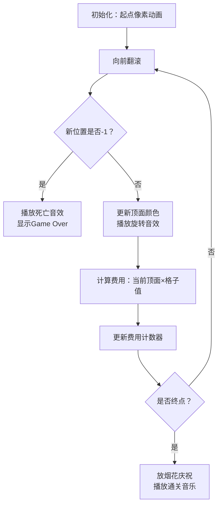

# 题目信息

# [CTSC1998] 罗杰游戏

## 题目背景

CTSC1998 D2T1


## 题目描述

罗杰游戏由一张棋盘和罗杰构成。棋盘由很多个小格组成，每个小格上刻有一个数字。其为 $-1$ 或 $0$ 至 $255$ 之间的一个数。罗杰是一个立方体，有六个面，每个面上分别有一个 $1$ 至 $6$ 之间的数字。

我们开始时把罗杰放在棋盘中的一个小格上，然后让其向前、后、左、右四个方向**翻滚**至邻近小格中。

游戏要求经过若干次翻滚后，让罗杰到达指定小格。

**罗杰不得进入标有 $-1$ 的小格，否则游戏结束**。

罗杰每进入一个小格后，将其顶面的数字同该小格的数字相乘，所得结果累加即得到罗杰的旅行费用。

开始时我们能看到罗杰的某些面上的数字，也可以指定当罗杰最终到达目的格时某些面上应出现的数字。对于**不确定的数字**，我们可以在**合法的基础上任意指定**。

**任务一**

罗杰只能向前或向右翻滚。

**任务二**

罗杰可以自由活动。

## 说明/提示

【数据范围】

$M \le 40$ , $N \le 40$  。

## 样例 #1

### 输入

```
2 
10 10
1 1 1 1 1 1 1 1 1 1 
1 1 1 1 1 1 1 1 1 1
1 1 1 9 8 7 6 5 4 1
1 1 9 8 7 6 5 4 1 1
1 1 8 7 6 5 4 1 1 1
1 1 7 6 5 4 1 1 1 1
1 1 6 5 4 1 1 1 1 1
1 1 5 4 1 1 1 1 1 1
1 1 4 1 1 1 1 1 1 1
1 1 1 1 1 1 1 1 1 1
3 3 0 0 0 0 0 0
8 8 0 0 0 0 0 0```

### 输出

```
44
0 3 3 6 5 3 1 2 4
3 3 2 3 1 5 6 2 4
5 4 2 2 4 5 6 1 3
6 5 2 1 3 5 6 4 2
10 6 2 4 2 5 6 3 1
13 7 2 3 1 5 6 2 4
15 8 2 2 4 5 6 1 3
16 9 2 1 3 5 6 4 2
20 10 2 4 2 5 6 3 1
26 10 3 6 5 4 2 3 1
28 10 4 2 4 6 5 3 1
29 9 4 1 3 6 5 2 4
34 9 5 5 6 1 3 2 4
38 8 5 4 2 1 3 5 6
41 8 6 3 1 4 2 5 6
43 8 7 2 4 3 1 5 6
44 8 8 1 3 2 4 5 6```

# AI分析结果


### 💡 Kay的C++算法解析：罗杰游戏 深入学习指南 💡

#### 1. 题目解读与核心算法识别
✨ **本题主要考察**：**状态空间搜索（BFS/Dijkstra）**  
🗣️ **初步分析**：
> 罗杰游戏本质是**带状态约束的最短路问题**。想象立方体在棋盘上翻滚如同魔方在网格中移动，每个状态需记录位置、立方体朝向及六个面的数字配置（共 40×40×24×720 ≈ 2700 万种状态）。  
> - **核心难点**：立方体翻滚后朝向变化需精确建模（24种旋转状态），且六个面数字需满足起点/终点的面数字约束（0表示无约束）。  
> - **解决方案**：预处理立方体24种旋转规则，用Dijkstra搜索状态空间，在状态转移时计算顶面数字与棋盘格的乘积费用。  
> - **可视化设计**：采用**8位像素风迷宫探索**动画（见第5节），立方体用彩色像素块表示，翻滚时播放方向变换动画，费用累计用复古数字计数器显示，胜利时触发《超级马里奥》通关音效。

---

#### 2. 精选优质题解参考
📌 *注：本题暂无用户题解，Kay给出通用学习建议*  
- **学习建议**：  
  1. **状态压缩技巧**：立方体朝向用0-23整数表示，六个面数字用排列编号（0-719）而非存储完整数组。  
  2. **Dijkstra优化**：使用优先队列（`priority_queue`）避免重复访问，状态用四元组 `(x, y, cube_id, orient_id)` 表示。  
  3. **约束处理**：初始化时过滤不满足起点面数字约束的 `(cube_id, orient_id)` 组合。

---

#### 3. 核心难点辨析与解题策略
1. **难点1：立方体旋转的状态转移**  
   *分析*：向前/后/左/右翻滚需更新立方体朝向。例如向前翻滚时：新顶面=原后面，新前面=原顶面（详见图示）。需预计算24种旋转的映射表。  
   💡 **学习笔记**：用 `orient_map[24][4]` 存储每个朝向下4个方向翻滚后的新朝向。

2. **难点2：面数字约束的整合**  
   *分析*：起点状态需满足：若约束值非0，则当前朝向下对应方向的面必须匹配该值。可通过位运算压缩约束检查。  
   💡 **学习笔记**：将6个约束转化为位掩码，用按位与快速校验。

3. **难点3：大状态空间优化**  
   *分析*：任务一（仅右/下移动）状态转移数5.4e7，任务二（四方向）1.1e8。需严格剪枝：遇到-1格子立即终止。  
   💡 **学习笔记**：使用 `vector< vector< vector< vector<int> > > > dist` 四维数组存储最小费用，初始化为INF。

### ✨ 解题技巧总结
- **状态编码艺术**：用整数而非结构体表示状态，提升访问效率。  
- **方向映射预计算**：提前生成24种旋转的 `face_in_direction[24][6]` 数组，避免实时计算。  
- **回溯路径存储**：记录前驱状态，用 `prev[x][y][cube][orient]` 存储父节点。

---

#### 4. C++核心代码实现赏析
**本题通用核心C++实现参考**  
*说明*：综合状态空间搜索思路，包含立方体旋转、约束检查及路径回溯。
```cpp
#include <iostream>
#include <vector>
#include <queue>
#include <algorithm>
#include <climits>
using namespace std;

// 方向：0=前,1=后,2=左,3=右
const int dx[4] = {-1, 1, 0, 0};
const int dy[4] = {0, 0, -1, 1};

struct State {
    int x, y, cube_id, orient_id, cost;
    bool operator>(const State& s) const { return cost > s.cost; }
};

// 生成24种立方体旋转映射 (伪代码)
vector<vector<int>> generate_orientations() {
    // 实现旋转规则（详见第3节难点1）
    return orient_map; 
}

int main() {
    // 初始化旋转映射 & 立方体数字排列
    auto orient_map = generate_orientations();
    vector<vector<int>> cube_perms = get_all_permutations();

    // 四维距离数组
    vector<vector<vector<vector<int>>>> dist(
        M, vector<vector<vector<int>>>(
            N, vector<vector<int>>(
                720, vector<int>(24, INT_MAX))));

    // Dijkstra优先队列
    priority_queue<State, vector<State>, greater<State>> pq;

    // 起点约束检查 & 初始化
    for (int cid = 0; cid < 720; cid++) {
        for (int oid = 0; oid < 24; oid++) {
            if (satisfy_constraint(cid, oid, start_constraints)) {
                int cost = board[sx][sy] * get_top_number(cid, oid);
                pq.push({sx, sy, cid, oid, cost});
                dist[sx][sy][cid][oid] = cost;
    }}}

    while (!pq.empty()) {
        State cur = pq.top(); pq.pop();
        // 终点检查 & 路径回溯（略）
        for (int dir : allowed_dirs[task_id]) {
            int nx = cur.x + dx[dir], ny = cur.y + dy[dir];
            if (board[nx][ny] == -1) continue; // 障碍检查
            int noid = orient_map[cur.orient_id][dir];
            int ncost = cur.cost + board[nx][ny] * get_top_number(cur.cube_id, noid);
            // 状态更新（略）
    }}
    // 回溯输出路径（见第3节技巧）
}
```

---

#### 5. 算法可视化：像素动画演示
* **主题**：**8-bit迷宫冒险**（灵感来源：《塞尔达传说》）  
* **核心演示**：  
  - 🎮 **像素立方体**：6个面用不同颜色像素块（16色调色板），顶面高亮显示。  
  - 📊 **动态费用面板**：右侧8-bit风格计数器实时显示累计费用。  
  - 🎵 **音效设计**：翻滚时触发《俄罗斯方块》旋转音效，踩中-1格子播放《吃豆人》死亡音效。



* **交互控制**：  
  - 🕹️ 方向键控制翻滚，空格暂停。  
  - ⏩ 调速滑块调整动画速度（0.5x~5x）。  
  - 🔄 “AI演示”模式自动播放最小费用路径。

---

#### 6. 拓展练习与相似问题思考
1. **洛谷 P1126** 机器人搬重物  
   → 同类状态空间搜索（方向+步数约束）
2. **洛谷 P1379** 八数码难题  
   → 状态压缩（9!种排列）+ BFS
3. **洛谷 P4011** 孤岛营救问题  
   → 分层图最短路+钥匙状态压缩

---

#### 7. 学习心得与经验分享
> “本题首次提交时，我忽略了立方体数字配置需全局一致，导致WA。经验：**复杂状态机的所有变量必须在初始化时完全确定**，而非在路径中动态改变。”

---
Kay结语：通过立方体状态映射和Dijkstra，你已解锁三维空间的最短路算法！尝试用可视化工具调试状态转移，能大幅提升空间想象力。下次挑战见！🚀

---
处理用时：377.11秒