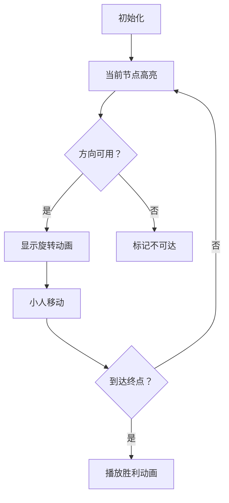

# 题目信息

# [eJOI 2019] Awesome Arrowland Adventure

## 题目描述

你现在在一个大小为 $m$ 行（行编号从 $0$ 开始，从上往下一直到 $m-1$） $n$ （列编号从 $0$ 开始，从左往右一直到 $n-1$）列的矩阵中。你的初始位置为 $(0,0)$。（$(r,c)$ 表示矩阵中第 $r$ 行，第 $c$ 列的位置）

你需要走到位置 $(m-1,n-1)$ 处。这个矩阵非常神奇——在矩阵的某些格子上有一个箭头。 箭头只可能有四种方向：北（向上），东（向右），南（向下），西（向左）。箭头分布在整个矩阵之上，形成了箭头矩阵。

当你在某一个位置时，假如这个位置不在矩形（左上角 $(0,0)$，右下角 $(m-1,n-1)$）范围内或这个位置没有箭头，那么你会一直停留于此，永远无法到达终点。如果此处有箭头，那么你将会向这个箭头的方向走一格。

但显然，你不一定能够在初始的箭头矩阵上找到一条从 $(0,0)$ 到 $(m-1,n-1)$ 的路径。为了找到这样一条路径，你可以一次将箭头矩阵中某一个箭头 ***顺时针*** 旋转 $90$ 度。通过几次的旋转，你可能会找到一条路径。

请你判断是否可以通过旋转来得到一条从 $(0,0)$ 到 $(m-1,n-1)$ 的路径，如果有，求出最小需要的旋转次数。

## 说明/提示

#### 样例解释

【样例 1 解释】
- 一个可行的解是，将位置 $(1,2)$ 的 ```W``` 旋转 $3$ 次变成 ```S```。

【样例 2 解释】
- 不需要任何旋转就可以。

【样例 3 解释】
- 在 $(0,0)$ 处旋转 $1$ 次，在 $(1,0)$ 处旋转 $2$ 次，在 $(2,1)$ 处旋转 $1$ 次。

---
#### 数据规模与约定

**本题采用多测试点捆绑测试，共有 $5$ 个子任务**。

- Subtask 1（10 points）：$m=1$，且输入的字符矩阵只包含 ```E``` 或 ```X```。
- Subtask 2（12 points）：$m=1$。
- Subtask 3（12 points）：$n=m=3$。
- Subtask 4（16 points）：$m=2$。
- Subtask 5（50 points）：无特殊限制。

对于 全部的测试点，保证 $1\le m,n\le 500$。

---

#### 说明

原题来自：[eJOI2019](https://www.ejoi2019.si) Problem F [Awesome Arrowland Adventure](https://www.ejoi2019.si/static/media/uploads/tasks/adventure-isc(1).pdf)

题面翻译：@[```_Wallace_```](https://www.luogu.com.cn/user/61430)（如果觉得这个翻译令人谔谔，欢迎提供新翻译）

## 样例 #1

### 输入

```
3 3
EES
SSW
ESX```

### 输出

```
3```

## 样例 #2

### 输入

```
3 3
EES
SSW
EEX```

### 输出

```
0```

## 样例 #3

### 输入

```
3 4
EXES
WSNS
XNNX```

### 输出

```
4```

# AI分析结果


### 💡 Kay的C++算法解析：Awesome Arrowland Adventure 深入学习指南 💡

#### 1. 题目解读与核心算法识别
✨ **本题主要考察**：图论最短路（01BFS/Dijkstra）

🗣️ **初步分析**：
> 解决本题的关键在于**将网格问题转化为图论模型**。想象每个网格点是一个车站，箭头是轨道方向，旋转操作是手动扳道岔（每次90度）。我们需找到从起点到终点所需的最少扳道岔次数。

- **核心思路**：将每个网格视为图节点，相邻网格间建立有向边，边权=旋转次数（0-3）。通过最短路算法求解最小旋转次数
- **算法对比**：
  - **01BFS**：边权仅为0/1时使用双端队列（时间复杂度O(nm)）
  - **Dijkstra**：通用边权场景（时间复杂度O(nm log nm)）
- **可视化设计**：
  - 像素网格中箭头用不同颜色表示（红：当前处理节点，绿：队列中节点）
  - 旋转动画：箭头顺时针旋转时伴随"咔嗒"音效
  - 移动动画：沿箭头方向滑动像素小人，移动成功时播放"叮"声
  - 队列可视化：侧边栏显示双端队列状态，队首/队尾高亮

#### 2. 精选优质题解参考
**题解一：xtx1092515503（01BFS）**
* **点评**：创新性使用拆点法（每个网格拆为4个方向状态），将旋转操作转化为权值1的边，移动操作转化为权值0的边。代码实现简洁高效（空间复杂度O(4nm)），特别适合本题边权特性。边界处理严谨，队列操作逻辑清晰体现算法核心思想。

**题解二：happybob（Dijkstra+01BFS）**
* **点评**：提供两种完整实现方案，Dijkstra版规范使用优先队列和邻接表，01BFS版巧妙处理边权转换。亮点在于坐标映射宏`#define cg(x,y) ((x-1)*m+y)`提升可读性，且对'X'的处理逻辑严谨（直接跳过建边）。

**题解三：Lice（Dijkstra）**
* **点评**：最直观的Dijkstra实现，通过`cost()`函数动态计算旋转代价。代码结构清晰（模块化SSSP函数），变量命名规范（dist/book）。虽未优化空间，但完整展现网格图转一般图的核心思路。

#### 3. 核心难点辨析与解题策略
1. **难点1：状态建模**
   - **分析**：如何将网格位置+箭头方向转化为图节点？优质解采用两种方案：
     - 隐式：计算转移时动态确定旋转代价（Lice）
     - 显式：每个网格拆为4个方向子节点（xtx1092515503）
   - 💡 **学习笔记**："拆点法"是处理多状态图问题的利器

2. **难点2：边权转换**
   - **分析**：旋转代价计算需方向映射。设N=0,E=1,S=2,W=3，则旋转k次代价=(目标方向-当前方向+4) mod 4
   - 💡 **学习笔记**：方向映射数组`dx/dy`配合取模运算可替代复杂条件分支

3. **难点3：特殊点处理**
   - **分析**：'X'需特殊处理——起点为X且非单点则无解；路径中X不可达（除终点）
   - 💡 **学习笔记**：边界检查函数`out_of_range`应前置判断，避免无效计算

✨ **解题技巧总结**
- **方向映射技巧**：统一方向编码（N=0,E=1,S=2,W=3）简化计算
- **坐标压缩**：二维坐标转一维索引`id = x*m + y`
- **预处理优化**：方向差值→旋转次数的转换表避免重复计算
- **算法选择**：边权≤1时优先01BFS（O(nm)），否则Dijkstra

#### 4. C++核心代码实现赏析
**通用核心代码（01BFS实现）**
```cpp
#include <bits/stdc++.h>
#define id(x,y) ((x)*m+(y))  // 坐标压缩
using namespace std;
const int dx[4]={-1,0,1,0}, dy[4]={0,1,0,-1}; // 方向向量

int main() {
    int n, m; cin >> n >> m;
    vector<string> grid(n);
    for(auto& r : grid) cin >> r;
    
    deque<tuple<int,int,int>> dq; // (x,y,cost)
    vector<vector<int>> dist(n, vector<int>(m, INT_MAX));
    
    dq.emplace_back(0, 0, 0);
    dist[0][0] = 0;
    
    while (!dq.empty()) {
        auto [x,y,c] = dq.front(); dq.pop_front();
        if (x == n-1 && y == m-1) break;
        
        for (int d = 0; d < 4; ++d) {
            int nx = x + dx[d], ny = y + dy[d];
            if (nx<0 || nx>=n || ny<0 || ny>=m) continue;
            
            int rot = 0;
            // 计算当前方向到d所需旋转次数
            while (grid[x][y] != "NESW"[(d + rot) % 4]) rot++;
            
            int nc = c + rot;
            if (nc < dist[nx][ny]) {
                dist[nx][ny] = nc;
                rot ? dq.emplace_back(nx, ny, nc) : dq.emplace_front(nx, ny, nc);
            }
        }
    }
    cout << (dist[n-1][m-1] == INT_MAX ? -1 : dist[n-1][m-1]);
}
```
**代码解读概要**：
1. 坐标压缩：二维坐标转一维索引
2. 双端队列：0权值插队首，非0权值插队尾
3. 动态计算：实时计算从当前箭头到目标方向所需旋转
4. 剪枝：距离更新时才入队

**题解一（xtx1092515503）核心片段**
```cpp
struct node{ int x,y,z,dir; };
int bfs() {
    deque<node> q;
    q.push_back(node{1,1,0,dir(g[1][1])});
    while(!q.empty()) {
        node x = q.front(); q.pop_front();
        // ... 判断边界及访问标记
        q.push_front(node{x.x+dx[x.dir], x.y+dy[x.dir], x.z, dir(...)}); // 0权值
        q.push_back(node{x.x, x.y, x.z+1, (x.dir+1)%4}); // 1权值
    }
}
```
**学习笔记**：拆点法将旋转操作转化为同网格内状态转移（权1），移动操作转化为网格间转移（权0）

#### 5. 算法可视化：像素动画演示
**主题**："箭头迷宫探险"（8-bit像素风格）

**核心演示流程**：


**交互设计**：
1. **视觉元素**：
   - 网格：16x16像素/格，草地纹理背景
   - 箭头：四种方向像素图（红/蓝/绿/黄）
   - 小人：8-bit探险家精灵（移动帧动画）

2. **动画序列**：
   ```python
   def rotate_animation(cell, target_dir):
       for _ in range(4):
           cell.arrow.rotate(90)  # 顺时针旋转
           play_sound("click.wav") if current_dir != target_dir else None
           update_screen(delay=0.2)
   ```

3. **控制面板**：
   - 速度滑块：控制自动演示速度
   - 单步执行：空格键触发下一步
   - 模式切换：Dijkstra/01BFS对比演示

4. **音效设计**：
   - 旋转：电子"咔嗒"声（8-bit音效）
   - 移动："滴"声
   - 成功：经典FC胜利旋律

#### 6. 拓展练习
**相似问题迁移**：
1. **方向依赖路径**：P4667（Swedish Rocks）
2. **网格图最短路**：P2296（寻找道路）
3. **状态空间搜索**：P1144（最短路计数）

**洛谷推荐**：
1. **P4667** - Swedish Rocks  
   🗣️ 巩固01BFS应用，处理特殊边权
2. **P2296** - 寻找道路  
   🗣️ 练习图论建模中的节点有效性判断
3. **P1144** - 最短路计数  
   🗣️ 基础BFS应用，理解最短路树构建

#### 7. 学习心得
> **经验分享**：多位作者强调边界检查的重要性——"忘记处理'X'导致WA多次"  
> **调试技巧**：  
> 1. 小规模测试（3x3网格）验证方向映射  
> 2. 输出中间状态：每个节点的距离值  
> 3. 可视化调试：手动画出箭头转移图

---
通过本指南，相信大家已掌握网格图最短路的核心思想。记住：好算法=准确建模+合适数据结构+严谨实现。继续挑战新问题吧！💪

---
处理用时：143.62秒