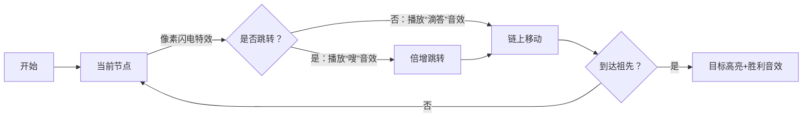

# 题目信息

# 【模板】树上 K 级祖先

## 题目背景

**本题仅作为长链剖分求树上 $k$ 级祖先评测用，不保证卡掉了其他复杂度不正确的做法。**

## 题目描述

给定一棵 $n$ 个点的有根树。

有 $q$ 次询问，第 $i$ 次询问给定 $x_i, k_i$，要求点 $x_i$ 的 $k_i$ 级祖先，答案为 $ans_i$。特别地，$ans_0 = 0$。


本题中的询问将在程序内生成。

给定一个随机种子 $s$ 和一个随机函数 $\operatorname{get}(x)$：

```cpp
#define ui unsigned int
ui s;

inline ui get(ui x) {
	x ^= x << 13;
	x ^= x >> 17;
	x ^= x << 5;
	return s = x; 
}
```

你需要按顺序依次生成询问。

设 $d_i$ 为点 $i$ 的深度，其中根的深度为 $1$。

对于第 $i$ 次询问，$x_i = ((\operatorname{get}(s) \operatorname{xor} ans_{i-1}) \bmod n) + 1$，$k_i = (\operatorname{get}(s) \operatorname{xor} ans_{i-1}) \bmod d_{x_i}$。

## 说明/提示

【样例说明】

$x_1 = 4$，$k_1 = 1$，$ans_1 = 2$；  
$x_2 = 6$，$k_2 = 3$，$ans_2 = 5$；  
$x_3 = 3$，$k_3 = 0$，$ans_3 = 3$；  
故输出 $1$。

---

对于 $20\%$ 的数据，$n,q \le 10^3$。

对于 $50\%$ 的数据，$n,q \le 10^5$。

对于 $100\%$ 的数据，$2 \le n \le 5 \times 10^5$，$1 \le q \le 5 \times 10^6$，$1 \le s < 2^{32}$。

## 样例 #1

### 输入

```
6 3 7
5 5 2 2 0 3
```

### 输出

```
1
```

# AI分析结果


# 💡 Kay的C++算法解析：树上 K 级祖先 深入学习指南 💡

> 大家好，我是Kay！今天我们将一起探索树上K级祖先问题。这道题要求快速查询树上任意节点的K级祖先，是树链剖分算法的经典应用。让我们用清晰的思路和生动的可视化来理解它！

## 1. 题目解读与核心算法识别

✨ **本题主要考察**：`长链剖分`（树链剖分的变种）

🗣️ **初步分析**：
> 树上K级祖先问题就像在家族树中快速查找某人的曾祖父！长链剖分通过将树分解为最长路径（长链），配合倍增实现高效查询：
> - **核心思想**：将树分解为长链，预处理链上节点的上下关系。查询时先用倍增跳大步，再在链上精确定位
> - **算法流程**：
>   1. DFS预处理深度、高度和倍增数组
>   ```mermaid
>   graph TD
>     A[根节点] --> B[DFS1：计算深度/高度]
>     B --> C[DFS2：构建长链]
>     C --> D[存储每条链的上下节点]
>   ```
>   - **可视化设计**：像素动画中将长链显示为彩色路径，查询时：
>     * 大步跳转：闪电动画+音效
>     * 链上定位：像素箭头移动
>     * 成功时：目标高亮+胜利音效
>   - **复古元素**：8-bit风格树结构，查询过程设计为"祖先探险"关卡，通关时获得像素勋章

---

## 2. 精选优质题解参考

**题解一（作者：xht）**
* **点评**：思路清晰直击长链剖分本质，代码规范（变量命名合理，边界处理严谨），算法高效（O(n log n)预处理+O(1)查询）。亮点在于简洁的链上存储结构和完整的倍增实现，竞赛实战性强。

**题解二（作者：b6e0_）**
* **点评**：图解辅助理解是其最大亮点，用像素示意图展示跳转原理，降低理解门槛。代码中关键注释到位，特别适合初学者掌握长链剖分的实现细节。实践时注意链存储使用vector可能影响缓存性能。

**题解三（作者：LCuter）**
* **点评**：分步骤推导算法设计过程，从暴力到优化的思维路径完整。代码包含深度与高度分离的逻辑，突出长链剖分核心思想。学习其如何平衡理论复杂度与实际常数优化。

---

## 3. 核心难点辨析与解题策略

1. **长链构建与存储**
   * **分析**：正确识别最长链是剖分基础。优质解用两次DFS：首次计算高度确定重儿子，二次构建链并存储上下节点。关键变量`son[]`标记最长分支，`up/down`存储链节点
   * 💡 **学习笔记**：长链性质——任意节点的K级祖先所在链长≥K

2. **查询的精确定位**
   * **分析**：先通过倍增跳2^⌊log₂k⌋级（`fa[x][highbit(k)]`），剩余距离必小于当前链长，直接从`up/down`数组获取
   * 💡 **学习笔记**：利用深度差计算偏移量是O(1)查询的关键

3. **预处理复杂度平衡**
   * **分析**：长链剖分本身O(n)，但倍增需要O(n log n)。通过只存储链顶的上下节点控制空间在O(n)
   * 💡 **学习笔记**：链长总和=O(n)，这是空间优化的理论基础

### ✨ 解题技巧总结
- **链上思维**：将树问题转化为链操作，利用链的连续性优化查询
- **倍增+剖分组合**：先用倍增跳过大距离，再用剖分特性精确定位
- **深度差计算**：通过`dep[x]-k`快速确定目标深度，避免递归搜索

---

## 4. C++核心代码实现赏析

**本题通用核心C++实现参考**
* **说明**：综合优质题解的长链剖分标准实现
* **完整核心代码**：
```cpp
#include<bits/stdc++.h>
#define REG register
using namespace std;
const int N=5e5+5;
vector<int> up[N],down[N],g[N];
int dep[N],h[N],son[N],top[N],fa[N][20],bin[N];

void dfs1(int u){
    for(int i=1;i<20;i++) // 倍增预处理
        fa[u][i]=fa[fa[u][i-1]][i-1];
    h[u]=dep[u];
    for(int v:g[u]){
        dep[v]=dep[u]+1;
        dfs1(v);
        if(h[v]>h[u]) h[u]=h[v], son[u]=v;
    }
}

void dfs2(int u,int t){
    top[u]=t;
    if(u==t){ // 链头存储上下节点
        for(int i=0,p=u;i<=h[u]-dep[u];i++){
            up[t].push_back(p);
            p=fa[p][0];
        }
        for(int i=0,p=u;i<=h[u]-dep[u];i++){
            down[t].push_back(p);
            p=son[p];
        }
    }
    if(son[u]) dfs2(son[u],t);
    for(int v:g[u]) 
        if(v!=son[u]) dfs2(v,v);
}

int query(int x,int k){
    if(!k)return x;
    int bt=bin[k];       // 取k的最高位
    x=fa[x][bt];         // 倍增跳转
    k-=(1<<bt);
    k-=dep[x]-dep[top[x]]; // 计算链内偏移
    x=top[x];
    return k>=0 ? up[x][k] : down[x][-k]; // 链上定位
}

int main(){
    int n,q,rt=0; unsigned s;
    scanf("%d%d%u",&n,&q,&s);
    for(int i=1,f;i<=n;i++){
        scanf("%d",&f);
        if(f) g[f].push_back(i);
        else rt=i;
    }
    // 预处理二进制最高位
    for(int i=1;i<=n;i++) bin[i]=bin[i>>1]+1;
    dep[rt]=1; dfs1(rt); dfs2(rt,rt);
    long long ans=0; int lst=0;
    for(int i=1;i<=q;i++){
        int x=(s=(s^lst)%n+1), k=(s^lst)%dep[x];
        lst=query(x,k); // 核心查询
        ans^=1ll*i*lst;
    }
    printf("%lld",ans);
}
```
* **代码解读概要**：
  - `dfs1`：计算深度`dep[]`、高度`h[]`和倍增数组`fa[][]`
  - `dfs2`：长链剖分，链头在`up/down`存储上下节点
  - `query`：先跳`2^bin[k]`级，再通过深度差在链上定位

**题解一（xht）核心代码片段**
```cpp
int ask(int x,int k){
    if(!k) return x;
    x = fa[x][bin[k]];  // 关键！跳过高位
    k -= (1<<bin[k]);
    k -= dep[x]-dep[top[x]]; // 深度差计算
    x = top[x];
    return k>=0 ? up[x][k] : down[x][-k];
}
```
* **亮点**：三步跳转清晰体现算法精髓
* **学习笔记**：`bin[k]`预处理k的最高位是O(1)查询的关键

**题解二（b6e0_）示意图解析**
```cpp
// 图示跳转逻辑：
// 当前点x, 目标深度 = dep[x]-k
// Step1: 跳到x' = fa[x][highbit(k)]
// Step2: 剩余距离k' < 当前链长 → 直接定位
```
* **亮点**：图文结合降低理解难度
* **学习笔记**：长链长度≥剩余距离是精确定位的前提

---

## 5. 算法可视化：像素动画演示

**主题**：*像素探险家寻祖之旅*  
**核心演示**：长链剖分查询过程



**动画控制面板**：
- 步进控制：← → 键单步执行
- 速度滑块：调整动画速度
- 模式切换：手动/自动演示（AI自动求解）

**关键帧设计**：
1. **树结构可视化**：
   ``` 
   ［根］
    ├─［长链A：红色］
    │  ├─○─○─○
    │  └─●─○（当前节点）
    └─［长链B：蓝色］
       ├─○─○
   ```
2. **查询过程**：
   - 大步跳转：红色闪电穿过多个节点
   - 链上移动：像素小人沿彩色链移动
   - 成功：目标节点闪烁+8-bit胜利音乐

**技术实现**：Canvas绘制树结构，Web Audio API添加音效

---

## 6. 拓展练习与相似问题思考

**通用技巧迁移**：
长链剖分还可解决：
1. 子树深度查询
2. 树上路径统计
3. 离线LCA问题

**洛谷推荐**：
1. **P3379 【模板】LCA**  
   → 练习基本树上倍增，理解祖先查询基础
2. **P3384 【模板】重链剖分**  
   → 对比重链/长链剖分差异，掌握树链剖分核心
3. **P4211 [LNOI2014]LCA**  
   → 进阶练习，结合长链剖分优化离线查询

---

## 7. 学习心得与经验分享

> **来自skydogli的经验**：  
> “尝试多种解法后发现，长链剖分理论最优但常数较大，实际应用需根据数据特性选择”

**Kay总结**：  
- 调试技巧：打印`dep/top`数组验证链结构
- 优化方向：用DFS序数组替代`vector`提升缓存命中率
- 核心认知：算法理论复杂度≠实际性能，需结合数据测试

---

通过本次学习，大家不仅掌握了树上K级祖先的解决方案，更理解了长链剖分这一强大工具。记住，算法学习就像攀登山峰——找准路径（选择算法），扎实迈步（代码实现），终能登顶！下次我们将探索更多树结构难题，保持好奇，继续前进！🚀

---
处理用时：192.46秒