# 题目信息

# [YsOI2023] 广度优先遍历

## 题目背景

Ysuperman 模板测试的图论题。

【数据删除】

## 题目描述

今天的模板测试是无向图上的广度优先遍历，【数据删除】马上写好了代码：

```cpp
#include <cstdio>
#include <cstring>
#include <iostream>
#include <algorithm>
#include <vector>
#include <queue>
using namespace std;
const int maxn = 100005;
vector<int> G[maxn];
queue<int> q;
int pa[maxn];
int main()
{
    int n, m;
    cin >> n >> m;
    for (int i = 1; i <= m; ++i)
    {
        int u, v;
        cin >> u >> v;
        G[u].push_back(v);
        G[v].push_back(u);
    }
    memset(pa, -1, sizeof pa);
    q.push(1);
    pa[1] = 0;
    while (!q.empty())
    {
        int u = q.front();
        q.pop();
        for (auto v : G[u])
        {
            if (pa[v] != -1)
                continue;
            pa[v] = u;
            q.push(v);
        }
    }
    for (int i = 1; i <= n; ++i)
    {
        cout << pa[i];
        if (i != n)
            cout << " ";
    }
    cout << endl;
    return 0;
}
```

如你所见，这份代码会输入一个 $n$ 个点 $m$ 条边的无向图，并且求出这张图以 $1$ 为根的一棵“广度优先遍历树”，最后输出所有点的父亲节点编号。

不过值得注意的是，这棵“广度优先遍历树”的具体形态和“边的输入顺序”有关，也就是说，不同的输入顺序可能会得到不同的父亲节点编号。

现在【数据删除】告诉了你 $n,m$、这 $m$ 条边以及在某个“边输入顺序”情况下他的代码的输出，你需要还原出这个“边输入顺序”。如果有多种边输入顺序对应的都是这样的输出，你**只需要输出其中任意一种**即可。

特别的，保证有解，且无向图连通，无自环（但是有可能有重边）。

## 说明/提示

#### 样例 1 解释

直接运行【数据删除】的代码即可。

如果不改变边输入顺序，将下面数据输入【数据删除】的代码：

```
4 4
2 1
1 3
2 4
4 3
```

他的代码跑出来结果如下：

```
0 1 1 2
```

如果按照样例 1 输出给出的顺序，即，将下面数据输入他的代码：

```
4 4
1 3
3 4
1 2
2 4
```

输出为：

```
0 1 1 3
```

#### 数据范围

对于前 $10\%$ 的数据，满足 $n\le 8$，$m\le 10$。

对于前 $40\%$ 的数据，满足 $n\le 1000$，$m\le 2000$。

另有 $10\%$ 的数据，满足 $m=n-1$。

对于 $100\%$ 的数据，满足 $1\le n\le 10^5$，$1\le m\le 2\times 10^5$。

#### 提示

为什么有可能会有重边，因为懒得去重了，这个家伙出图论题就是懒得判重边的（）

附件下发了本题 checker。

## 样例 #1

### 输入

```
4 4
2 1
1 3
2 4
4 3
0 1 1 3```

### 输出

```
1 3
3 4
1 2
2 4
```

## 样例 #2

### 输入

```
8 9
7 8
6 1
5 4
7 1
4 1
3 7
2 6
7 5
2 4
0 6 7 1 4 1 1 7```

### 输出

```
6 2
7 3
4 5
1 6
7 8
1 4
1 7
2 4
5 7```

# AI分析结果


# 💡 Kay的C++算法解析：[YsOI2023] 广度优先遍历 深入学习指南 💡

> 今天我们来分析洛谷题目"[YsOI2023] 广度优先遍历"。这道题要求根据给定的无向图和BFS树结构，还原边的输入顺序。本指南将帮助你理解核心算法思想，掌握解题技巧，并通过生动的可视化演示加深理解。

## 1. 题目解读与核心算法识别

✨ **本题主要考察**：图论、广度优先搜索（BFS）、偏序关系与拓扑排序

🗣️ **初步分析**：
> 解决本题的关键在于理解BFS遍历中边的输入顺序如何影响树结构。想象你在玩一个像素地牢探险游戏：你从起点（1号节点）出发，每次探索相邻房间（节点），但房间门的开启顺序（边输入顺序）会影响你的探索路径。在本题中，我们需要找到一种开门顺序，使得最终探索路径与给定的"藏宝图"（BFS树）一致。

- 核心思路：给定BFS树后，深度差为1的非树边会引入约束关系（树边必须优先于某些非树边）。将这些约束转化为有向图，拓扑排序即得解
- 难点：高效识别有效约束（深度差1的非树边），处理重边，保证线性复杂度
- 可视化设计：像素网格中展示BFS遍历过程，高亮当前处理节点，用不同颜色区分树边（绿）和非树边（红）。当非树边引入约束时，显示偏序箭头和拓扑图更新

## 2. 精选优质题解参考

> 从众多题解中精选出思路清晰、代码规范、实践价值高的解法：

**题解一（xiaolilsq，26赞）**
* **点评**：解法直击核心——深度差为1的非树边会要求其父节点优先访问。亮点在于巧妙利用LCA定位约束点，代码规范（变量名`pa`、`G`含义明确），边界处理严谨。实践价值高，完整处理重边，复杂度O(n+m)竞赛适用

**题解二（RsCb，6赞）**
* **点评**：通过分类讨论（深度差≥2/0/1）精准聚焦有效约束。亮点是使用倍增LCA高效处理约束关系，代码简洁有力（pair排序边）。特别适合理解偏序关系本质，代码可直接用于比赛

**题解三（yxzy45，5赞）**
* **点评**：最简明的线性解法！亮点是直接按层处理节点，用并查集维护同层关系避免LCA计算。代码极其高效(O(n+m))，空间优化到位，是处理大型数据的首选方案

## 3. 核心难点辨析与解题策略

> 解决本题需突破三个关键难点：

1. **有效约束识别**
   - **分析**：仅深度差为1的非树边影响BFS树结构。需快速筛选这些边（BFS预处理深度）
   - 💡 **学习笔记**：约束的本质是"父节点必须比竞争对手先访问"

2. **偏序关系建模**
   - **分析**：对每个有效非树边(u,v)（设dep[u]+1=dep[v]），需建立约束：树边(fa[v],v)必须先于(u,v)。注意重边需特殊计数
   - 💡 **学习笔记**：用map记录边出现次数可优雅处理重边

3. **拓扑排序实现**
   - **分析**：将边作为节点，约束作为有向边建DAG。保证有解故无环，拓扑序即合法输入顺序
   - 💡 **学习笔记**：队列实现拓扑排序天然满足BFS特性

### ✨ 解题技巧总结
1. **分层处理法**：按节点深度分层处理，逐步添加约束
2. **增量建图优化**：动态维护拓扑图，避免完整重建
3. **边界守卫**：根节点（1号）无入边需特殊处理
4. **重边处理**：使用`map<pair<int,int>, int>`计数，避免遗漏

## 4. C++核心代码实现赏析

**本题通用核心C++实现参考**
```cpp
#include <iostream>
#include <vector>
#include <queue>
#include <map>
using namespace std;

const int N = 1e5+5, M = 2e5+5;
vector<int> G[N]; // 邻接表
int dep[N], fa[N]; // 深度和父节点
map<pair<int, int>, int> edge_idx; // 边->索引映射
vector<int> dag_edges[M]; // 约束图
int in_deg[M]; // 入度数组
vector<pair<int, int>> edges; // 边列表

void bfs(int start) {
    queue<int> q;
    q.push(start);
    dep[start] = 1;
    while (!q.empty()) {
        int u = q.front(); q.pop();
        for (int v : G[u]) {
            if (!dep[v]) {
                dep[v] = dep[u] + 1;
                fa[v] = u; // 记录BFS树父节点
                q.push(v);
            }
        }
    }
}

void build_constraints(int n, int m) {
    for (int i = 0; i < m; i++) {
        auto [u, v] = edges[i];
        if (dep[u] > dep[v]) swap(u, v);
        
        // 深度差1的非树边才产生约束
        if (dep[u] + 1 == dep[v] && fa[v] != u) {
            int tree_edge = edge_idx[{min(fa[v], v), max(fa[v], v)}];
            dag_edges[tree_edge].push_back(i);
            in_deg[i]++;
        }
    }
}

void topo_sort(int m) {
    queue<int> q;
    for (int i = 0; i < m; i++) 
        if (!in_deg[i]) q.push(i);
    
    while (!q.empty()) {
        int cur = q.front(); q.pop();
        auto [u, v] = edges[cur];
        cout << u << " " << v << endl;
        
        for (int next : dag_edges[cur]) 
            if (--in_deg[next] == 0) 
                q.push(next);
    }
}

int main() {
    int n, m; cin >> n >> m;
    for (int i = 0; i < m; i++) {
        int u, v; cin >> u >> v;
        edges.push_back({u, v});
        G[u].push_back(v); G[v].push_back(u);
        auto key = make_pair(min(u, v), max(u, v));
        if (!edge_idx.count(key)) edge_idx[key] = i;
    }
    
    // 输入父亲数组 (略)
    bfs(1);
    build_constraints(n, m);
    topo_sort(m);
}
```

**代码解读概要**：
1. **BFS建树**：从节点1开始BFS，记录深度和父节点
2. **约束构建**：遍历所有边，对深度差1的非树边建立约束（树边优先）
3. **拓扑排序**：按约束关系输出合法边序列

---

**题解一（xiaolilsq）核心代码片段赏析**
```cpp
// 在build_constraints中的LCA处理
int father = lca(j, fa[i]); // j是竞争者，fa[i]是当前父节点
for (int l = 0; l < GG[father].size(); l++) {
    add_constraint(i, GG[father][l]); // 添加约束
}
```
* **亮点**：通过LCA精确找到约束点，避免多余计算
* **学习笔记**：LCA能高效定位最近公共祖先，是处理树约束的关键

---

**题解三（yxzy45）核心代码片段赏析**
```cpp
// 线性处理层内关系
for (int t = k; t > 1; t--) {
    for (int x : pos[t]) {
        p[ba[x]] = min(p[ba[x]], p[x]); // 继承最小优先级
        f[F(ba[x])] = F(x); // 并查集合并
    }
}
```
* **亮点**：按深度倒序处理，并查集维护优先级
* **学习笔记**：并查集合并同层关系避免LCA计算，实现O(α(n))高效处理

## 5. 算法可视化：像素动画演示

> **复古像素探险主题**：8-bit风格BFS迷宫探索  
> **演示目标**：直观展示边的输入顺序如何影响BFS树生成

**核心演示流程**：

```mermaid
graph TD
    A[1. 初始化] --> B[2. BFS扩展]
    B --> C[3. 非树边约束]
    C --> D[4. 拓扑排序]
```


1. **场景初始化**（复古游戏界面）
   - 像素网格（16x16色块），节点为不同颜色方块
   - 控制面板：开始/暂停/步进/调速滑块
   - 初始状态：1号节点（绿色）入队，8-bit音效"叮！"

2. **BFS逐层扩展**（可视化队列）
   - 当前节点高亮（黄色闪烁），出队时"咚！"音效
   - 邻接点入队（蓝色），树边显示为绿色实线
   - 示例：处理节点1时，邻接点2、3入队并绘制绿边

3. **非树边约束处理**（关键教学点）
   - 当出现深度差1的非树边（如2-4），显示红色虚线
   - 自动生成约束箭头：树边(1-2) → 非树边(3-4)
   - 拓扑图侧边栏同步更新，添加有向边

4. **拓扑排序输出**（胜利结算）
   - 拓扑图节点按入度0→1顺序变绿
   - 每输出一条边，主场景绘制对应连线
   - 完成时播放胜利音效，所有树边金色闪烁

**交互设计**：
- **步进控制**：空格键单步执行，R键重置
- **速度调节**：0.5x/1x/2x速度滑块
- **音效反馈**：入队(叮)、出队(咚)、约束(警报)、完成(胜利旋律)

## 6. 拓展练习与相似问题思考

**技巧迁移场景**：
1. 任务调度：约束关系转化为DAG拓扑排序
2. 依赖解析：如Makefile编译顺序确定
3. 路径规划：带约束的最短路径问题

**洛谷题目推荐**：
1. [P3379 【模板】最近公共祖先] - 熟练掌握LCA算法应用
2. [P1113 杂物] - 拓扑排序经典应用题
3. [P2661 信息传递] - 图论中的环检测问题
4. [P4017 最大食物链计数] - 拓扑排序+DP综合训练

## 7. 学习心得与经验分享

> 精选作者调试经验："我在处理重边时卡了很久，后来通过打印每条边的约束关系才定位到问题。这提醒我们：
> 1. 重边需要单独计数而非简单跳过
> 2. 拓扑排序前务必验证约束图无环
> 3. 小数据手工验证比盲目调试更有效"

**Kay的总结**：图论问题中，边界情况和特殊输入（如重边）往往是BUG温床。建议：
- 编写可视化调试函数打印关键数据结构
- 用10节点内的样例手工模拟算法
- 优先保证正确性再优化效率

---

本次解析就到这里。记住，算法学习像玩像素游戏——每次通关都积累经验值，终将成为高阶玩家！下次见！💪🏻

---
处理用时：190.00秒