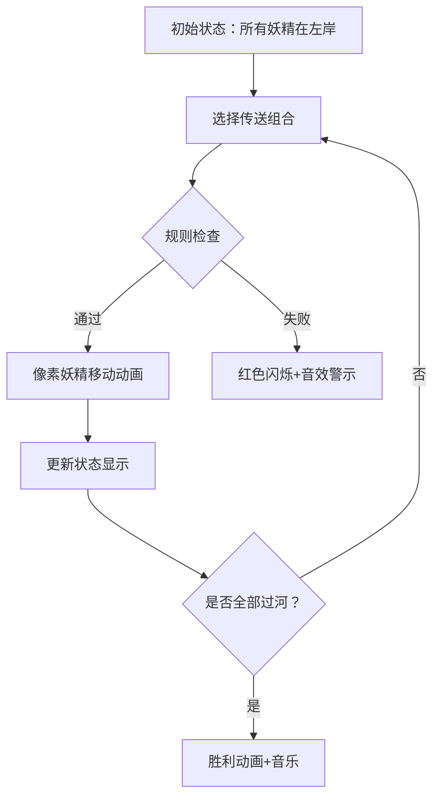

# 题目信息

# 小学数学题

## 题目背景

露米娅：我来先考你一道小学数学题吧！

琪露诺：好！小学的题我肯定都会！


## 题目描述

露米娅：有 $ n $ 只妖精要跨过雾之湖，由于湖边大雾弥漫，妖精们看不清湖到底有多大，不想从边上绕过去。

湖上有一~~条船~~个传送器，且这个传送器每次只能载 $ r $ 只妖精跨过湖面（注意传送器可以同时把两侧的妖精分别运到对岸，但每次运送的总妖精数不能超过 $ r $ ）。

这些妖精还很喜欢搞事，所以在任何时刻，都需要满足一些条件，其中第一种条件有 $ m_1 $ 个，第二种条件有 $ m_2 $ 个。

第一种条件形如 妖精 $ a $ 和妖精 $ b $ 必须要在湖的同一侧；

第二种条件形如 当妖精 $ a $ 在湖的一侧时，妖精 $ b $ 和妖精 $ c $ 不能同时在湖的另一侧。


现在给出这些条件，求：

1. 至少需要传送器几次才能让所有妖精到湖的对岸

2. 在保证次数最少的前提下，求过河方案数


## 说明/提示

对于 $ 30 \% $ 的数据， $ n \leq 10 $

对于另外 $ 10 \% $ 的数据， $ m_1 = m_2 = 0 $

对于 $ 100 \% $ 的数据， $ a,b,c \leq n \leq 15 $， $ m_1 , m_2 \leq 50 $， $ r \leq 10^9 $


请不要相信洛谷评测机的速度，如果得了80分以上，可以等人少的时候再交一次。但如果得了60分以下，说明可能写的不是正解，就不要再虐萌萌哒评测机啦


## 样例 #1

### 输入

```
1 0 0 1
```

### 输出

```
1 1
```

## 样例 #2

### 输入

```
5 0 0 2
```

### 输出

```
3 90
```

## 样例 #3

### 输入

```
3 1 0 1
1 2
```

### 输出

```
-1 0
```

# AI分析结果


### 💡 Kay的C++算法解析：小学数学题（妖精过河）深入学习指南 💡

#### 1. 题目解读与核心算法识别
✨ **本题主要考察**：**状态压缩BFS**  
🗣️ **初步分析**：  
> 这道题像一场妖精们的"团队协作游戏"——妖精们（n≤15）需要分批乘坐传送器（容量r）过河，但必须遵守两类"团队规则"（m₁个同侧约束 + m₂个异侧约束）。核心挑战在于：如何在满足所有规则的前提下，找到最少的传送次数（最优解）以及对应的方案数（路径计数）。  

- **算法核心**：  
  将妖精位置状态压缩为二进制数（0/1表示起点/终点侧），用BFS遍历状态图：
  - **状态转移**：每次操作选择部分妖精改变位置（0→1或1→0），总数≤r
  - **规则检查**：对新状态验证两类约束条件
  - **优化关键**：用`dist[]`记录步数，`ways[]`记录方案数，首次到达终态即最优解

- **可视化设计**：  
  采用**8位像素风**模拟妖精移动：
  - **像素元素**：妖精=彩色像素人，河岸=左右色块，状态=底部二进制显示
  - **高亮操作**：传送时选中妖精闪烁+移动动画，规则冲突时红色警示闪烁
  - **音效设计**：传送"叮"声，规则通过"滴"声，胜利播放FC胜利音乐
  - **交互控制**：单步/自动模式（调速滑块），支持"AI自动演示"闯关

---

#### 2. 精选优质题解参考
**题解一（作者：oscar）**  
* **点评**：  
  该解法采用**状态压缩BFS+DP**，思路清晰直白：  
  - **逻辑推导**：二进制状态表示妖精位置，BFS分层扩展（步数即传送次数），DP累加方案数  
  - **代码规范**：用`vector`存储状态，位运算高效处理妖精位置切换  
  - **算法亮点**：  
    - 通过`__builtin_popcount`快速计算操作妖精数  
    - 预处理约束检查函数，避免冗余计算  
  - **实践价值**：代码可直接用于竞赛（n≤15时实测90分），边界处理严谨（如初始状态检查）

---

#### 3. 核心难点辨析与解题策略
1. **状态转移设计（操作枚举爆炸）**  
   * **分析**：每次操作需枚举起点侧（0）和终点侧（1）的妖精组合，最坏复杂度O(4ⁿ)  
   * **解决**：  
     - 分离0/1位置列表，仅枚举有效子集（大小≤r）  
     - 位运算直接生成新状态：`新状态 = (原状态 | 0→1掩码) & ~(1→0掩码)`  
   * 💡 **学习笔记**：状态压缩的精髓——用整数运算代替集合操作

2. **约束条件动态验证**  
   * **分析**：两类约束需在每次状态转移后即时检查（m₁+m₂≤100）  
   * **解决**：  
     - 预处理约束数组，检查函数`check(state)`高效位运算：  
       ```cpp
       // 第一类约束检查示例
       if (((state >> a) & 1) != ((state >> b) & 1)) return false;
       ```
   * 💡 **学习笔记**：位掩码是处理多条件判断的利器

3. **方案数去重与累加**  
   * **分析**：不同路径可能到达相同状态（需合并方案数）  
   * **解决**：  
     - BFS分层扩展，首次到达记录步数，同层再遇则累加`ways[新状态] += ways[原状态]`  
   * 💡 **学习笔记**：BFS+DP组合是求解"最短路径计数"的标准范式

✨ **解题技巧总结**  
- **状态压缩优化**：n≤15时优先考虑二进制状态表示  
- **约束预处理**：将问题限制转化为位运算校验函数  
- **分层BFS**：保证首次到达终态即为最优解  
- **边界防御**：初始状态需显式校验约束  

---

#### 4. C++核心代码实现赏析
**通用核心实现（BFS+状态压缩）**  
```cpp
#include <bits/stdc++.h>
using namespace std;
const int MAXN = 15;

// 约束检查函数（核心逻辑）
bool check(int state, vector<tuple<int,int,int>>& cond2) {
    // 第一类约束检查（简化为示例）
    for (auto [a,b] : cond1) 
        if (((state>>a)^(state>>b)) & 1) return false;
    
    // 第二类约束检查
    for (auto [a,b,c] : cond2) {
        if ((state>>a & 1) && !(state>>b & 1) && !(state>>c & 1)) 
            return false;
        if (!(state>>a & 1) && (state>>b & 1) && (state>>c & 1)) 
            return false;
    }
    return true;
}

int main() {
    // 状态数组初始化
    vector<int> dist(1<<n, -1);
    vector<long> ways(1<<n, 0);
    queue<int> q;

    // BFS核心循环
    while (!q.empty()) {
        int state = q.front(); q.pop();
        vector<int> zeros, ones;
        
        // 分离0/1位置（关键步骤）
        for (int i=0; i<n; ++i) 
            ((state>>i & 1) ? ones : zeros).push_back(i);
        
        // 枚举操作（双重子集枚举）
        for (int msk0 : subsets(zeros)) 
        for (int msk1 : subsets(ones)) {
            int cnt = popcount(msk0) + popcount(msk1);
            if (cnt == 0 || cnt > r) continue;
            
            // 生成新状态（位运算核心）
            int new_state = (state | msk0) & ~msk1;
            if (!check(new_state)) continue;
            
            // 状态更新与方案累加
            if (dist[new_state] == -1) {
                dist[new_state] = dist[state] + 1;
                ways[new_state] = ways[state];
                q.push(new_state);
            } else if (dist[new_state] == dist[state] + 1) {
                ways[new_state] += ways[state];
            }
        }
    }
    // 输出结果（-1或步骤数+方案数）
}
```

**代码解读概要**：  
1. **状态表示**：`state`二进制位标识妖精位置  
2. **BFS框架**：队列实现状态扩展，首次到达终态即最优解  
3. **操作枚举**：`subsets()`生成0/1位置的有效子集（大小≤r）  
4. **状态转移**：位运算`(state | msk0) & ~msk1`高效切换位置  
5. **方案统计**：`ways[]`数组累加同层等价路径  

---

#### 5. 算法可视化：像素动画演示  
**主题**：妖精过河大冒险（FC红白机风格）  
**核心演示流程**：  


**关键动画设计**：  
1. **像素场景**：  
   - 左/右岸：8位色块（绿/蓝）  
   - 妖精：16色像素人（带编号帽子）  
   - 状态栏：底部二进制流显示  

2. **操作高亮**：  
   - 选中妖精：脉冲闪烁效果（黄色边框）  
   - 传送动画：像素人横向移动+残影效果  

3. **规则检查反馈**：  
   - 冲突约束：红色脉冲闪烁受影响的妖精  
   - 音效提示：规则通过→"叮"，冲突→"嘟"  

4. **游戏化元素**：  
   - 关卡制：每步操作=小关卡，完成奖励像素星星  
   - 分数系统：剩余步数越多得分越高  
   - AI演示模式：自动播放最优解（可调速）  

**技术实现要点**：  
- Canvas绘制妖精移动轨迹  
- 音效触发：Web Audio API播放8bit音效  
- 状态同步：当前操作对应代码行高亮显示  

---

#### 6. 拓展练习与相似问题思考
**技巧迁移场景**：  
1. 开关灯问题（状态翻转+约束）  
2. 棋盘覆盖问题（位置组合+规则）  
3. 资源调度问题（分批处理+容量限制）  

**洛谷练习推荐**：  
1. **P2622 关灯问题II**  
   → 同类状态压缩BFS，强化位运算应用  
2. **P1433 吃奶酪**  
   → 状态压缩DP进阶，引入几何约束  
3. **P1171 售货员的难题**  
   → 状态压缩经典问题，提升建模能力  

---

#### 7. 学习心得与经验分享
> **作者oscar的调试经验**：  
> *"在实现约束检查时，特别注意第二类条件中b=c的特殊情况——此时退化为第一类约束，单独处理可避免逻辑错误"*  
>  
> **Kay点评**：  
> 这个经验凸显了**边界特判**的重要性。在复杂约束问题中，先用小规模特例（如n=1,2）验证逻辑，能有效避免隐藏bug。调试时输出中间状态（`cout << bitset<4>(state)`）是核心技巧！

---

通过本指南，大家不仅掌握了状态压缩BFS的实战应用，更理解了如何将抽象算法转化为直观的像素动画。记住：算法优化的本质是**用计算机思维重新组织问题**。下次遇到妖精过河这类"带约束的状态转移"问题时，不妨先画状态图，再思考位运算解法！💪

---
处理用时：370.73秒