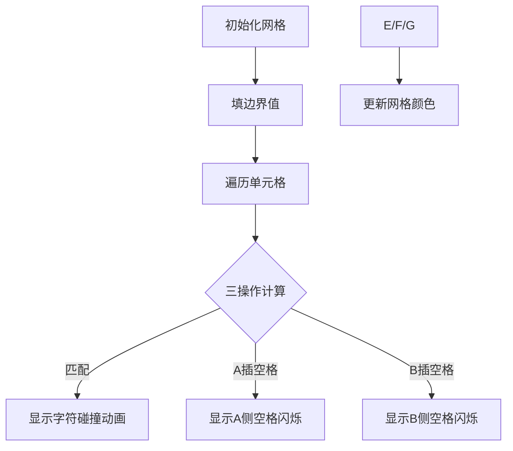

# 题目信息

# 字串距离

## 题目描述

设有字符串 $X$，我们称在 $X$ 的头尾及中间插入任意多个空格后构成的新字符串为 $X$ 的扩展串，如字符串 $X$ 为$\verb!abcbcd!$，则字符串 $\verb!abcb␣cd!$，$\verb!␣a␣bcbcd␣!$ 和 $\verb!abcb␣cd␣!$ 都是 $X$ 的扩展串，这里 $\verb!␣!$ 代表空格字符。

如果 $A_1$ 是字符串 $A$ 的扩展串，$B_1$ 是字符串 $B$ 的扩展串，$A_1$ 与 $B_1$ 具有相同的长度，那么我们定义字符串 $A_1$ 与 $B_1$ 的距离为相应位置上的字符的距离总和，而两个非空格字符的距离定义为它们的 ASCII 码的差的绝对值，而空格字符与其他任意字符之间的距离为已知的定值K，空格字符与空格字符的距离为 $0$。在字符串 $A$、$B$ 的所有扩展串中，必定存在两个等长的扩展串 $A_1$，$B_1$，使得 $A_1$ 与 $B_1$ 之间的距离达到最小，我们将这一距离定义为字符串 $A$，$B$ 的距离。

请你写一个程序，求出字符串 $A$，$B$ 的距离。


## 样例 #1

### 输入

```
cmc

snmn

2

```

### 输出

```
10

```

# AI分析结果


### 💡 Kay的C++算法解析：字串距离 深入学习指南 💡

#### 题目解读与核心算法识别
✨ **本题主要考察**：`动态规划 (序列比对类)`  
🗣️ **初步分析**：  
> 解决“字串距离”的关键在于**动态规划**。想象两个字符串像两条待拼接的轨道，我们可以在轨道间插入“缓冲带”（空格）来对齐轨道，目标是用最小的代价（ASCII差值和K值）完成轨道对接。DP就是逐步计算最优对齐方案的工具箱。  
> - **核心思路**：用`dp[i][j]`表示字符串A前i位和B前j位的最小距离。通过三种操作实现状态转移：字符直接匹配、A插入空格、B插入空格。  
> - **难点**：理解状态转移的物理意义（三种操作对应三种路径），以及边界初始化（全空格场景）。  
> - **可视化设计**：采用**8位像素网格**，横纵轴分别表示两个字符串的字符索引。每个网格用不同颜色标记状态（未计算/已计算/最优路径），音效区分操作类型（匹配“叮”、空格“噗”），自动演示模式可调速观察DP填表过程。

---

#### 精选优质题解参考
**题解一（Forever丶CIL）**  
* **点评**：思路直击DP本质，状态定义`A[i][j]`清晰，转移方程`min(三种操作)`简洁完整。代码规范：  
  - 亮点：独立`ini()`函数处理边界初始化，增强可读性  
  - 优化：直接使用`abs()`计算字符差，避免冗余类型转换  
  - 实践：输入用`cin>>s+1`实现1-indexed存储，简化下标操作  

**题解二（Y_BY）**  
* **点评**：图解辅助理解是最大亮点！用网格图明确展示`f[i][j]`的物理意义：  
  - 亮点：原创示意图解释状态转移（如`f[i-1][j]`对应A插空格）  
  - 代码：严格初始化`f[0][j]=j*k`，避免未定义行为  
  - 深度：注释强调`f[i][j]`本质是扩展串的最小距离  

**题解三（zhangyuhan）**  
* **点评**：结构化思维突出，将DP分解为四要素（状态定义/转移/边界/目标）：  
  - 亮点：用`' '+a`技巧实现1-indexed，比`cin>>s+1`更通用  
  - 严谨性：显式赋初值`1e9`确保`min()`正确性  
  - 教学：明确指出三种状态转移的物理含义  

---

#### 核心难点辨析与解题策略
1. **状态定义抽象**  
   *分析*：`dp[i][j]`表示A前i字符与B前j字符对齐的最小代价。优质解法定为二维状态，因其必须同时追踪两个字符串的匹配进度。  
   💡 **学习笔记**：DP状态需完整描述当前子问题规模  

2. **状态转移理解**  
   *分析*：三种操作对应三种路径：  
   - `dp[i-1][j-1]+|A[i]-B[j]|`：字符直接PK  
   - `dp[i-1][j]+k`：A末尾插空格“跳过”B[j]  
   - `dp[i][j-1]+k`：B末尾插空格“跳过”A[i]  
   💡 **学习笔记**：转移方程本质是决策树的数学表达  

3. **边界初始化**  
   *分析*：当某字符串为空时，代价必然是全插空格：  
   `dp[i][0]=i*k`（A前i字符全匹配B的空格）  
   `dp[0][j]=j*k`（对称场景）  
   💡 **学习笔记**：边界是递归基，决定DP起点可靠性  

✨ **解题技巧总结**  
- **问题分解**：将字符串对齐拆解为末位字符的三种操作  
- **1-indexed优化**：下标从1开始存储，避免±1混乱  
- **防御性初始化**：未计算状态赋极大值(`1e9`)，确保`min()`正确  
- **可视化辅助**：画DP表格验证转移逻辑  

---

#### C++核心代码实现赏析
**通用核心实现参考**  
```cpp
#include <iostream>
#include <cstring>
#include <cmath>
using namespace std;
const int N=2005;
int dp[N][N], k; 
string A, B;

int main() {
    cin >> A >> B >> k;
    int n = A.size(), m = B.size();
    // 初始化边界
    for(int i=1; i<=n; i++) dp[i][0] = i*k;
    for(int j=1; j<=m; j++) dp[0][j] = j*k;
    // 核心DP
    for(int i=1; i<=n; i++) {
        for(int j=1; j<=m; j++) {
            int match = dp[i-1][j-1] + abs(A[i-1]-B[j-1]); // 字符直接匹配
            int insertA = dp[i-1][j] + k;  // A插入空格
            int insertB = dp[i][j-1] + k;  // B插入空格
            dp[i][j] = min(match, min(insertA, insertB));
        }
    }
    cout << dp[n][m];
    return 0;
}
```
**代码解读概要**：  
1. 读入字符串后转为0-indexed存储（`A[i-1]`访问第i字符）  
2. 边界初始化体现全空格场景  
3. 双重循环遍历所有子问题，三选一决策  

**题解一核心片段赏析**  
```cpp
void ini() {
    for(int i=1;i<=len1;i++) A[i][0]=A[i-1][0]+k; // 递推初始化
}
```
💡 **学习笔记**：边界初始化可递推实现，避免单独循环  

**题解二核心片段赏析**  
```cpp
f[i][j]=min(f[i][j],f[i][j-1]+k); // 状态转移精简写法
```
💡 **学习笔记**：`min`嵌套调用替代临时变量，代码更紧凑  

**题解三核心片段赏析**  
```cpp
a = ' '+a; // 添加首空格实现1-indexed
b = ' '+b;
```
💡 **学习笔记**：字符串头部插入空格是1-indexed的优雅实现  

---

#### 算法可视化：像素动画演示
**设计思路**：复古红白机风格，将DP转化为“字符对齐游戏”  


**实现细节**：  
1. **像素网格**：16x16像素块，暖色系（黄/橙）标记计算路径  
2. **动态效果**：  
   - 字符匹配：字符像素块碰撞→火花特效+“叮”声  
   - 插入空格：灰色像素块扩展+“噗”声  
3. **控制面板**：  
   - 速度滑块：调节自动演示速度  
   - 单步按钮：手动触发下一步  
   - 高亮开关：标记最小值获取路径  
4. **游戏化元素**：  
   - 每完成一行获得1积分  
   - 最终解显示“通关”8-bit音乐  

---

#### 拓展练习与相似问题
**通用技巧迁移**：序列对齐DP广泛用于：  
1. 基因序列比对（生物信息学）  
2. 文本相似度计算（自然语言处理）  
3. 版本差异分析（如git diff）  

**洛谷推荐**：  
1. **P1140 相似基因**  
   🗣️ 同款DP模型应用，强化状态设计能力  
2. **P2758 编辑距离**  
   🗣️ 增加插入/删除操作，拓展决策维度  
3. **P1435 回文字串**  
   🗣️ 序列处理的逆向思维训练  

---

#### 学习心得与经验分享
> **Y_BY的调试经验**：  
> *“最初误解f[i][j]含义，通过网格图模拟才理解状态转移”*  
> **Kay点评**：  
> 动态规划理解障碍时，**手工画表格**是最佳调试手段！建议：  
> 1. 用2x2小样例模拟  
> 2. 记录每个`dp[i][j]`的决策来源  
> 3. 对比程序输出与手工结果  

---

### 结语
掌握序列对齐类DP的核心在于**状态设计的物理直觉**和**转移方程的决策分解**。通过本题的像素动画演示，希望大家能直观感受“字符串像轨道拼接”的动态过程。下次遇到类似问题，记得画表格辅助分析哦！🚀

---
处理用时：91.10秒