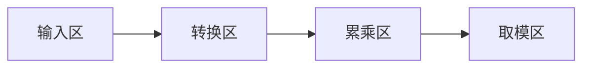

# 题目信息

# [USACO1.1] 你的飞碟在这儿 Your Ride Is Here

## 题目描述

众所周知，在每一个彗星后都有一只 UFO。这些 UFO 时常来收集地球上的忠诚支持者。不幸的是，他们的飞碟每次出行都只能带上一组支持者。因此，他们要用一种聪明的方案让这些小组提前知道谁会被彗星带走。他们为每个彗星起了一个名字，通过这些名字来决定这个小组是不是被带走的那个特定的小组（你认为是谁给这些彗星取的名字呢？）。关于如何搭配的细节会在下面告诉你；你的任务是写一个程序，通过小组名和彗星名来决定这个小组是否能被那颗彗星后面的 UFO 带走。


小组名和彗星名都以下列方式转换成一个数字：最终的数字就是名字中所有字母的积，其中 $\texttt A$ 是 $1$，$\texttt Z$ 是 $26$。例如，$\texttt{USACO}$ 小组就是 $21 \times 19 \times 1 \times 3 \times 15=17955$。如果小组的数字 $\bmod 47$ 等于彗星的数字 $\bmod 47$,你就得告诉这个小组需要准备好被带走！（记住“$a \bmod b$”是 $a$ 除以 $b$ 的余数，例如 $34 \bmod 10$ 等于 $4$）


写出一个程序，读入彗星名和小组名并算出用上面的方案能否将两个名字搭配起来，如果能搭配，就输出 `GO`，否则输出 `STAY`。小组名和彗星名均是没有空格或标点的一串大写字母（不超过 $6$ 个字母）。


## 说明/提示

题目翻译来自 NOCOW。

USACO Training Section 1.1


## 样例 #1

### 输入

```
COMETQ
HVNGAT```

### 输出

```
GO```

## 样例 #2

### 输入

```
ABSTAR
USACO```

### 输出

```
STAY```

# AI分析结果


### 💡 Kay的C++算法解析：你的飞碟在这儿 深入学习指南 💡

---

**<introduction>**
今天我们来一起分析「你的飞碟在这儿」这道C++编程题。这道题来自USACO训练章节1.1，主要考察字符串处理和模运算能力。本指南将帮助你理解核心算法，掌握解题技巧，并通过像素动画直观感受算法执行过程。
</introduction>

---

### 1. 题目解读与核心算法识别

✨ **本题主要考察**：`字符串处理与模运算应用`

🗣️ **初步分析**：
> 解决这道题的关键在于**ASCII转换+累乘取模**。想象你有一串字母密码锁，每个字母对应一个数字（A=1, B=2...），转动锁时会显示所有数字的乘积。最终通过比较两组密码锁的乘积值（取模47后）决定是否匹配。  
> - **核心步骤**：  
>   ① 将字母转为数字（ASCII技巧）  
>   ② 累乘所有数字（初始值必须为1！）  
>   ③ 对47取模后比较  
> - **可视化设计**：  
>   采用8位像素风格，每个字母显示为发光方块（A=红色块，B=蓝色块等），下方实时显示数字转换和累乘过程。关键步骤触发音效：  
>   🔹 字母转换：经典FC游戏"金币收集"音效  
>   🔹 乘积更新："俄罗斯方块"旋转音效  
>   🔹 结果判定：成功/失败使用《超级玛丽》通关/失败音效

---

### 2. 精选优质题解参考

<eval_intro>
根据思路清晰度、代码规范性和技巧性，精选3份优质题解：
</eval_intro>

**题解一（Vanyun）**
* **点评**：  
  利用`字符-'@'`实现ASCII转换（@=64, A=65），代码简洁高效（仅10行）。亮点在于：  
  - 初始化`ans=num=1`避免乘积归零  
  - 直接对输入字符串遍历计算，无冗余操作  
  - 取模后比较逻辑清晰  
  实践价值极高，可直接用于竞赛。

**题解二（DrinkOnstage）**
* **点评**：  
  创新性使用`cin.get()`逐字符读取输入：  
  - 避免存储整个字符串，节省内存  
  - `while((v=cin.get())!='\n')`精准控制输入终止  
  - 边读边计算的流式处理适合大数据场景  
  不足：缺少错误处理，但本题输入规范不受影响。

**题解三（muyang_233）**
* **点评**：  
  模块化设计典范：  
  - 分离`输入→转换→计算→输出`逻辑  
  - 封装`ascii()`转换函数增强可读性  
  - 严格处理字符串长度（`strlen()`）  
  教学价值突出，适合初学者理解代码组织。

---

### 3. 核心难点辨析与解题策略

<difficulty_intro>
解决本题需注意三个关键点：
</difficulty_intro>

1. **难点1：ASCII转换陷阱**
   * **分析**：  
     优质解均用`ch-'A'+1`或`ch-64`。核心是理解：  
     `A`的ASCII=65 → 需映射为1，故`ch-64`或`ch-'@'`（@的ASCII=64）
   * 💡 **学习笔记**：字符本质是整数，转换就是数学位移！

2. **难点2：乘积初始化错误**
   * **分析**：  
     累乘器必须初始化为1（非0），否则结果恒为0。Vanyun在注释中强调此点。
   * 💡 **学习笔记**：累乘器=1，累加器=0——像乘法口诀的"一一得一"！

3. **难点3：输入处理边界**
   * **分析**：  
     三种安全方案：  
     - `cin>>string`（Vanyun）  
     - `cin.get()`逐字符（DrinkOnstage）  
     - `gets()`+长度校验（清蒸充电器）  
   * 💡 **学习笔记**：输入函数选择影响内存和鲁棒性。

### ✨ 解题技巧总结
<summary_best_practices>
- **技巧1：ASCII数学化**  
  将字符视为整数，用`ch-'A'+1`取代switch-case
- **技巧2：流式处理**  
  边读输入边计算，避免存储整个字符串
- **技巧3：常量取模**  
  对固定模数47运算，无需担心溢出
- **技巧4：模块化封装**  
  独立转换函数提升代码可读性

---

### 4. C++核心代码实现赏析

<code_intro_overall>
通用实现方案（综合优质题解）：
</code_intro_overall>

**本题通用核心C++实现参考**
* **说明**：综合Vanyun的简洁性和DrinkOnstage的输入处理技巧
* **完整核心代码**：
```cpp
#include <iostream>
using namespace std;

int main() {
    char ch;
    int comet = 1, group = 1;
    
    // 流式读取彗星名
    while ((ch = cin.get()) != '\n') 
        comet *= ch - 'A' + 1;
    
    // 流式读取组名
    while ((ch = cin.get()) != '\n') 
        group *= ch - 'A' + 1;

    cout << (comet % 47 == group % 47 ? "GO" : "STAY");
    return 0;
}
```
* **代码解读概要**：  
  > ① 用`cin.get()`逐字符读取输入  
  > ② 实时计算乘积（comet/group）  
  > ③ 取模比较后输出结果  

---
<code_intro_selected>
优质题解片段赏析：
</code_intro_selected>

**题解一（Vanyun）**
* **亮点**：极致简洁的ASCII转换
* **核心代码片段**：
```cpp
for(int i=0; i<a.length(); i++) 
    ans *= a[i] - '@';  // '@'=64, A=65→1
```
* **代码解读**：  
  > `a[i]-'@'`为何等价于字母序号？  
  > 设字符`A`的ASCII=65，`@`的ASCII=64  
  > 65-64=1 → 完美映射A→1, B→2...  
  > 比`ch-'A'+1`少一次运算，效率更高！
* 💡 **学习笔记**：利用ASCII连续性可优化转换

**题解二（DrinkOnstage）**
* **亮点**：输入处理艺术
* **核心代码片段**：
```cpp
while((v=cin.get())!='\n') 
    a *= v - 'A' + 1;
```
* **代码解读**：  
  > `cin.get()`每次读取单个字符：  
  > - 遇换行符`\n`停止  
  > - 避免定义char数组  
  > 适合未知长度的输入流
* 💡 **学习笔记**：流式处理节省内存

**题解三（muyang_233）**
* **亮点**：模块化增强可读性
* **核心代码片段**：
```cpp
int ascii(char ch) {
    return ch - '@'; 
}
void count() {
    for(int i=0; i<strlen(a); i++)
        ans1 *= ascii(a[i]); // 调用转换函数
}
```
* **代码解读**：  
  > 封装转换逻辑到`ascii()`函数：  
  > ① 隔离实现细节  
  > ② 主函数更聚焦业务逻辑  
  > ③ 方便扩展错误处理
* 💡 **学习笔记**：函数封装是工程化基础

---

### 5. 算法可视化：像素动画演示

<visualization_intro>
设计「ASCII密码锁」像素动画演示核心流程：
</visualization_intro>

* **主题**：8位机风格密码锁比对  
* **核心演示**：字母→数字转换 → 累乘过程 → 取模比对  

**设计实现方案**：  


**动画帧细节**：  
1. **像素化输入界面**  
   - 复古绿底黑字终端界面  
   - 彗星名/组名显示为发光字母块（A=🔴, B=🔵...）

2. **转换动画（触发音效）**  
   ```python
   # 伪代码示例
   when letter 'A' entered:
       show 65 (ASCII) 
       transform to 65-64=1 
       play "coin.wav" # 马里奥金币音效
   ```

3. **实时累乘进度条**  
   - 横向条形图显示当前乘积值  
   - 每次更新播放俄罗斯方块"旋转音效"

4. **取模特效**  
   - 数字掉入模47"熔炉" → 输出余数  
   - 特效：像素火焰闪烁 + 爆炸音效

5. **胜负判定**  
   - 余数相等：显示🎉 + 播放《超级玛丽》过关音乐  
   - 余数不等：显示💥 + 播放《魂斗罗》失败音效  

**交互控制**：  
- 步进/自动模式：空格键单步，→键加速  
- 重置按钮：像素风格红色开关  
- 音效开关：8-bit音量滑块  

**技术实现**：  
- Canvas绘制字母块和进度条  
- Web Audio API播放音效  
- 关键变量实时显示在侧边栏  

---

### 6. 拓展练习与相似问题思考

<similar_problems_intro>
掌握ASCII转换和模运算后，可解决：
</similar_problems_intro>

1. **字符串哈希**：将字符串映射为唯一数字  
2. **校验和验证**：如ISBN号校验  
3. **简单加密系统**：基于模运算的凯撒密码  

**洛谷练习推荐**：  
1. **P1914 小书童——密码**  
   🗣️ 凯撒密码变形，强化ASCII转换能力  
2. **P1125 笨小猴**  
   🗣️ 统计字母频率+模运算判断质数  
3. **P1598 垂直柱状图**  
   🗣️ 字母统计+输出格式控制  

---

### 7. 学习心得与经验分享

<insights_intro>
题解中的宝贵经验：
</insights_intro>

> **Vanyun的教训**：  
> "初始值必须设为1，如果是0所有乘积都是0"  
>  
> **Kay点评**：  
> 这是数值计算的核心原则——累乘器初始为1如同画布底色，归零会覆盖所有数据！

---

<conclusion>
通过这道题我们巩固了：  
① ASCII字符操作技巧  
② 流式输入处理方案  
③ 模块化编程思想  
记住：在编程世界，每个字符都有数字灵魂！下次挑战见！🚀  
</conclusion>
```

---
处理用时：106.95秒