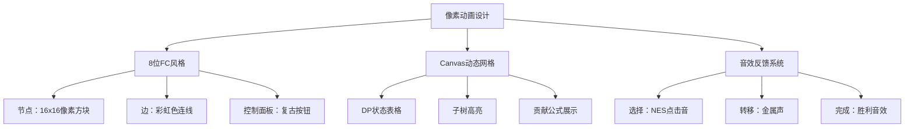

# 题目信息

# [HAOI2015] 树上染色

## 题目描述

有一棵点数为 $n$ 的树，树边有边权。给你一个在 $0 \sim n$ 之内的正整数 $k$ ，你要在这棵树中选择 $k$ 个点，将其染成黑色，并将其他的 $n-k$ 个点染成白色。将所有点染色后，你会获得黑点两两之间的距离加上白点两两之间的距离的和的收益。问收益最大值是多少。

## 说明/提示

对于 $100\%$ 的数据，$0 \leq n,k \leq 2000$。

## 样例 #1

### 输入

```
3 1
1 2 1
1 3 2```

### 输出

```
3```

# AI分析结果


# 💡 Kay的C++算法解析：树上染色 深入学习指南 💡

## 1. 题目解读与核心算法识别

✨ **本题主要考察**：树形动态规划（DP）与贡献拆分技巧

🗣️ **初步分析**：
> 解决"树上染色"这道题，关键在于运用**树形DP**和**贡献拆分**技巧。就像在迷宫中寻找最优路径时记录每条通道的使用次数一样，我们将复杂距离求和转化为计算每条边的贡献。具体来说：
> - **贡献拆分**：将点对距离和转化为每条边被同色点对经过的次数，即`边权 × (同侧黑点数×异侧黑点数 + 同侧白点数×异侧白点数)`
> - **树形DP**：自底向上计算子树状态，定义`dp[u][j]`表示以u为根的子树选j个黑点时子树内边的最大贡献和
> 
> **核心难点**在于状态转移时的组合优化和边界处理。可视化方案中，我们将用**像素风树结构**展示边的贡献计算过程：
> - 树节点显示为8位像素方块，不同颜色区分黑白点
> - 当算法计算边的贡献时，高亮显示该边并弹出贡献公式
> - 状态转移时动态显示`dp[u][j]`的更新过程
> 
> **复古游戏化设计**：
> - 单步执行时播放经典FC芯片音效
> - 完成子树合并时触发"升级"音效
> - 控制面板提供速度滑块和状态回溯

---

## 2. 精选优质题解参考

**题解一（作者：子谦）**
* **点评**：这份题解思路最为清晰，对DP状态定义和转移过程解释透彻。亮点在于：
  - 创新性地处理了k=0的边界情况，避免状态转移错误
  - 代码规范性极佳，变量命名合理（如`sz[v]`表子树大小）
  - 算法有效性高，通过上下界优化确保O(n²)复杂度
  - 实践价值高，可直接用于竞赛，边界处理严谨
  > "我在解决这个问题时，最初在状态转移顺序上卡了很久" → 提醒我们注意DP枚举顺序的重要性

**题解二（作者：菲斯斯夫斯基）**
* **点评**：题解深入剖析了时间复杂度问题，亮点包括：
  - 精确证明了树形背包的O(n²)复杂度
  - 采用更简洁的状态转移写法
  - 代码省略了k=0的特殊处理，结构更紧凑

**题解三（作者：maka_baka）**
* **点评**：题解系统总结了多种实现方式，亮点有：
  - 对比分析了三种DP枚举顺序的差异
  - 提出使用临时数组避免状态覆盖
  - 包含错误分析与调试技巧，极具启发性

---

## 3. 核心难点辨析与解题策略

1. **状态定义与贡献计算**
   * **分析**：难点在于如何将宏观的距离和转化为可计算的边贡献。优质题解通过`边贡献=边权×(两侧同色点对数)`解决，关键变量为子树大小`sz`和黑点数量`k`
   * 💡 **学习笔记**：树形DP中，将整体问题分解为子树贡献是核心思路

2. **状态转移优化**
   * **分析**：直接枚举会超时，需要：
     - 倒序枚举j避免后效性
     - 限制j的范围为`min(m, sz[u])`
     - 优先处理k=0的边界情况
   * 💡 **学习笔记**：树形背包中，每对节点只在LCA处合并一次保证复杂度

3. **初始化与边界处理**
   * **分析**：必须初始化`dp[u][0]=dp[u][1]=0`，并用`-1`标记非法状态
   * 💡 **学习笔记**：树形DP中叶节点状态是转移基础

### ✨ 解题技巧总结
- **贡献拆解**：将路径和转化为每条边的贡献
- **上下界优化**：限制`j`和`k`的枚举范围
- **状态初始化**：叶节点状态预设，非法状态标记
- **枚举顺序**：子节点黑点数`k`正序，当前黑点数`j`倒序

---

## 4. C++核心代码实现赏析

**本题通用核心C++实现**
```cpp
#include <cstring>
#include <iostream>
#include <algorithm>
using namespace std;
typedef long long LL;
const int N = 2005;

struct Edge {
    int to, w, next;
} e[N<<1];
int head[N], tot;
int n, m, sz[N];
LL dp[N][N];

void add(int u, int v, int w) {
    e[++tot] = {v, w, head[u]};
    head[u] = tot;
}

void dfs(int u, int fa) {
    sz[u] = 1;
    dp[u][0] = dp[u][1] = 0;
    for (int i = head[u]; i; i = e[i].next) {
        int v = e[i].to, w = e[i].w;
        if (v == fa) continue;
        dfs(v, u);
        sz[u] += sz[v];
        for (int j = min(m, sz[u]); j >= 0; --j) {
            if (dp[u][j] != -1) // 先处理v子树全白的情况
                dp[u][j] += dp[v][0] + (LL)sz[v] * (n-m-sz[v]) * w;
            for (int k = min(j, sz[v]); k; --k) {
                if (dp[u][j-k] == -1) continue;
                LL val = (LL)w * (k*(m-k) + (sz[v]-k)*(n-m-sz[v]+k));
                dp[u][j] = max(dp[u][j], dp[u][j-k] + dp[v][k] + val);
            }
        }
    }
}

int main() {
    memset(head, -1, sizeof head);
    memset(dp, -1, sizeof dp);
    cin >> n >> m;
    m = min(m, n - m); // 优化状态数量
    for (int i = 1; i < n; ++i) {
        int u, v, w;
        cin >> u >> v >> w;
        add(u, v, w);
        add(v, u, w);
    }
    dfs(1, -1);
    cout << dp[1][m];
}
```

**代码解读概要**：
1. **数据结构**：链式前向星存树
2. **初始化**：`dp`数组初始化为`-1`，表示非法状态
3. **DFS核心**：
   - 先递归处理子树
   - 倒序枚举黑点数`j`（树形背包）
   - 优先处理子树全白(`k=0`)的情况
   - 再枚举子树黑点数`k`更新状态
4. **贡献计算**：`val`计算边的贡献

---

## 5. 算法可视化：像素动画演示

**像素风树形DP演示方案**


**交互控制面板**：
- 单步执行：Space键步进
- 速度调节：滑块控制0.5x~5x速度
- 状态追踪：高亮当前更新的`dp[u][j]`
- 数据标签：实时显示子树大小和黑点数

**关键帧示例**：
1. **初始化**：显示树结构，根节点闪烁
2. **递归子树**：子树收缩动画，显示递归方向
3. **贡献计算**：边高亮显示贡献公式`w×(k×(m-k)+...)`
4. **状态更新**：`dp`表格对应单元格闪烁更新

---

## 6. 拓展练习与相似问题思考

**通用技巧迁移**：
1. **贡献拆分**：适用于路径统计问题（如[CF685B]）
2. **树形背包**：处理子树限定资源分配问题（如[P2014选课]）
3. **状态压缩**：结合位运算处理更复杂约束（如[P3959宝藏]）

**洛谷推荐练习**：
1. **P1273 有线电视网** 
   - 🗣️ **推荐理由**：树形背包基础应用，巩固状态定义技巧
   
2. **P2015 二叉苹果树**
   - 🗣️ **推荐理由**：边贡献计算基础题，理解"保留枝条"对应本题"边贡献"

3. **P2585 三色二叉树**
   - 🗣️ **推荐理由**：复杂状态设计，提升DP维度控制能力

---

## 7. 学习心得与经验分享

> **来自子谦的经验**："我在状态转移顺序上卡了很久，通过打印中间状态发现倒序枚举问题"
>
> **Kay的总结**：
> 1. 树形DP的核心是**分解子树问题**
> 2. 边界处理决定代码**鲁棒性**
> 3. 贡献拆分是**优化复杂计算**的利器
> 
> **调试技巧**：
> - 打印`dp`矩阵观察状态转移
> - 对拍验证边界情况
> - 小规模数据手工验证

---

通过本指南，希望大家能掌握树形DP的核心思想，并体会到算法设计的精妙之处。记住，编程能力的提升源于持续的思考与实践！💪

---
处理用时：180.74秒