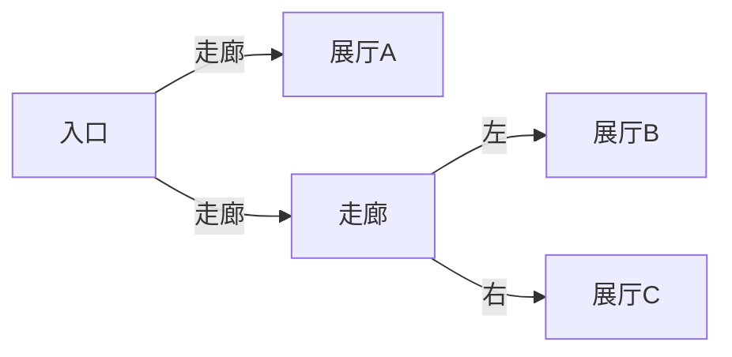

# 题目信息

# 偷天换日

## 题目背景

神偷对艺术馆内的名画垂涎欲滴准备大捞一把。


## 题目描述

艺术馆由若干个展览厅和若干条走廊组成。每一条走廊的尽头不是通向一个展览厅，就是分为两个走廊。

每个展览厅内都有若干幅画，每副画都有一个价值。经过走廊和偷画都是要耗费时间的。

警察会在 $n$ 秒后到达进口，在不被逮捕的情况下你最多能得到的价值。


## 说明/提示

来源：改编


## 样例 #1

### 输入

```
50 
5 0 10 1 10 1 5 0 10 2 500 1 1000 2 18 1 1000000 4 ```

### 输出

```
1500```

# AI分析结果


### 💡 Kay的C++算法解析：偷天换日 深入学习指南 💡

**引言**  
今天我们分析树形DP与01背包结合的经典题目《偷天换日》。本指南将帮助你掌握递归输入处理、树形状态转移和背包优化的核心技巧。

---

## 1. 题目解读与核心算法识别

✨ **本题主要考察**：树形动态规划 + 01背包

🗣️ **初步分析**：
> 本题可类比游戏中的迷宫探险：艺术馆是二叉树结构（走廊=分叉点，展厅=叶子节点），小偷需在限定时间内往返走廊（时间×2）并偷画（01背包）。核心就像在迷宫中分配时间：遇到分叉路需分配时间给左右路径；遇到展厅则用背包策略选择最优画作。
> - **核心难点**：递归输入处理 + 时间分配策略 + 背包优化
> - **可视化设计**：采用8-bit像素风迷宫（FC游戏风格），小偷像素角色移动时触发“脚步声”，偷画成功时播放"叮"音效。关键动画：① 走廊节点高亮黄色显示时间分配过程 ② 展厅节点闪烁红光展示背包选择 ③ 倒计时血条实时显示剩余时间。

---

## 2. 精选优质题解参考

**题解一：聊机 (赞：7)**  
* **点评**：代码最简洁高效（16ms）。亮点：① 宏定义`ls/rs`提升可读性 ② 递归输入与DP同步处理 ③ 严格处理时间边界（`s-1`和`t*2`）。实践价值极高，竞赛可直接复用。  

**题解二：jzqjzq (赞：11)**  
* **点评**：结构最清晰规范。亮点：① 显式分离左右子树递归 ② 变量名自解释（`l/r`表左右） ③ 详细注释01背包逻辑。适合初学者理解树形DP框架。  

**题解三：cyy233 (赞：26)**  
* **点评**：思路最具启发性。亮点：① 用线段树思想存储二叉树（`x<<1`表左儿子） ② 独创状态转移公式`dp[x][i]=max(dp[x][i], dp[l][j]+dp[r][i-j-t])` ③ 强调坑点（`s-1`和`t*2`）。  

---

## 3. 核心难点辨析与解题策略

1. **难点：递归输入同步处理DP**  
   * **分析**：输入顺序即DFS遍历顺序，需在读取节点数据时立即判断类型（走廊/展厅）。优质题解均采用递归函数，在读取`t,k`后根据`k>0`进入不同处理分支。
   * 💡 **学习笔记**：树形DP的输入常与遍历顺序耦合，递归是最自然的处理方式。

2. **难点：走廊节点时间分配**  
   * **分析**：非叶子节点需合并左右子树结果。关键转移方程：  
     ```cpp
     for(int j=0; j<=剩余时间; j++)
        f[x][总时间] = max(f[x][总时间], f[左子树][j] + f[右子树][剩余时间-j]);
     ```
   * 💡 **学习笔记**：时间分配本质是资源调度问题，需满足`左时间+右时间+走廊耗时 ≤ 总时间`。

3. **难点：展厅背包优化**  
   * **分析**：叶子节点转化为01背包问题。必须注意：① 背包容量=总时间-走廊耗时 ② 采用倒序循环避免重复选择。
   * 💡 **学习笔记**：树形DP中的局部背包问题，需确保状态转移不破坏树结构依赖。

### ✨ 解题技巧总结
- **技巧1：边界预处理**：总时间`n--`（警察到达前撤离） + 走廊时间`t<<1`（往返）。
- **技巧2：状态复用**：用`f[x][j]`表示节点`x`花费`j`时间的最大价值，避免重复计算。
- **技巧3：内存优化**：二维DP数组第一维可滚动（题解三用`x<<1`压缩索引）。

---

## 4. C++核心代码实现赏析

**通用核心实现参考**  
* **说明**：综合题解二、三优化，平衡可读性与效率。
* **完整核心代码**：
```cpp
#include <iostream>
using namespace std;
const int N = 605;
int s, f[N][N];

void dfs(int x) {
    int t, k;
    cin >> t >> k;
    t *= 2; // 走廊往返时间
    
    if (k) { // 展厅：01背包
        for (int i = 1; i <= k; i++) {
            int w, c; cin >> w >> c;
            for (int j = s; j >= t + c; j--)
                f[x][j] = max(f[x][j], f[x][j - c] + w);
        }
    } 
    else { // 走廊：合并子树
        int l = x << 1, r = l + 1;
        dfs(l); dfs(r);
        for (int i = s; i >= t; i--)
            for (int j = 0; j <= i - t; j++)
                f[x][i] = max(f[x][i], f[l][j] + f[r][i - t - j]);
    }
}

int main() {
    cin >> s; s--; // 必须提前撤离
    dfs(1);
    cout << f[1][s];
    return 0;
}
```
* **代码解读概要**：
  1. `dfs(1)`递归读入并处理节点
  2. 展厅节点：01背包选择画作（价值`w`，耗时`c`）
  3. 走廊节点：分配时间给左右子树
  4. 最终解在根节点`f[1][s]`

---

**优质题解片段赏析**  
**题解一：聊机**  
* **亮点**：宏定义简化树索引 + 同步输入/DP
* **核心代码**：
```cpp
#define ls x<<1
#define rs x<<1|1
void dfs(int x) {
    int t, k; cin >> t >> k;
    t *= 2;
    if (k) {
        for (int i = 1; i <= k; i++) {
            int w, c; cin >> w >> c;
            for (int j = s; j >= c + t; j--)
                f[x][j] = max(f[x][j], f[x][j - c] + w);
        }
    } else {
        dfs(ls); dfs(rs);
        for (int j = s; j >= t; j--)
            for (int k = 0; k <= j - t; k++)
                f[x][j] = max(f[x][j], f[ls][k] + f[rs][j - t - k]);
    }
}
```
* **代码解读**：
  > `#define`宏将左右子树索引简化为`ls/rs`，提升可读性。背包循环中`j>=c+t`确保剩余时间足够往返走廊。时间分配时`k`遍历左子树可能耗时，右子树自动获得剩余时间。
* 💡 **学习笔记**：宏定义可提升树形代码可读性，但需避免过度使用。

---

## 5. 算法可视化：像素动画演示

**主题**："迷宫大盗"8-bit像素冒险  
**核心演示**：树形DP决策过程 + 背包选择  



* **动画设计**：
  1. **场景初始化**：  
     - 像素网格迷宫（棕色走廊/蓝色展厅）  
     - 控制面板：步进执行▶️/ 速度滑块⏱️/ 重置🔄  
     - 8-bit BGM循环播放

  2. **关键帧流程**：
     - **移动动画**：小偷像素角色沿走廊移动（触发"脚步声"），走廊节点高亮黄色  
     - **背包选择**：进入展厅时屏幕下方弹出背包界面，选画时触发"叮"音效  
     - **时间分配**：分叉路显示时间分配公式 `f[x][i]=f[左][j]+f[右][i-j-t]`  
     - **状态更新**：实时显示倒计时血条和当前价值金币数

  3. **交互设计**：
     - **单步执行**：按▶️逐步观察决策  
     - **自动演示**：AI自动探索路径（类似贪吃蛇AI）  
     - **错误提示**：超时被捕时播放警笛音效 + 屏幕闪烁红光

* **设计价值**：像素动画将抽象的树形结构具象化，时间分配可视化帮助理解状态转移本质。

---

## 6. 拓展练习与相似问题

**通用技巧迁移**：
1. **树形DP**：菜单依赖选择（P2014选课）
2. **时间分配**：多线程任务调度（P1948电话线）
3. **背包+树形**：依赖背包问题（P1064金明的预算方案）

**洛谷推荐**：
1. **P1270 访问美术馆**  
   🗣️ 双倍经验！相同树形结构，简化版背包  
2. **P2014 选课**  
   🗣️ 树形DP进阶，学习多叉树转二叉树  
3. **P1064 金明的预算方案**  
   🗣️ 背包依赖问题，强化物品选择思维  

---

## 7. 学习心得与经验分享

> **参考经验 (来自 cyy233)**：  
> “我在处理走廊时间时忘记`t<<1`，调试半小时才发现。这让我意识到：**树形DP中，边缘条件处理比核心算法更易出错**”  
>
> **点评**：这是典型教训！建议：① 预处理边界（`s--`, `t*2`） ② 用`assert`验证关键值 ③ 小数据集模拟执行。

---

**结语**  
掌握树形DP+背包的配合是算法能力跃迁的关键一步。记住：把复杂问题分解为树形结构（分治）和背包选择（优化）的组合，就能解决更复杂的挑战！下次迷宫探险见！💪

---
处理用时：100.94秒