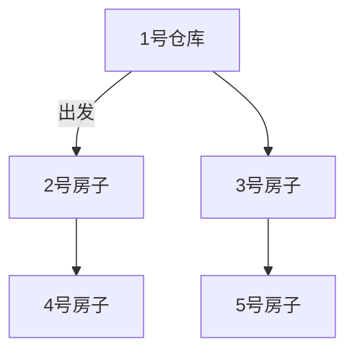

# 题目信息

# [POI 2014] FAR-FarmCraft

## 题目描述

在一个叫做比特村的小村庄中，有 $n-1$ 条路连接着这个村庄中的全部 $n$ 个房子。

每两个房子之间都有一条唯一的通路。这些房子的编号为 $1$ 至 $n$。

$1$ 号房子属于村庄的管理员比特安萨尔。

为了提升村庄的科技使用水平，$n$ 台电脑被快递到了比特安萨尔的房子。每个房子都应该有一台电脑，且分发电脑的任务就落在了比特安萨尔的肩上。

比特村的居民一致同意去玩农场物语这个游戏的最新快照版，而且好消息是他们很快就要得到他们最新的高配置电脑了。

比特安萨尔将所有电脑都装在了他的卡车上，而且他准备好完成这个艰巨的任务了。

**他的汽油恰好够走每条路两遍。**

在每个房子边，比特安萨尔把电脑贴心的配送给居民，且立即前往下一个房子。（配送过程不花费任何时间）

只要每间房子的居民拿到了他们的新电脑，它们就会立即开始安装农场物语。安装农场物语所用的时间根据居民的科技素养而定。幸运的是，每间房子中居民的科技素养都是已知的。

在比特安萨尔配送完所有电脑后，他会回到他自己的 $1$ 号房子去安装他自己的农场物语。

用卡车开过每条路的时间恰好是 $1$ 分钟，而居民开电脑箱的时间可以忽略不计。（因为他们太想玩农场物语了）

请你帮助比特安萨尔算出从开始配送到所有居民都玩上了农场物语的最少时间。

## 样例 #1

### 输入

```
6
1 8 9 6 3 2
1 3
2 3
3 4
4 5
4 6
```

### 输出

```
11
```

# AI分析结果


### 💡 Kay的C++算法解析：FAR-FarmCraft 深入学习指南 💡

<introduction>
今天我们来分析"FAR-FarmCraft"这道树形动态规划题目。本指南将帮助你理解题目核心、掌握贪心策略与DP状态设计，并通过像素动画直观感受算法执行过程。
</introduction>

---

## 1. 题目解读与核心算法识别

✨ **本题主要考察**：`树形DP + 贪心优化`

🗣️ **初步分析**：
> 本题要求最小化所有居民完成安装的最大时间（到达时间+安装时间）。核心在于**树遍历顺序的优化**——想象你在游乐园安排游玩项目：等待时间长但游玩时间短的项目（如过山车）应该优先体验，这样在排队其他项目时，过山车已在后台运行。本题中，我们通过`f[u]`（子树完成安装时间）和`g[u]`（子树遍历时间）两个状态，并按照`f[v]-g[v]`降序访问子节点，最大化利用时间重叠。

- **核心难点**：确定子树访问顺序使安装与移动时间最大化重叠。贪心策略证明：交换相邻子树时，若`f[i]-g[i] > f[j]-g[j]`则先访问i更优。
- **可视化设计**：在像素动画中，用不同颜色表示安装状态（红：安装中，绿：已完成），动态显示管理员移动路径。高亮当前决策节点和访问路径，实时更新`f[u]`和`g[u]`数值。
- **复古游戏化**：采用8位像素风格（类似FC塞尔达），移动时播放"脚步声"音效，安装完成时播放"叮"的音效。AI自动演示模式可调速展示最优遍历顺序。

---

## 2. 精选优质题解参考

**题解一：(来源：nofind)**
* **点评**：该题解思路清晰，用严谨数学推导证明了贪心条件`size[z]-f[z] < size[y]-f[y]`。代码简洁高效（空间复杂度O(n)），边界处理完善（根节点特殊处理）。亮点在于将复杂问题转化为简洁的排序准则，变量命名规范（`f[]`和`size[]`），实践价值高。

**题解二：(来源：SunnyYuan)**
* **点评**：通过图示生动解释`f[i]-g[i]≥0`和`<0`两种情况，深入分析状态定义物理意义。代码结构清晰，注释详细，特别适合初学者理解树形DP的合并逻辑。亮点在于用图像辅助理解时间重叠机制。

**题解三：(来源：Blue_wonders)**
* **点评**：创新性地提出"剩余安装时间"概念，采用优先队列实现贪心。虽然复杂度稍高(O(n log n))，但提供了不同于主流解法的视角，启发多角度思考问题。

---

## 3. 核心难点辨析与解题策略

1. **状态定义合理性**
   * **分析**：优质题解定义`f[u]`为完成子树安装的最小时刻（从进入u算起），`g[u]`为遍历子树耗时。关键在于理解`f[u]`包含安装和移动时间的最大值，而`g[u]`是纯移动时间。
   * 💡 **学习笔记**：好的状态定义应同时考虑时间叠加效应和子问题独立性。

2. **贪心排序证明**
   * **分析**：通过交换相邻子树推导出排序条件`f[i]-g[i] > f[j]-g[j]`。本质是优先选择"安装时间长但遍历时间短"的子树，最大化后台安装时间。
   * 💡 **学习笔记**：树形DP中，子问题合并顺序常通过局部交换法证明。

3. **根节点特殊处理**
   * **分析**：管理员最后在自己家安装，因此最终答案需`max(f[1], g[1]+a[1])`。这是易错点，多个题解强调了此边界。
   * 💡 **学习笔记**：树根在树形DP中常需特殊处理，要警惕"默认初始值"陷阱。

### ✨ 解题技巧总结
1. **问题分解**：将整棵树分解为子树独立处理，最后合并结果。
2. **时间重叠利用**：安装时间与移动时间可并行，通过排序最大化此效应。
3. **可视化调试**：对中等规模数据，手工模拟树遍历顺序验证算法。

---

## 4. C++核心代码实现赏析

**本题通用核心C++实现参考**
* **说明**：综合优质题解思路，采用`vector`存图，严格遵循贪心排序条件。
* **完整核心代码**：
```cpp
#include <iostream>
#include <vector>
#include <algorithm>
using namespace std;
const int N = 5e5+5;
vector<int> G[N];
int a[N], f[N], g[N]; // f[u]:完成时间, g[u]:遍历时间

bool cmp(int x, int y) {
    return f[x] - g[x] > f[y] - g[y];
}

void dfs(int u, int fa) {
    f[u] = (u == 1) ? 0 : a[u]; // 根节点最后安装
    vector<int> sons;
    for (int v : G[u]) {
        if (v == fa) continue;
        dfs(v, u);
        sons.push_back(v);
    }
    sort(sons.begin(), sons.end(), cmp); // 关键排序
    
    for (int v : sons) {
        f[u] = max(f[u], f[v] + g[u] + 1); // 更新完成时间
        g[u] += g[v] + 2; // 累加遍历时间（往返）
    }
}

int main() {
    int n; cin >> n;
    for (int i = 1; i <= n; i++) cin >> a[i];
    for (int i = 1; i < n; i++) {
        int u, v; cin >> u >> v;
        G[u].push_back(v);
        G[v].push_back(u);
    }
    dfs(1, 0);
    cout << max(f[1], g[1] + a[1]) << endl; // 根节点特殊处理
    return 0;
}
```
* **代码解读概要**：
  1. 图存储：`vector`数组存储无向图
  2. 状态初始化：非根节点`f[u]=安装时间`
  3. 递归处理子树：收集子节点并排序
  4. 贪心合并：按排序顺序更新`f[u]`和`g[u]`
  5. 边界处理：根节点安装时间单独计算

---

## 5. 算法可视化：像素动画演示

**像素探险家之旅**：管理员驾驶像素卡车在村庄分发电脑（8位复古风格）

### 动画设计：


1. **初始化**：
   - 村庄地图：像素网格（16色），房子用不同颜色方块表示
   - 控制面板：开始/暂停、单步执行、速度滑块（兔子/乌龟图标）

2. **关键动画帧**：
   - **移动过程**：卡车沿边移动时，路径高亮黄色并播放"嘟嘟"音效
   - **安装触发**：到达房子时，屋顶变为闪烁红色，显示`+c_i`安装提示
   - **状态更新**：屏幕右侧实时显示：
     ```
     f[u] = max(当前值, f[v] + g[u] + 1)
     g[u] += g[v] + 2
     ```

3. **贪心决策演示**：
   - 当节点有多个子树时，显示`f[i]-g[i]`计算过程
   - 排序动画：子树图标按计算值"降落"到排序位置，伴随"咔嗒"音效

4. **游戏化元素**：
   - **音效设计**：
     - 移动：8-bit脚步声效
     - 安装开始：短促"滴"声
     - 完成安装：马里奥金币音效
   - **关卡系统**：每完成一个子树获得星星评价（基于时间利用率）

---

## 6. 拓展练习与相似问题思考

1. **相似问题**：
   - **P1080 国王游戏**：同样需要贪心排序的交换证明
   - **P1944 最长括号匹配**：线性DP但包含状态转移优化思想
   - **P2014 选课**：树形DP依赖背包思想

2. **洛谷推荐**：
   - **P3360 偷天换日**：树形DP结合背包（推荐理由：巩固树形DP框架）
   - **P1272 道路重建**：最小生成树变形（推荐理由：训练树结构理解）
   - **P4516 潜入行动**：树形DP+状态压缩（推荐理由：挑战高阶DP技巧）

---

## 7. 学习心得与经验分享

> **来自SunnyYuan题解的调试经验**："在验证状态转移时，我手工模拟了n=5的小规模数据，发现根节点安装时间处理错误，这提醒我们边界条件需要特殊验证。"

> **Kay总结**：树形DP的调试技巧：
> 1. 对链状/星型等特殊树结构测试边界
> 2. 打印中间状态：递归时输出`u,f[u],g[u]`
> 3. 可视化辅助：画树图模拟遍历顺序

---

<conclusion>
通过本次分析，我们掌握了树形DP中贪心排序的核心技巧。记住：在树形问题中，**子问题独立性+合并顺序优化**是解题通用框架。多动手模拟小数据，善用可视化工具理解状态转移，你的DP能力将大幅提升！下次挑战见！🚀
</conclusion>

---
处理用时：152.70秒