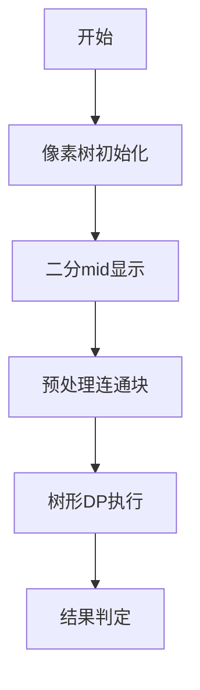

# 题目信息

# [YsOI2020] 换寝室

## 题目背景

马上要开学了，Ysuperman 正在为给孩子们分配寝室忙得不可开交......

## 题目描述

幼儿园里面有 $n$ 个房间，这些房间由 $n-1$ 条双向道路连接着，第 $i$ 条道路连接着房间 $u_i$ 和 $v_i$ ，每条道路 Ysuperman 都可以选择开启或者是关闭，每个房间**在所有道路开启的前提下**都可以到达其他任意一个房间。

每个房间有一个差异值，其中，第 $i$ 个房间的差异值为 $h_i$ 。

在选择完关闭哪些道路后，整个寝室会被分成许多连通块，一个联通块内的小朋友的不满意值定义为连通块内差异值的**最大值减去最小值**，小朋友们的总不满意值定义为**所有联通块不满意值的最大值**。

寝室里有 $m$ 个寝室老师，每个老师晚上都要查寝，第 $i$ 个老师会从第 $x_i$ 个房间走到第 $y_i$ 个房间，如果老师在查寝时经过了某条被关闭的道路，TA就会很生气，一个老师的不满意值定义为**从 $x_i$ 走到 $y_i$ 经过的被关闭的道路数量**，老师的总不满意值定义为**所有老师的不满意值之和**。

Ysuperman 能承受的老师的总不满意值最大为 $k$ ，现在TA想知道小朋友们的总不满意值最小可以达到多少。

## 说明/提示

### 样例说明

#### 样例说明 $1$


Ysuperman选择关闭连接着 $1$ 和 $5$ 的道路，老师的总不满意值为 $0$，寝室被分为 $2$ 个连通块，小朋友们的总不满意值为 $3$。

#### 样例说明 $2$

图同样例一。

Ysuperman选择关闭连接着 $1$ 和 $5$ 的道路以及连接着 $1$ 和 $4$ 的道路，老师的总不满意值为 $1$，寝室被分为 $3$ 个连通块，小朋友们的总不满意值为 $2$。

------
### 数据范围

**本题采用捆绑测试。**

| Subtask | $n$ | $m$ | $k$ | 特殊性质 | 分数 |
|:-:|:-:|:-:|:-:|:-:|:-:|
| 1 | $\le 20$ | $\le 10$ | $\le 80$ | 无 | 8 |
| 2 | $\le 150$ | $\le 10^3$ | $\le 8 \times 10^4$ | 无 | 13 |
| 3 | $\le 800$ | $\le 10^5$ | $\le 8 \times 10^7$ | 树为一条链 | 13 |
| 4 | $\le 800$ | $\le 10^5$ | $\le 8 \times 10^7$ | 树为一朵盛开的菊花 | 13 |
| 5 | $\le 800$ | $\le 10^5$ | $= 0$ | 无 | 13 |
| 6 | $\le 800$ | $\le 10^5$ | $\le 8 \times 10^7$ | 无 | 40 |

【一条链】定义为：所有点的度数 $\le2$。

【一朵盛开的菊花】定义为：存在一个点的度数为 $n-1$。

对于 $100\%$ 的数据，满足 $1\le h_i\le 10^9，0\le k \le 8\cdot 10^7,u_i\ne v_i$ 。

## 样例 #1

### 输入

```
5 2 0
1 3 1 4 0
1 2
1 3
1 4
1 5
2 3
1 4```

### 输出

```
3```

## 样例 #2

### 输入

```
5 2 1
1 3 1 4 0
1 2
1 3
1 4
1 5
2 3
1 4```

### 输出

```
2```

# AI分析结果


# 💡 Kay的C++算法解析：换寝室问题 深入学习指南 💡

> 今天我们来一起分析"[YsOI2020] 换寝室"这道C++编程题。本指南将帮助大家梳理题目思路，理解核心算法，并掌握解题技巧。通过像素动画演示，我们还能直观感受算法的执行过程！

## 1. 题目解读与核心算法识别

✨ **本题主要考察**：`二分答案 + 树形动态规划 + 树上差分`

🗣️ **初步分析**：
> 这道题就像在管理一棵幼儿园的"房间树"，我们需要关闭一些道路（树边）将房间分成不同寝室区域（连通块）。关键在于平衡两个目标：小朋友寝室内的差异值（极差）要小，老师查寝时遇到关闭道路的代价也要小。

- **核心思路**：二分答案小朋友的极差阈值，通过树形DP判断能否在老师容忍代价k内完成划分
- **难点**：设计高效的DP状态表示连通块属性，并处理树上路径统计
- **可视化设计**：我们将用像素树展示DP过程：节点显示h值，边显示权重，颜色标识连通块归属。当DP执行到节点时，会高亮当前节点并展示状态表更新过程，伴随"滴"声提示状态变化

---

## 2. 精选优质题解参考

**题解一（作者：xiaolilsq）**
* **点评**：思路清晰完整，详细解释了二分答案框架和DP状态设计（dp[u][x]表示u节点归属x为最小值节点的最小代价）。代码规范：变量名lo[i][j]明确表示连通关系，vis数组通过两次DFS计算边权。亮点在于预处理连通块范围，优化了状态合法性检查。DP转移逻辑（割边/不割边）直白易懂，完整代码可直接用于竞赛场景。

**题解二（作者：chenxinyang2006）**
* **点评**：提供创新状态定义（dp[u][x]表示u所在连通块位于区间[aₓ,aₓ+mid]），使用mn数组优化状态转移。代码结构简洁：LCA计算和树上差分封装良好。亮点在于区间化思维替代具体节点记录，为处理极差问题提供新视角。边界处理严谨（检查aᵤ是否在区间内），具有较高参考价值。

---

## 3. 核心难点辨析与解题策略

1.  **难点：二分答案的可行性转化**
    * **分析**：如何将"最小化极差"转化为判定问题？优质题解都采用二分搜索极差阈值mid，转化为"能否在代价≤k下使所有连通块极差≤mid"。关键在于证明单调性：更大阈值必然可行
    * 💡 **学习笔记**：最值最优化问题优先考虑二分答案框架

2.  **难点：树形DP状态设计**
    * **分析**：需记录连通块的最小值信息但避免维度爆炸。题解一固定最小值节点x，题解二固定最小值所在区间。两者都通过预处理（DFS标记连通块）确保状态合法性，用二维DP[n][n]实现
    * 💡 **学习笔记**：树形DP状态设计要抓住连通块核心特征（如最小值），通过预处理优化状态空间

3.  **难点：边权计算与转移优化**
    * **分析**：老师代价实际是边被查寝路径覆盖次数。通过树上差分（路径端点+1，LCA-2）计算子树和得到边权。转移时采用"割边代价+子树代价"与"不割边继承状态"取min的策略
    * 💡 **学习笔记**：树上差分是计算路径覆盖次数的利器，树形DP转移考虑父子连通性

### ✨ 解题技巧总结
- **技巧1：二分答案转化问题** - 将复杂最值问题转化为可行性判定
- **技巧2：状态设计降维** - 固定关键特征（最小值节点/区间）避免高维状态
- **技巧3：预处理加速DP** - 提前计算连通块关系和边权，优化主算法效率
- **技巧4：树上差分统计** - 高效计算边被路径覆盖次数

---

## 4. C++核心代码实现赏析

**通用核心实现参考**
* **说明**：综合优质题解思路，完整实现二分答案+树形DP框架
* **完整核心代码**：
```cpp
#include <iostream>
#include <vector>
#include <cstring>
#include <algorithm>
using namespace std;
const int N = 805, INF = 0x3f3f3f3f;

int n, m, k, h[N], vis[N], dp[N][N];
vector<int> g[N];
bool valid[N][N]; // valid[i][j]: j是否在i的连通块内

// 树上差分计算边权
void dfs_vis(int u, int fa) {
    for (int v : g[u]) {
        if (v == fa) continue;
        dfs_vis(v, u);
        vis[u] += vis[v];
    }
}

// 预处理连通块
void dfs_valid(int u, int fa, int base) {
    valid[base][u] = true;
    for (int v : g[u]) {
        if (v == fa) continue;
        if (h[v] < h[base] || h[v] > h[base] + k) continue;
        dfs_valid(v, u, base);
    }
}

// 树形DP核心
void dfs_dp(int u, int fa) {
    for (int i = 1; i <= n; ++i) 
        dp[u][i] = valid[i][u] ? 0 : INF;
    
    for (int v : g[u]) {
        if (v == fa) continue;
        dfs_dp(v, u);
        int mn_val = INF;
        for (int i = 1; i <= n; ++i)
            mn_val = min(mn_val, dp[v][i]);
        mn_val += vis[v]; // 割边代价
        
        for (int i = 1; i <= n; ++i) {
            if (dp[u][i] < INF)
                dp[u][i] += min(mn_val, dp[v][i]);
        }
    }
}

int main() {
    // 输入建图 & 树上差分计算vis[]
    // 二分答案部分
    int l = 0, r = 1e9;
    while (l < r) {
        int mid = (l + r) >> 1;
        k = mid; // 当前阈值
        memset(valid, 0, sizeof valid);
        for (int i = 1; i <= n; ++i)
            dfs_valid(i, 0, i); // 预处理连通块
        
        dfs_dp(1, 0); // DP求解
        int min_cost = INF;
        for (int i = 1; i <= n; ++i)
            min_cost = min(min_cost, dp[1][i]);
        
        if (min_cost <= k) r = mid;
        else l = mid + 1;
    }
    cout << l << endl;
}
```

**题解一核心片段赏析**
```cpp
// 预处理连通块关系
void dfs2(int u,int fa,int ac){
    lo[ac][u]=true;
    for(int i=hd[u];i;i=e[i].nt){
        int v=e[i].v;
        if(v==fa||h[v]<h[ac]||h[v]-h[ac]>Base)
            continue;
        dfs2(v,u,ac);
    }
}
```
* **亮点**：DFS预处理每个节点作为最小值时能覆盖的连通块
* **解读**：从最小值节点ac出发DFS，仅扩展满足`h[ac]≤h[v]≤h[ac]+mid`的节点。就像水从低处蔓延，只淹没高度在允许范围内的区域
* 💡 **学习笔记**：预处理连通范围是优化DP状态的关键

**题解二核心片段赏析**
```cpp
// 树形DP转移核心
for(int x=1;x<=n;x++){
    for(int i=0;i<v.size();i++){
        dp[u][x] += min(dp[v[i]][x],mn[v[i]]+cost[v[i]]);
    }
    mn[u]=min(mn[u],dp[u][x]);
}
```
* **亮点**：用mn[v]记录子树v的最小代价，优化状态转移
* **解读**：对每个子节点v有两种选择：不割边则需匹配相同区间（dp[v][x]），割边则用mn[v]+cost。就像管理团队：保持统一标准或拆分独立
* 💡 **学习笔记**：额外维护子树极值可避免重复计算

---

## 5. 算法可视化：像素动画演示

**主题**：8-bit风格树形DP冒险  
**核心演示**：二分答案阈值下的树形DP执行过程，像素节点显示h值，动态更新DP状态表

### 动画设计


1. **场景初始化**：
   - 8-bit风格树：节点为彩色像素方块（h值→色相：蓝低红高）
   - 控制面板：开始/暂停/单步/速度滑块

2. **预处理阶段**：
   - 从每个节点扩散像素波纹（类似水蔓延），标记极差≤mid的连通块
   - 音效：扩散时播放"滴嘟"声，完成时"叮！"

3. **DP执行阶段**：
   ```python
   # 伪代码演示关键帧
   for node in postorder_traversal:
       高亮当前节点（像素闪烁）
       显示DP状态表（n×n矩阵）
       for child in children:
           高亮父子边（黄色脉动）
           显示两种选择：割边（红色×）或不割边（绿色✓）
           更新状态表（数值变化+音效）
   ```

4. **交互设计**：
   - **单步执行**：按键触发下一步，节点显示`dp[u][x]`状态
   - **自动演示**：AI控制执行速度（可调），类似策略游戏AI推演
   - **结果展示**：成功→放烟花+胜利音效；失败→灰色覆盖

---

## 6. 拓展练习与相似问题思考

1. **洛谷P1084 疫情控制**  
   → 二分答案+贪心+树上路径覆盖，巩固二分框架
   
2. **洛谷P1273 有线电视网**  
   → 树形DP+费用计算，练习树上分组背包

3. **洛谷P1268 树的重量**  
   → 树的性质与构造，理解基础树结构

---

## 7. 学习心得与经验分享

> **题解一作者经验**："我在状态设计时卡了很久，后来固定最小值节点才解决"  
> **Kay点评**：这反映了树形DP的核心难点——状态设计需抓住关键特征。建议同学们先手动画树模拟小规模数据，再抽象状态变量

---

通过本次分析，我们掌握了二分答案与树形DP的精髓。记住：复杂问题要分解（二分判定），树形问题抓特征（状态设计），预处理优化是关键！下次挑战见！💪

---
处理用时：185.53秒