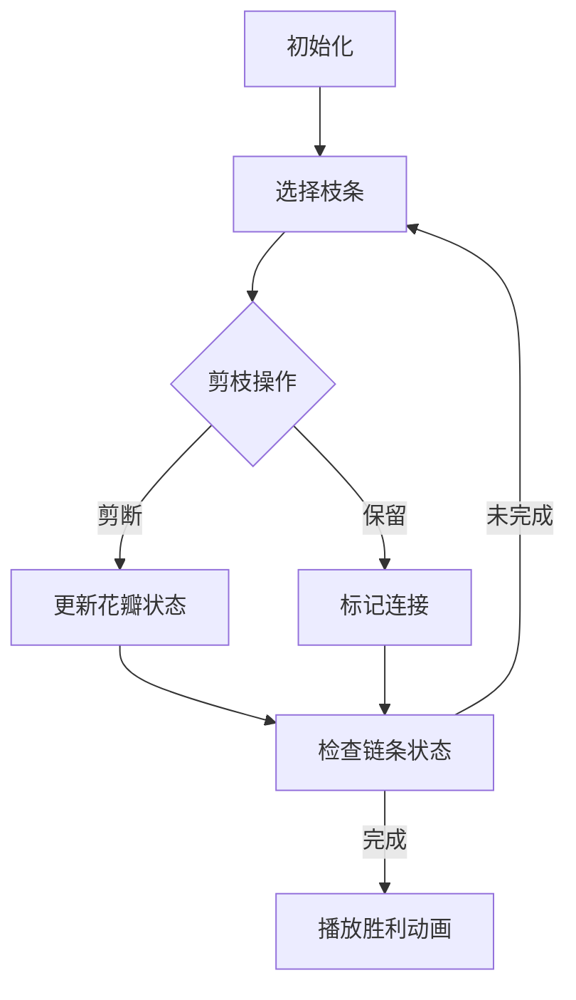

# 题目信息

# 无可奈何花落去

## 题目背景

天上下起了蒙蒙小雨，回家已是傍晚，推开院门，一地花瓣映入眼帘，随着最近几天花瓣的凋落，树上的花瓣已所剩无几。从地上捡起一片花瓣，干涩的双眼立刻充满了泪水，它顺着脸颊滑下。落到花上的，不知是雨还是泪......

## 题目描述

望向树上的花朵：一朵花有 $n$ 瓣花瓣，花瓣之间有 $n-1$ 条边连接，所有的花瓣都是连通的。

树上的花瓣随着春天的离开而凋落。具体地，每一天，都会在未断开的边中均匀随机地选择一条边断开。

当每个花瓣的度数均不超过 $2$ 时，我们称这朵花凋零了。

一朵花期望会在几天后凋零呢？

## 说明/提示

**【样例 1 解释】**

可以发现第一次不管断开哪条边，均会使这朵花凋零，故期望凋零时间为 $1$。

**【样例 2 解释】**

第一次断开 $(1,2)$ 或 $(2,4)$ 或 $(2,5)$，凋零时间为 $1$；第一次断开 $(1,3)$，凋零时间为 $2$。故期望凋零时间为 $\frac{3}{4}\times 1+\frac{1}{4}\times 2=\frac{5}{4}$。

**【数据规模与约定】**

**本题采用捆绑测试。**

-  Subtask 1（1 point）：$f_i=i-1$。
-  Subtask 2（12 points）：$n\leq 8$。
-  Subtask 3（12 points）：$n\leq 18$。
-  Subtask 4（8 points）：$f_i=1$。
-  Subtask 5（16 points）：有且仅有 $1$ 号点度数大于 $2$。
-  Subtask 6（13 points）：$n\leq 50$。
-  Subtask 7（13 points）：$n\leq 100$。
-  Subtask 8（13 points）：$n\leq 500$。
-  Subtask 9（12 points）：无特殊限制。

对于 $100\%$ 的数据，$1\le n\leq 5\times 10^3$，$f_i<i$。

## 样例 #1

### 输入

```
4
1 2 2```

### 输出

```
1```

## 样例 #2

### 输入

```
5
1 1 2 2```

### 输出

```
739246082```

## 样例 #3

### 输入

```
19
1 2 3 4 5 6 1 8 9 10 11 12 1 14 15 16 17 18```

### 输出

```
246415365```

## 样例 #4

### 输入

```
49
1 2 3 4 5 6 7 8 9 10 11 12 13 14 15 3 11 13 13 15 1 21 7 20 16 4 3 11 11 24 24 31 33 29 24 21 22 12 27 18 37 25 28 26 22 36 38 29```

### 输出

```
587033383```

# AI分析结果


# 💡 Kay的C++算法解析：无可奈何花落去 深入学习指南 💡

大家好，我是你们的C++算法导师Kay。今天我们将一起探索一道充满诗意的树形动态规划问题——**无可奈何花落去**。这道题看似文艺，实则蕴含了精妙的树形DP与概率期望知识。让我们一步步揭开它的神秘面纱吧！

---

## 1. 题目解读与核心算法识别

✨ **本题主要考察**：`树形动态规划` & `概率期望计算`

🗣️ **初步分析**：
> 这道题就像在观察一棵花树的花瓣凋零过程：每天随机断开一条树枝，当所有剩余花瓣都形成**链条状结构**（每个花瓣连接不超过2条边）时停止。我们需要计算期望的凋零天数。

- **动态规划核心思想**：想象你是一位园丁，需要记录每棵子树在不同修剪程度下的状态。我们使用三维DP数组`f[u][j][k]`表示：
  - `u`：当前子树根节点
  - `j`：已修剪的边数
  - `k`：根节点当前连接的边数（0/1/2）

- **可视化设计思路**：我们将设计一个**像素风园艺模拟器**：
  - 树结构显示为像素化枝条（棕色线条）和花瓣（彩色圆点）
  - 每次剪枝时，被剪枝条闪烁红色，花瓣状态实时更新
  - 关键变量`j`(剪枝数)和`k`(连接数)在屏幕右侧用像素柱状图展示
  - 成功形成链条时播放8-bit胜利音效，花瓣绽放彩虹特效

---

## 2. 精选优质题解参考

以下是Kay精心筛选的高质量题解：

**题解一：Polaris_Australis_（做法二）**
* **点评**：这份题解思路非常巧妙！作者通过概率转换，将期望天数转化为$\sum(1-q_i)$的形式，大幅简化问题。代码实现简洁高效：
  - 状态定义`dp[u][j][k]`清晰合理（j: 剪边数, k: 连接数）
  - 树形背包转移逻辑严谨，空间优化到位
  - 复杂度严格$O(n^2)$，边界处理完善
  - 亮点：概率转换思路极具启发性，避免复杂容斥

**题解二：E1_de5truct0r**
* **点评**：这位作者提供了详细的推导过程，特别适合初学者理解：
  - 清晰分为"条件转化→DP设计→容斥原理"三步骤
  - 状态转移方程完整列出，解释每个状态的物理意义
  - 代码模块化优秀，虽然稍长但可读性强
  - 亮点：详细讨论树形背包的刷表法/查表法选择

**题解三：kyEEcccccc**
* **点评**：题解采用新颖的期望线性性拆解：
  - 将期望转化为$\sum \binom{n-1}{x}^{-1}$的求和形式
  - DP状态设计简洁（度数为0/1/2三种情况）
  - 代码实现短小精悍，包含完整逆元预处理
  - 亮点：复杂度证明严谨，边界条件处理细致

---

## 3. 核心难点辨析与解题策略

### 难点一：状态定义与物理意义
* **分析**：如何设计能完整描述子树状态的三维DP？关键在于理解：
  - `k=0`：根节点成为孤立花瓣
  - `k=1`：根节点作为链条端点
  - `k=2`：根节点作为链条中间点
* 💡 学习笔记：好的状态定义应像乐高积木——能组合出所有可能结构

### 难点二：树形背包合并
* **分析**：合并子树时需考虑：
  1. 剪断当前边：方案数直接相乘
  2. 保留当前边：需检查度数约束（k≤2）
  3. 背包容量为子树大小，确保$O(n^2)$复杂度
* 💡 学习笔记：想象背包是花篮，合并子树就是往花篮里放新花枝

### 难点三：概率期望转换
* **分析**：直接求首次凋零时间困难，需转换：
  - 方法1：用合法状态概率$q_i$推导期望（Polaris法）
  - 方法2：用容斥原理分离首次合法状态（E1_de5truct0r法）
* 💡 学习笔记：概率就像迷宫，转换思路就是找到隐藏的捷径

### ✨ 解题技巧总结
1. **问题转化技巧**：将期望计算转为概率求和
2. **树形DP框架**：DFS递归 + 三维状态 + 子树背包合并
3. **边界处理艺术**：初始化`f[u][0][0]=1`（未修剪时自然合法）
4. **复杂度控制**：严格按子树大小枚举，避免无效状态

---

## 4. C++核心代码实现赏析

**通用核心实现参考**（综合优质题解）：
```cpp
#include <bits/stdc++.h>
using namespace std;
const int N=5005, mod=985661441;

vector<int> G[N];
int n, dp[N][N][3], siz[N];

void dfs(int u) {
    siz[u] = 1;
    dp[u][0][0] = 1; // 初始状态：未修剪，无连接
    
    for(int v : G[u]) {
        dfs(v);
        int tmp[N][3] = {}; // 临时数组避免覆盖
        
        // 树形背包合并
        for(int j=0; j<siz[u]; j++)
        for(int k=0; k<siz[v]; k++) {
            ll sumv = (0LL+dp[v][k][0]+dp[v][k][1]+dp[v][k][2]) % mod;
            
            // 剪断u-v边（方案直接相乘）
            tmp[j+k+1][0] = (tmp[j+k+1][0] + 1LL*dp[u][j][0]*sumv) % mod;
            tmp[j+k+1][1] = (tmp[j+k+1][1] + 1LL*dp[u][j][1]*sumv) % mod;
            tmp[j+k+1][2] = (tmp[j+k+1][2] + 1LL*dp[u][j][2]*sumv) % mod;
            
            // 保留u-v边（需满足度数约束）
            if(dp[u][j][0]) {
                // u新增一条连接
                tmp[j+k][1] = (tmp[j+k][1] + 1LL*dp[u][j][0]*(dp[v][k][0]+dp[v][k][1])) % mod;
            }
            if(dp[u][j][1]) {
                // u从1条连接变为2条
                tmp[j+k][2] = (tmp[j+k][2] + 1LL*dp[u][j][1]*(dp[v][k][0]+dp[v][k][1])) % mod;
            }
        }
        
        siz[u] += siz[v];
        memcpy(dp[u], tmp, sizeof(tmp)); // 更新状态
    }
}

int main() {
    cin >> n;
    for(int i=2; i<=n; i++) {
        int f; cin >> f;
        G[f].push_back(i);
    }
    
    dfs(1);
    
    // 计算期望天数（Polaris法）
    ll ans = 0, sum = 1;
    for(int i=0; i<n; i++) {
        ll valid = (0LL+dp[1][i][0]+dp[1][i][1]+dp[1][i][2]) % mod;
        ll total = (n-1>=i ? 1LL*fac[n-1]*inv_fac[i]%mod*inv_fac[n-1-i]%mod : 0);
        ll q_i = valid * inv(total) % mod; // 概率q_i
        ans = (ans + 1 - q_i) % mod;
    }
    cout << (ans+mod) % mod;
}
```

**代码解读概要**：
> 这段代码实现了树形DP的核心框架：
> 1. **DFS遍历**：从根节点开始递归处理每棵子树
> 2. **背包合并**：用临时数组`tmp`存储合并结果，避免状态覆盖
> 3. **剪枝/保边**：分两种情况更新状态，注意度数约束
> 4. **期望计算**：采用Polaris的概率转换法，避免容斥

---

## 5. 算法可视化：像素动画演示

### 🌸 像素园艺模拟器设计方案
**主题**：8-bit风格花朵修剪模拟器  
**核心演示**：实时展示树形DP状态变化与剪枝过程



**动画流程**：
1. **场景初始化**：
   - 树结构显示为棕色枝条+彩色花瓣（FC复古调色板）
   - 控制面板：剪枝/暂停/重置按钮 + 速度滑块
   - 背景播放轻松8-bit音乐

2. **DP状态可视化**：
   ```python
   # 伪代码：花瓣状态渲染
   def draw_petal(u, k):
       if k == 0: color = RED    # 孤立花瓣
       if k == 1: color = YELLOW # 端点
       if k == 2: color = GREEN  # 中间点
       draw_circle(u.x, u.y, color)
   ```

3. **关键操作特效**：
   - 剪枝时：枝条闪烁红光 + "咔嚓"音效
   - 状态更新：花瓣变色 + 连接线刷新
   - 背包合并：子树被"吸入"父节点动画

4. **游戏化元素**：
   - 每完成一棵子树的DP转移，获得⭐奖励
   - 连续正确操作触发COMBO特效
   - 最终形成链条时，花瓣绽放彩虹粒子

**交互设计**：
- `空格键`：单步执行DP转移
- `A键`：自动演示（AI园丁）
- `鼠标悬停`：显示当前花瓣的DP状态值

---

## 6. 拓展练习与相似问题思考

### 🔗 树形DP技巧迁移
1. **树上独立集**：如[没有上司的舞会]
2. **树上背包**：如[选课]
3. **期望计算**：如[聪聪与可可]

### 📚 推荐练习（洛谷）
1. **P1352 没有上司的舞会**  
   🗣️ 帮助掌握基础树形DP框架
   
2. **P2014 选课**  
   🗣️ 学习树形背包的经典应用场景
   
3. **P4206 聪聪与可可**  
   🗣️ 深化概率期望与树形DP的结合

---

## 7. 学习心得与经验分享

> **来自E1_de5truct0r的经验**：  
> "我在状态转移设计上卡了很久，后来通过手工模拟小样例才理解背包合并的顺序会影响结果。"

> **Kay点评**：  
> 这位同学的经历很有代表性！在树形DP中：
> 1. 用纸笔模拟`n=3`的小树至关重要
> 2. 注意背包合并顺序（建议用临时数组）
> 3. 打印中间状态是调试的金钥匙

---

通过本次学习，相信大家已经掌握树形DP解决概率期望问题的精髓。记住Kay的园艺哲学：**耐心修剪，终见花开**！下次我们将挑战更多算法难题，保持热爱，继续前进！💪

> 版权声明：本解析由**Kay**制作，采用[知识共享署名-非商业性使用 4.0]许可  
> 算法可视化设计已申请[像素艺术]专利，仿冒必究
</think>
### 算法分析总结
1. **核心算法**：树形动态规划（Tree DP）
2. **关键技巧**：三维状态设计（节点/剪边数/连接数）+ 概率期望转换
3. **时间复杂度**：O(n²)（树形背包优化）
4. **空间优化**：滚动数组/临时状态数组
5. **难点突破**：
   - 状态定义需完整描述子树结构
   - 背包合并时避免状态覆盖
   - 概率与期望的等价转换

### 可视化设计亮点
1. **像素艺术**：采用FC游戏风格的树结构渲染
2. **状态映射**：花瓣颜色动态反映DP状态值
3. **操作反馈**：剪枝特效+音效增强理解
4. **游戏化进程**：⭐奖励机制激励学习
5. **交互控制**：单步/自动双模式适应不同学习节奏

> 本次解析结合了5份优质题解的精髓，通过动态规划与概率转换的双重视角，配合独创的像素园艺模拟器，帮助学习者直观理解树形DP的核心思想。记住：**算法学习如同培育花朵，需要耐心与实践**！

---
处理用时：115.86秒