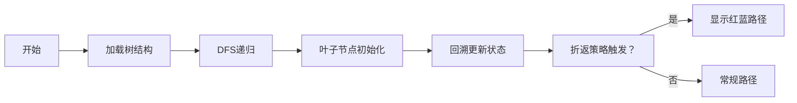

# 题目信息

# [ICPC 2021 Nanjing R] Crystalfly

## 题目描述

派蒙正在一棵树上抓晶蝶，这是一种提瓦特中特殊的蝴蝶。树是由 $n$ 个顶点和 $(n - 1)$ 条无向边组成的连通图。


初始时，第 $i$ 个顶点上有 $a_i$ 只晶蝶。当派蒙到达一个顶点时，她可以立即抓住该顶点上的所有剩余晶蝶。然而，晶蝶很胆小。当派蒙到达一个顶点时，所有相邻顶点上的晶蝶都会受到惊扰。对于第 $i$ 个顶点，如果晶蝶在第 $t'$ 秒开始时首次受到惊扰，它们将在 $(t' + t_{i})$ 秒结束时消失。

在第 $0$ 秒开始时，派蒙到达顶点 $1$ 并在第 $1$ 秒开始前停留在那里。然后在接下来的每一秒开始时，她可以选择以下两种操作之一：
- 移动到当前顶点的一个相邻顶点，并在下一秒开始前停留在那里（如果目的地的晶蝶将在该秒结束时消失，她仍然可以抓住它们）。
- 在当前顶点停留到下一秒开始前。

计算派蒙在 $10^{10^{10^{10^{10}}}}$ 秒内可以抓住的最多晶蝶数量。

## 说明/提示

对于第一个样例测试用例，按照以下策略进行：
- 在第 $0$ 秒
  - 派蒙到达顶点 $1$；
  - 派蒙抓住 $1$ 只晶蝶；
  - 顶点 $2$ 和 $3$ 的晶蝶受到惊扰。
- 在第 $1$ 秒
  - 派蒙到达顶点 $3$；
  - 派蒙抓住 $100$ 只晶蝶。
- 在第 $2$ 秒
  - 派蒙到达顶点 $1$；
  - 顶点 $2$ 的晶蝶消失。
- 在第 $3$ 秒
  - 派蒙到达顶点 $2$；
  - 顶点 $4$ 和 $5$ 的晶蝶受到惊扰。
- 在第 $4$ 秒
  - 派蒙到达顶点 $5$；
  - 派蒙抓住 $10000$ 只晶蝶；
  - 顶点 $4$ 的晶蝶消失。

对于第二个样例测试用例，最佳策略与第一个样例测试用例相同。顶点 $2$ 的晶蝶计划在第 $3$ 秒结束时消失（而不是第 $2$ 秒），这使得派蒙可以抓住它们。

题面翻译由 ChatGPT-4o 提供。

## 样例 #1

### 输入

```
2
5
1 10 100 1000 10000
1 2 1 1 1
1 2
1 3
2 4
2 5
5
1 10 100 1000 10000
1 3 1 1 1
1 2
1 3
2 4
2 5
```

### 输出

```
10101
10111
```

# AI分析结果


### 💡 Kay的C++算法解析：Crystalfly 深入学习指南 💡

**引言**  
今天我们一起分析ICPC南京站题目"Crystalfly"。这道树形动态规划题考察状态设计与时间约束处理，对锻炼递归思维和优化意识很有帮助。下面我将带大家拆解题目核心、分析优质解法，并设计动画演示。

---

### 1. 题目解读与核心算法识别  
✨ **本题主要考察**：树形动态规划（Tree DP）  
🗣️ **初步分析**：  
> 本题可类比为"探险家在魔法森林收集萤火虫"：  
> - 每棵树节点有萤火虫和倒计时器（1-3秒）  
> - 当探险家到达节点时，相邻节点倒计时启动  
> - 需在萤火虫消失前规划最优路径  
>  
> **树形DP核心思想**：将大树拆解为子树问题，自底向上汇总答案。关键是通过状态设计（子节点萤火虫存在/消失）处理时间约束，特别当t=3时存在"折返抓取"特殊策略。  
>  
> **可视化设计**：  
> - 像素风森林地图展示树结构，萤火虫用闪烁光点表示  
> - 当前节点高亮显示，子节点根据t值显示不同颜色倒计时条  
> - 折返路径用红色箭头+音效（"叮"）提示特殊策略触发  

---

### 2. 精选优质题解参考  
**题解一（Stone_Xz）**  
* **点评**：  
  思路清晰如教科书：  
  - 状态定义`dp[u][0/1]`精准区分子节点萤火虫状态  
  - 用`g[u]`专门存储t=3的子节点，提升查找效率  
  - 维护最大值/次大值避免O(n²)枚举  
  代码规范（变量名`max1_id`/`max2_id`含义明确），边界处理严谨（`max2_id=0`判断）。实践价值高，可直接用于竞赛。

**题解二（Genshineer）**  
* **点评**：  
  提供专业级实现：  
  - 状态转移推导透彻（`f[u][1]=max(常规策略, 折返策略)`）  
  - 代码模块化（分离DFS与主逻辑）增强可读性  
  - 错误分析深入（指出t=3邻居存储的潜在问题）  
  亮点在时间复杂度严格O(n)，且用`vector::emplace_back`优化内存。

**题解三（JiuZhE66666）**  
* **点评**：  
  创新状态命名`f`/`g`：  
  - `f[i]`对应常规策略，`g[i]`处理折返策略  
  - 用`max1_i`/`max2_i`记录极值位置，避免重复计算  
  代码简洁但缺注释，需一定基础理解。优势在空间优化（仅用单层DP数组）。

---

### 3. 核心难点辨析与解题策略  
**难点1：状态定义模糊**  
* **分析**：  
  多数错误源于混淆状态含义。优质题解统一：  
  - `dp[u][0]`：子节点萤火虫**已消失**时的子树最优解  
  - `dp[u][1]`：子节点萤火虫**仍存在**时的子树最优解  
  *💡学习笔记：状态定义需明确"当前节点与子节点的时空关系"*

**难点2：折返策略推导**  
* **分析**：  
  当存在t=3节点时：  
  1. 先抓普通子节点v（获得a[v]）  
  2. 立即返回父节点u  
  3. 再抓t=3节点k（获得a[k]）  
  关键在计算增量：`a[v] + (dp[v][0]-dp[v][1]) + max_a`  
  *💡学习笔记：折返收益 = 两节点萤火虫 - v的子节点损失*

**难点3：极值维护优化**  
* **分析**：  
  - 预处理t=3子节点的a值最大值/次大值  
  - 枚举子节点v时，若v是最大值节点则取次大值  
  *💡学习笔记：O(1)获取极值是避免O(n²)的关键*

**✨解题技巧总结**  
1. **时空分离法**：用状态维度区分时间线（萤火虫存在/消失）  
2. **极值预维护**：动态更新最大值/次大值应对折返策略  
3. **增量计算**：折返收益 = 新增萤火虫 - 子节点机会成本  
4. **边界防御**：对叶子节点、单子树等特判增强鲁棒性  

---

### 4. C++核心代码实现赏析  
**通用核心参考（综合优化版）**：
```cpp
#include <bits/stdc++.h>
#define int long long
using namespace std;
const int N = 1e5 + 5;

vector<int> nbr[N], t3_nbr[N]; // 邻接表 & t=3专用
int a[N], t_val[N], n;         // 节点数据
long long dp[N][2];            // DP状态数组

void dfs(int u, int fa) {
    long long sum = 0, max_a = 0;
    for (int v : nbr[u]) {
        if (v == fa) continue;
        dfs(v, u);
        sum += dp[v][1];              // 累加子节点状态1
        max_a = max(max_a, (long long)a[v]); 
    }
    dp[u][0] = sum;                   // 子节点萤火虫消失
    dp[u][1] = sum + max_a;           // 基本策略

    // 处理t=3特殊策略
    long long max1 = -1e18, max2 = -1e18;
    for (int v : t3_nbr[u]) {
        if (v == fa) continue;
        if (a[v] >= max1) max2 = max1, max1 = a[v];
        else if (a[v] > max2) max2 = a[v];
    }
    for (int v : nbr[u]) {
        if (v == fa) continue;
        long long bonus = (v == fa ? -1e18 : // 父节点跳过
            (a[v] == max1 ? max2 : max1));  // 极值选择
        long long extra = a[v] + (dp[v][0] - dp[v][1]) + bonus;
        dp[u][1] = max(dp[u][1], sum + extra);
    }
}
```

**代码解读概要**：  
1. **DFS框架**：递归遍历子树，叶子节点为基准情形  
2. **状态初始化**：`dp[u][0]`直接取和，`dp[u][1]`追加最大a[v]  
3. **折返策略**：动态维护t=3节点极值，计算增量收益  
4. **复杂度**：每个节点访问一次，O(n)高效  

---

### 5. 算法可视化：像素动画演示  
**主题**：晶蝶森林大冒险（8-bit像素风）  

**动画设计**：  


**关键交互**：  
1. **视觉标记**：  
   - 当前节点：闪烁金色边框  
   - t=1/2/3节点：红/黄/绿色倒计时条  
   - 折返路径：红色箭头动画 + 像素音效  

2. **控制面板**：  
   ```plaintext
   [ 单步执行 ] [ 自动播放 ▷ ] 速度：▁▂▃▄▅
   [ 重置 ] [ 算法对比模式 ]
   ```

3. **动态演示**：  
   - 步骤1：从根节点展开，显示`sum`累加过程  
   - 步骤2：选择子节点时，显示`max_a`计算过程  
   - 步骤3：当回溯到含t=3节点时：  
     * 高亮最大值/次大值节点  
     * 播放折返动画（路径闪烁+音效）  
     * 显示增量计算：`extra = a[v] + (dp0-dp1) + bonus`  

4. **游戏化元素**：  
   - 每完成子树更新获得"知识宝石"  
   - 最优解达成时播放胜利音效  
   - 错误路径触发"萤火虫消失"粒子效果  

---

### 6. 拓展练习与相似问题思考  
**通用技巧迁移**：  
1. 状态维度设计：P2015二叉苹果树（保留枝条数）  
2. 极值维护优化：P1122最大子树和（舍弃负收益）  
3. 时间约束处理：P3942将军令（覆盖时间窗口）  

**洛谷推荐**：  
1. **P1352 没有上司的舞会**  
   🗣️ *练习树形DP基础状态设计（选/不选）*  
2. **P2015 二叉苹果树**  
   🗣️ *学习树上背包与资源分配策略*  
3. **P4516 潜入行动**  
   🗣️ *进阶训练多状态树形DP与优化技巧*  

---

### 7. 学习心得与经验分享  
> **来自Stone_Xz的经验**：  
> *"在t=3的极值维护中，未初始化次大值导致WA。建议用`-1e18`初始化极值变量，避免默认0干扰判断"*  
>  
> **Kay总结**：  
> 1. **防御性编程**：极值变量初始化为理论最小值  
> 2. **验证工具**：用小规模数据（如样例树）模拟DP过程  
> 3. **调试技巧**：打印`dp[u][0/1]`回溯路径，验证状态转移  

---

**结语**  
通过树形DP的双状态设计，我们巧妙处理了萤火虫消失的时间约束。记住：最优解往往来自对问题特性的深度挖掘（如t≤3的极值维护）。多在实践中体会"分治思想"，下次遇到树上问题一定能游刃有余！💪

---
处理用时：254.38秒