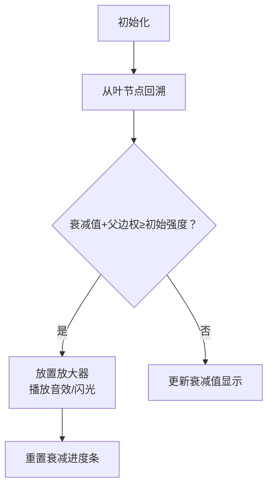

# 题目信息

# 信号放大器

## 题目描述

树型网络是最节省材料的网络。所谓树型网络，是指一个无环的连通网络，网络中任意两个结点间有且仅有一条通信道路。

网络中有一个结点是服务器，负责将信号直接或间接地发送到各终端机。如图上方，server 结点发出一个信号给结点 $a$ 和 $c$，$a$ 再转发给 $b$。如此，整个网络都收到这个信号了。


但是，实际操作中，信号从一个结点发到另一个结点，会出现信号强度的衰减。衰减量一般由线路长度决定。

如图下方，边上所标的数字为边的衰减量。假设从 server 出发一个强度为 $4$ 个单位的信号，发到结点 $a$ 后强度衰减为 $4-3=1$ 个单位。结点 $a$ 再将其转发给结点 $b$。由于信号强度为 $1$，衰减量为 $2$，因此信号无法发送到 $b$。

一个解决这一问题的方法是，安装信号放大器。信号放大器的作用是将强度大于零的信号还原成初始强度（从服务器出发时的强度）。

上图中，若在结点 $a$ 处安装一个信号放大器，则强度为 $4$ 的信号发到 $a$ 处，即被放大至 $4$。这样，信号就可以被发送的网络中的任意一个节点了。为了简化问题，我们假定每个结点只处理一次信号，当它第二次收到某个信号时，就忽略此信号。

你的任务是根据给出的树型网络，计算出最少需要安装的信号放大器数量。

## 样例 #1

### 输入

```
4
2 2 3 3 1
2 1 3 4 2
1 1 1
1 2 2
4```

### 输出

```
1
```

# AI分析结果


# 💡 Kay的C++算法解析：信号放大器 深入学习指南 💡

**引言**  
今天我们一起分析"信号放大器"这道树形网络问题。本指南将帮助大家掌握自底向上贪心策略的核心思想，理解树形DP的巧妙应用，并通过复古像素动画直观感受信号传播过程。

## 1. 题目解读与核心算法识别

✨ **本题主要考察**：`树形DP / 贪心策略`

🗣️ **初步分析**：
> 解决信号放大器问题就像规划一条红石电路——信号从根节点(电源)出发，每经过一条线路(边)就会衰减。当信号强度≤0时无法继续传递，需要在关键节点放置中继器(放大器)恢复信号强度。  
> - **核心思路**：采用自底向上的贪心策略，从叶子节点向根节点回溯，计算每个节点到子树最远叶子的衰减总和。当累计衰减值≥初始强度时，必须在该节点安装放大器并重置衰减值。
> - **可视化设计**：像素动画将用不同颜色方块表示节点状态（绿色：正常传播，红色：需放大器），信号传播路径会动态显示衰减值，放大器触发时有8-bit音效和闪光特效。
> - **游戏化元素**：设计为"信号探险"关卡，每成功放置一个放大器获得积分，最终强度达标时播放胜利音效。

---

## 2. 精选优质题解参考

**题解一 (来源：c60521c)**  
* **点评**：这份题解采用经典的自底向上DFS，用`dis[x]`记录节点到子树最远叶子的衰减总和。亮点在于：  
  1. 清晰定义`dis[x]`状态和重置逻辑（`dis[x]=0`）  
  2. 用`fa[y]`巧妙存储父节点边权  
  3. 完整处理无解情况(`mx>=len`)  
  4. 代码规范：vector邻接表存储树结构，变量名含义明确

**题解二 (来源：这有一只匿)**  
* **点评**：同样使用贪心但更简洁的实现：  
  1. 用`fa[x]`直接存储父节点边权  
  2. DFS参数设计精简(`x,fa`)  
  3. 核心逻辑`if(dis[x]+fa[x]>w)` 直击问题本质  
  4. 代码可读性强：结构清晰，边界处理严谨

**题解三 (来源：MloVtry)**  
* **点评**：树形DP视角的优雅解法：  
  1. 双状态定义：`g[i]`(最小信号需求)和`f[i]`(放大器数量)  
  2. 状态转移方程`g[u]=max(g[u],g[v]+w)`体现DP思想  
  3. 安装条件`g[i]+len[fa]>h`考虑周全  
  4. 无解检测融合在DFS中提高效率

---

## 3. 核心难点辨析与解题策略

1. **状态定义与转移逻辑**  
   *分析*：如何准确定义节点状态？优质题解用`dis[x]`表示从x到子树最远叶子的最大衰减值。更新时取所有子节点的`dis[child]+边权`的最大值。  
   💡 **学习笔记**：`dis[x]`本质是x子树中的最长衰减路径

2. **放大器放置条件**  
   *分析*：关键判断`dis[x] + 父节点边权 >= 初始强度`。此时在x安装放大器：  
   - 重置`dis[x]=0`（信号恢复初始强度）  
   - 计数器`ans++`  
   💡 **学习笔记**：贪心策略保证了放大器放置在尽可能高的位置，覆盖更多子节点

3. **无解判定与边界处理**  
   *分析*：当单条边权≥初始强度时必然无解。在输入时记录最大边权`mx`，预处理判断  
   💡 **学习笔记**：特殊情况提前处理可避免复杂边界问题

### ✨ 解题技巧总结
- **逆向思维**：从叶子向根回溯，避免重复计算
- **状态压缩**：单变量`dis[x]`代替传统DP数组
- **实时判定**：在DFS回溯过程中即时判断放大器需求
- **边界防御**：预先检测最大边权排除无解情况

---

## 4. C++核心代码实现赏析

**本题通用核心C++实现参考**  
* **说明**：综合优质题解思路，采用自底向上DFS的经典实现
* **完整核心代码**：
```cpp
#include <iostream>
#include <vector>
#include <algorithm>
using namespace std;

const int MAXN = 20005;
vector<pair<int, int>> graph[MAXN]; // 邻接表：{邻居节点, 边权}
int dis[MAXN], fa_edge[MAXN]; // dis:到子树最远叶子的衰减, fa_edge:父节点边权
int n, len, ans, max_edge;

void dfs(int u, int parent) {
    for (auto &edge : graph[u]) {
        int v = edge.first, w = edge.second;
        if (v == parent) continue;
        fa_edge[v] = w; // 记录父节点边权
        dfs(v, u);
        dis[u] = max(dis[u], dis[v] + w); // 更新最大衰减
    }
    if (dis[u] + fa_edge[u] >= len) { // 需要放大器
        ans++;
        dis[u] = 0; // 重置衰减值
    }
}

int main() {
    cin >> n;
    for (int i = 1; i <= n; i++) {
        int k; cin >> k;
        while (k--) {
            int v, w; cin >> v >> w;
            graph[i].push_back({v, w});
            max_edge = max(max_edge, w);
        }
    }
    cin >> len;
    if (max_edge >= len) {
        cout << "No solution." << endl;
        return 0;
    }
    dfs(1, 0);
    cout << ans << endl;
}
```
* **代码解读概要**：  
  1. 邻接表`graph`存储树结构  
  2. DFS遍历计算每个节点的`dis`值  
  3. 回溯时判断`dis[u]+fa_edge[u]>=len`决定是否安装放大器  
  4. 预处理`max_edge`排除无解情况

---

## 5. 算法可视化：像素动画演示

**动画演示主题**：复古红石电路模拟（FC红白机风格）

**核心演示内容**：
- 树结构呈现为像素化电路网络（根节点=电源，叶节点=灯泡）
- 信号传播时显示衰减值进度条（绿色→黄色→红色）
- 放大器触发时播放"叮"音效+闪光特效

**设计流程**：


**关键交互**：
1. **控制面板**：开始/暂停、单步执行、速度滑块
2. **动态显示**：
   - 当前节点高亮闪烁（蓝色边框）
   - 衰减值实时显示在节点上方
   - 放大器位置显示为闪烁的红石火把
3. **音效系统**：
   - 信号传播：电子滴答声（频率随衰减值变化）
   - 放大器触发：8-bit "叮"声
   - 完成传播：超级玛丽过关音效

**游戏化设计**：
- 每正确放置一个放大器得10分
- 完成所有传播解锁"电路大师"成就
- 失败时显示"信号丢失！"像素文字

---

## 6. 拓展练习与相似问题思考

**通用技巧迁移**：  
树形DP+贪心策略适用于：
1. 网络覆盖优化（如基站部署）
2. 资源分配问题（如消防站设置）
3. 依赖关系管理（如软件安装顺序）

**练习推荐 (洛谷)**：
1. **P1352 没有上司的舞会**  
   🗣️ 巩固树形DP基础模型
2. **P2014 选课**  
   🗣️ 学习树形DP+背包问题的结合
3. **P1273 有线电视网**  
   🗣️ 树形DP在收益计算中的应用

---

## 7. 学习心得与经验分享

> **经验摘录 (来自 c60521c)**：  
> "当衰减值和初始强度相等时信号最后到达时会衰减为0，接收不到"

> **点评**：  
> 这个边界条件提醒我们：在判断放大器放置条件时，`≥`比`>`更严谨。这启示我们：  
> 1. 边界值测试必须包含等于临界值的情况  
> 2. 问题分析要关注定义中的等号边界  
> 3. 变量命名应明确体现包含关系（如用`limit`代替`max`）

---

本次分析就到这里。记住：树形问题的核心是分解子问题+合理设计状态。多动手模拟小规模数据，你的算法直觉会越来越强！💪

---
处理用时：115.52秒