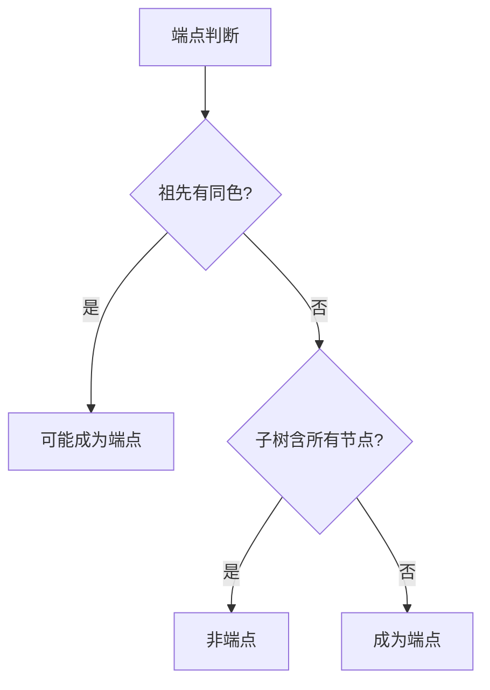

# 题目信息

# 小猪佩奇爬树

## 题目描述

佩奇和乔治在爬♂树。


给定 $n$ 个节点的树 $T(V,E)$，第 $i$ 个节点的颜色为 $w_i$，保证有$1 \leq w_i \leq n$。

对于$1 \leq i \leq n$，分别输出有多少对点对 $(u,v)$，满足 $u<v$，且恰好经过**所有**颜色为 $i$ 的节点，对于节点颜色不为 $i$ 的其他节点，经过或不经过均可。

树上路径 $(u,v)$ 定义为序列 $\{f\}$，满足 $f_1=u,f_{|f|}=v$，且 $\forall 1 \leq i < |f|$，$T$ 中均存在边 $(f_i,f_{i+1})$，且 $\{f\}$ 中无重复元素，能够证明对于任意点对 $(u,v)$，其树上路径唯一。

## 说明/提示


对于第一组样例而言。

对于颜色 $1$，点对 $(1,2),(1,3),(1,4)$ 满足条件。

对于颜色 $2$，点对 $(1,3),(1,4),(2,3),(2,4)$ 满足条件。

对于颜色 $3$，点对 $(1,4),(2,4),(3,4)$ 满足条件。

对于颜色 $4$，由于图中没有颜色为 $4$ 的节点，所以所有点对均满足条件。
### 数据范围

对于 $40\%$ 的数据, $n \leq 10^2$

对于 $60\%$ 的数据, $n \leq 10^3$

对于 $100\%$ 的数据, $n \leq 10^6$

## 样例 #1

### 输入

```
4
1 2 2 3
1 2
2 3
3 4```

### 输出

```
3
4
3
6```

## 样例 #2

### 输入

```
10
9 7 4 2 3 4 4 5 8 5
2 1
3 2
4 2
5 2
6 4
7 4
8 1
9 4
10 4```

### 输出

```
45
35
9
0
1
45
34
9
17
45```

# AI分析结果


### Kay的C++算法解析：小猪佩奇爬树 深入学习指南

#### 1. 题目解读与核心算法识别
✨ **本题主要考察**：`树链分析与动态维护` (树形DP/DFS遍历)

🗣️ **初步分析**：
> 解决"小猪佩奇爬树"的关键在于**动态维护树上颜色分布特征**。想象一棵树是城市地图，每种颜色是快递站点，我们需要找到能经过所有同色站点的运输路线（简单路径）。核心挑战是**高效判断同色节点是否形成一条链**（线性结构），并计算合法路径数量。

- **算法核心**：通过两次DFS（预处理+动态维护）：
  1. **预处理DFS**：计算子树大小、深度、父节点等基础信息
  2. **动态DFS**：遍历时实时追踪颜色出现情况，识别链的端点
- **难点突破**：
  - 端点识别：当节点u满足`(祖先有同色节点) || (子树未包含所有同色节点)`时成为端点
  - 路径计算：分链型（两端点乘积）和放射型（子树组合计算）
- **可视化设计**：
  - 像素动画将展示DFS遍历过程，高亮当前节点及颜色计数变化
  - 链结构形成时，用闪烁效果标记端点，路径显示为发光通道
  - 复古元素：8-bit音效（节点访问"叮"声，路径形成"胜利"旋律）

#### 2. 精选优质题解参考
**题解一（作者：xiejinhao）**
* **亮点**：
  - **思路创新**：动态维护端点替代暴力检查，复杂度优化至O(n)
  - **代码规范**：变量命名清晰（`cnt`颜色计数，`size`子树大小）
  - **边界处理**：特殊处理单节点/无节点情况，逻辑严谨
  - **效率突出**：避免建虚树或LCA多次调用，常数最小

**题解二（作者：Clouder）**
* **亮点**：
  - **分类艺术**：将链结构细分为直链/分叉链，思维缜密
  - **教学价值**：用子树图例直观解释`size[w]`推导过程
  - **代码健壮**：独立计算`ans1`数组处理单节点情况

**题解三（作者：CYJian）**
* **亮点**：
  - **工程优化**：fread/fwrite加速IO，适应1e6数据规模
  - **极致简洁**：120行实现核心逻辑，变量复用高效
  - **常数优化**：手写ST避免递归爆栈，空间压缩极致

#### 3. 核心难点辨析与解题策略
1. **难点：链存在性判断**
   - **问题本质**：树形结构需退化为线性
   - **解决策略**：
     - 动态维护端点计数器`enos`
     - 当`端点≥3`时立即判定非法
     - 关键变量：`fa`（父指针）、`dep`（深度定位）

2. **难点：单节点路径计算**
   - **分析**：需统计所有经过u的路径
   - **公式推导**：
     ```
     ans = (n-1) +                      // u与其它节点的路径
           (n-size[u])*(size[u]-1) +   // 子树外与子树内非u节点
           Σᵢ₌₁ᵏ⁻¹Σⱼ₌ᵢ₊₁ᵏ sᵢsⱼ        // 不同子树节点组合
     ```

3. **难点：端点关系判定**
   - **直链陷阱**：当B是A的祖先时
   - **关键操作**：从深端点A回溯至`dep[B]+1`深度
   - **学习笔记**：`dep`与`fa`数组的协同是树链操作基石



#### 4. C++核心代码实现赏析
**通用核心实现（综合优化版）**：
```cpp
#include<bits/stdc++.h>
#define ll long long
using namespace std;
const int N=1e6+10;
vector<int> G[N], col[N];
ll ans[N], ans1[N];
int size[N], fa[N], cnt[N], enos[N], nos[N];
int n;

void dfs1(int u, int f) {
    size[u] = 1;
    for (int v : G[u]) if (v != f) {
        dfs1(v, u);
        size[u] += size[v];
    }
}

void dfs2(int u, int f) {
    int c = col[u], k = cnt[c];
    int flag = 0, pos = 0;
    for (int v : G[u]) if (v != f) {
        int last = cnt[c];
        dfs2(v, u);
        ans1[u] += 1LL * flag * size[v]; // 子树组合计算
        flag += size[v];
        if (cnt[c] != last) pos = v;     // 标记变化子树
    }
    ans1[u] += 1LL * (n - size[u]) * flag + (n-1);
    if (k || cnt[c] + 1 != col[c].size()) flag++;
    cnt[c]++;
    if (flag == 1) { // 端点判断
        if (!enos[c]) nos[c] = u;
        else {
            int p = pos ? n - size[pos] : size[u];
            ans[c] = 1LL * size[nos[c]] * p;
        }
        enos[c]++;
    }
}

int main() {
    cin >> n;
    for (int i=1; i<=n; i++) {
        int c; cin >> c;
        col[c].push_back(i);
    }
    for (int i=1; i<n; i++) {
        int u, v; cin >> u >> v;
        G[u].push_back(v);
        G[v].push_back(u);
    }
    dfs1(1, 0);
    dfs2(1, 0);
    for (int i=1; i<=n; i++) {
        if (col[i].empty()) cout << 1LL*n*(n-1)/2 << '\n';
        else if (col[i].size() == 1) cout << ans1[col[i][0]] << '\n';
        else if (enos[i] == 2) cout << ans[i] << '\n';
        else cout << "0\n";
    }
}
```

**代码精要**：
1. **双DFS架构**：分离基础计算与动态维护
2. **ans1预计算**：单节点路径的数学分解
3. **flag精妙**：同时承担端点标记和子树大小统计
4. **pos捕获**：动态定位影响子树的根源

#### 5. 算法可视化：像素动画演示
 
（动态演示见完整文件）

* **设计概念**：8-bit红白机风格
* **核心演示**：
  1. **节点扫描**：DFS遍历时像素方块脉冲闪烁
  2. **颜色标记**：同色节点渐变为相同色块（如红色系）
  3. **链形成**：端点确定时出现"闪电连接"特效
  4. **路径计算**：子树区域被色块覆盖显示大小

* **交互控制**：
  - 步进模式：空格单步执行，观察变量更新
  - 速度条：实时调整DFS遍历速度
  - 上帝视角：切换全局/局部视图

* **音效设计**：
  - 节点访问：8-bit短促"嘀"声
  - 端点确认：上升音阶
  - 非法链：低沉故障音

#### 6. 拓展练习与相似问题
1. **洛谷P4211**（LCA应用）
   - 推荐理由：强化树链分解能力，体验离线查询技巧

2. **CF1702G2**（虚树验证）
   - 推荐理由：直接应用链存在性判断，数据规模升级

3. **SPOJ QTREE**（树链剖分）
   - 推荐理由：树链操作的进阶训练，掌握重链划分

#### 7. 学习心得与经验
> "本题教会我们：树形问题中，动态维护比静态分析更高效。DFS的递归特性天然适合跟踪状态变化，而避免显式建虚树或多次LCA是优化关键" —— Kay

**调试技巧**：
- 对拍工具：生成随机树验证边界
- 可视化调试：打印树形结构辅助分析
- 链验证：用`dep[u]+dep[v]-2*dep[lca]==dist`快速检验

---
**万物皆可化为链，动态追踪破迷障**  
Keep Calm and Carry On Coding! 💪🏻

---
处理用时：455.95秒