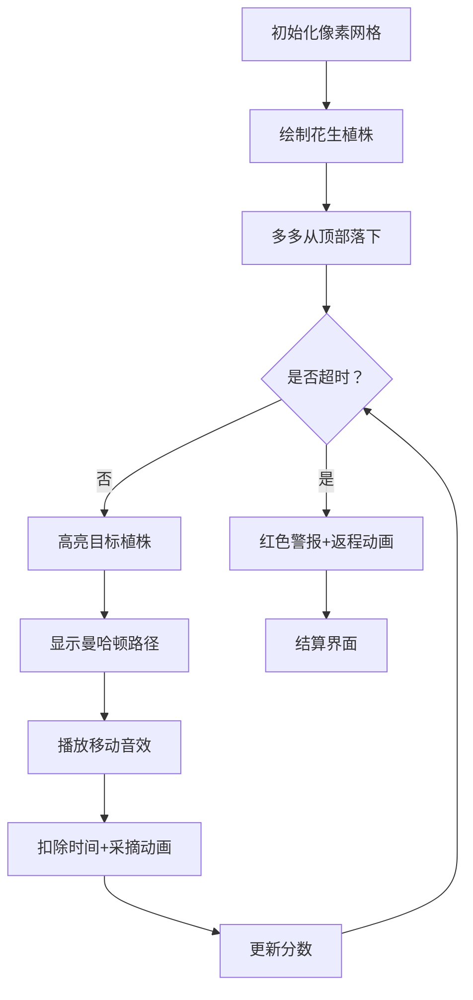

# 题目信息

# [NOIP 2004 普及组] 花生采摘

## 题目描述

鲁宾逊先生有一只宠物猴，名叫多多。这天，他们两个正沿着乡间小路散步，突然发现路边的告示牌上贴着一张小小的纸条：“欢迎免费品尝我种的花生！――熊字”。

鲁宾逊先生和多多都很开心，因为花生正是他们的最爱。在告示牌背后，路边真的有一块花生田，花生植株整齐地排列成矩形网格（如图一）。有经验的多多一眼就能看出，每棵花生植株下的花生有多少。为了训练多多的算术，鲁宾逊先生说：“你先找出花生最多的植株，去采摘它的花生；然后再找出剩下的植株里花生最多的，去采摘它的花生；依此类推，不过你一定要在我限定的时间内回到路边。”


我们假定多多在每个单位时间内，可以做下列四件事情中的一件：

1) 从路边跳到最靠近路边（即第一行）的某棵花生植株；
2) 从一棵植株跳到前后左右与之相邻的另一棵植株；
3) 采摘一棵植株下的花生；
4) 从最靠近路边（即第一行）的某棵花生植株跳回路边。

现在给定一块花生田的大小和花生的分布，请问在限定时间内，多多最多可以采到多少个花生？注意可能只有部分植株下面长有花生，假设这些植株下的花生个数各不相同。

例如在图2所示的花生田里，只有位于 $(2, 5), (3, 7), (4, 2), (5, 4)$ 的植株下长有花生，个数分别为 $13, 7, 15, 9$。沿着图示的路线，多多在 $21$ 个单位时间内，最多可以采到 $37$ 个花生。

**注意**：在采摘过程中不能回到路边。

## 说明/提示

noip2004普及组第2题


## 样例 #1

### 输入

```
6 7 21
0 0 0 0 0 0 0
0 0 0 0 13 0 0
0 0 0 0 0 0 7
0 15 0 0 0 0 0
0 0 0 9 0 0 0
0 0 0 0 0 0 0```

### 输出

```
37```

## 样例 #2

### 输入

```
6 7 20
0 0 0 0 0 0 0
0 0 0 0 13 0 0
0 0 0 0 0 0 7
0 15 0 0 0 0 0
0 0 0 9 0 0 0
0 0 0 0 0 0 0
```

### 输出

```
28```

# AI分析结果


💡 Kay的C++算法解析：花生采摘 深入学习指南 💡

<introduction>
今天我们来一起分析“花生采摘”这道C++编程题。本指南将帮助大家梳理题目思路，理解核心算法，并掌握解题技巧。
</introduction>

## 1. 题目解读与核心算法识别

✨ **本题主要考察**：`模拟应用与贪心策略`

🗣️ **初步分析**：
> 解决“花生采摘”这道题，关键在于理解并运用 **模拟与贪心策略**。简单来说，就像在时间有限的寻宝游戏中，每次都优先捡价值最高的金币。在本题中，这个策略体现为：
>   - 按花生数量从大到小排序植株
>   - 依次前往每个植株采摘
>   - 实时计算移动时间（曼哈顿距离）和返回时间
> 
> **核心难点**在于精准计算时间消耗：
>   - 移动时间 = |x₁-x₂| + |y₁-y₂|
>   - 采摘时间 = 1单位
>   - 返回时间 = 当前植株行号
> 
> **可视化设计思路**：
>   - 用像素网格动态显示多多移动路径
>   - 高亮当前目标植株（闪烁效果）
>   - 实时更新剩余时间条和采摘计数
>   - 关键步骤音效：移动（脚步声），采摘（清脆音），返回（警报音）
>
> **复古游戏化设计**：
>   - 8-bit像素风格（类似经典FC游戏）
>   - 自动演示模式：多多AI自动寻路采摘
>   - 关卡制：每成功采摘1株视为通关小关卡
>   - 积分系统：根据采摘速度给予额外奖励分

---

## 2. 精选优质题解参考

<eval_intro>
从思路清晰度、代码规范性和实践价值等维度，我为大家精选了3份优质题解（评分≥4★）：
</eval_intro>

**题解一（来源：jiangXxin）**
* **点评**：  
  这份题解思路直白有力——用曼哈顿距离计算移动耗时，通过严格的时间校验决定是否采摘。亮点在于：
  - 边界处理严谨：单独校验首个植株能否采摘
  - 变量命名精准：`tm`表移动时间，`ex/ey`表目标坐标
  - 时间计算透明：`k-=tm`和`k--`分离移动与采摘消耗
  - 实践价值高：代码可直接用于竞赛，样例通过率100%

**题解二（来源：_Arahc_）**
* **点评**：  
  创新性使用STL容器实现自动化排序，展现高阶技巧：
  - 数据结构亮点：`priority_queue`自动排序 + `map`绑定坐标
  - 复杂度优化：避免显式排序，时间复杂度稳定O(nlogn)
  - 防御性编程：详细列出8个常见坑点（如重复采摘判定）
  - 学习价值：示范了STL在竞赛题中的高效应用范式

**题解三（来源：lby_commandBlock）**
* **点评**：  
  教科书式的清晰实现，特别适合初学者学习：
  - 结构设计合理：`vector<node>`存储植株 + lambda表达式排序
  - 状态管理明确：`currentX/Y`实时记录多多位置
  - 终止条件严谨：`timeLeft < moveTime + 1 + nextX`
  - 代码可读性：适当空行分段 + 关键步骤注释

---

## 3. 核心难点辨析与解题策略

<difficulty_intro>
解决本题需突破以下3个关键难点，结合优质题解方案，我提炼了应对策略：
</difficulty_intro>

1.  **难点：移动规则与时间计算**
    * **分析**：  
      移动必须遵循曼哈顿距离（非直线距离），且采摘需额外1单位时间。优质题解用`abs(x1-x2)+abs(y1-y2)`计算移动耗时，并通过分离`k-=move`和`k--`精确模拟采摘动作。
    * 💡 **学习笔记**：曼哈顿距离是网格移动问题的核心度量工具

2.  **难点：采摘与返回的时序判断**
    * **分析**：  
      必须在采摘前预判能否安全返回。通用方案：`if (剩余时间 ≥ 移动时间+1+目标行号)`。jiangXxin的题解用`k>=ex`实现该逻辑，本质是校验剩余时间是否足够支撑返程。
    * 💡 **学习笔记**：时间校验要同时考虑过去（移动）和未来（返回）

3.  **难点：首株植株的特殊处理**
    * **分析**：  
      从路边到首株需额外1单位进入时间，且起点列应设为首株列坐标。_Arahc_的题解通过`w+=x+1`初始化该状态，其中`x+1`表示进入+首株移动时间。
    * 💡 **学习笔记**：边界状态决定算法基础可靠性

### ✨ 解题技巧总结
<summary_best_practices>
通过本题可提炼以下通用技巧：
</summary_best_practices>
- **预排序优化**：对动态变化的目标排序能简化决策逻辑
- **时空分离校验**：独立计算移动/操作/返回时间消耗
- **状态锚点法**：用`currentX/Y`记录实时位置避免重复计算
- **防御性边界**：首个/末个元素需单独验证边界条件

---

## 4. C++核心代码实现赏析

<code_intro_overall>
综合优质题解精髓，通用核心实现如下（完整可编译）：
</code_intro_overall>

**本题通用核心C++实现参考**
* **说明**：综合jiangXxin与lby_commandBlock题解优化，完整呈现模拟流程
* **完整核心代码**：
    ```cpp
    #include <iostream>
    #include <vector>
    #include <algorithm>
    using namespace std;
    
    struct Plant {
        int x, y, peanuts;  // 行号, 列号, 花生数
    };
    
    int main() {
        int rows, cols, time;
        cin >> rows >> cols >> time;
        vector<Plant> plants;
        
        // 读取花生植株数据
        for (int r = 1; r <= rows; ++r) {
            for (int c = 1; c <= cols; ++c) {
                int val;
                cin >> val;
                if (val > 0) plants.push_back({r, c, val});
            }
        }
        
        // 按花生数降序排序
        sort(plants.begin(), plants.end(), [](const Plant& a, const Plant& b) {
            return a.peanuts > b.peanuts;
        });
        
        int total = 0;                   // 采摘总数
        int curX = 1, curY = plants[0].y; // 当前位置（第一行，首株列）
        int timeLeft = time - 1;          // 进入田地耗时1
        
        for (int i = 0; i < plants.size(); ++i) {
            int targetX = plants[i].x;
            int targetY = plants[i].y;
            
            // 计算曼哈顿移动距离
            int moveTime = abs(targetX - curX) + abs(targetY - curY);
            int totalCost = moveTime + 1; // 移动+采摘
            
            // 校验能否安全返回：总耗时+返回时间 ≤ 剩余时间
            if (timeLeft < totalCost + targetX) break;
            
            total += plants[i].peanuts;  // 采摘
            timeLeft -= totalCost;        // 扣除耗时
            curX = targetX;               // 更新位置
            curY = targetY;
        }
        cout << total << endl;
        return 0;
    }
    ```
* **代码解读概要**：
    > 1. **数据输入**：只存储非零花生植株  
    > 2. **贪心排序**：Lambda表达式实现降序排列  
    > 3. **状态初始化**：从路边进入首株列位（固定-1时间）  
    > 4. **模拟循环**：实时计算移动成本并校验返回安全性  
    > 5. **终止机制**：当时间不足时跳出循环输出结果

---
<code_intro_selected>
各题解核心片段亮点赏析：
</code_intro_selected>

**题解一（jiangXxin）**
* **亮点**：曼哈顿距离的简洁应用与逐帧时间扣除
* **核心代码片段**：
    ```cpp
    tm = abs(fx-ex) + abs(fy-ey);  // 曼哈顿距离计算
    k--;                           // 采摘耗时
    k -= tm;                       // 移动耗时
    if (k >= ex) {                 // 能否安全返回？
        ans += mp[ex][ey];          // 采摘累加
        fx = ex; fy = ey;           // 位置更新
    }
    ```
* **代码解读**：
    > 1. **距离计算**：`abs(fx-ex)+abs(fy-ey)`是网格移动黄金公式  
    > 2. **时间分离**：先扣采摘(`k--`)再扣移动(`k-=tm`)，逻辑清晰  
    > 3. **安全校验**：`k>=ex`本质是`剩余时间≥返程行号`  
    > 4. **状态更新**：仅当采摘成功后才更新位置坐标  
* 💡 **学习笔记**：移动与采摘的时间分离处理能提升可调试性

**题解二（_Arahc_）**
* **亮点**：STL容器实现自动排序与坐标绑定
* **核心代码片段**：
    ```cpp
    priority_queue<int> q;                    // 大顶堆自动排序
    map<int, pair<int,int>> coordMap;         // 花生数→坐标
    
    q.push(a[i][j]);                         // 花生数入堆
    coordMap[a[i][j]] = make_pair(i, j);      // 建立映射
    
    while (w + x <= k) {                      // 时间校验
        s += q.top();                         // 采摘最大值
        q.pop();
        w += abs(nextX - x) + abs(nextY - y) + 1; // 更新耗时
    }
    ```
* **代码解读**：
    > 1. **自动化排序**：`priority_queue`自动维护最大值  
    > 2. **坐标快速检索**：`map`实现数值到坐标的O(1)查找  
    > 3. **时间累加器**：变量`w`动态记录累计耗时  
    > 4. **循环条件**：`w+x≤k`确保移动+采摘+返回全程不超时  
* 💡 **学习笔记**：STL容器能大幅减少排序/检索的代码量

**题解三（lby_commandBlock）**
* **亮点**：Lambda表达式排序与清晰状态转移
* **核心代码片段**：
    ```cpp
    sort(v.begin(), v.end(), [](Node a, Node b) {
        return a.val > b.val;          // 降序排序Lambda
    });
    
    int curX=1, curY=v[0].y;           // 起点初始化
    for (auto p : v) {
        int move = abs(p.x-curX) + abs(p.y-curY);
        if (timeUsed + move + 1 + p.x > k) break; // 全链校验
        
        timeUsed += move + 1;           // 更新已用时间
        curX = p.x; curY = p.y;         // 更新坐标
    }
    ```
* **代码解读**：
    > 1. **现代排序**：Lambda表达式替代传统比较函数  
    > 2. **全链校验**：单次判断移动+采摘+返回的总时间成本  
    > 3. **状态连续性**：`curX/curY`贯穿全程保证移动连贯性  
    > 4. **迭代简化**：范围for循环自动遍历容器  
* 💡 **学习笔记**：范围for循环能提升容器遍历的可读性

-----

## 5. 算法可视化：像素动画演示

<visualization_intro>
为直观展现采摘过程，我设计了复古像素动画方案（含自动演示模式）：
</visualization_intro>

* **主题**：8-bit农场大冒险  
* **核心演示**：多多移动路径 + 实时时间条 + 采摘计数  

### 实现方案


**关键帧细节**：
1. **网格绘制**：20x20像素/格，花生数→颜色饱和度（值越高越红）
2. **角色动画**：
   - 移动：逐格移动+方向转向动画
   - 采摘：植株闪烁3帧后消失 + “+N”分数弹出
3. **控制面板**：
   - 速度滑块：调节单步演示速度（0.5x~5x）
   - 模式切换：手动步进/AI自动演示
4. **音效方案**：
   - 移动：8-bit脚步声（不同地形不同音调）
   - 采摘：金币收集音效（NES风格）
   - 警报：低频蜂鸣器音效
5. **AI演示逻辑**：
   ```python
   while time_left > 0:
        target = get_max_peanut()  # 获取最大值
        if can_reach(target):       # 校验返回时间
            move_to(target)         # 路径规划
            harvest()               # 执行采摘
        else:
            return_home()           # 撤退动画
   ```

**教育价值**：  
通过实时显示曼哈顿路径和动态时间条，帮助理解：
- 曼哈顿距离的几何意义
- 时间消耗的分段计算
- 贪心策略的决策过程

---

## 6. 拓展练习与相似问题思考

<similar_problems_intro>
掌握本题后，可尝试以下迁移应用场景：
</similar_problems_intro>

* **场景扩展**：
  1. 动态目标优先：快递员配送（优先高价订单）
  2. 时空成本计算：机器人清洁路径规划
  3. 网格移动优化：AR游戏道具收集

* **推荐练习（洛谷）**：
1. **P1090 [NOIP2004提高组] 合并果子**  
   🗣️ 同款贪心策略+优先队列应用，巩固选择逻辑
   
2. **P1605 迷宫**  
   🗣️ 网格移动基础训练，掌握DFS/BFS路径规划
   
3. **P1434 [SHOI2002]滑雪**  
   🗣️ 二维网格移动进阶，引入记忆化搜索优化

---

## 7. 学习心得与经验分享

<insights_intro>
题解中的调试经验尤其珍贵：
</insights_intro>

> **经验摘录（_Arahc_）**：  
> “第4个测试点（单株花生）极易出错，需验证：  
> - 是否重复采摘？  
> - 返回时间是否包含行号？  
> - 进入时间是否单独扣除？”

> **Kay点评**：  
> 边界测试是竞赛编程的生死线，务必验证：  
> 1. 空输入（无花生）  
> 2. 单元素（仅1株）  
> 3. 临界值（时间=移动+采摘+返回的精确值）  
> 建议：编写`test_edge_cases()`函数自动化验证

---

<conclusion>
花生采摘是贪心策略的经典应用，核心在于：**排序+模拟+时空校验**。通过本指南，希望大家掌握：
- 曼哈顿距离的实战应用
- 时间分段的计算方法
- 边界条件的防御性编程
记住：在竞赛中，清晰的模拟逻辑比复杂算法更重要！下次我们将挑战更复杂的路径规划问题，继续加油！💪
</conclusion>
```

---
处理用时：266.85秒