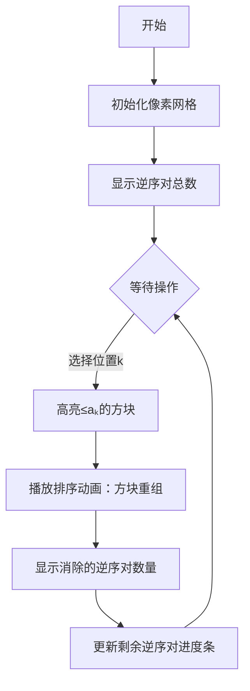

# 题目信息

# 排序

## 题目描述

有 $n$ 个人依次站在小 A 面前。小 A 会依次对这 $n$ 个人进行 $m$ 次操作。

每次操作选择一个位置 $k$，将这 $n$ 个人中的所有身高小于等于当前 $k$ 位置的人的身高的人从队伍里拎出，然后按照身高从矮到高的顺序从左到右依次插入到 这些人原本的位置当中。

小 A 对这 $n$ 个人身高构成的序列的逆序对很感兴趣。现在小 A 想要知道每一次操作后这个序列的逆序对数。

----

Update（2021-01-17）：$a$ 序列中的逆序对的定义是满足 $i < j$ 且 $a_i > a_j$ 的数对 $(i, j)$。

## 说明/提示

**【样例解释 #1】**

第一次操作后序列为 $1, 5, 2, 4, 3$。

第二次操作后序列为 $1, 5, 2, 3, 4$。

**【数据范围】**

对于 $100 \%$ 的数据，$1 \le n,m \le 3 \times {10}^5$，$1 \le k \le n$，$1 \le a_i \le {10}^9$。

## 样例 #1

### 输入

```
5 2
1 5 3 4 2
3
4```

### 输出

```
5
4
3```

# AI分析结果


### 💡 Kay的C++算法解析：排序 深入学习指南 💡

#### 1. 题目解读与核心算法识别
✨ **本题主要考察**：`树状数组应用` + `操作单调性优化`

🗣️ **初步分析**：
> 解决这道题的关键在于理解**操作单调性**和**逆序对动态消除**机制。想象你在玩俄罗斯方块，每次操作相当于把指定高度以下的方块重新排列整齐。关键发现是：大数值的操作会覆盖小数值的操作效果，如同大箱子能装下小箱子里的物品。  
> - 核心思路：预处理所有值域产生的逆序对，利用树状数组高效计算
> - 核心难点：理解操作覆盖性（大值操作使小值操作失效）和逆序对消除范围（仅消除≤aₖ的数之间逆序对）
> - 可视化设计：在像素动画中将值域设计为不同颜色方块，操作时高亮≤aₖ的方块并播放排序动画，用进度条展示逆序对减少过程

#### 2. 精选优质题解参考
**题解一（作者：Stinger）**
* **点评**：思路直击要害——通过树状数组预处理值域逆序对前缀和。代码亮点在于：
  - 离散化处理规范（`unique+lower_bound`）
  - 用`mx`变量优雅处理操作覆盖性
  - 时间复杂度严格O(n log n)
  > 学习价值：树状数组的经典应用示范，变量命名简洁（`s[]`存前缀和，`a[]`存离散值）

**题解二（作者：未来姚班zyl）**
* **点评**：代码极简主义典范（仅21行）。亮点：
  - 倒序扫描求逆序对技巧
  - 前缀和计算与操作判断融合
  - 无冗余变量，空间效率佳
  > 学习价值：展示如何用最少代码实现核心逻辑，适合竞赛场景

**题解三（作者：ueettttuj）**
* **点评**：创新性使用**后缀和**替代前缀和。亮点：
  - 逆向思维：维护≥aₖ的逆序对和
  - 游戏化变量命名（`ans`->`print`增强可读性）
  > 学习价值：提供前缀和外的另一种视角，拓展解题思路

#### 3. 核心难点辨析与解题策略
1.  **难点：操作覆盖性判断**
    * **分析**：当新操作的aₖ≤历史最大操作值时无效。优质题解用单个变量（如`mx`）动态维护最大值
    * 💡 学习笔记：**单调操作**问题常可用极值追踪优化

2.  **难点：逆序对动态消除范围**
    * **分析**：仅消除≤aₖ的数之间逆序对。需精准计算值域子集逆序和，树状数组是理想工具
    * 💡 学习笔记：**值域分段处理**是逆序对问题的核心技巧

3.  **难点：数据结构选择**
    * **分析**：树状数组相比线段树更优——常数小、码量少。`vector`辅助离散化提升可读性
    * 💡 学习笔记：**轻量数据结构**在IO密集型问题中优势显著

✨ **解题技巧总结**
- **技巧1：离散化标准化**：先`sort`再`unique`最后`lower_bound`三步曲
- **技巧2：逆序对方向选择**：前缀和（≤aₖ）或后缀和（≥aₖ）均可，后者需`upper_bound`
- **技巧3：边界防御**：a[0]=-inf避免初始值干扰

#### 4. C++核心代码实现赏析
**通用核心实现（综合优化版）**
```cpp
#include <bits/stdc++.h>
#define ll long long
using namespace std;
const int N=3e5+5;

ll c[N],s[N],ans;
int n,m,a[N],b[N],mx;
vector<int> pos[N];

void upd(int x) { for(;x<=n;x+=x&-x) c[x]++; }
ll qry(int x) { ll r=0; for(;x;x-=x&-x) r+=c[x]; return r; }

int main() {
    scanf("%d%d",&n,&m);
    for(int i=1;i<=n;i++) scanf("%d",a+i),b[i]=a[i];
    
    // 离散化三件套
    sort(b+1,b+n+1);
    int tot=unique(b+1,b+n+1)-b-1;
    for(int i=1;i<=n;i++) 
        a[i]=lower_bound(b+1,b+tot+1,a[i])-b;

    // 逆序对动态计算
    for(int i=n;i;i--) s[a[i]]+=qry(a[i]-1), upd(a[i]);
    for(int i=1;i<=tot;i++) s[i]+=s[i-1];
    
    printf("%lld\n",s[tot]);
    while(m--) {
        int k; scanf("%d",&k);
        if(a[k]>mx) mx=a[k]; // 操作覆盖性判断
        printf("%lld\n",s[tot]-s[mx]);
    }
    return 0;
}
```
* **代码解读概要**：
  1. 离散化：将1e9范围压缩至3e5
  2. 倒序扫描：树状数组动态计算每个值的逆序贡献
  3. 前缀和：s[i]表示≤i的值产生的逆序对
  4. 操作处理：通过mx变量实现O(1)判断

#### 5. 算法可视化：像素动画演示
**🎮 主题**：*逆序消除者*（8-bit像素风格）  
**🖌️ 设计思路**：将值域可视化为不同颜色方块，算法过程转化为消除游戏


**交互控制**：
- **单步执行**：观察树状数组更新过程
- **速度滑块**：调节0.5X~5X速度
- **数据视角**：切换显示原始值/离散值
- **音效设计**：
  - 消除时：8-bit "叮"声
  - 无效操作：短促蜂鸣
  - 进度更新：电子合成音播报

#### 6. 拓展练习与相似问题思考
**技巧迁移场景**：
1. 动态区间排序（CF 786A）
2. 带删除操作的逆序对（洛谷P3157）
3. 多维度操作单调性（LOJ 6029）

**洛谷推荐**：
1. **P1908 逆序对**  
   → 巩固树状数组求逆序对基础
2. **P1972 HH的项链**  
   → 学习值域区间统计技巧
3. **P3834 可持久化线段树**  
   → 进阶为动态值域查询

#### 7. 学习心得与经验分享
> **来自Stinger的调试经验**：  
> *"离散化后未初始化边界值导致RE，添加a[0]=-inf后解决"*  
> **Kay点评**：边界防御是竞赛编程的黄金法则，建议：
> 1. 数组下标从1开始
> 2. 临界点设置哨兵值
> 3. 大数据规模进行边界测试

> **学习感悟**：  
> 理解操作单调性如同发现物理中的守恒定律，瞬间化繁为简。树状数组的巧妙设计再次印证了分治思想在算法中的核心地位。

通过本指南，希望大家不仅掌握本题解法，更能领悟「用空间换时间」「化动态为静态」的算法设计哲学。下次遇到排序+操作类问题时，记得Kay的像素小方块哦！(≧∇≦)ﾉ

---
处理用时：180.78秒