# 题目信息

# [NOIP 2006 提高组] 金明的预算方案

## 题目描述

金明今天很开心，家里购置的新房就要领钥匙了，新房里有一间金明自己专用的很宽敞的房间。更让他高兴的是，妈妈昨天对他说：“你的房间需要购买哪些物品，怎么布置，你说了算，只要不超过 $n$ 元钱就行”。今天一早，金明就开始做预算了，他把想买的物品分为两类：主件与附件，附件是从属于某个主件的，下表就是一些主件与附件的例子：

| 主件 | 附件 |
| :----------: | :----------: |
| 电脑 | 打印机，扫描仪 |
| 书柜 | 图书 |
| 书桌 | 台灯，文具 |
| 工作椅 | 无 |

如果要买归类为附件的物品，必须先买该附件所属的主件。每个主件可以有 $0$ 个、$1$ 个或 $2$ 个附件。每个附件对应一个主件，附件不再有从属于自己的附件。金明想买的东西很多，肯定会超过妈妈限定的 $n$ 元。于是，他把每件物品规定了一个重要度，分为 $5$ 等：用整数 $1 \sim 5$ 表示，第 $5$ 等最重要。他还从因特网上查到了每件物品的价格（都是 $10$ 元的整数倍）。他希望在不超过 $n$ 元的前提下，使每件物品的价格与重要度的乘积的总和最大。

设第 $j$ 件物品的价格为 $v_j$，重要度为 $w_j$，共选中了 $k$ 件物品，编号依次为 $j_1,j_2,\dots,j_k$，则所求的总和为：

$$v_{j_1} \times w_{j_1}+v_{j_2} \times w_{j_2}+ \dots +v_{j_k} \times w_{j_k}$$

请你帮助金明设计一个满足要求的购物单。


## 说明/提示

#### 数据规模与约定

对于全部的测试点，保证 $1 \leq n \leq 3.2 \times 10^4$，$1 \leq m \leq 60$，$0 \leq v_i \leq 10^4$，$1 \leq p_i \leq 5$，$0 \leq q_i \leq m$，答案不超过 $2 \times 10^5$。

NOIP 2006 提高组 第二题

## 样例 #1

### 输入

```
1000 5
800 2 0
400 5 1
300 5 1
400 3 0
500 2 0
```

### 输出

```
2200```

# AI分析结果


# 💡 Kay的C++算法解析：金明的预算方案 深入学习指南 💡

> 欢迎各位学习者！我是Kay，今天我们将一起探索「金明的预算方案」这道经典动态规划题目。我会用清晰的讲解和生动的可视化方案，帮助大家掌握依赖背包问题的核心技巧。准备好了吗？让我们开始吧！

## 1. 题目解读与核心算法识别

✨ **本题主要考察**：`动态规划（分组背包变体）`

🗣️ **初步分析**：
> 解决这道题就像在组装一台定制电脑：主件是核心部件（如主机），附件是可选配件（如内存条）。**关键规则是：买配件必须先买主机！** 动态规划在这里就像一位精明的财务顾问，帮我们在预算内组合出性能最强的方案。

- **核心思路**：将每个主件及其附件视为一个"商品组"，组内有5种购买方案（不买/只买主机/主机+配件1/主机+配件2/全买）。用背包DP计算最优组合。
- **算法流程**：
  1. **预处理**：用二维数组或结构体存储主附件关系
  2. **DP状态**：`dp[j]`表示预算为j时的最大价值
  3. **状态转移**：对每组枚举5种情况更新DP
- **可视化设计**：采用复古游戏商店界面，主件作为"商品货架"，附件作为"可选配件"。DP更新时显示金币消耗和性能值变化，关键步骤用像素动画展示组合方案（详见第5节）。

---

## 2. 精选优质题解参考

> 我从思路清晰度、代码规范性、算法优化等维度精选了3份优质题解：

**题解一：Anguei (赞269)**
* **点评**：
  - 思路创新点：用lambda函数封装价格计算，避免重复代码
  - 代码亮点：常量命名规范(kMaxN)，一维DP空间优化
  - 算法效率：O(n*m)时间复杂度，边界处理严谨
  - 实践价值：工业级代码风格，可直接用于竞赛

**题解二：tuntunQwQ (赞33)**
* **点评**：
  - 思路亮点：二维DP实现更直观展示状态转移
  - 代码特点：简短直接，适合快速理解核心逻辑
  - 教学价值：无复杂封装，初学者友好

**题解三：ClV_Csy (赞5)**
* **点评**：
  - 结构优势：结构体清晰管理主附件数据
  - 代码亮点：详细注释解释每种购买情况
  - 学习价值：展示数据结构在DP中的典型应用

---

## 3. 核心难点辨析与解题策略

> 以下是解决此类问题的关键难点及应对策略：

1. **难点1：依赖关系建模**
   * **分析**：附件必须随主件购买 → 转化为分组背包问题
   * **解决**：创建"主件组"数据结构，预计算5种组合方案
   * 💡 **学习笔记**：依赖关系本质是决策树的剪枝

2. **难点2：状态转移复杂性**
   * **分析**：每组需处理最多5个状态转移方程
   * **解决**：封装计算逻辑（如lambda函数），避免重复代码
   * 💡 **学习笔记**：代码模块化是复杂DP的救星

3. **难点3：空间优化**
   * **分析**：二维DP空间开销大(m*n=60*3.2w≈192万)
   * **解决**：逆序更新一维DP数组
   * 💡 **学习笔记**："滚动数组"是背包问题的经典优化技巧

### ✨ 解题技巧总结
- **分组枚举法**：将复杂依赖转化为有限组合（本题每组≤5种）
- **预处理封装**：提前计算组合花费/价值，简化DP核心逻辑
- **边界防御**：严格检查`j>=cost`防止数组越界
- **数据结构选择**：小规模数据用数组，复杂关系用结构体

---

## 4. C++核心代码实现赏析

### 本题通用核心C++实现参考
* **说明**：综合优质题解优化的清晰实现
* **完整核心代码**：
```cpp
#include <iostream>
#include <algorithm>
using namespace std;
const int MAX_N = 32000, MAX_M = 60;

struct Component {
    int main_v = 0, main_val = 0;    // 主件价格和价值
    int sub1_v = 0, sub1_val = 0;    // 附件1
    int sub2_v = 0, sub2_val = 0;    // 附件2
} items[MAX_M];

int dp[MAX_N] = {0};  // 一维DP数组

int main() {
    int budget, item_count;
    cin >> budget >> item_count;
    
    // 预处理：建立主附件关系
    for (int i = 1; i <= item_count; i++) {
        int price, importance, parent;
        cin >> price >> importance >> parent;
        
        if (parent == 0) { // 主件
            items[i].main_v = price;
            items[i].main_val = price * importance;
        } else if (items[parent].sub1_v == 0) { // 第一个附件
            items[parent].sub1_v = price;
            items[parent].sub1_val = price * importance;
        } else { // 第二个附件
            items[parent].sub2_v = price;
            items[parent].sub2_val = price * importance;
        }
    }

    // 动态规划核心
    for (int i = 1; i <= item_count; i++) {
        if (items[i].main_val == 0) continue; // 跳过附件
        
        // 五种组合方案
        int cost[5] = {0}, value[5] = {0};
        cost[1] = items[i].main_v; value[1] = items[i].main_val; // 仅主件
        cost[2] = items[i].main_v + items[i].sub1_v; 
        value[2] = items[i].main_val + items[i].sub1_val; // 主+附1
        cost[3] = items[i].main_v + items[i].sub2_v;
        value[3] = items[i].main_val + items[i].sub2_val; // 主+附2
        cost[4] = items[i].main_v + items[i].sub1_v + items[i].sub2_v;
        value[4] = items[i].main_val + items[i].sub1_val + items[i].sub2_val; // 全家桶
        
        // 背包DP更新
        for (int j = budget; j >= 0; j--) {
            for (int k = 1; k <= 4; k++) {
                if (j >= cost[k]) { // 确保预算足够
                    dp[j] = max(dp[j], dp[j - cost[k]] + value[k]);
                }
            }
        }
    }
    
    cout << dp[budget] << endl;
    return 0;
}
```
* **代码解读概要**：
  1. **数据结构**：用`Component`结构体管理主件和附件
  2. **预处理**：读入时建立主附件关系树
  3. **组合预计算**：提前算出5种方案的花费/价值
  4. **DP更新**：逆序遍历预算，对每种方案更新最大值
  5. **边界保护**：`j >= cost[k]`确保不越界

### 针对各优质题解的片段赏析

**题解一：Anguei - Lambda优化**
* **亮点**：用Lambda表达式简化复杂计算
* **核心代码片段**：
```cpp
auto cost2 = [](int x, int y) { 
    return items[i].main_v + items[i].sub_v[y]; 
};
if (j >= cost2(1)) 
    dp[j] = max(dp[j], dp[j - cost2(1)] + ...);
```
* **代码解读**：
  > Lambda像数学公式：定义`cost2`计算组合价格 → 代码更简洁
  > 为什么这样写？避免重复计算相同表达式
  > 注意：Lambda捕获当前`items[i]`状态

**题解二：tuntunQwQ - 二维DP**
* **亮点**：二维DP清晰展示状态转移
* **核心代码片段**：
```cpp
for (int i=1; i<=m; i++) {
    for (int j=0; j<=n; j++) {
        f[i][j] = f[i-1][j]; // 不选当前组
        if (j >= main_cost) // 选主件
            f[i][j] = max(f[i][j], f[i-1][j-main_cost] + main_val);
        // ...其他组合
    }
}
```
* **代码解读**：
  > 二维数组`f[i][j]`直观但耗内存 → 适合小规模数据
  > 先继承"不选"状态 → 再尝试更新选择状态
  > 教学价值：展示DP状态机如何逐步演进

**题解三：ClV_Csy - 结构体应用**
* **亮点**：结构体组织复杂数据
* **核心代码片段**：
```cpp
struct Item {
    int v0, p0, v1, p1, v2, p2; 
} items[65];
// 使用时直接访问items[i].v0等
```
* **代码解读**：
  > 结构体将相关数据捆绑 → 比二维数组更语义化
  > 类似OOP思想：每个主件是独立"对象"
  > 扩展性：易添加新属性（如库存状态）

---

## 5. 算法可视化：像素动画演示 (核心部分)

> 我们将通过**8位复古商店模拟游戏**理解算法，就像在NES上玩《商店大亨》！

### 动画设计说明
- **主题**：像素风电子商城（主件=主机，附件=配件）
- **核心演示**：背包DP如何逐步选择最优组合
- **风格**：FC红白机复古像素风（16色调色板）

### 关键动画场景

```mermaid
graph LR
    A[开始界面] --> B[商品展示]
    B --> C[DP状态网格]
    C --> D[组合选择]
    D --> E[金币动画]
    E --> F[结果庆祝]
```


### 交互式演示步骤
1. **商店初始化（像素场景）**：
   - 左侧：商品架展示主件（不同颜色方块）
   - 右侧：DP状态网格（X轴=预算，Y轴=价值）
   - 底部：控制面板（步进/暂停/调速滑块）

2. **处理主件组（动画高亮）**：
   - 当前主件闪烁（配8bit音效）
   - 弹出五种购买选项（配不同颜色边框）
   - 玩家/AI选择方案（方向键+确认音效）

3. **DP更新（像素动画）**：
   - 金币减少动画（预算减少）
   - 价值条增长（绿色像素块向上填充）
   - 网格对应位置亮起（配"升级"音效）

4. **关键操作提示**：
   - 选择附件时显示依赖关系（箭头连接主附件）
   - 无效操作时显示红色"X"（配警告音）
   - 最佳选择时显示金色边框（配喝彩音）

5. **游戏化元素**：
   - 每完成一组=通过小关卡（+100分）
   - 连续最优解触发连击奖励（COMBO!）
   - 最终结算：显示购买清单和性能评分

### 技术实现草图
```javascript
// 伪代码：核心动画循环
function updateFrame() {
    drawBackground(); // 绘制商店场景
    drawItems();      // 绘制当前商品组
    drawDPGrid();     // 绘制DP状态网格
    
    if (autoPlay) {
        let bestChoice = calculateOptimal();
        highlightChoice(bestChoice); // 高亮最佳选择
        applyChoice(bestChoice);    // 更新DP状态
        playSound('select');        // 播放选择音效
    }
}
```

---

## 6. 拓展练习与相似问题思考

### 通用技巧迁移
分组背包思想还可用于：
1. 课程选修（先修课依赖）
2. 装备镶嵌系统（宝石依赖装备）
3. 家庭采购决策（全家物品组合）

### 洛谷推荐题目
1. **P1048 采药**  
   → 基础01背包，巩固DP思想
   
2. **P2014 [CTSC1997] 选课**  
   → 树形依赖背包，本题进阶版
   
3. **P1060 开心的金明**  
   → 同类背景的简化背包问题

---

## 7. 学习心得与经验分享

> 来自题解作者的经验结晶：

**Anguei的调试心得**：  
*"在实现DP时，先打印中间状态表格，能快速定位转移错误。"*

**Kay的总结**：  
动态规划就像搭积木——先设计好状态架构，再小心放置每块积木（状态转移）。调试时从简单案例开始，逐步验证每步决策！

---

> 恭喜完成本次学习！通过分组背包的思想，我们不仅解决了金明的购物难题，更掌握了处理依赖关系的通用方法。记住：好的算法设计就像精打细算的购物，要在约束中找到最优解。下次见！🚀

---
处理用时：195.82秒