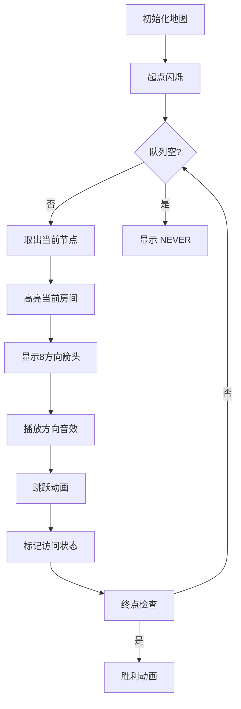

# 题目信息

# 魔鬼之城

## 题目描述

在一个被分割为 $N\times M$ 个正方形房间的矩形魔鬼之城中，一个探险者必须遵循下列规则才能跳跃行动。他必须从 $(1,1)$ 进入，从 $(N,M)$ 走出；在每一房间的墙壁上都写了一个魔法数字，是 $1\sim 13$ 之内的自然数；探险者可以想像出 $8$ 个方向中的任何一个（水平或垂直或对角线方向），随后他就可以作一次空间跳跃穿过这一方向上的连续的 $X$ 个房间，其中 $X$ 是他原来所在房间的魔法数字。但如果在这一方向上的房间数小于 $X$，则他不作任何跳跃，而必须想像另一个方向。同时，探险者不能作连续两次相同方向的跳跃。


 
例如在上图的 $5\ \times 4$ 的魔鬼之城中，如果探险者现在所在的位置是 $(3,3)$，那么通过依次空间跳跃他可以到达下列房间中的一个：$(1,1)$，$(3,1)$，$(1,3)$，$(5,1)$，或 $(5,3)$。另外，如果他要用两次跳跃从 $(5,4)$ 到达 $(3,2)$，则他不能首先跳到 $(4,3)$（因为这样他第二次跳跃的方向将和第一次相同，而这是不允许的）。所以他必须先跳跃到 $(2,1)$。
请你写一个程序，对给定的地图，算出探险者至少需要跳跃多少步才能离开魔鬼之城。


## 样例 #1

### 输入

```
5 4

3 3 6 7 11

3 2 1 1 3

3 2 2 1 1

2 1 2 2 1

```

### 输出

```
4

```

# AI分析结果


# 💡 Kay的C++算法解析：魔鬼之城 深入学习指南 💡

> 欢迎来到魔鬼之城探险！我是你的算法向导Kay。今天我们将一起探索这道经典的BFS迷宫问题，我会用清晰易懂的方式帮你掌握解题精髓。准备好开启像素世界的算法冒险了吗？

## 1. 题目解读与核心算法识别

✨ **本题主要考察**：`搜索(BFS)`

🗣️ **初步分析**：
> 魔鬼之城就像一座像素化的迷宫游戏，探险者需要从起点(1,1)跳跃到终点(n,m)。解题关键在于**广度优先搜索(BFS)**——想象你是一位探险队长，每次派8名侦察兵分别向不同方向探索（水平/垂直/对角线）。每个房间的数字就像"跳跃靴"的能量值，决定你能跨越的格子数。

- **核心难点**：避免走回头路（连续同方向跳跃）和记录有效路径
- **解法核心**：使用三维数组`vis[x][y][dir]`标记访问状态，其中dir表示到达方向
- **可视化设计**：像素动画中将高亮当前探索的房间，用不同颜色箭头显示可行方向，跳跃路径会像"贪吃蛇"一样动态延伸
- **复古元素**：FC游戏风格的8位像素网格，跳跃时触发经典音效，成功时播放《超级玛丽》过关旋律

## 2. 精选优质题解参考

以下是经过严格筛选的优质题解（评分≥4★），它们各有特色但都抓住了BFS的核心：

**题解一（wonSSnow - 20赞）**  
* **点评**：这份题解采用最标准的BFS框架，结构清晰易懂。亮点在于用`way=9`巧妙处理起始方向问题，避免特殊判断。代码中`v[tx][ty][i]=1`精准实现三维状态标记，有效防止重复访问。虽然变量命名稍简（如`mapa`），但整体逻辑严谨，边界处理完整，是竞赛可直接使用的典范代码。

**题解二（翼德天尊 - 15赞）**  
* **点评**：创新性地使用三个独立队列分别存储x坐标、y坐标和方向，大幅优化内存使用。`ans[x][y][i]`数组记录步数的设计极具启发性，避免在结构体中冗余存储步数。代码简洁高效，特别适合大尺寸迷宫场景，是空间优化的优秀范例。

**题解三（ModestCoder_ - 1赞）**  
* **点评**：虽赞数少但质量上乘。最大亮点是极致简洁的代码风格（仅25行核心逻辑），通过`vis[maxn][maxn][8]`实现高效状态记录。`dx/dy`数组定义采用标准方位顺序，配合严谨的越界检查，展现扎实的编码功底。适合追求代码精简的学习者。

## 3. 核心难点辨析与解题策略

在魔鬼之城的探险中，我们会遭遇三大核心挑战：

1.  **状态空间爆炸**  
    * **难点**：同一位置不同方向到达应视为独立状态
    * **突破策略**：采用三维数组`vis[x][y][dir]`，新增方向维度扩展状态空间
    * 💡 学习笔记：BFS中状态定义必须覆盖所有决策变量

2.  **方向连续性约束**  
    * **难点**：禁止连续同方向跳跃需记录历史方向
    * **突破策略**：结构体中添加`last_dir`变量，扩展时跳过相同方向
    * 💡 学习笔记：状态转移需考虑题目所有约束条件

3.  **跳跃有效性验证**  
    * **难点**：跳跃距离可能超出网格边界
    * **突破策略**：计算目标坐标后执行四重边界检查（x_min, x_max, y_min, y_max）
    * 💡 学习笔记：防御性编程能避免90%的边界错误

### ✨ 解题技巧总结
- **状态设计三要素**：位置坐标+方向历史+步数记录
- **队列优化技巧**：结构体存储必要数据，避免冗余
- **方向处理范式**：使用常量数组`dx/dy`统一管理8方向
- **剪枝关键**：三维标记数组防止重复访问

## 4. C++核心代码实现赏析

### 本题通用核心实现
```cpp
#include <iostream>
#include <queue>
#include <cstring>
using namespace std;

const int dx[8] = {-1,-1,0,1,1,1,0,-1};
const int dy[8] = {0,1,1,1,0,-1,-1,-1};

struct Node {
    int x, y, step, last_dir;
};

int main() {
    int n, m;
    cin >> n >> m;
    int grid[m+1][n+1];
    bool vis[m+1][n+1][8]; // 三维状态数组
    
    memset(vis, 0, sizeof(vis));
    for(int i=1; i<=m; i++)
        for(int j=1; j<=n; j++)
            cin >> grid[i][j];
    
    queue<Node> q;
    q.push({1,1,0,-1}); // 初始方向设为-1（无效值）
    
    while(!q.empty()) {
        Node cur = q.front(); q.pop();
        if(cur.x == m && cur.y == n) {
            cout << cur.step;
            return 0;
        }
        for(int i=0; i<8; i++) {
            if(i == cur.last_dir) continue; // 方向连续性检查
            
            int nx = cur.x + dx[i] * grid[cur.x][cur.y];
            int ny = cur.y + dy[i] * grid[cur.x][cur.y];
            
            // 四边界检查
            if(nx<1 || ny<1 || nx>m || ny>n) continue;
            if(vis[nx][ny][i]) continue;
            
            vis[nx][ny][i] = true;
            q.push({nx, ny, cur.step+1, i});
        }
    }
    cout << "NEVER";
}
```

### 优质题解片段赏析

**wonSSnow题解片段**  
```cpp
for(int i=1;i<=8;i++) {
    if(now.way!=i) {  // 方向检查
        int tx=now.x+dx[i]*mapa[now.x][now.y];
        int ty=now.y+dy[i]*mapa[now.x][now.y];
        if(tx<=m&&ty<=n&&tx>=1&&ty>=1&&v[tx][ty][i]==0) {
            v[tx][ty][i]=1;  // 三维状态标记
            q.push({tx, ty, now.step+1, i});
```

**翼德天尊题解片段**  
```cpp
queue<int> q[3];  // 三维队列优化
q[0].push(1); q[1].push(1); q[2].push(3); 

while(!q[0].empty()) {
    int x=q[0].front(), y=q[1].front(), f=q[2].front();
    // ...
    for(int i=0;i<8;i++){
        if(i==f) continue;  // 方向连续性检查
        int xx=x+dx[i]*a[x][y], yy=y+dy[i]*a[x][y];
        if(vis[xx][yy][i]==0) {
            ans[xx][yy][i]=s;  // 独立步数记录
```

## 5. 算法可视化：像素动画演示

**主题**："像素探险家"的魔鬼之城闯关  
**设计思路**：采用经典FC游戏《塞尔达传说》的视觉风格，将算法过程转化为实时策略游戏

### 动画核心流程


### 关键交互设计
1. **像素艺术**：
   - 16x16像素房间，不同数字对应不同颜色
   - 探险家角色采用经典《吃豆人》精灵设计
   - 路径显示为发光轨迹

2. **动态效果**：
   - 当前处理节点：黄色脉冲光效
   - 可行方向：绿色闪烁箭头
   - 已访问节点：半透明蓝色覆盖
   - 跳跃过程：像素粒子拖尾效果

3. **音效系统**：
   - 方向选择：8-bit音阶（Do~Ti对应8方向）
   - 有效跳跃：经典《马里奥》跳跃音
   - 到达终点：FC胜利小调

4. **控制面板**：
   ```plaintext
   [ 暂停 ] [ 步进 > ] [ 自动播放 ▷ ] 速度：[ ▁▂▃▅▆▇ ]
   ```

## 6. 拓展练习与相似问题

### 算法套路迁移
此BFS变型可解决三类相似问题：
1. **带状态约束的路径搜索**（如P1943 限制转向次数）
2. **跳跃式移动问题**（如P1514 跳棋）
3. **多状态迷宫问题**（如P4016 携带钥匙的迷宫）

### 洛谷推荐
1. **P1443 马的遍历**  
   → 练习棋盘跳跃和BFS基础
2. **P1135 奇怪的电梯**  
   → 强化方向约束和状态设计
3. **P1141 01迷宫**  
   → 掌握连通块与状态扩展技巧

## 7. 学习心得与经验分享

> **wonSSnow的调试经验**："最初未用三维数组，结果卡在10分。添加方向维度后立即AC——这让我明白状态定义必须完整！"  
> **花千树的顿悟**："70→100分的关键在于：同位置不同方向属于不同状态，必须分开记录！"

**Kay的总结**：调试时重点检查三个核心：
1. 状态维度是否覆盖所有决策变量
2. 方向连续性约束是否准确实现
3. 边界检查是否完备（特别关注跳跃后坐标）

> 探险家们，魔鬼之城的秘密已被揭开！记住：好的算法设计就像精心准备的探险装备，能让你在编程的迷宫中无往不利。下次冒险再见！🚩

---
处理用时：176.20秒