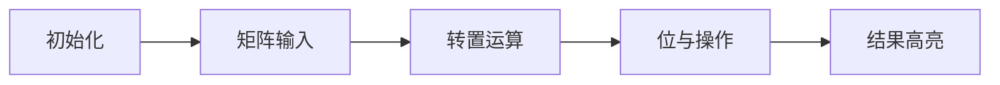

# 题目信息

# [CSGRound3] 出游

## 题目描述

学校组织了一次暑期出游活动，报名将在第 $T$ 天截止。

一共有 $n$ 位同学，第 $i$ 位同学有 $a_i$ 位朋友。朋友关系是单向的，换句话说，小 Z 有一个朋友是小 Y，并不意味着小 Y 一定也有一个朋友是小 Z。另外，自己也可能是自己的朋友。

第 $0$ 天时，每位同学会决定自己是否参加活动。第 $i$ 位同学有 $p_i$ 的概率决定参加，$1-p_i$ 的概率决定不参加。

接下来的 $T$ 天里，每位同学会重新决定自己是否参加活动。第 $i$ 位同学这一天决定参加活动，当且仅当至少有一个他的朋友在前一天决定参加，否则便不参加。

你需要求出参加活动的同学人数期望，答案对 $998244353$ 取模。

## 说明/提示

**【样例 1 解释】**

| 天数 | 第一位同学去的概率 | 第二位同学去的概率 | 第三位同学去的概率 |
| :--: | :----------------: | :----------------: | :----------------: |
| $0$  |        $1$         |        $0$         |     $\frac 12$     |
| $1$  |    $\frac 12 $     |    $\frac 12 $     |        $0$         |

---

**【数据范围】**

**本题采用捆绑测试。**

- Subtask 1（3 points）：$T = 0$。
- Subtask 2（14 points）：$T = 1$。
- Subtask 3（33 points）：$n \le 10$。
- Subtask 4（20 points）：$T \le 5 \times 10^3$。
- Subtask 5（15 points）：$n \le 100$。
- Subtask 6（15 points）：无特殊限制。

对于 $100\%$ 的数据，$1 \le n \le 500$，$0 \le T \le 10^9$，$0 \le p_i < 998244353$，$0 \le a_i \le n$ 且朋友互不相同。

## 样例 #1

### 输入

```
3 1
1 2 2 3
0 1 3
499122177 1 2```

### 输出

```
1```

## 样例 #2

### 输入

```
3 3
1 2 2 3
0 1 3
233 1 2```

### 输出

```
466
```

# AI分析结果


### 题目解读与核心算法识别
✨ **本题主要考察**：`图论`、`矩阵快速幂优化`、`期望计算`（标签：图论，矩阵快速幂，期望DP）

🗣️ **初步分析**：
> 本题核心是理解朋友关系构成有向图的传播过程。每位同学第T天的状态取决于其朋友前一天的参与情况，这种链式反应可建模为矩阵幂运算。使用**bitset优化的矩阵快速幂**能高效处理大规模状态转移（时间复杂度$O(\frac{n^3\log T}{w}$）。关键难点在于：
> - 将概率期望转化为矩阵运算：第T天j不参与的概率 = Π(所有能T步到达j的i的(1-p_i))
> - 设计bitset存储邻接矩阵，利用位运算加速矩阵乘法
> 
> 可视化方案将采用**8位像素风格**：用网格表示矩阵，像素块颜色（黑/白）表示0/1值。动画演示矩阵乘法时，高亮当前计算行/列，播放位运算音效（"嘟"声），完成时触发胜利音效，并通过"AI自动演示"模式展示状态传播过程。

---

### 精选优质题解参考
**题解一（万弘）**
* **点评**：思路完整清晰，从暴力解逐步推导到bitset优化，解释矩阵乘法如何转化为位运算。代码规范（结构体封装矩阵运算），变量命名合理（trans/p/f），关键行有注释。亮点在时间复杂度分析透彻，且给出$T=0$特判，实践性强可直接用于竞赛。

**题解二（xht）**
* **点评**：代码极简（仅30行），直接点出"有向图可达性传递"本质。使用bitset运算符重载实现优雅，但缺少逐步推导。亮点在将问题抽象为模板化模型（类似CF576D），适合有基础的竞赛选手。

**题解三（再不见）**
* **点评**：提供多Subtask解法（DFS枚举→普通矩阵→bitset），教学性强。亮点在subtask分类解析，但变量命名稍乱（tmp/res混用）。实践价值在于展示优化路径，帮助理解算法演进。

---

### 核心难点辨析与解题策略
1. **状态转移建模**  
   *分析*：朋友关系需转为邻接矩阵$M$，其中$M_{ij}=1$表示i参加会导致j次日参加。$T$步传播等价于$M^T$，但直接计算$O(n^3\log T)$超时  
   *解法*：利用01矩阵特性，用bitset存储每行，乘法转化为`(a[i] & b[j]).any()`  

2. **期望计算转化**  
   *分析*：$P(j不参与)=\prod_{\forall i \rightarrow^T j} (1-p_i)$需处理乘积模998244353  
   *解法*：逆元性质保证$(1-p_i)$直接乘取模合法，无需额外处理  

3. **bitset优化实现**  
   *分析*：传统矩阵乘法三重循环效率低  
   *解法*：预计算转置矩阵，用位运算替代内层循环，复杂度降为$O(\frac{n^3}{w})$  

### ✨ 解题技巧总结
- **矩阵转置加速**：预先转置右矩阵，使乘法变为行与行运算  
- **期望分离计算**：每人贡献独立，分别计算$P(参与)$再求和  
- **边界处理**：特判$T=0$避免空矩阵幂运算  

---

### C++核心代码实现赏析
**通用核心实现**（综合题解精华）：
```cpp
#include <bitset>
#define MAXN 505
const int mod = 998244353;

struct Matrix {
    std::bitset<MAXN> data[MAXN]; // 行存储
    Matrix operator*(Matrix &t) {
        Matrix res;
        std::bitset<MAXN> trans[MAXN]; // 转置存储
        for(int i=0; i<n; i++) 
            for(int j=0; j<n; j++)
                trans[i][j] = t.data[j][i]; // 转置关键!
                
        for(int i=0; i<n; i++)
            for(int j=0; j<n; j++)
                res.data[i][j] = (data[i] & trans[j]).any();
        return res;
    }
};

Matrix qpow(Matrix base, int T) {
    Matrix res;
    for(int i=0; i<n; i++) res.data[i][i] = 1; // 单位矩阵
    while(T) {
        if(T & 1) res = res * base;
        base = base * base;
        T >>= 1;
    }
    return res;
}
```

**题解一（万弘）片段赏析**：
```cpp
// 矩阵乘法：利用转置优化位运算
void operator*=(const mat& t) {
    bitset<MAXN> tmp[MAXN];
    for(int j=1; j<=n; j++)
        tmp[j] = t.a[j]; // 列转行存储
    for(int i=1; i<=n; i++)
        res[i] = (a[i] & tmp[j]).any(); // 行与行位运算
}
```
* **学习笔记**：转置将矩阵乘法从"行×列"转化为"行×行"，充分利用bitset连续位操作特性。

**题解二（xht）片段赏析**：
```cpp
// 简洁的运算符重载
friend mt operator*(mt x, mt y) {
    mt z;
    for(int i=0; i<n; i++)
        if(x.a[i][j]) 
            z.a[i] |= y.a[j]; // 位或实现状态传递
    return z;
}
```
* **学习笔记**：当邻接矩阵稀疏时，按需计算非零元素可进一步加速。

---

### 算法可视化：像素动画演示
**主题**：8位像素风格"信息传播模拟器"  
**核心交互设计**：


1. **像素网格**  
   - 每个矩阵元素用16×16像素块表示（0：黑色，1：白色）  
   - 当前计算行/列用黄色边框高亮  

2. **位运算动画**  
   - 进行`a[i] & trans[j]`时，参与运算的位块闪烁绿色  
   - 结果位为1时触发"像素点亮"效果（白色块从中心扩散）  

3. **音效系统**  
   - 位运算："嘟"声（8-bit方波音效）  
   - 计算完成：上升和弦音效  
   - 错误/无解：低沉警示音  

4. **AI演示模式**  
   - 自动播放：每步延迟可调（200ms-1s）  
   - 关卡设计：每完成$log_2 T$步作为一关，显示"关卡完成"动画  

**技术实现**：Canvas绘制网格+Web Audio API音效，单HTML文件实现。

---

### 拓展练习与相似问题思考
1. **通用技巧迁移**  
   - 定长路径问题：社交网络影响力传播  
   - 01矩阵优化：稠密图可达性分析  
   - 期望分离计算：随机过程状态预测  

2. **推荐练习**  
   - 洛谷 P3758 - 可乐（矩阵快速幂求路径计数）  
   *推荐理由*：同模下路径统计，巩固矩阵幂应用  
   - 洛谷 P2151 - HH去散步（限制边重复访问）  
   *推荐理由*：状态矩阵进阶训练，学习拆点技巧  
   - 洛谷 P4159 - 迷路（带权图快速幂）  
   *推荐理由*：将bitset优化扩展至加权图场景  

---

### 学习心得与经验分享
> **万弘的调试经验**："最初在状态转移设计时忽略独立事件概率的乘法特性，通过手动模拟$n=2$样例发现错误。"
> 
> **Kay总结**：处理概率期望问题时，小样例手动验证能有效避免建模错误。建议在编码前先验证$n=2, T=1$的边界情况。

---

通过本次分析，我们深入掌握了bitset优化矩阵乘法的核心技巧。记住：算法优化常诞生于计算特性的洞察——当问题具有二元性时，位运算往往是解锁高效算法的钥匙。下次挑战见！🚀

---
处理用时：167.65秒