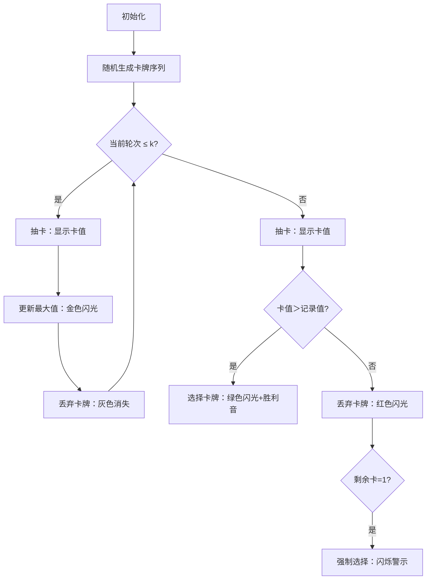

# 题目信息

# [加油武汉] 居家隔离

## 题目背景

为了防止感染，大家要自觉做到居家隔离，少外出少与外人接触。

## 题目描述

居家久了，你需要给自己找点娱乐。于是你看到这么一个游戏：
给定一个 $n$ 元集合 $ \{a_1,a_2,a_3....a_n \}$，元素各不相同。

游戏总共会进行 $n$ 轮，每轮系统会从集合中随机挑出一个元素，记作 $x$。你可以有如下两种选择：

1. 取走 $x$，那么 $x$ 将会是你的最终得分。
2. 舍弃 $x$，此时 $x$ 将会永久的从这个集合中删去，并且进入下一轮。

请注意，若是集合中仅剩唯一一个元素时，该元素无法被舍弃。

由于你很懒，所以你指定了一个很咸鱼的策略：

对于前 $k$ 轮，将得到的数全部舍弃，并且记录下得到的数中的最大值，记作 $y$。

在第 $k$ 轮之后，执行如下策略：

若是取得的 $x > y$，则直接取走 $x$。反之不断舍弃，直到找到了一个满足要求的 $x$ 或是仅剩一个元素。

现在你希望知道，对于 $1$ 到 $n-1$ 的每一个 $k$，你期望下的得分是多少。

所有数请对 $998244353$ 取模。

## 说明/提示

**样例解释**

答案输出的四个数应该分别是 $\frac{39}{10}, \frac{19}{5} ,\frac{69}{20}, 3$，但在模意义下除以一个数相当于乘这个数在模意义下的逆元，因此输出为这些数。举例来说 $\frac{39}{10}\equiv 39\cdot 10^{-1}\equiv 39\cdot 299473306\equiv 698771051\pmod{998244353}$。

提示：如果你不知道如何对一个分数取余，请点这里：<https://www.luogu.com.cn/problem/P2613>


 - 对于 $40\%$ 的数据，满足 $2 \leq n \leq 10$；
 - 对于 $60\%$ 的数据，满足集合为 $[1,n]$ 中所有正整数；
 - 对于 $100\%$ 的数据，满足 $2 \leq n \leq 1000$，集合中所有数字不超过 $10000$。

## 样例 #1

### 输入

```
5
1 2 3 4 5```

### 输出

```
698771051 399297745 349385527 3```

# AI分析结果


# 💡 Kay的C++算法解析：居家隔离 深入学习指南 💡

## 1. 题目解读与核心算法识别

✨ **本题主要考察**：组合数学与期望计算

🗣️ **初步分析**：
> 这道题就像一个抽卡策略游戏：前k次抽卡你都放弃，记录最大卡值y；之后遇到比y大的卡就立刻拿走。核心在于计算不同k下的期望得分。
> - **组合数学**：通过枚举最大值位置，用组合数和阶乘计算所有有效排列方案
> - **期望计算**：总得分=每种情况的得分×出现概率，最后取模
> - **可视化设计**：将展示像素风格的抽卡过程：前k张卡被丢弃(灰色)，记录最大值(金色闪光)，后续抽卡时若大于y则高亮选择(绿色闪光)，否则丢弃(红色闪光)。音效配合关键操作(抽卡声/选择胜利音)

---

## 2. 精选优质题解参考

**题解一 (来源：TheShadow)**
* **点评**：思路最完整清晰，通过分情况讨论(最大值是否全局最大)建立组合模型。代码规范(fac/ifac变量名明确)，利用前缀和优化计算。亮点在严谨处理边界条件(如取模)和空间优化，可直接用于竞赛。

**题解二 (来源：xiayuyang)**
* **点评**：从概率角度创新推导，计算每个数成为前k轮最大值的概率。代码中组合数计算规范，亮点在独特概率视角：$ans = C(j-1,i-1)/C(n,i)×(sum_{j+1}/(n-j))$，提供另一种理解方式。

**题解三 (来源：arrow_king)**
* **点评**：公式最简洁，明确分两种情况计算。代码中排列计算($A(n,k)$)的使用直观，亮点在联系"秘书问题"的经典模型，启发解题思维。

---

## 3. 核心难点辨析与解题策略

1.  **难点：避免重复枚举排列**
    * **分析**：直接枚举$n!$排列不可行。优质解通过固定最大值位置$i$，计算该位置成为前$k$轮最大值的方案数：$C(i-1,k-1)×k!×...$
    * 💡 **学习笔记**：组合计数是处理大规模排列问题的利器

2.  **难点：分情况处理全局最大值**
    * **分析**：当$i=n$时，策略会强制选择最后一张卡。需单独计算方案：$k×(n-2)!$，否则会漏解
    * 💡 **学习笔记**：极值特判是期望问题的常见陷阱

3.  **难点：高效计算得分贡献**
    * **分析**：每个$i$对应多个可能答案。通过排序+前缀和，用$sum_{j+1}$快速计算$>i$的数和
    * 💡 **学习笔记**：前缀和是优化区间求和的标配技巧

### ✨ 解题技巧总结
- **组合建模**：将随机过程转化为位置固定的组合问题
- **分类讨论**：区分全局最大值/非全局最大值情况
- **前缀和优化**：预处理排序后数组的和
- **模逆元处理**：用$qpow(div,mod-2,mod)$实现除法的取模

---

## 4. C++核心代码实现赏析

**通用核心实现 (综合优质题解)**
```cpp
#include<bits/stdc++.h>
#define mod 998244353
using namespace std;
typedef long long ll;
const int N=1005;

ll n,a[N],fac[N],inv[N],sum[N];
ll qpow(ll a,ll b){...} // 快速幂
ll C(ll n,ll m){return fac[n]*inv[m]%mod*inv[n-m]%mod;} // 组合数

void solve(){
    // 预处理阶乘和逆元
    fac[0]=1;
    for(int i=1;i<=n;i++) fac[i]=fac[i-1]*i%mod;
    inv[n]=qpow(fac[n],mod-2);
    for(int i=n-1;i>=0;i--) inv[i]=inv[i+1]*(i+1)%mod;
    
    sort(a+1,a+n+1); // 排序
    for(int i=1;i<=n;i++) sum[i]=(sum[i-1]+a[i])%mod; // 前缀和
    
    // 枚举k
    for(int k=1;k<n;k++){
        ll res=0;
        // 枚举最大值位置i
        for(int i=k;i<n;i++){ // 非全局最大
            ll t=C(i-1,k-1)*fac[k]%mod;
            t=t*C(n-k,i-k)%mod*fac[i-k]%mod;
            t=t*fac[n-i-1]%mod;
            t=t*(sum[n]-sum[i]+mod)%mod;
            res=(res+t)%mod;
        }
        // 全局最大(i=n)
        ll t=C(n-2,k-1)*fac[k]%mod;
        t=t*fac[n-k-1]%mod*sum[n-1]%mod;
        res=(res+t)%mod;
        
        // 期望=总得分/排列数
        res=res*qpow(fac[n],mod-2,mod)%mod;
        cout<<res<<" ";
    }
}
```

**题解一赏析 (TheShadow)**
```cpp
void Solve(int k){
    int res=0;
    for(int i=k;i<n;i++){ // 枚举最大值位置
        int tval=(sum[n]-sum[i])%mod; // >i的数和
        tval=tval*C(i-1,k-1)%mod;    // 前k-1位置组合
        tval=tval*C(n-k,i-k)%mod;    // 剩余位置组合
        tval=tval*fac[k]%mod*fac[i-k]%mod*fac[n-i-1]%mod;
        res=(res+tval)%mod;
    }
    // 全局最大情况
    int tval=C(n-2,k-1)*fac[k]%mod*fac[n-k-1]%mod*sum[n-1]%mod;
    res=(res+tval)%mod;
    res=res*qpow(fac[n],mod-2,mod)%mod; // 乘逆元
}
```
* **亮点**：组合数公式清晰，变量命名规范
* **学习笔记**：前缀和$sum$避免重复求和是核心优化

**题解二赏析 (xiayuyang)**
```cpp
for(int j=i;j<n;j++){ // 枚举最大值位置
    // 概率公式：C(j-1,i-1)/C(n,i) * (sum_{j+1}/(n-j))
    ans = (ans + C(j-1,i-1)*inv[C(n,i)]%mod 
                * sum[j+1]%mod * inv[n-j]%mod)%mod;
}
```
* **亮点**：概率视角的独特实现
* **学习笔记**：$inv[n-j]$巧妙替代除法取模

---

## 5. 算法可视化：像素动画演示

**主题**：8-bit抽卡策略模拟器  
**核心演示**：动态展示策略执行过程 + 数据变化  



**关键交互**：
1. **像素风格**：FC红白机色调(4色)，卡牌=16×16像素方块
2. **控制面板**：
   - 调速滑块(0.5x~3x)
   - 单步/暂停/重置
   - k值选择器(1~n-1)
3. **动画逻辑**：
   - 抽卡时播放8-bit"翻牌音"
   - 选择卡牌时触发"胜利旋律"
   - 丢弃卡牌时红色闪烁+"错误音"
4. **AI演示模式**：自动运行不同k值策略，并标注期望得分

---

## 6. 拓展练习与相似问题

**通用技巧迁移**：
1. 组合计数 → 概率期望问题
2. 前缀和优化 → 区间统计问题
3. 策略期望 → 最优停止理论

**推荐练习**：
1. **P2111 [NOI2008] 糖果雨**  
   → 强化期望计算能力
2. **P1850 [NOIP2016] 换教室**  
   → 复杂期望DP实战
3. **P2219 [HAOI2007] 理想的正方形**  
   → 二维组合优化进阶

---

## 7. 学习心得与经验分享

> **参考经验 (arrow_king)**:  
> "这道题本质是经典'秘书问题'（最优停止理论），前k次观察后选择首个更优项的策略，在算法设计中具有普适性"

> **Kay的总结**：  
> 1. 经典数学模型能提供解题框架  
> 2. 枚举固定点+组合计数是处理随机过程的有效手段  
> 3. 前缀和预处理是优化求和的关键步骤

--- 

掌握组合数学与期望计算的精髓，你就能在概率王国游刃有余！下次见~ 🚀

---
处理用时：176.26秒