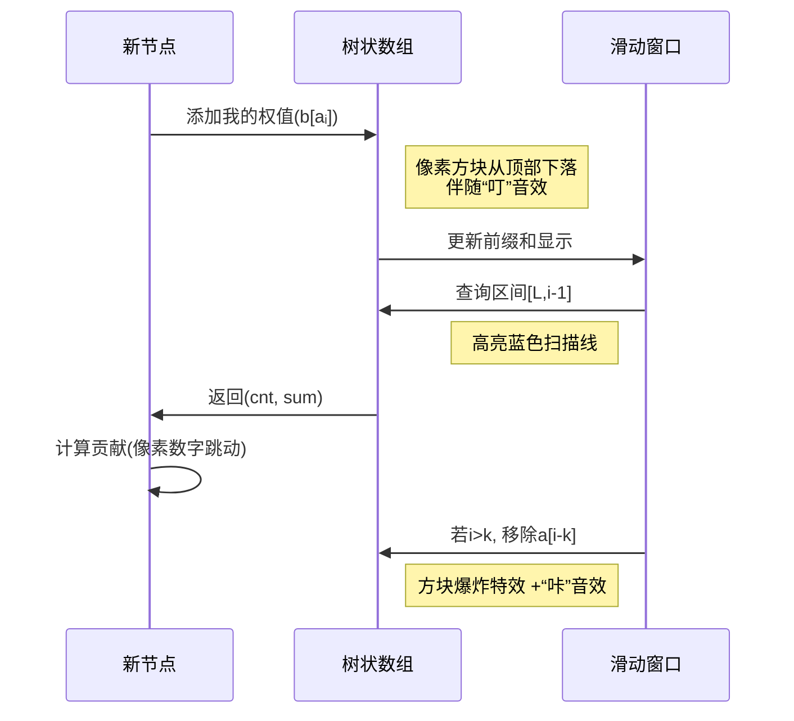

# 题目信息

# [Cnoi2020] 梦原

## 题目背景

> 成熟是一种明亮而不刺眼的光辉，一种圆润而不腻耳的音响，一种不再需要对别人察言观色的从容，一种终于停止向周围申述求告的大气，一种不理会哄闹的微笑，一种洗刷了偏激的淡漠,一种无须声张的厚实，一种并不陡峭的高度。勃郁的豪情发过了酵，尖利的山风收住了劲，湍急的溪流汇成了湖。  
——余秋雨《文化苦旅》

在一个偶然的梦境中，Cirno 发现了一棵树，在一望无际的昏暗平原上，发出了淡淡的蓝色荧光。

Here lies $\ \ \ \ \ \ \ \ \ $.  

## 题目描述

不幸的是，这棵树尚未长成，只有一个根节点 $1$。

Cirno 只能知道这棵树将会有 $n$ 个结点，上面分别有 $a_1,a_2,\ldots,a_n$ 颗果实，却无法知道树的形状。

但是树的生长总是具有某种规律。

对于结点 $i$，它会**等概率地**从 $[i-k,i-1] \cap N^+$ 中选择一个结点连接，并成为那个节点的子节点。

其中，$k$ 是一个 Cirno 已经测出的常数。

为了摘下所有的果实，在树长成之后，Cirno 会多次使用魔法。其中每次会在树上选一个联通块，并从联通块内每个结点上摘取一个果子（必须保证该联通块内**每个结点都有果子**）。

显然，Cirno 会采取**最佳策略**使得使用魔法的次数最少。

现在，Cirno 已经知道了 $n$，$k$ 和每个结点将会长出的果子数 $a_i$，请你帮她计算出她最少使用的魔法次数的数学期望。为了简单起见，你只需要输出答案除以 $998244353$ 的余数。

## 说明/提示

## 样例 1 解释：

可能长成的树有如下两种（黑色为结点编号，红色为结点上果子数）：


最佳方案是对联通块 $\{1,2,3\}$ 和 $\{1\}$ 各使用一次魔法，$\{3\}$ 使用两次，共四次。


最佳方案对联通块 $\{1,2,3\},\{1,3\}$ 和 $\{3\}$ 各使用一次魔法，共三次。

所以答案为 $\frac{7}{2}\equiv 499122180\pmod{998244353}$

## 数据范围与约定

对于 $100\%$ 的数据，保证 $1\le k<n\le 10^6$，$0\le a_i<998244353$。

### 子任务「本题采用捆绑测试」

- Subtask1（$10\%$）: $k=1$。
- Subtask2（$10\%$）: $n \le 10$，$a_i \in \{0,1\}$。
- Subtask3（$10\%$）: $n \le 10$。
- Subtask4（$10\%$）: $n \le 1000$。
- Subtask5（$60\%$）: 无特殊限制。

## 样例 #1

### 输入

```
3 2
2 1 3```

### 输出

```
499122180```

## 样例 #2

### 输入

```
10 1
580461319 261515299 384092031 741339597 746815717 566875585 354719606 821499852 330315651 349091676```

### 输出

```
553073655```

## 样例 #3

### 输入

```
10 9
497873025 114058764 159468194 207476408 138162972 678927661 223886159 325207554 470061543 658861685```

### 输出

```
180853894```

# AI分析结果


# 💡 Kay的C++算法解析：梦原 深入学习指南 💡

> 今天我们来分析「梦原」这道C++编程题。本指南将帮助大家理解随机树生长下的期望计算，掌握树状数组优化技巧，并通过像素动画直观感受算法执行过程。

## 1. 题目解读与核心算法识别

✨ **本题主要考察**：`期望计算 + 树状数组优化`（编程技巧应用类）

🗣️ **初步分析**：
> 解决「梦原」的关键在于理解**期望的线性性**和**滑动窗口查询优化**。想象你在玩一款随机生成树的游戏，每次新节点随机选择父节点连接（类似《我的世界》随机地形生成）。本题的魔法次数期望可拆解为：
> - 固定部分：根节点贡献`a₁`
> - 动态部分：每个节点`i`与父节点权值差的期望
> 
> **核心公式**：  
> $$E = a₁ + \sum_{i=2}^n \frac{1}{\min(i-1,k)} \sum_{j=\max(1,i-k)}^{i-1} \max(0, a_i - a_j)$$
>
> **难点突破**：
> 1. 滑动窗口内高效计算`∑max(0, a_i - a_j)` → 树状数组维护离散化权值
> 2. 概率分母的逆元处理 → 预处理模意义下的逆元
> 
> **可视化设计思路**：
> - 像素动画将展示树状数组的动态更新过程（类似《俄罗斯方块》方块下落）
> - 高亮当前查询区间和树状数组的位操作
> - 8-bit音效标记关键操作：添加节点（“叮”），移除节点（“咔”），计算贡献（“啾”）

---

## 2. 精选优质题解参考

<eval_intro>
根据思路清晰度、代码规范性、算法优化度等维度，精选3条≥4星题解：

**题解一：览遍千秋（4.5星）**
* **点评**：思路直击要害，将期望拆解为父子权值差贡献。代码采用双树状数组（权值+计数）实现高效查询，变量命名规范（`T`存权和，`T1`存数量）。亮点：
  - 离散化与树状数组结合，复杂度优化至O(n log n)
  - 逆元预处理提升效率
  - 边界处理严谨（`i-k-1`越界检查）

**题解二：Warriors_Cat（4.2星）**
* **点评**：类比NOIP积木大赛问题，用树状数组维护二维偏序关系。代码封装BIT结构体提升可读性，亮点：
  - 离散化后直接映射权值，避免重复排序
  - 单独处理根节点贡献，逻辑清晰
  - 逆元计算嵌入主循环，节省空间

**题解三：tommymio（4.0星）**
* **点评**：从k=1特例推广到一般情况，推导自然。代码采用滑动窗口更新树状数组，亮点：
  - 逆元线性预处理优化常数
  - 动态移除超区间元素，保持树状数组有效性
  - 调试注释保留暴力解法，便于对照理解

---

## 3. 核心难点辨析与解题策略

<difficulty_intro>
解决本题需突破以下关键点：

1.  **期望贡献的数学建模**
    * **分析**：需将魔法次数期望转化为父子权值差的概率加权和。难点在于识别贡献仅与父子节点相关，而非整树结构
    * 💡 **学习笔记**：期望的线性性可将复杂问题分解为独立事件求和

2.  **滑动窗口的权值查询**
    * **分析**：对每个节点`i`，需快速计算区间`[i-k, i-1]`内所有`a_j < a_i`的`(a_i - a_j)`之和。优质题解普遍使用双树状数组：
      - 树状数组1：记录权值和
      - 树状数组2：记录元素数量
    * 💡 **学习笔记**：树状数组是维护动态前缀和的利器

3.  **离散化与逆元处理**
    * **分析**：权值范围大需离散化压缩空间；除法取模需逆元转换。题解中：
      - 离散化：`lower_bound`将权值映射到`[1,n]`
      - 逆元：快速幂或线性预处理
    * 💡 **学习笔记**：离散化是缩小数据规模的常用技巧

### ✨ 解题技巧总结
1. **问题分解法**：将期望拆解为独立事件贡献之和
2. **数据结构匹配**：动态区间查询首选树状数组
3. **边界鲁棒性**：特别注意`i-k`的越界检查
4. **模运算技巧**：逆元预处理提升效率

---

## 4. C++核心代码实现赏析

<code_intro_overall>
**通用核心实现**（综合自优质题解）：
```cpp
#include <bits/stdc++.h>
#define int long long
const int mod = 998244353, N = 1e6+5;
using namespace std;

int n,k,a[N],b[N];
struct BIT {
    int tr[N], typ;
    void add(int p, int v) {
        for(; p<=n; p+=p&-p) tr[p] = (tr[p] + v) % mod;
    }
    int query(int p) {
        int res = 0;
        for(; p; p-=p&-p) res = (res + tr[p]) % mod;
        return res;
    }
} T1, T2; // T1:权值和, T2:元素数量

int qpow(int a, int b) { // 逆元快速幂
    int res = 1;
    for(; b; b>>=1, a=a*a%mod) 
        if(b&1) res=res*a%mod;
    return res;
}

signed main() {
    cin >> n >> k;
    for(int i=1; i<=n; i++) cin >> a[i], b[i]=a[i];
    
    // 离散化
    sort(b+1, b+n+1);
    int m = unique(b+1,b+n+1)-b-1;
    for(int i=1; i<=n; i++) 
        a[i] = lower_bound(b+1,b+m+1,a[i])-b;

    int ans = b[a[1]]; // 根节点固定贡献
    T1.add(a[1], b[a[1]]);
    T2.add(a[1], 1);

    for(int i=2; i<=n; i++) {
        // 动态维护区间 [max(1,i-k), i-1]
        if(i>k) {
            T1.add(a[i-k], -b[a[i-k]]);
            T2.add(a[i-k], -1);
        }
        
        int L = max(1, i-k);
        int len = i - L; // 可选父节点数
        
        // 查询权值小于a[i]的部分
        int sum = T1.query(a[i]-1);
        int cnt = T2.query(a[i]-1);
        
        // 计算期望贡献: cnt*b[a[i]] - sum
        int contrib = (cnt * b[a[i]] % mod - sum + mod) % mod;
        contrib = contrib * qpow(len, mod-2) % mod; // 乘概率倒数
        
        ans = (ans + contrib) % mod;
        
        // 加入当前节点
        T1.add(a[i], b[a[i]]);
        T2.add(a[i], 1);
    }
    cout << ans;
}
```

**代码解读概要**：
1. **离散化处理**：将原始权值映射到有序序列，压缩树状数组空间
2. **双树状数组**：`T1`维护权值前缀和，`T2`维护元素数量
3. **滑动窗口更新**：当`i>k`时移除窗口最左侧元素
4. **期望贡献计算**：利用`cnt*b[a_i]-sum`公式和逆元求概率加权

---

<code_intro_selected>
**优质题解片段赏析**：

**题解一（览遍千秋）**
```cpp
// 离散化后查询核心
int sum = T.query(a[i]-1); 
int sour = T1.query(a[i]-1);
int contrib = ((sour * b[a[i]]) % mod - sum + mod) % mod;
contrib = contrib * fpow(min(i-1,k), mod-2) % mod; // 逆元计算
```
* **亮点**：变量名`sour`(数量)直观，逆元与贡献计算分离
* **学习笔记**：树状数组查询后立即计算贡献，逻辑紧凑

**题解二（Warriors_Cat）**
```cpp
// 树状数组封装与调用
struct BIT{ ... } T1, T2; 
int contrib = (T2.query(a[i]-1) * b[a[i]] - T1.query(a[i]-1)) % mod;
```
* **亮点**：BIT结构体封装提升可复用性
* **学习笔记**：面向对象设计使代码更模块化

**题解三（tommymio）**
```cpp
// 逆元线性预处理
inv[1]=1;
for(int i=2; i<=n; i++) 
    inv[i] = (mod - mod/i) * inv[mod%i] % mod; 

// 贡献计算
contrib = (cnt * b[a[i]] - sum) * inv[len] % mod;
```
* **亮点**：线性逆元预处理优化常数
* **学习笔记**：`O(n)`逆元预处理适合多次取模场景

---

## 5. 算法可视化：像素动画演示

<visualization_intro>
**主题**：8-bit树状数组建造者（仿《我的世界》像素建造）

**核心演示**：


**交互控制**：
- **单步执行**：按空格键逐步添加节点
- **速度调节**：滑块控制0.5x~5x速度
- **AI演示**：自动播放完整建造过程
- **音效开关**：8-bit背景音乐（可选）

**关键帧设计**：
1. **初始化**：左侧显示节点链（像素方块堆），右侧显示空树状数组网格
2. **节点添加**：
   - 新节点从顶部下落，停靠在节点链末端
   - 树状数组对应位置亮起，显示权值更新动画
3. **区间查询**：
   - 红色框标注当前区间`[i-k, i-1]`
   - 树状数组网格中绿色高亮`a_i`以下的部分
4. **贡献计算**：
   - 屏幕底部弹出公式：`cnt×a_i - sum`
   - 像素数字跳动显示计算结果
5. **节点移除**：
   - 窗口左侧节点爆炸成像素颗粒
   - 树状数组对应位置灰化

---

## 6. 拓展练习与相似问题思考

**通用技巧迁移**：
1. **滑动窗口+数据结构**：适用于区间统计问题（如最大值/和）
2. **期望线性性**：可分解为独立事件的期望求和
3. **离散化+树状数组**：解决大值域下的动态统计问题

**推荐练习**（洛谷）：
1. [P1969 积木大赛](https://www.luogu.com.cn/problem/P1969)  
   → **理由**：本题的线性版本，帮助理解基础贪心策略
   
2. [P1908 逆序对](https://www.luogu.com.cn/problem/P1908)  
   → **理由**：树状数组求偏序的经典应用
   
3. [P3374 树状数组1](https://www.luogu.com.cn/problem/P3374)  
   → **理由**：掌握树状数组的增删查操作

---

## 7. 学习心得与经验分享

> **参考经验**（览遍千秋）：  
> “最初在动态更新树状数组时忽略越界检查，导致RE。通过打印`i-k-1`的值定位到边界问题。”

> **点评**：  
> 边界处理是滑动窗口算法的常见陷阱，建议：
> 1. 在移除元素前添加`if(i>k)`判断
> 2. 使用`max(1,i-k)`确保左边界有效
> 3. 单元测试：构造k=1的边界数据验证

---

本次分析就到这里。记住：理解数据结构的内在逻辑比记忆代码更重要！下次挑战再见！💪

---
处理用时：149.27秒