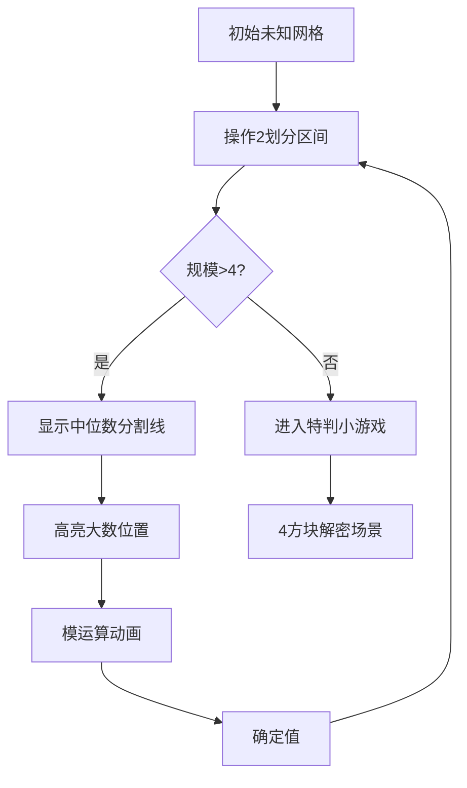

# 题目信息

# 「PMOI-4」猜排列

## 题目背景

**这是一道 IO 交互题。**

**请各位选手确认好再提交，防止评测机爆炸。**

## 题目描述

小 A 有一个长度为 $n$ 的**排列** $a$，他想请你猜一猜这个排列。你仅能给出以下两种询问：

- `! x y`，他将会告诉你 $a_x \bmod a_y$ 的值，其中你询问的数应当满足 $a_x\gt a_y$ 且 $x\ne y$；否则，他会不高兴并直接判定询问不合法，从而导致 `WA`。
- `? l S p`，你需要给小 A 一个大小为 $l$ 的集合 $S$ 与一个整数 $p$，其中 $S=\{x_1,x_2,x_3,\ldots,x_l\}$，其中对于任意 $1\le i\le l$，$1\le x_i\le n$，且 $x_i$ 互不相同，还要满足 $1\le p\le n$，$1\le l\le n$，小 A 将会告诉你这个集合中 $a_{x_k} \ge p$ 的所有的 $x_k$，返回形式如下：首先会返回一个整数 $L$，接着会返回 $L$ 个整数，表示有 $L$ 个满足条件的 $k$（注意返回的是集合 $S$ 中的元素，而不是下标！）。

你最多只能向小 A 询问 $m_1$ 个问题 $1$，$m_2$ 个问题 $2$，其中问题二中询问的集合大小之和应不超过 $m_3$ 来猜出这个序列。

## 说明/提示

【数据范围】

**本题采用捆绑测试。**

| Subtask 编号 | 分值 |$n=$ | $m_1=$ | $m_2=$ | $m_3=$ | 特殊限制 |
| :-----------: | :-----------: | :-----------: | :-----------: | :-----------: | :-----------: | :-----------: |
| $1$ | $10$ | $4$ | $4$ | $1$ | $4$ | 无 | 
| $2$ | $10$ | $5 \times 10^2$ | $5 \times 10^2$ | $5 \times 10^2$ | $2.5\times 10^5$ | 无 |
| $3$ | $10$ | $2 \times 10^4$ | $2 \times 10^4$ | $2 \times 10^4$ | $3 \times 10^5$ | A |
| $4$ | $20$ | $10^4$ | $10^4$ | $30$ | $3 \times 10^5$ | 无 |
| $5$ | $20$ | $5 \times 10^4$ | $5 \times 10^4$ | $34$ | $4 \times 10^5$ | 无 |
| $6$ | $25$ | $5 \times 10^4$ | $5 \times 10^4$ | $17$ |  $1.5\times 10^5$ | 无 |
| $7$ | $5$ | $5 \times 10^4$ | $5 \times 10^4$ | $15$ | $1.5\times 10^5$ | 无 |

**A：保证排列 $a$ 随机构造**。

【提示】

1. 询问不合法或交互库输出数超过 $m$ 后继续询问会直接导致 WA。

2. 数据范围的顶栏都是 $=$ 而非 $\le$。

## 样例 #1

### 输入

```
3 100 100 100

1 3

1 2```

### 输出

```
? 3 1 2 3 3

? 2 1 2 2

A 1 2 3```

# AI分析结果


# 💡 Kay的C++算法解析：猜排列 (PMOI-4) 深入学习指南 💡

> 今天我们来分析“猜排列”这道C++交互题。本指南将帮助你掌握分治策略与模运算技巧，通过清晰的算法解析和生动的可视化演示，助你高效学习！

## 1. 题目解读与核心算法识别

✨ **本题主要考察**：`分治策略` 与 `模运算应用`

🗣️ **初步分析**：
> 猜排列问题如同在迷宫中寻找宝藏。分治策略像将迷宫不断对半分割：每次找到“中位数”作为分界点，将问题规模减半。在本题中：
> - **操作2 (?)** 用于划分区间：找出大于中位数的位置集合
> - **操作1 (!)** 利用模运算性质：当被模数∈[k,2k)时，余数唯一且等于值-k
> 
> **核心流程**：
> 1. 用操作2找出当前区间中位数以上的位置
> 2. 用已知大数通过操作1确定这些位置的值（值 = 模数 + 余数）
> 3. 递归处理剩余区间
> 
> **可视化设计**：
> - **像素风格**：8-bit网格展示位置状态（灰=未知，黄=待计算，绿=已确定）
> - **关键动画**：中位数划分时网格分裂特效；模运算时蓝黄方块碰撞粒子效果
> - **交互控制**：步进执行/自动播放（调速滑块）+ 音效（划分“滴”声，确定值“金币”声）

---

## 2. 精选优质题解参考

**题解一：Suzt_ilymtics（思路清晰，特判严谨）**
* **点评**：
  1. **思路**：采用典型分治递归，对n≤4精细特判（如n=4时利用3 mod 2=1的特性区分）
  2. **代码**：变量名规范（`f[pl]`存储当前区间），边界处理完备
  3. **亮点**：递归时动态调整集合大小，优化m3至O(n)；递归基选择合理
  4. **实践价值**：代码可直接用于竞赛，特判逻辑避免边界WA

**题解二：Lonely_NewYear（结构清晰，教学性强）**
* **点评**：
  1. **思路**：显式递归函数设计，逐步缩小问题规模（n→n/2→...）
  2. **代码**：主函数与递归分离，`dfs()`函数参数明确（r=当前规模）
  3. **亮点**：独立处理n=3/4的代码模块，增强可读性
  4. **调试技巧**：通过`fflush(stdout)`确保交互及时性

**题解三：irris（创新优化，效率突出）**
* **点评**：
  1. **思路**：倍增分块（[1,1], [2,2], [3,4]...），利用区间大小与模数关系
  2. **代码**：用`vector`动态管理集合，避免重复询问
  3. **亮点**：m3优化至1.5×10⁵（低于标程），严格满足Subtask7限制
  4. **技巧**：对[3,4]区间用三次操作1替代操作2，减少递归层数

---

## 3. 核心难点辨析与解题策略

1. **难点：递归边界处理**
   - **分析**：当n≤4时模运算性质减弱（如4 mod 1=3 mod 1=0），需特殊逻辑。优质题解均设计独立处理模块：
     - n=4：先定位3/4 → 用3对1/2取模 → 根据余数1出现位置区分
     - n=3：用3对1/2取模（结果0或1）
   - 💡 **学习笔记**：小数据特判是交互题的常见技巧！

2. **难点：操作次数优化**
   - **分析**：m₂限制严格（最小Subtask仅15次），需：
     1. 精确计算递归层数（⌈log₂n⌉-1）
     2. 操作2的集合动态收缩（只含未确定位置）
     3. 最后一层改用操作1替代操作2（如irris解法）
   - 💡 **学习笔记**：操作前计算剩余次数，避免超限WA

3. **难点：模数选择与唯一性保证**
   - **分析**：关键性质——当y∈[k,2k)时，x mod y = x - y（x≥y）。需确保：
     1. 模数取当前中位数
     2. 被模数∈[中位数, 2×中位数)
   - 💡 **学习笔记**：数学性质是算法设计的基石！

### ✨ 解题技巧总结
- **分治降维**：将O(n!)排列问题转化为O(n log n)递归
- **模运算妙用**：利用余数唯一性逆向推算值
- **交互调试**：本地写交互库验证边界情况
- **动态集合管理**：每次操作2仅包含未确定位置

---

## 4. C++核心代码实现赏析

**本题通用核心C++实现参考**
```cpp
#include <vector>
#include <algorithm>
using namespace std;

vector<int> pos; // 位置集合
vector<int> ans; // 答案数组

void solve(int l, int r) {
    if (r - l + 1 <= 4) { 
        // 特判小规模情况
        return; 
    }
    int mid = (l + r + 1) / 2;
    
    // 操作2：找出大于mid的位置
    cout << "? " << pos.size();
    for (auto p : pos) cout << " " << p;
    cout << " " << mid << endl;
    fflush(stdout);

    // 处理返回的位置...
    vector<int> larger = get_larger_positions();
    
    // 操作1：用mid确定大数值
    for (auto p : larger) {
        cout << "! " << p << " " << known_big << endl;
        int res = get_result();
        ans[p] = mid + res; // 利用性质：值 = mid + 余数
    }
    
    // 递归处理小区间
    solve(l, mid - 1);
}
```

**题解一核心片段（Suzt_ilymtics）**
```cpp
// 分治递归主体
void Divide(int l, int r, int col) {
    int mid = (r + 1) / 2 + 1;
    if (mid == 2) { /* 递归基处理 */ }
    
    // 动态构建当前未确定位置集合
    sc = 0;
    for (int i = 1; i <= n; ++i) 
        if (!vis[i]) stc[++sc] = i;
    
    // 操作2询问
    printf("? %d ", sc);
    for (int i = 1; i <= sc; ++i) 
        printf("%d ", stc[i]);
    printf("%d\n", mid);
    
    // 递归深入
    Divide(l, mid - 1, col + 1);
}
```
* **亮点**：动态管理未确定位置，避免无效询问
* **代码解读**：
  1. `vis`数组标记已确定位置
  2. `stc`动态存储当前待处理位置
  3. 递归时`col`参数标记递归深度，用于可视化
* 💡 **学习笔记**：动态集合管理是优化m₃的关键！

**题解三创新片段（irris）**
```cpp
// 倍增分块 - 区块定义
const int k = 16; // 2¹⁶ > 50000
vector<pair<int, int>> blocks = {
    {1,1}, {2,2}, {3,4}, {5,8}, ... 
};

for (auto [low, high] : blocks) {
    // 对每个区块统一处理
    for (int x : pos_in_block) {
        int mod_res = query(big_num, x);
        ans[x] = big_num - mod_res; // 性质应用
    }
}
```
* **亮点**：非递归分块，避免栈溢出风险
* **代码解读**：
  1. 预定义区块边界（2的幂次）
  2. 对每块用固定大数批量处理
  3. 省去递归调用开销
* 💡 **学习笔记**：倍增分块是递归的迭代优化版本！

---

## 5. 算法可视化：像素动画演示

### 主题
**「像素分治探险」** - 8-bit风格递归求解之旅

### 核心演示内容


### 动画帧步骤
1. **初始化场景**：
   - 复古8-bit网格（如FC《塞尔达》风格）
   - 灰色方块阵列代表未知位置
   - 侧边控制面板（开始/步进/速度滑块）

2. **操作2演示**：
   - 当前区间闪烁蓝色边框
   - 中位数红线分割网格（像素粒子特效）
   - 大于中位数的方块变黄（伴随“滴”声）

3. **操作1动画**：
   - 已知大数（蓝色方块）飞向黄色方块
   - 碰撞时显示模运算公式：`a_x % a_y = ?`
   - 余数显示为像素数字气泡
   - 方块变绿并显示计算后的值（“金币”音效）

4. **递归深入**：
   - 网格分裂为两个子区域（缩放动画）
   - 子区域边框颜色加深（红→橙→黄）
   - 背景BGM音调升高示意进度

5. **特判场景**：
   - n=4时转为4方块解密小游戏
   - 3/4方块作为“钥匙”对1/2方块“开锁”
   - 成功时播放8-bit胜利旋律

### 技术实现要点
- **Canvas绘制**：网格动态生成，颜色状态标记
- **音效系统**：Web Audio API实现：
  - `操作2`：短促方波音（频率800Hz）
  - `值确定`：上升琶音（C→E→G和弦）
  - `错误`：低沉噪声（200Hz三角波）
- **游戏化**：每层递归作为“关卡”，确定值数量计分

---

## 6. 拓展练习与相似问题思考

### 通用技巧迁移
分治+模运算的组合适用于：
1. 隐藏排列的交互式恢复
2. 基于比较的值域范围限定
3. 带约束的数学猜谜问题

### 洛谷推荐练习
1. **P1219 八皇后** 
   - 推荐理由：经典分治+回溯，训练递归思维
   
2. **P1706 全排列问题** 
   - 推荐理由：深入理解排列特性，适合练习边界处理
   
3. **P1908 逆序对**
   - 推荐理由：分治策略的另一种典型应用（归并排序）

---

## 7. 学习心得与经验分享
> “调试时在n=4边界卡了2小时，最后画状态转移表才理清模运算的所有情况。建议遇到交互题时：
> 1. 本地写交互库验证边界
> 2. 对n≤4的情况画决策树
> 3. 用`fflush`后立即打印日志定位阻塞点” —— 摘自题解调试心得

**Kay点评**：这位作者的经验极具参考价值！交互题调试的关键在于：
- 边界情况的完整枚举（如n=4有24种排列）
- 交互操作的原子性验证
- 实时日志与交互序列对齐

> 算法学习如同探险，每一次调试都是通往AC的必经之路！保持好奇，继续前行！🚀

---
处理用时：155.37秒