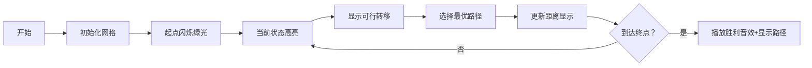

# 题目信息

# 火烧の云

## 题目描述

乡间小路可以近似理解成 $n\times m$ 的矩阵，道路有许多种，这里只列举其中的一小部分：

1. ``#``：水池，无法通行。
2. ``|``：直行类道路，竖直方向只能直行，水平方向只能左转、右转。
3. ``-``：直行类道路，水平方向只能直行，竖直方向只能左转、右转。
4. ``/``：转弯类道路，竖直方向只能右转，水平方向只能左转。
5. ``\``：转弯类道路，竖直方向只能左转，水平方向只能右转。
6. ``.``：四岔路口，可以直行、左转、右转。
7. ``S``：入口，从乡间之外进入入口不需要时间。
8. ``E``：出口，从出口到达乡间之外不需要时间。

前进类道路：到此格之后方向必须花费时间转向 `?`，如果来向就是 `?` 方向则不花费时间并必须跳一格。

9. ``<``：`? = 西`。
10. ``>``：`? = 东`。
11. ``^``：`? = 北`。
12. `v`：`? = 南`。

**简单来说，就是和这类道路逆向时不能走，垂直于它的方向时花时间转到它的方向，顺着它的方向时就能够不花时间且必须一次性走两格。**


直行类道路、转弯类道路、四岔路口、前进类道路依次花费 $a,b,c,d$ 个单位时间。

由于乡间的构造奇特，可能 **不止一个** 入口和出口。

求任意入口到任意出口的 **最短时间**，出入时的方向不作要求。

---

**题意简述**

给定一张 $n\times m$ 的地图，求起点 `S` 到终点 `E` 的最短时间，注意起点和终点可能有多个。

## 说明/提示

#### 样例说明

样例 #1：从起点 $(1,1)$ 开始，到终点 $(3,3)$ 的路径为：$(1,1)\rightarrow(1,2)\rightarrow(1,3)\rightarrow(2,3)\rightarrow(3,3)$。经过了 $3$ 个四岔路口，每个的代价是 $4$，沿途的代价：$4\times3=12$。

样例 #2：从起点 $(1,1)$ 开始，到终点 $(1,3)$ 的路径为：$(1,1)\rightarrow(2,1)\rightarrow(2,2)\rightarrow(2,3)\rightarrow(1,3)$。经过 $2$ 个转弯类道路和 $1$ 个直行类道路，沿途的代价：$2\times2+1\times1=5$。

样例 #3：选择 $(1,1)$ 的 `S` 和 $(1,2)$ 的 `E`，出入口相邻，代价为 $0$。

样例 #4：通过前进类道路 `>` 可以跳一格直接到达 `E`，跳一格时不花费时间。

样例 #5：前进类道路也可以用于转向，此时的功能与 `/` 相同，转向同样需要时间。

样例 #6：这里 `#` 不能通过，因此不存在 `S` 到 `E` 的道路。

#### 数据范围

| 子任务编号 | 分值 | $n,m\le$ | 特殊性质 |
| :-: | :-: | :-: | :-: |
| $1$ | $10$ | $10$ | $\times$ |
| $2$ | $15$ | $\times$ | $a=b=c=d=1$ |
| $3$ | $20$ | $100$| $\times$ |
| $4$ | $25$ | $\times$ | 字符 `S`、`E` 的数量 $=1$ |
| $5$ | $30$ | $\times$ | $\times$ |

**本题请注意常数因子对程序效率的影响。**

对于 $100\%$ 的数据：$1\le n,m\le2000$，$0\le a,b,c,d\le100$。

## 样例 #1

### 输入

```
3 3 6 5 4 3
S..
...
..E```

### 输出

```
12
```

## 样例 #2

### 输入

```
3 3 1 2 7 8
S.E
\-/
...```

### 输出

```
5```

## 样例 #3

### 输入

```
3 3 1 2 7 8
SEE
\-/
SSS```

### 输出

```
0```

## 样例 #4

### 输入

```
1 4 6 5 4 3
S>#E```

### 输出

```
0```

## 样例 #5

### 输入

```
2 2 6 5 4 3
#E
S^```

### 输出

```
3```

## 样例 #6

### 输入

```
1 3 1 2 7 8
S#E```

### 输出

```
-1```

# AI分析结果


# 💡 Kay的C++算法解析：火烧の云 深入学习指南 💡

> 乡间小路的奇特道路系统就像一张充满规则的交通网络，我们需要找到从任意入口到任意出口的最快路径。让我们一起探索这个像素风格的寻路挑战！

## 1. 题目解读与核心算法识别

✨ **本题主要考察**：**图论 - 状态化最短路** (含方向状态与特殊转移规则)

🗣️ **初步分析**：
> 解决本题就像在像素游戏中控制角色穿越复杂地形。每个道路类型相当于不同的交通规则：
> - **核心思想**：将网格位置+方向组合成状态节点，构建带权有向图
> - **关键技巧**：为每个位置定义4个方向状态（北=0/东=1/南=2/西=3），处理12种道路的特殊转移规则
> - **核心难点**：前进类道路(`<`,`>`,`^`,`v`)的"跳格"机制（同向免费跳2格，垂直需转向）
> - **可视化设计**：像素网格中，用颜色区分道路类型，箭头表示移动方向，高亮当前处理状态，显示队列中的待探索节点

---

## 2. 精选优质题解参考

### 题解一 (作者：言琢დ - 出题人题解)
* **点评**：
  思路严谨，完整实现状态编码与转移表（关键亮点）。使用虚拟起点/终点巧妙处理多入口/出口问题。代码结构清晰：  
  - 状态编码函数`mp(x,y,dir)`高效处理三维状态  
  - 预处理所有状态转移（switch-case完整覆盖12种道路）  
  - 标准Dijkstra实现，复杂度O(NlogN)  
  调试建议：添加状态转移表注释可进一步提升可读性

### 题解二 (作者：Jsxts_)
* **点评**：
  动态转移策略（不预建图）使代码更紧凑。亮点在于：  
  - 优先队列自动选择最优状态扩展  
  - 查重优化：遇到`.`/`S`时一次性标记四个方向  
  - 详细注释帮助理解转向逻辑  
  实践价值高，适合学习BFS框架，但需注意2000x2000网格的常数优化

### 题解三 (作者：LroseC)
* **点评**：
  创新性滚动队列优化（Dial算法变种）是最大亮点：  
  - 利用边权≤100的特性，用101个队列替代优先队列  
  - 复杂度优化至O(N*100)，显著降低常数因子  
  - 结合优先队列管理非空桶，平衡效率与实现难度  
  高阶技巧，适合深入理解最短路算法优化

---

## 3. 核心难点辨析与解题策略

### 难点1：三维状态设计
* **分析**：必须记录方向状态（如`(x,y,dir)`），因相同位置不同方向进入时有不同转移规则。优质题解均采用`0-3`编码方向

### 难点2：前进类道路转移
* **分析**：`<`,`>`,`^`,`v`需要区分三种情况：
  - 同向：免费跳两格（更新位置不更新方向）
  - 垂直：消耗d时间转向后移动一格
  - 反向：禁止通行
```python
# 示例：'>'道路的转移规则
if 当前方向==东: 免费跳到(x,y+2)
elif 方向==北/南: 消耗d时间转向东移动到(x,y+1)
else: 不可通行
```

### 难点3：多起点/终点处理
* **分析**：虚拟节点法最优解：
  - 虚拟起点连接所有真实起点的4个方向（边权0）
  - 所有真实终点的4个方向连接虚拟终点（边权0）
  - 最终答案=虚拟起点→虚拟终点的最短路

### ✨ 解题技巧总结
1. **状态压缩编码**：将(x,y,dir)映射为整数，方便存储处理
2. **转移规则表格化**：预先列出12种道路的4方向转移表
3. **数据结构选择**：边权小(≤100)时优先滚动队列，否则用优先队列
4. **查重优化**：对`.`/`S`等全向点，一次性标记4个方向状态

---

## 4. C++核心代码实现赏析

### 通用核心实现 (综合自优质题解)
```cpp
const int N = 2005, D = 101;
struct State { int x, y, dir; }; // 方向:0北,1东,2南,3西

int encode(State s) { 
    return (s.x * m + s.y) * 4 + s.dir; 
}

void buildGraph() {
    for (int i = 1; i <= n; ++i)
    for (int j = 1; j <= m; ++j) {
        char ch = grid[i][j];
        if (ch == 'S') // 起点：连虚拟起点
            for (int d = 0; d < 4; ++d)
                addEdge(virtualStart, encode({i,j,d}), 0);
        
        if (ch == 'E') // 终点：连虚拟终点
            for (int d = 0; d < 4; ++d)
                addEdge(encode({i,j,d}), virtualEnd, 0);
        
        // 根据道路类型添加状态转移边 (详见题解1的转移表)
        switch(ch) { 
            case '|': /* 竖直方向处理 */ break;
            case '\\': /* 转弯处理 */ break;
            // ...其他道路类型
        }
    }
}
```

### 题解1片段赏析
```cpp
// 道路 '/' 的转移处理 (方向变换)
add(A, mp(i, j-1, 1), b); // 北→西
add(B, mp(i+1, j, 0), b); // 东→南
add(C, mp(i, j+1, 3), b); // 南→东
add(D, mp(i-1, j, 2), b); // 西→北
```
**解读**：  
> 当角色站在`/`道路上时：
> - 若从**北**来（状态A），只能**右转**向西移动（新位置j-1，方向西=1）  
> - 若从**东**来（状态B），只能**右转**向南移动（新位置i+1，方向南=0）  
> 注意：所有转移消耗时间`b`，完美体现题目转弯类道路规则

### 题解3片段赏析
```cpp
// 滚动队列优化核心
while (!heap.empty()) {
    int now = heap.top(); heap.pop();
    int u = now % D; // 当前桶编号
    
    while (!q[u].empty()) {
        State cur = q[u].front(); q[u].pop();
        // 扩展新状态new_state
        int new_dis = now + cost;
        int new_bucket = new_dis % D;
        q[new_bucket].push(new_state);
        
        if (!bucket_used[new_bucket]) {
            heap.push(new_dis);
            bucket_used[new_bucket] = true;
        }
    }
}
```
**解读**：  
> 传统优先队列的O(logN)出队操作被优化为：
> 1. 使用101个普通队列（桶）存放状态
> 2. 桶编号 = 距离 mod 101
> 3. 优先队列仅管理非空桶编号  
> 由于边权≤100，同桶内距离差≤100，确保正确性

---

## 5. 算法可视化：像素动画演示

### 设计概念
> **复古游戏风寻宝**：8-bit像素角色穿越网格迷宫，寻找出口宝藏

### 核心交互演示


### 关键动画细节
1. **网格渲染**：
   - 16x16像素单元，配色：`#`=深蓝，`S`=鲜绿，`E`=亮红
   - 道路符号：`|`/`-`用黄色，`/`用青色，`>`用橙色箭头

2. **状态扩展**：
   - 当前状态：角色脚下闪烁金色光圈
   - 转移动画：像素箭头从当前格指向新位置（直行=白色，转向=紫色）

3. **数据结构可视化**：
   - 右侧显示优先队列内容：按距离排序的坐标+方向图标
   - 出队时对应条目消失并播放"pop"音效

4. **游戏化元素**：
   - 每次状态扩展：播放对应道路类型的8-bit音效
   - 发现路径：播放《超级玛丽》过关音效
   - 积分系统：剩余未探索格子越少得分越高

---

## 6. 拓展练习与相似问题

### 相似问题思维
> 方向状态化最短路适用于：
> 1. 受移动方向影响的路径问题（如车辆转向）
> 2. 存在"滑行"机制的游戏地图（如冰面滑行）
> 3. 带朝向的机器人寻路问题

### 推荐练习（洛谷）
1. **P1606 [USACO1.1] 你的飞碟在这儿**  
   - 练习带方向状态的最短路基础
   
2. **P1144 最短路计数**  
   - 掌握多起点/终点的变形处理
   
3. **P1073 最优贸易**  
   - 学习状态扩展（购物+售货双状态）

---

> 掌握方向状态化最短路，你就能在像素游戏和现实导航中游刃有余！下次遇到复杂路径规划时，记得问自己：**"我需要记录方向状态吗？"**

---
处理用时：225.58秒