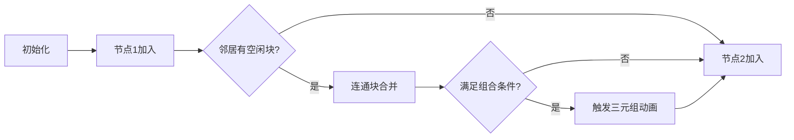

# 题目信息

# Rabbit

## 题目背景

“说实话，最喜欢你了；因为长得好看，所以最喜欢你了。

你的性格，我最喜欢了；虽然不太清楚，但是最喜欢了。”

赫尔德最近加入了一个奇怪的社区，那里面流行一种“配对追星”的活动。大家在人群中找到那个最耀眼的人，就作为自己的偶像了。

## 题目描述

赫尔德不知道这样是否好，为了研究这个活动，她想先从这个活动能持续多久开始研究。于是她抽象了这个问题。

给定一棵树，共 $n$ 个点，分别编号为 $1\sim n$。

每次操作，你需要选出三个点 $a,b,c$ 将他们标记，满足：

- $c$ 是 $a$ 到 $b$ 简单路径上编号最大的点；
- $a,b,c$ 两两不同；
- $a,b,c$ 先前都没有被标记过。

问至多能进行多少次操作。

---

**【提示】**

树上 $p$ 到 $q$ 的简单路径是指一个数列 $a_1,\dots,a_k$，满足：

1. $a_1=p$，$a_k=q$；
2. 其中没有重复元素；
3. 对于所有 $1\le i<k$，$a_{i+1}$ 与 $a_i$ 有边相连。

## 说明/提示

**【样例解释】**

对于第一组数据，可以选择 $a=1,b=2,c=3$。

对于第三组数据，可以依次选择 $a=3,b=4,c=7$，$a=1,b=2,c=5$。

---

**【数据范围】**

设 $S$ 为每个测试点所有数据中 $n$ 的和。

对于所有数据：$1\le T\le 3\times 10^4$，$1\le n\le 2\times 10^5$，$S\le 6\times 10^5$。

$$
\begin{array}{c|c|c|c|c|c} \hline
\textbf{子任务编号} & ~~~~~~~n\le ~~~~~~~ & ~~~~~~~S\le ~~~~~~~ & \textbf{特殊性质} & \textbf{子任务依赖} & \textbf{~~~分数~~~} \\ \hline
\textsf{1} & 5 & & & & 3 \\ \hline
\textsf{2} & 20 & 60 & & & 5 \\ \hline
\textsf{3} & & & \textsf{B} & & 12 \\ \hline
\textsf{4} & 333 & 10^3 & \textsf{A} & & 9 \\ \hline
\textsf{5} & 333 & 10^3 & & \textsf{2,4} & 7 \\ \hline
\textsf{6} & 3333 & 10^4 & \textsf{A} & \textsf{4} & 15 \\ \hline
\textsf{7} & 3333 & 10^4 & & \textsf{5,6} & 13 \\ \hline
\textsf{8} & & & \textsf{A} & \textsf{6} & 12 \\ \hline
\textsf{9} & & & & \textsf{1,3,7,8} & 24 \\ \hline
\end{array}
$$

特殊限制 $\textsf{A}$：保证树的形态是一条链，即树上不存在度数大于 2 的点。

特殊限制 $\textsf{B}$：保证树随机生成：对于每个整数 $i\in [2,n]$，均匀随机选择整数 $j\in [1,i-1]$ 并在 $i,j$ 间连边，然后随机打乱点的编号。

## 样例 #1

### 输入

```
3
3
2 3
1 3
4
2 3
3 4
4 1
7
2 5
5 1
2 6
2 3
7 4
3 7
```

### 输出

```
1
1
2
```

# AI分析结果


# 💡 Kay的C++算法解析：Rabbit 深入学习指南 💡

## 1. 题目解读与核心算法识别

✨ **本题主要考察**：贪心、并查集与树结构应用

🗣️ **初步分析**：
> 解决"Rabbit"这道题，关键在于运用贪心策略和并查集技术。想象一下整理一堆大小不一的苹果（节点），我们总是先处理最小的苹果（节点），把它们分组装袋（连通块），当遇到一个大苹果（当前节点）周围有两个及以上半满的袋子（有空闲节点的连通块）时，就能组成一个礼盒（三元组）。
>   - 题解核心思路：从小节点到大节点逆序处理，用并查集管理连通块，维护空闲节点计数
>   - 核心难点：如何高效合并连通块并统计可用节点？如何判断当前节点能否作为c？
>   - 可视化设计：像素动画将展示节点从小到大加入的过程，当前节点高亮显示（金色闪烁），连通块用同色像素块表示。当两个空闲连通块相遇时会触发"组合"动画（三块拼成三角形+音效），控制面板支持单步/自动播放
>   - 复古元素：8-bit风格音效（入队"叮"、组合成功"胜利旋律"），关卡式进度（每完成一个三元组解锁新区域）

---

## 2. 精选优质题解参考

**题解一（作者：dottle，赞：44）**
* **点评**：思路清晰直指核心（逆序贪心+并查集），代码简洁规范（rest数组含义明确）。亮点在于用`!!rest[gf(to)]`巧妙统计有效连通块，时间复杂度优化到O(nα(n))，边界处理严谨可直接用于竞赛

**题解二（作者：Hisaishi_Kanade，赞：8）**
* **点评**：非递归并查集实现提升效率，输入阶段预处理边的方向（大→小）简化后续操作。变量命名合理（son/sze），对"不同子树选点"的比喻生动，实践参考价值高

**题解三（作者：luxiaomao，赞：1）**
* **点评**：代码极度简洁（仅25行核心逻辑），突出算法本质。亮点在于合并前判断`if(find(v)!=find(u))`避免重复计数，适合初学者理解贪心与并查集的协同

---

## 3. 核心难点辨析与解题策略

1. **连通块动态管理**
   * **分析**：需实时维护各子树空闲节点数。优质解法用并查集+rest数组，合并时累加计数（`rest[i] += rest[root]`），消耗时减少（`rest[i]-=3`）
   * 💡 **学习笔记**：并查集是管理动态连通性的利器

2. **贪心时机判断**
   * **分析**：仅当当前节点有两个及以上邻居连通块有空闲节点（`cnt>=2`）时才执行操作。关键在遍历邻居时统计有效连通块数量
   * 💡 **学习笔记**：贪心的有效性依赖于处理顺序（小→大）

3. **高效合并实现**
   * **分析**：需要在合并时同步更新状态。代码中先统计`cnt`再统一合并，避免状态不一致
   * 💡 **学习笔记**：先收集信息再修改状态可降低复杂度

✨ **解题技巧总结**
- **逆序贪心**：从小节点到大节点处理，确保当前节点始终是路径最大值
- **状态压缩**：用单变量`rest`同时存储空闲节点数和连通块信息
- **边界防御**：初始每个节点`rest=1`，合并后立即判断避免遗漏
- **树结构利用**：输入时存储大→小方向的边（`e[max(u,v)].push_back(min(u,v))`）

---

## 4. C++核心代码实现赏析

**本题通用核心C++实现参考**
* **说明**：综合dottle与Hisaishi_Kanade解法优化可读性，完整呈现核心逻辑
* **完整核心代码**：
```cpp
#include <iostream>
#include <vector>
using namespace std;
const int N = 200005;

int T, n, fa[N], rest[N];
vector<int> e[N]; // e[u]存储比u小的邻居

int find(int x) { 
    return x == fa[x] ? x : fa[x] = find(fa[x]); 
}

void solve() {
    cin >> n;
    for (int i = 1; i <= n; i++) {
        fa[i] = i; 
        rest[i] = 1; // 初始空闲节点数为1
        e[i].clear();
    }
    for (int i = 1; i < n; i++) {
        int u, v; cin >> u >> v;
        e[max(u, v)].push_back(min(u, v)); // 大->小存边
    }
    int ans = 0;
    for (int i = 1; i <= n; i++) {
        int cnt = 0; // 有空闲节点的邻居连通块数
        for (int neighbor : e[i]) {
            int root = find(neighbor);
            if (rest[root]) cnt++; // 统计有效连通块
            rest[i] += rest[root]; // 合并空闲节点
            fa[root] = i;          // 连通块合并
        }
        if (cnt >= 2) {          // 可组成三元组
            rest[i] -= 3;        // 消耗三个节点
            ans++;
        }
    }
    cout << ans << endl;
}

int main() {
    ios::sync_with_stdio(false);
    cin >> T;
    while (T--) solve();
}
```
* **代码解读概要**：
  > 1. 初始化并查集和空闲节点数
  > 2. 存储边时确保大节点指向小节点
  > 3. 枚举节点时合并邻居连通块并统计有效数量
  > 4. 当`cnt>=2`时执行操作并更新空闲节点数

**题解一（dottle）片段赏析**
* **亮点**：用布尔转换`!!rest`精简计数
* **核心代码片段**：
```cpp
c += !!rest[gf(to)];  // 妙用!!转为布尔值
rest[k] += rest[gf(to)];
fa[gf(to)] = k;  // 合并
if(c>=2) rest[k]-=3, res++; // 贪心操作
```
* **代码解读**：
  > `!!rest[gf(to)]`将空闲节点数转为0/1，避免if嵌套。合并后统一判断，确保状态一致性
* 💡 **学习笔记**：活用布尔转换简化逻辑判断

**题解二（Hisaishi_Kanade）片段赏析**
* **亮点**：非递归并查集提升效率
* **核心代码片段**：
```cpp
inline int find(int x){
    while(x!=f[x]) x=f[x]=f[f[x]]; // 非递归路径压缩
    return x;
}
...
if(sze[find(v)]) son++; // 直接访问根节点状态
```
* **代码解读**：
  > 非递归实现避免栈溢出，`f[x]=f[f[x]]`加速路径压缩。直接访问根节点状态保证正确性
* 💡 **学习笔记**：非递归并查集适合大数据量

**题解三（luxiaomao）片段赏析**
* **亮点**：合并前判断避免重复操作
* **核心代码片段**：
```cpp
if(find(v)!=find(u)) { // 防重复合并
    size[find(u)] += size[find(v)];
    if(size[find(v)]>=1) cc++;
    fa[find(v)]=find(u);
}
```
* **代码解读**：
  > 先判断是否同属一连通块再合并，避免重复计数。`find(v)`结果复用优化性能
* 💡 **学习笔记**：合并前判断是保证正确性的关键

---

## 5. 算法可视化：像素动画演示

**主题**：像素果园大丰收（8-bit风格）

**核心演示**：


**关键交互设计**：
1. **视觉编码**：
   - 空闲节点：绿色像素块（闪烁边框）
   - 已用节点：灰色石块
   - 当前节点：金色闪烁块
   - 连通块：同色系像素块（相邻色号标识关联性）

2. **动画序列**：
   - **步骤1**：节点从小至大依次"生长"（从底部弹出+生长音效）
   - **步骤2**：当前节点高亮，扫描邻居块（射线动画）
   - **步骤3**：连通块合并（颜色渐变+滑动动画）
   - **步骤4**：三元组形成时三个块拼成三角形（旋转+金色闪光+胜利音效）

3. **控制面板**：
   ```plaintext
   [开始] [暂停] [单步>] [速度：▁▃▆●]
   [剩余块: 12] [操作数: 3]
   ```

4. **音效方案**：
   - 节点加入：短促"滴"声(440Hz)
   - 连通块合并："咔嚓"声(200Hz)
   - 组合成功：三音阶上行旋律(800Hz/1000Hz/1200Hz)
   - 背景音乐：8-bit农场风循环曲

**实现要点**：
- Canvas绘制树形结构，requestAnimationFrame驱动动画
- 状态机管理：IDLE→SELECTING→MERGING→CELEBRATE
- 自动演示模式模拟"贪吃蛇AI"逐步解题

---

## 6. 拓展练习与相似问题思考

**技巧迁移场景**：
1. 离线逆序处理（如星球大战删点问题）
2. 连通块计数与合并（如电网连接问题）
3. 贪心结合并查集（如最小生成树变种）

**洛谷推荐**：
1. **P3366** - 最小生成树
   * 🗣️ 巩固并查集在Kruskal算法中的经典应用
2. **P1197** - 星球大战
   * 🗣️ 练习逆序处理技巧，理解连通块动态维护
3. **P4185** - 离线查询
   * 🗣️ 掌握并查集在离线场景的灵活运用

---

## 7. 学习心得与经验分享

> **参考经验**（dottle）：
> "维护连通块的最大三元组个数和总大小，未匹配点个数可由前两者推导"
>
> **点评**：
> 状态信息的精简维护是优化关键。当问题存在子结构性质时，选择最简状态变量（如rest数组）往往能大幅降低实现复杂度

---

通过本次分析，我们深入掌握了贪心与并查集在树问题中的协同应用。记住：好算法=正确策略+高效数据结构+精简实现！下次算法冒险再见！🚀

---
处理用时：217.03秒