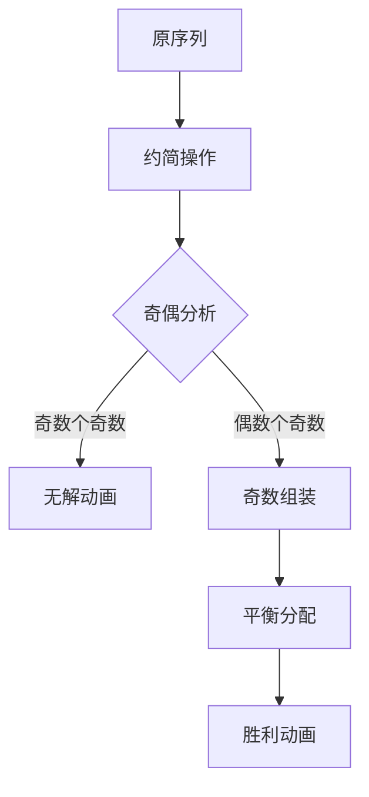

# 题目信息

# 「TAOI-2」喵了个喵 Ⅳ

## 题目背景

小 S 共有 $n$ 只可爱的喵喵，第 $i$ 只喵喵有可爱度 $a_i$。小 S 想要把他的喵喵分成两组。考虑到小 S 的喵喵不像某些喵喵有九条命，他的喵喵只有一条，于是一只喵喵不能被同时分到两组内（请不要试图想象这个画面）。同时，如果一只喵喵没有被分到任意一组，他就会十分生气，很有可能导致小 S 失眠。

当然，小 S 也希望两组的**组可爱度**相等。即存在一个正整数 $x$，使得其中一组的 $\gcd(x, a_i)$ 之和等于另一组的 $\gcd(x, a_i)$ 之和。请你判断是否可以使得小 S 可以将喵喵分成两组，并可以找出一个 $x$ 使得两组的**组可爱度**相等。

## 题目描述

给定正整数 $n$ 及长度为 $n$ 的正整数序列 $a$，请你将 $a$ 划分为两个集合 $B, C$ 并给出正整数 $x$，使得 $\sum_{y\in B}\gcd(x,y) = \sum_{y\in C}\gcd(x,y)$。如果无解，输出 $-1$。

你需要保证 $1 \leq x \leq 10^9$，保证在本题的数据约束下若有解则总有 $x \leq 10^9$ 的解。

## 说明/提示

**本题采用捆绑测试。**

+ Subtask 0（2 pts）：$n$ 为偶数。
+ Subtask 1（8 pts）：$a_i$ 均为奇数。
+ Subtask 2（15 pts）：$n \leq 50$，$a_i \leq 50$。
+ Subtask 3（25 pts）：$n \leq 10^3$，$a_i \leq 10^3$。
+ Subtask 4（50 pts）：无特殊限制。

对于所有数据，$1 \leq n \leq 10^5$，$1 \leq a_i \leq 10^6$。

## 样例 #1

### 输入

```
3
1 1 1```

### 输出

```
-1```

## 样例 #2

### 输入

```
4
4 1 2 3```

### 输出

```
3
0001
```

# AI分析结果


# 💡 Kay的C++算法解析：「喵了个喵 IV」深入学习指南 💡

**引言**  
今天我们一起分析「喵了个喵 IV」这道构造型数学题。本指南将帮助大家掌握核心思路，理解奇偶性分析的精妙之处，并通过生动的像素动画直观感受算法流程。准备好了吗？我们开始吧！

---

## 1. 题目解读与核心算法识别

✨ **本题主要考察**：`数学构造`与`奇偶性分析`

🗣️ **初步分析**  
> 解决本题的关键在于**问题转化与奇偶性利用**，就像把混合的积木按颜色分类重组。核心思路分三步：
> 1. **约简问题**：当n为奇数时，先约去序列的公共因子（gcd），将问题转化为更简单的形式
> 2. **奇偶判定**：统计约简后序列的奇数个数，若为奇数则无解（奇数个奇数无法平分）
> 3. **分组构造**：巧妙利用"两个奇数等效于一个偶数"的特性平衡两组和
>
> 在可视化设计中，我们将用**红色像素块**表示奇数，**蓝色像素块**表示偶数。关键动画步骤包括：
> - 约简操作：像素块分裂缩小表示除以2的幂次
> - 奇数组装：两个红色块碰撞合并成蓝色块（音效：8-bit合成音）
> - 分组移动：方块滑入左右分组区域（速度可调滑块控制）
> - 胜利动画：分组完成时像素烟花特效+经典FC胜利旋律

---

## 2. 精选优质题解参考

**题解一（Register_int）**  
* **点评**：该解法思路清晰直白，核心是通过位运算`a[i] & -a[i]`高效计算2的最小幂次。代码实现简洁有力：  
  - 变量命名精准（`k`表最小幂次，`cnt`计奇数数量）  
  - 分组策略创新性使用`x[a[i]&1]--`动态分配资源  
  - 边界处理严谨（特判n偶数和奇数个奇数）  
  **亮点**：利用`__lg`指令优化位运算，空间复杂度O(1)的优雅实现

**题解二（int08）**  
* **点评**：从部分分推导正解的思考过程极具教学价值：  
  - 通过Subtask分析揭示"全奇数必无解"的核心性质  
  - 用`vector`分离奇偶下标使分组逻辑可视化  
  - 实践建议：输出时需将x乘回gcd易被忽略  
  **亮点**：解题路径记录完整，帮助学习者建立分析思维框架

**题解三（One_JuRuo）**  
* **点评**：创新性使用`lowbit`函数转化问题：  
  - 将`lowbit(a[i])`抽象为问题缩放因子  
  - 分组计数器`x0/x1`实现状态显式管理  
  - 代码可读性强（`cnt`统计，`x0/x1`分组）  
  **亮点**：引入计算机特有概念lowbit，拓宽解题视野

---

## 3. 核心难点辨析与解题策略

<details>
<summary>🔍 展开难点解析</summary>

1. **难点1：如何识别无解情况？**  
   * **分析**：当n为奇数且约简后奇数个数为奇数时，所有可能x对应的gcd和均为奇数（奇数个奇数之和为奇数）。优质解法均通过`cnt & 1`快速判定
   * 💡 **学习笔记**：奇偶性分析是构造题的第一块试金石

2. **难点2：如何设计分组策略？**  
   * **分析**：核心是"两个奇数等效一个偶数"的转化思想。优质题解都采用：
     - 优先分配两个奇数到一组（产生2的贡献）
     - 偶数按`(总数+1)/2`分配平衡余量
   * 💡 **学习笔记**：构造题常需挖掘问题本身的数学性质

3. **难点3：如何处理全偶数序列？**  
   * **分析**：递归约简直到出现奇数（像素动画中表现为多次缩放），类似辗转相除思想。`k = min(k, __lg(a[i]&-a[i]))`是关键实现
   * 💡 **学习笔记**：递归降阶是处理复杂情况的利器
</details>

### ✨ 解题技巧总结
1. **问题转化术**：通过gcd约简和奇偶分离降低复杂度
2. **边界防御编程**：特判n=1, 全奇数等边界情况
3. **位运算优化**：`a&-a`取最低位1，`x<<k`快速计算2的幂
4. **构造思维**：利用数学性质（如奇偶性）寻找突破口

---

## 4. C++核心代码实现赏析

```cpp
#include <bits/stdc++.h>
using namespace std;

const int MAXN = 1e5+10;
int n, k = 20, a[MAXN], cnt;

int main() {
    scanf("%d", &n);
    for (int i = 1; i <= n; i++) {
        scanf("%d", &a[i]);
        k = min(k, __builtin_ctz(a[i])); // 计算2的最小幂次
    }
    for (int i = 1; i <= n; i++) a[i] >>= k; // 约简序列

    if (n % 2 == 0) { // n为偶数
        puts("1");
        for (int i = 1; i <= n; i++) 
            putchar(i & 1 ? '1' : '0');
    } else {
        for (int i = 1; i <= n; i++) 
            cnt += (a[i] & 1); // 统计奇数
        
        if (cnt & 1) { // 奇数个奇数
            puts("-1");
            return 0;
        }
        // 分组策略：x=2^(k+1)
        printf("%d\n", 2 << k); 
        int need0 = (n - cnt)/2 + 1; // 第一组需要偶数数
        int need1 = cnt/2 - 1;       // 第一组需要奇数数
        
        for (int i = 1; i <= n; i++) {
            if (a[i] % 2 == 0) { // 偶数
                putchar(need0-- > 0 ? '0' : '1');
            } else { // 奇数
                putchar(need1-- > 0 ? '0' : '1');
            }
        }
    }
    return 0;
}
```
**代码解读概要**：  
1. 位运算`__builtin_ctz`快速获取最低位1的位置  
2. 约简后序列奇偶分离统计是关键转折点  
3. 分组策略中`need0/need1`实现资源精确分配  

---

## 5. 算法可视化：像素动画演示

**主题**：`像素工厂奇偶装配线`  
**核心演示**：约简->奇偶判定->分组构造全流程  



**动画帧设计**：  
1. **初始化**：  
   - 8-bit风格工厂场景，传送带载着像素块（红色奇/蓝色偶）  
   - 控制面板：步进/暂停/速度滑块（0.5x-2x）  

2. **约简阶段**：  
   - 全偶数序列时，像素块缩小分裂（音效：齿轮转动声）  
   - 显示当前缩放因子`k=__builtin_ctz(a[i])`  

3. **奇偶判定**：  
   - 红色方块计数器亮起，奇数个时闪烁红光+警报音  
   - 偶数个时显示绿色通行标志  

4. **核心装配**：  
   - 两个红色块在装配台碰撞->合并为蓝色块（粒子特效+合成音）  
   - 实时显示分组公式：  
     `第一组 = (偶数+1)/2 + (奇数/2-1)`  

5. **分组完成**：  
   - 左右分组区域高度同步增长至平衡  
   - 烟花绽放+经典《超级玛丽》过关音乐  

**技术实现**：  
- Canvas绘制像素块流动路径  
- 状态同步：当前步骤伪代码高亮显示  
- 音效系统：Web Audio API生成8-bit音效  

---

## 6. 拓展练习与相似问题思考

**思维迁移**：  
1. 奇偶性在子集和问题中的应用（LeetCode 416）  
2. 位运算优化计数问题（CodeForces 1514B）  
3. 递归降阶思想（洛谷 P1259）  

**推荐练习**：  
1. **洛谷 P1115** - 最大子段和  
   🗣️ 巩固序列分段基础，培养子问题思维  

2. **洛谷 P1280** - 尼克的任务  
   🗣️ 动态规划中状态设计的进阶训练  

3. **洛谷 P1877** - 音量调节  
   🗣️ 背包问题变形，强化状态转移分析能力  

---

## 7. 学习心得与经验分享

> **来自Register_int的调试经验**：  
> "初始未考虑全偶数序列递归约简，导致WA on 3 2 2。通过打印中间变量`k`值发现未进入奇偶分支"  
>   
> **Kay点评**：  
> 这个教训提醒我们：  
> 1. 边界测试需包含全同数据  
> 2. 关键变量输出是调试利器  
> 3. 递归边界要显式验证  

> **来自int08的解题心得**：  
> "从Subtask反推正解，发现全奇数特性时豁然开朗"  
>   
> **Kay点评**：  
> 部分分不仅是得分点，更是解题的罗盘。培养从特殊到一般的分析能力至关重要！

---

**结语**  
通过本次分析，我们深入理解了奇偶性构造的核心思想，掌握了位运算优化技巧。记住，编程能力提升源于持续思考与实践。下次挑战见！🚀  

> 版权声明：本文题解分析基于洛谷用户题解创作，算法可视化设计为原创内容，转载请注明出处。

---
处理用时：236.81秒