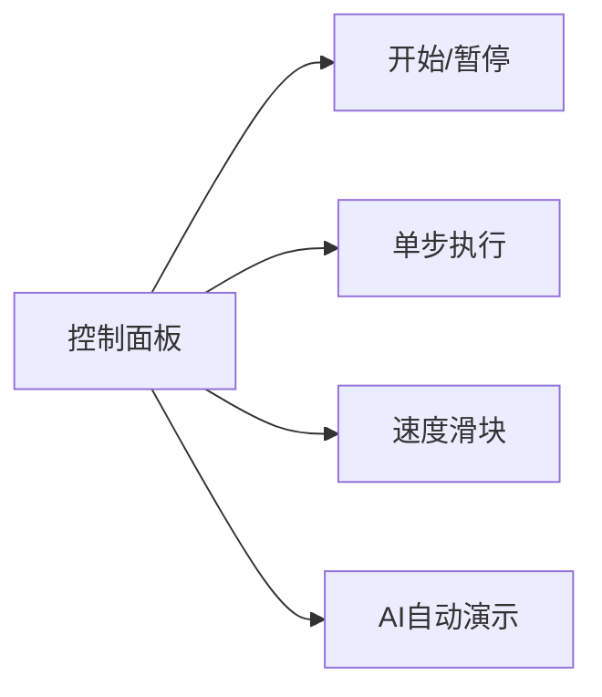

# 题目信息

# 日志分析

## 题目描述

M 海运公司最近要对旗下仓库的货物进出情况进行统计。目前他们所拥有的唯一记录就是一个记录集装箱进出情况的日志。该日志记录了两类操作：第一类操作为集装箱入库操作，以及该次入库的集装箱重量；第二类操作为集装箱的出库操作。这些记录都严格按时间顺序排列。集装箱入库和出库的规则为先进后出，即每次出库操作出库的集装箱为当前在仓库里所有集装箱中最晚入库的集装箱。

出于分析目的，分析人员在日志中随机插入了若干第三类操作――查询操作。分析日志时，每遇到一次查询操作，都要报告出当前仓库中最大集装箱的重量。


## 说明/提示

### 数据范围及约定

- 对于 $20\%$ 的数据，有 $N \le 10$；
- 对于 $40\%$ 的数据，有 $N \le 1000$；
- 对于 $100\%$ 的数据，有 $1 \le N \le 200000$，$1 \le X \le 10^8$。


## 样例 #1

### 输入

```
13
0 1
0 2
2
0 4
0 2
2
1
2
1
1
2
1
2
```

### 输出

```
2
4
4
1
0
```

# AI分析结果


### 💡 Kay的C++算法解析：日志分析 深入学习指南 💡

**引言**  
今天我们一起分析"日志分析"这道C++编程题。本指南将帮助大家掌握栈的应用技巧，理解高效维护动态最大值的方法，并通过像素动画直观感受算法执行过程。

---

### 1. 题目解读与核心算法识别

✨ **本题主要考察**：`栈的应用与动态最值维护`  

🗣️ **初步分析**：  
> 这道题就像管理一个叠放的集装箱仓库，新集装箱放在最上面（入栈），取货时只能取最顶部的（出栈）。关键挑战在于快速回答"当前最重的集装箱是多少？"  
> - **核心技巧**：维护一个与主栈同步的"最大值栈"。每次入栈时，最大值栈压入当前栈的最大值（新值与栈顶最大值比较）。这样查询时直接返回最大值栈顶，实现O(1)时间复杂度查询。  
> - **可视化设计**：动画将用像素方块表示集装箱，黄色方块表示当前最大值。入栈时自动更新最大值栈，出栈时同步弹出，查询时高亮黄色方块并播放提示音效。  
> - **复古游戏化**：采用8位像素风格（类似FC游戏），集装箱堆叠动画配合"叮"（入栈）、"咔嚓"（出栈）、"胜利号角"（查询成功）音效，AI自动演示模式可调节速度观察流程。

---

### 2. 精选优质题解参考

**题解一：medusa（赞221）**  
* **点评**：思路极简高效，用数组模拟栈结构，`f[t]`维护栈底到当前位置的最大值。入栈时通过`f[t]=max(f[t-1],x)`动态更新最值，出栈只需移动指针。代码规范（变量名`f`/`t`含义明确），空间复杂度O(n)最优，边界处理严谨（`t=0`时直接返回0），是竞赛级实现的典范。

**题解二：buickboy（赞61）**  
* **点评**：采用双栈结构（主栈+最大值栈），直观体现"同步维护"思想。亮点在于最大值栈的更新逻辑：新值大于栈顶时压入新值，否则重复压入原栈顶。代码使用STL栈容器，可读性强，出栈时同步`pop`的操作避免逻辑错误，完美体现数据结构协同工作的美感。

**题解三：安好en（赞5）**  
* **点评**：独立实现数组模拟双栈（`a`存重量，`b`存最大值），更新逻辑`b[tb+1]=max(b[tb],y)`清晰体现动态规划思想。虽未用STL但结构工整，特别适合初学者理解栈与最值数组的对应关系，变量名`ta`/`tb`的指针设计易于调试。

---

### 3. 核心难点辨析与解题策略

1. **难点一：如何高效维护动态变化的最值？**  
   * **分析**：暴力扫描栈内元素（O(n)）会超时。优质解法均采用"空间换时间"策略：用额外栈/数组在入栈时通过`max(新值, 历史最值)`递推更新，保证查询O(1)。  
   * 💡 **学习笔记**：动态最值问题常需设计辅助数据结构记录中间状态。

2. **难点二：如何同步处理栈与最值的关系？**  
   * **分析**：出栈时需同步移除最值栈顶元素。关键技巧是识别最值栈顶与主栈顶的关联性——当主栈弹出值等于最值栈顶时，说明该值是"当前最大值的来源"，需同步弹出（如安好en解法），否则仅主栈弹出。  
   * 💡 **学习笔记**：数据结构的协同操作需严格保证状态一致性。

3. **难点三：如何避免边界条件错误？**  
   * **分析**：空栈出栈/查询需特殊处理（如`medusa`的`if(t!=0)`）。最值数组初始值设为0（`f[0]=0`）可统一空栈返回0的逻辑。  
   * 💡 **学习笔记**：边界测试是代码健壮性的关键（空栈、单元素栈等）。

#### ✨ 解题技巧总结
- **技巧1：状态递推设计**  
  将最值维护转化为`f[i]=max(f[i-1],x)`的递推关系，避免重复计算。
- **技巧2：数据结构镜像**  
  为每个操作（入/出栈）设计对称的最值结构更新逻辑。
- **技巧3：防御性编程**  
  显式检查空栈（`if(!stack.empty())`），初始值预设（如`f[0]=0`）。

---

### 4. C++核心代码实现赏析

**通用核心实现参考**  
* **说明**：综合优质题解思路，采用数组模拟栈实现O(1)查询的最优方案。
```cpp
#include <iostream>
#include <algorithm>
using namespace std;
const int MAXN = 200001;
int f[MAXN], t = 0; // f:最大值数组, t:栈顶指针

int main() {
    int n, op, x;
    cin >> n;
    f[0] = 0; // 初始最大值设为0（处理空栈）
    while (n--) {
        cin >> op;
        if (op == 0) {
            cin >> x;
            t++;
            f[t] = max(f[t-1], x); // 关键递推：更新当前位置最大值
        }
        else if (op == 1 && t > 0) t--; // 出栈：仅移动指针
        else if (op == 2) cout << f[t] << endl; // 查询：直接输出当前最值
    }
    return 0;
}
```
* **代码解读概要**：  
  - **初始化**：`f[0]=0`处理空栈情况  
  - **入栈**：`f[t]=max(f[t-1],x)`继承历史最值或更新  
  - **出栈**：仅需`t--`（最值由指针位置隐式维护）  
  - **查询**：`f[t]`即当前最值  

#### 优质题解片段赏析
**题解一：medusa**  
```cpp
t++; 
f[t]=max(f[t-1],y);  // 动态更新最值
if (x==2) cout<<f[t]<<endl; 
```
* **亮点**：极简递推实现最值维护  
* **解读**：  
  > `f[t-1]`是前t-1个元素的最值，与`y`比较后存入`f[t]`。查询时`f[t]`即当前最值，无需扫描栈。  
  > 💡 **学习笔记**：递推式最值维护是降低复杂度的核心技巧。

**题解二：buickboy**  
```cpp
a.push(x); 
if(b.empty()||x>b.top()) b.push(x); 
else b.push(b.top()); 
```
* **亮点**：双栈保持高度同步  
* **解读**：  
  > 最大值栈`b`始终与主栈`a`同尺寸。新值`x`若更大则压入`x`，否则重复压入原栈顶，保证`b.top()`即当前最值。  
  > 💡 **学习笔记**：双栈结构以空间换时间，逻辑清晰但空间占用略高。

---

### 5. 算法可视化：像素动画演示

**主题**：`集装箱仓库大冒险`（8位像素风仓库管理模拟）  

**核心演示**：  
- 黄色集装箱代表当前最大值，随操作动态变化  
- 左侧主栈（蓝色集装箱），右侧同步显示最大值栈（黄色标记）  

**交互设计**：  


**动画流程**：  
1. **初始化**  
   - 像素网格仓库（16色），空栈显示"Empty"  
   - 背景音乐：8-bit轻快循环BGM  

2. **入栈操作**  
   - 新集装箱从右侧滑入主栈顶  
   - 若为当前最大值：  
     * 集装箱变黄✨  
     * 播放"叮！"音效  
     * 右侧最大值栈同步压入黄色方块  
   - 否则：  
     * 保持蓝色  
     * 最大值栈压入原黄色方块副本  

3. **出栈操作**  
   - 主栈顶集装箱向左滑出消失  
   - 最大值栈顶同步弹出  
   - 播放"咔嚓"音效  

4. **查询操作**  
   - 当前最大值集装箱高亮闪烁  
   - 弹出对话框显示重量  
   - 播放"胜利号角"短音效  

5. **特殊状态**  
   - 空栈查询：显示"0"并播放"呜-"提示音  
   - AI模式：自动按随机操作序列执行，速度可调  

**技术实现**：  
- Canvas绘制栈结构，每帧更新集装箱位置/颜色  
- 音效触发：`AudioContext`播放8-bit音效（Web Audio API）  
- 数据结构：JavaScript数组模拟双栈，与动画状态绑定  

---

### 6. 拓展练习与相似问题

**通用技巧迁移**：  
动态最值维护技术还可用于：  
1. 滑动窗口最大值（单调队列）  
2. 实时数据流中位数（双堆维护）  
3. 历史版本查询（持久化数据结构）  

**洛谷推荐**：  
1. **P1886 滑动窗口**  
   🗣️ 巩固单调队列思想，理解最值维护的另一种形式。  
2. **P1440 求m区间内的最小值**  
   🗣️ 练习动态范围最值查询，与本题栈结构形成对比。  
3. **P2947 仰望奶牛**  
   🗣️ 进阶练习，结合栈与单调性优化，深化最值维护技巧。  

---

### 7. 学习心得与经验分享

> **参考经验 (来自 buickboy)**：  
> *"双栈法要特别注意同步性——主栈和最大值栈必须同进同出，否则会出现状态不一致的致命错误。"*  
> **点评**：这是双栈实现的核心要点！建议在代码中用相同`push`/`pop`操作处理双栈，并在注释中强调其关联性。  

> **参考经验 (来自 medusa)**：  
> *"递推数组法省去了显式栈结构，但务必记得初始化`f[0]=0`，否则空栈查询会出错。"*  
> **点评**：边界处理是算法鲁棒性的关键，测试时务必覆盖空栈场景。  

---

**结语**  
通过本次分析，我们掌握了栈结构动态维护最值的高效技巧。记住：好算法 = 清晰数据结构设计 + 严谨边界处理。希望大家在"集装箱仓库大冒险"的像素动画中深化理解，在拓展练习中巩固技能。下次挑战再见！💪

---
处理用时：113.67秒