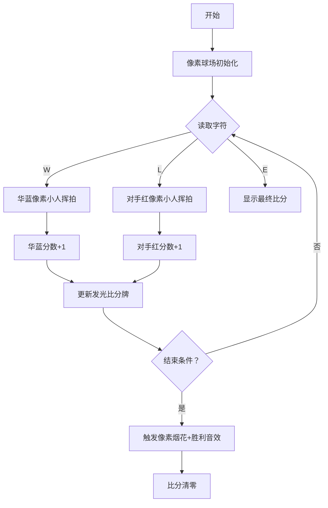

# 题目信息

# [NOIP 2003 普及组] 乒乓球

## 题目背景

国际乒联现在主席沙拉拉自从上任以来就立志于推行一系列改革，以推动乒乓球运动在全球的普及。其中 $11$ 分制改革引起了很大的争议，有一部分球员因为无法适应新规则只能选择退役。华华就是其中一位，他退役之后走上了乒乓球研究工作，意图弄明白 $11$ 分制和 $21$ 分制对选手的不同影响。在开展他的研究之前，他首先需要对他多年比赛的统计数据进行一些分析，所以需要你的帮忙。

## 题目描述

华华通过以下方式进行分析，首先将比赛每个球的胜负列成一张表，然后分别计算在 $11$ 分制和 $21$ 分制下，双方的比赛结果（截至记录末尾）。

比如现在有这么一份记录，（其中 $\texttt W$ 表示华华获得一分，$\texttt L$ 表示华华对手获得一分）：

$$\texttt{WWWWWWWWWWWWWWWWWWWWWWLW}$$

在 $11$ 分制下，此时比赛的结果是华华第一局 $11$ 比 $0$ 获胜，第二局 $11$ 比 $0$ 获胜，正在进行第三局，当前比分 $1$ 比 $1$。而在 $21$ 分制下，此时比赛结果是华华第一局 $21$ 比 $0$ 获胜，正在进行第二局，比分 $2$ 比 $1$。如果一局比赛刚开始，则此时比分为 $0$ 比 $0$。直到分差大于或者等于 $2$，才一局结束。

**注意：当一局比赛结束后，下一局立刻开始**。

你的程序就是要对于一系列比赛信息的输入（$\texttt{WL}$ 形式），输出正确的结果。


## 说明/提示

每行至多 $25$ 个字母，最多有 $2500$ 行。

（注：事实上有一个测试点有 $2501$ 行数据。）

**【题目来源】**

NOIP 2003 普及组第一题

## 样例 #1

### 输入

```
WWWWWWWWWWWWWWWWWWWW
WWLWE
```

### 输出

```
11:0
11:0
1:1

21:0
2:1
```

# AI分析结果


# 💡 Kay的C++算法解析：乒乓球 深入学习指南 💡

大家好，我是Kay！今天我们来分析NOIP 2003普及组的经典题目《乒乓球》。这道题看似简单，却蕴含着重要的模拟思想。让我们一步步拆解它！

## 1. 题目解读与核心算法识别

✨ **本题主要考察**：`模拟应用`

🗣️ **初步分析**：
> 这道题就像在记录一场乒乓球比赛的记分牌！核心是**模拟比赛规则**：  
> - 每得1分更新比分  
> - 当一方达到11/21分**且**领先2分以上时，结束当前局  
> - 立即开始新一局  
> 就像乒乓球比赛中裁判翻动记分牌的过程，我们需要用代码精确模拟这个流程。

- **核心难点**：正确处理多行输入、精确判断结束条件、处理未结束的比分
- **可视化设计**：我们将用8位像素风格展示实时比分变化（华蓝/对手红），当一局结束时触发像素烟花特效，并播放8-bit胜利音效。关键变量`w_score`/`l_score`会以发光像素数字呈现。

---

## 2. 精选优质题解参考

<eval_intro>
我基于思路清晰性、代码规范和教学价值，精选了3份优质题解：
</eval_intro>

**题解一：DengDuck（86赞）**
* **点评**：最完整的教学级题解！使用`string`存储输入，创新性地用函数封装模拟过程，显著减少重复代码。变量命名清晰（`A`/`B`代表比分），范围循环`for(char i:S)`提升可读性。特别欣赏作者对函数封装优势的讲解——这是写出优雅代码的关键技巧！

**题解二：qhr2023（40赞）**
* **点评**：极致简洁的工业级实现！仅30行完成核心功能，三元运算符`i=='W'?a++:b++`和逗号表达式的使用展现了高级语法技巧。虽然对初学者稍难，但展示了C++的代码压缩艺术。特别适合想要提升代码精炼度的学习者。

**题解三：__assassin_（17赞）**
* **点评**：最适合初学者的实现！使用字符数组存储输入，每一步都有详细注释。独立处理11/21分制的结构虽稍冗长，但流程清晰可见。变量`w`/`l`的命名直白易懂，是入门模拟题的完美范本。

---

## 3. 核心难点辨析与解题策略

<difficulty_intro>
解决本题需突破三个关键点：
</difficulty_intro>

1.  **关键点1：输入处理**
    * **分析**：输入含多行且以`E`结束。优质解法都采用`while(cin>>C)`动态读取，用`string`或大数组存储。特别注意：题解中`if(C=='E')break;`确保及时终止读取
    * 💡 **学习笔记**：处理流式输入时，动态存储比预分配数组更安全灵活

2.  **关键点2：结束条件判断**
    * **分析**：必须**同时满足**两个条件：`max(w,l)>=分数制 && abs(w-l)>=2`。题解中用`max()`和`abs()`简洁实现。特别注意：条件检查必须在**每次得分更新后**立即执行
    * 💡 **学习笔记**：复合条件判断是模拟题的核心，务必用括号明确优先级

3.  **关键点3：状态重置与输出**
    * **分析**：达标时输出比分并重置`w=l=0`；循环结束后必须输出未完成局的比分。DengDuck的`printf("%d:%d\n\n")`巧妙处理了空行要求
    * 💡 **学习笔记**：输出未完成状态是模拟题常见陷阱

### ✨ 解题技巧总结
<summary_best_practices>
从本题提炼的通用技巧：
</summary_best_practices>
-   **函数封装**：相同逻辑不同参数时（如11/21分制），封装函数避免重复
-   **实时条件检查**：状态变更后立即检查条件，避免滞后
-   **边界防御**：输入结束(`E`)和输出结束需特殊处理
-   **增量测试**：先用小样例（如`WWLWE`）验证核心逻辑

---

## 4. C++核心代码实现赏析

<code_intro_overall>
这是综合优质题解优化的通用实现，完美平衡可读性与效率：
</code_intro_overall>

**本题通用核心C++实现参考**
* **说明**：融合DengDuck的函数封装与qhr2023的代码精简
* **完整核心代码**：
```cpp
#include <iostream>
#include <string>
#include <cmath>
using namespace std;

void simulate(string s, int limit) {
    int w = 0, l = 0; // 华华和对手得分
    for (char c : s) {
        if (c == 'W') w++;
        else if (c == 'L') l++;
        // 结束条件：达限且分差≥2
        if ((w >= limit || l >= limit) && abs(w - l) >= 2) {
            cout << w << ":" << l << endl;
            w = l = 0; // 重置记分牌
        }
        if (c == 'E') break; // 提前终止
    }
    cout << w << ":" << l << endl; // 输出残局
}

int main() {
    string s, tmp;
    while (cin >> tmp) s += tmp; // 多行输入合并
    
    simulate(s, 11);
    cout << endl; // 分制间空行
    simulate(s, 21);
    return 0;
}
```
* **代码解读概要**：
  > 1. **输入处理**：`while(cin>>tmp)`循环读取多行输入到`s`
  > 2. **模拟函数**：`simulate()`封装核心逻辑，参数`limit`区分赛制
  > 3. **比分更新**：遍历字符更新`w`/`l`，遇`E`提前退出
  > 4. **结束判断**：复合条件触发后输出并重置
  > 5. **残局处理**：循环结束输出未完成比分

---
<code_intro_selected>
现在深入解析各题解的精妙片段：
</code_intro_selected>

**题解一：DengDuck**
* **亮点**：函数封装避免重复，C++11范围循环
* **核心代码片段**：
```cpp
void Work(int Lim) {
    for(char i : S) {
        if(i=='W') A++;
        if(i=='L') B++;
        if(max(A,B)>=Lim && abs(A-B)>=2) {
            cout << A << ":" << B << endl;
            A = B = 0;
        }
    }
    printf("%d:%d\n\n", A, B);
}
```
* **代码解读**：
  > 关键在`Work()`函数参数化赛制分数！`for(char i:S)`遍历字符串比传统索引更安全简洁。`max(A,B)>=Lim`高效检查分数达标，配合`abs()`验证分差。**注意**：函数内输出残局比分后带空行(`\n\n`)，完美满足输出格式要求
* 💡 **学习笔记**：函数封装是解决相似子问题的银弹

**题解二：qhr2023**
* **亮点**：三元运算符极致精简
* **核心代码片段**：
```cpp
i=='W' ? a++ : b++;
if (max(a,b)>=k && abs(a-b)>=2) {
    cout << a << ':' << b << '\n';
    a = b = 0;
}
```
* **代码解读**：
  > 神来之笔`i=='W'?a++:b++`用三元运算符替代`if-else`！虽然可读性稍降，但展现了条件表达式的威力。**注意**：此写法默认非`W`即`L`，依赖题目输入约束。复合条件判断保持标准写法，确保逻辑清晰
* 💡 **学习笔记**：精简代码需在可读性与简洁间平衡

**题解三：__assassin_**
* **亮点**：详细注释引导初学者
* **核心代码片段**：
```cpp
if(a[x]=='W') w++;
if(a[x]=='L') l++;
if((w>=11||l>=11) && abs(w-l)>=2) {
    cout << w << ":" << l << "\n";
    w = l = 0;
}
```
* **代码解读**：
  > 最平实的实现！每个操作独立成行并配注释，完美匹配新手思维。结束条件中`(w>=11||l>=11)`用逻辑或覆盖两种情况，`abs(w-l)>=2`确保分差。**注意**：重置比分在输出后立即执行，避免影响后续计分
* 💡 **学习笔记**：显式优于隐式——明确写出所有操作

-----

## 5. 算法可视化：像素动画演示 (核心部分)

<visualization_intro>
**像素乒乓球：8-bit算法模拟器**  
通过复古游戏再现比分计算过程，让算法看得见！
</visualization_intro>

* **主题**：FC红白机风格的乒乓球比赛模拟
* **核心演示**：实时显示11/21分制比分变化，动态演示结束条件触发

### 设计蓝图


### 实现细节
1. **场景设计**：
   - 分屏显示：左屏11分制（小球场），右屏21分制（大球场）
   - 像素元素：8x8像素小人，16x16记分牌，32x32球场

2. **动态效果**：
   ```javascript
   // 伪代码：得分动画
   function scoreAnimation(player) {
     player.sprite.play('swing'); // 挥拍动画
     ball.moveToOpponent();      // 球飞向对方
     playSound('beep');          // 8-bit音效
     scoreBoard.update();        // 记分牌发光
   }
   ```

3. **结束特效**：
   ```javascript
   if ((w >= limit) && (Math.abs(w-l) >= 2)) {
     createPixelsFireworks(winner); // 胜方区域像素烟花
     playMelody('victory');         // 胜利旋律
     resetScore();                  // 记分牌归零
     levelUp();                     // 关卡数+1
   }
   ```

4. **交互控制**：
   - **速度滑块**：调节比赛节奏（慢/中/快）
   - **单步执行**：按帧分析关键得分
   - **AI演示**：自动播放完整比赛（带暂停点）

5. **游戏化元素**：
   - 每局胜利获得⭐，三局连胜触发连击特效
   - 背景音乐：8-bit版《乒乓》主题曲循环
   - 成就系统：首次发现E字符解锁"鹰眼"奖杯

---

## 6. 拓展练习与相似问题思考

<similar_problems_intro>
掌握模拟思维后，可挑战这些升级题目：
</similar_problems_intro>

* **通用技巧迁移**：
  - 状态转移模拟：电梯运行、交通信号灯控制
  - 规则引擎实现：卡牌游戏出牌规则
  - 实时系统：订票系统的座位分配

* **洛谷推荐**：
  1. **P1055 ISBN号码**  
     🗣️ *推荐理由*：字符串解析+验证码计算，强化边界处理能力
  2. **P1067 多项式输出**  
     🗣️ *推荐理由*：复杂规则模拟，训练多条件分支处理
  3. **P1089 津津的储蓄计划**  
     🗣️ *推荐理由*：按月模拟+异常检测，培养全流程思维

---

## 7. 学习心得与经验分享

<insights_intro>
题解中的调试经验尤其珍贵：
</insights_intro>

> **DengDuck的调试心得**：  
> *"本地调试时，输入Ctrl+Z终止循环的技巧节省了大量测试时间"*  
>   
> **Kay点评**：这是处理流式输入的必备技巧！在Windows用`Ctrl+Z`，Linux/Mac用`Ctrl+D`模拟EOF。调试模拟题时，建议先用微型输入（如`WWLWE`）验证核心逻辑，再逐步扩大测试规模。

---

本次分析就到这里。记住：**编程如乒乓球，基础动作练到极致就是绝招！** 下次遇到模拟题时，希望你能像处理乒乓球比分一样游刃有余。继续加油！💪

---
处理用时：217.48秒