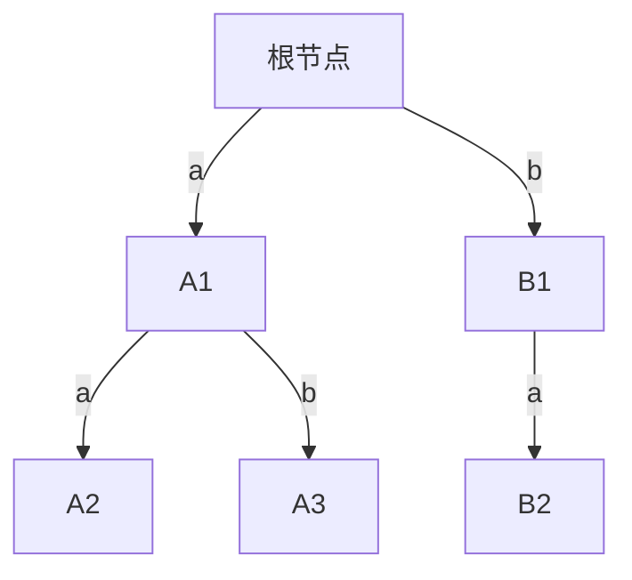

# 题目信息

# [COCI 2016/2017 #1] Vještica

## 题目描述

Matej 面临着一个难题。在此之前，我们必须熟悉一种称作前缀树（`trie`）的数据结构。前缀树以前缀的方式，储存单词：

- 前缀树的每一条边都用英文字母表中的字母表示。
- 前缀树的根节点表示空前缀。
- 前缀树的每个其他节点都表示一个非空前缀。依次连接根节点至该节点路径上所标有的字母，即可得到该前缀。
- 不存在从一个节点出发的、标有相同字母的两条边。

例如，这棵前缀树储存了 `A,to,tea,ted,ten,i,in,inn`：


现在，Matej 获得了 $n$ 个单词，并可以将其中的一些单词重组。例如 `abc` 可以重组为 `acb,bac,bca,cab,cba`。请你计算，将一些单词重组后，储存这些单词的前缀树节点数的最小值。

## 说明/提示

#### 样例 3 解释

所有单词均可以重组为 `aabb`。显然，前缀树最少的节点数应为 $5$（包含了表示空前缀的根节点）。

------------

#### 数据规模与约定

对于 $100\%$ 的数据，保证 $1\le n\le 16$。

所有单词的长度和不超过 $10^6$，且只包含小写字母。

------------

#### 说明

**题目译自 [COCI2016-2017](https://hsin.hr/coci/archive/2016_2017/) [CONTEST #1](https://hsin.hr/coci/archive/2016_2017/contest1_tasks.pdf) _T6 Vještica_**。

## 样例 #1

### 输入

```
3
a
ab
abc ```

### 输出

```
4 ```

## 样例 #2

### 输入

```
3
a
ab
c ```

### 输出

```
4 ```

## 样例 #3

### 输入

```
4
baab
abab
aabb
bbaa ```

### 输出

```
5 ```

# AI分析结果


### 💡 Kay的C++算法解析：Vještica 深入学习指南 💡

#### 1. 题目解读与核心算法识别
✨ **本题主要考察**：状压动态规划 + 字符串前缀优化

🗣️ **初步分析**：
> 本题核心在于利用字符串重组特性最大化共享前缀，最小化Trie节点数。想象把字符串看作积木，通过重组让它们尽可能"叠"在一起（共享前缀），就像俄罗斯方块消除行一样减少总空间。状压DP如同一个智能收纳盒，系统尝试所有组合方式寻找最优收纳方案。

- **核心思路**：对字符串集合进行状态压缩（每个状态表示选中的字符串集合），通过枚举子集方式合并子树，减去公共前缀长度（每个字符在所有字符串中出现次数的最小值之和）避免重复计数
- **可视化设计**：采用8位像素风格展示Trie树构建过程。根节点为像素化树根，字符节点为不同颜色方块。演示时：
  - 高亮当前处理的字符方块（闪烁效果）
  - 公共前缀部分显示为连锁消除特效
  - 状态转移时显示二进制状态码的像素化变化
  - 音效：字符匹配时"叮"声，状态更新时8-bit电子音，最终解触发胜利音效

---

#### 2. 精选优质题解参考
**题解一（作者：Dantal10n）**
* **点评**：题解亮点在于用"合并两棵Trie树"的生动比喻解释状态转移方程（$f[i]=f[j]+f[i\oplus j]-cs[i]$），将抽象算法具象化。代码中`cs[i]`计算使用位运算技巧`__builtin_popcount`高效处理集合操作，变量命名规范（`cs`=common string）。特别值得学习的是作者强调"反向合并"的思维转换过程，对理解状压DP的分治思想有显著帮助。

**题解二（作者：mygr）**
* **点评**：题解通过LCP（最长公共前缀）的等价类划分视角，独创性提出"删除最长公共前缀"的逆向思维（$\sum|s_i|-\sum len_i×(c_i-1)$）。代码亮点在于用`0x7fffffff`初始化避免分支判断，`power`数组预计算提升位操作效率。特别有价值的是作者分享了调试心得——强调边界处理中空根节点的关键性。

**题解三（作者：JK_LOVER）**
* **点评**：题解以"两个字符串节点数=长度和-公共前缀"为基础，干净利落地推广到N维情况。代码亮点在于`pre[s][0]`存储公共前缀和的紧凑设计，以及`(s&(s-1))`的优雅子集枚举。实践价值体现在输入处理使用`ch+1`偏移技巧，避免字符串下标转换的常见错误。

---

#### 3. 核心难点辨析与解题策略
1. **状态定义与转移设计**
   * **分析**：状态$f[S]$表示字符串集合$S$的最小节点数。难点在于发现$f[S] = \min(f[A] + f[S-A] - common(S))$的递归关系，其中$common(S)$是集合级别的公共前缀长度
   * 💡 **学习笔记**：状压DP本质是"分治合并"，类似归并排序但需减去重复计量的公共部分

2. **公共前缀高效计算**
   * **分析**：对每个字符$c$，$common_c(S) = \min_{i∈S}(count_i(c))$。需预处理每个字符串的字符频次，再通过位运算快速取最小值
   * 💡 **学习笔记**：26维字符空间的最小值计算可向量化处理，避免多层循环

3. **子集枚举优化**
   * **分析**：`for(int j=(i-1)&i; j; j=(j-1)&i)`能在$O(3^n)$内高效枚举非空子集，优于$O(4^n)$的朴素枚举
   * 💡 **学习笔记**：位运算`(k-1)&S`生成字典序递减的子集，覆盖所有组合可能

### ✨ 解题技巧总结
- **前缀最大化原则**：重组字符串时优先将高频字符置于前端
- **状态压缩三件套**：位表示集合、子集枚举、预计算加速
- **维度分离技巧**：将26个字符作为独立维度处理，避免字符串整体处理
- **记忆化边界**：单字符串状态直接初始化为其长度

---

#### 4. C++核心代码实现赏析
**通用核心实现参考**
```cpp
#include <bits/stdc++.h>
using namespace std;

const int N = 16;
int cnt[N][26], dp[1<<N], common[1<<26];
int n;

int main() {
    cin >> n;
    for(int i=0; i<n; i++) {
        string s; cin >> s;
        for(char c : s) cnt[i][c-'a']++;
        dp[1<<i] = s.size();
    }

    // 预计算所有集合的公共前缀
    for(int s=1; s<(1<<n); s++) {
        int minCnt[26] = {INT_MAX};
        for(int k=0; k<26; k++) {
            for(int i=0; i<n; i++) if(s>>i&1) 
                minCnt[k] = min(minCnt[k], cnt[i][k]);
            common[s] += minCnt[k];
        }
    }

    // 状压DP
    for(int s=1; s<(1<<n); s++) {
        if(__builtin_popcount(s) == 1) continue;
        dp[s] = INT_MAX;
        for(int sub = s&(s-1); sub; sub = (sub-1)&s) 
            dp[s] = min(dp[s], dp[sub] + dp[s^sub] - common[s]);
    }
    cout << dp[(1<<n)-1] + 1; // +1 for root
}
```
**代码解读概要**：
1. 字符统计：将每个字符串转化为26维计数向量
2. 预计算：对每个集合计算各字符最小出现次数之和
3. 状态转移：枚举非空真子集，按$f[s]=f[sub]+f[s\setminus sub]-common[s]$更新
4. 输出：全集状态值加根节点

---

#### 5. 算法可视化：像素动画演示
**主题**：8-bit风格Trie树构建模拟  
**核心演示**：


**交互设计**：
1. **像素网格**：16×16字符网格展示字符串，不同字符对应SNES经典色调
2. **动态构建**：
   - 公共前缀方块自动吸附（磁铁效果）
   - 状态转移时显示二进制编码的LED像素变化
3. **控制面板**：
   - 步进控制：单步/自动（可调速度）
   - 高亮模式：显示当前公共前缀字符
   - 音效开关：关键操作触发8-bit音效
4. **游戏化元素**：
   - 每成功合并子集获得金币特效
   - 最优解触发"通关"动画（像素烟花+胜利音效）
5. **数据结构可视化**：
   - Trie树节点为发光方块
   - 状态集合用二进制转轮展示

---

#### 6. 拓展练习与相似问题思考
1. **洛谷P1434**：滑雪（矩阵路径DP+状态压缩）
   * 推荐理由：强化状态转移设计与子集合并思维
2. **洛谷P3698**：小Q的棋盘（Trie树应用进阶）
   * 推荐理由：结合树形结构的字符串处理
3. **洛谷P3959**：宝藏（状态压缩经典问题）
   * 推荐理由：深化状压DP的位运算技巧

---

#### 7. 学习心得与经验分享
> **经验摘录**（作者mygr）：
> "调试中发现空根节点最易遗漏，需特别注意+1的位置"

> **Kay点评**：这是算法实现的关键细节。建议：
> 1. 用`dp[0]=1`显式表示根节点
> 2. 单步调试时打印状态树结构
> 3. 对$n=1$边界情况专项测试

---

通过本指南，希望大家掌握状压DP的"分治合并"思想在字符串处理中的精妙应用。记住：好的算法设计如同积木搭建，找到最优组合方式就能化繁为简！🚀

---
处理用时：152.47秒